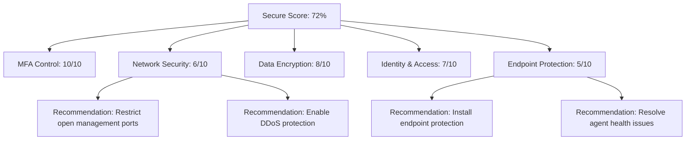

# How to Enable and Configure Microsoft Defender for Cloud Secure Score Recommendations

Author: [nawazdhandala](https://www.github.com/nawazdhandala)

Tags: Azure, Microsoft Defender for Cloud, Secure Score, Security Posture, Cloud Security, Compliance, CSPM

Description: Learn how to use Microsoft Defender for Cloud Secure Score to identify and remediate security vulnerabilities across your Azure environment.

---

Microsoft Defender for Cloud provides a Secure Score that gives you a single number representing the overall security posture of your Azure environment. Think of it as a health score for your cloud infrastructure. A higher score means fewer security risks. A lower score means there are recommendations you should act on.

The real power of Secure Score is not the number itself but the actionable recommendations it provides. Each recommendation tells you exactly what is misconfigured, why it matters, and how to fix it. In this guide, I will walk through how to enable Defender for Cloud, understand the Secure Score, and systematically work through the recommendations.

## What Is Secure Score

Secure Score is calculated based on the ratio of healthy resources to total resources across various security controls. Microsoft groups recommendations into security controls like "Enable MFA," "Apply system updates," and "Encrypt data in transit." Each control has a maximum score, and your actual score depends on how many of the recommendations within that control you have addressed.



The score is not a simple percentage of resolved recommendations. Controls are weighted based on their security impact, so addressing high-impact controls improves your score more than low-impact ones.

## Prerequisites

To work with Secure Score, you need:

- An Azure subscription
- Security Administrator, Security Reader, or Contributor role
- Microsoft Defender for Cloud enabled (the free tier provides basic recommendations; the paid tier provides advanced protection)

## Step 1: Enable Microsoft Defender for Cloud

If you have not already enabled Defender for Cloud:

1. Navigate to the Azure portal at portal.azure.com.
2. Search for "Microsoft Defender for Cloud" and open it.
3. If this is your first visit, the free Cloud Security Posture Management (CSPM) plan is enabled by default for all subscriptions.
4. To enable enhanced security features, go to Environment settings.
5. Select your subscription.
6. Under Defender plans, you will see various workload protections. For Secure Score recommendations, the free CSPM is sufficient, but enabling Defender CSPM (paid) provides additional capabilities like attack path analysis and governance rules.

To enable enhanced CSPM using Azure CLI:

```bash
# Enable the Defender for Cloud free tier on a subscription
# This provides basic Secure Score recommendations
az security pricing create \
    --name CloudPosture \
    --tier free \
    --subscription YOUR_SUBSCRIPTION_ID

# To enable the paid Defender CSPM plan with advanced features
az security pricing create \
    --name CloudPosture \
    --tier standard \
    --subscription YOUR_SUBSCRIPTION_ID
```

## Step 2: View Your Secure Score

1. In Defender for Cloud, click on Secure Score in the left navigation, or look at the overview dashboard.
2. You will see your overall score as a percentage and the breakdown by security control.
3. Click on a security control to see the individual recommendations within it.

Each recommendation shows:

- **Severity**: High, Medium, or Low
- **Freshness interval**: How often the recommendation is reassessed
- **Unhealthy resources**: How many of your resources do not comply
- **Healthy resources**: How many are already compliant
- **Not applicable resources**: Resources the recommendation does not apply to

## Step 3: Prioritize Recommendations

Not all recommendations are equal. Here is a practical approach to prioritization:

Focus first on recommendations that meet these criteria:
- High severity
- Part of a security control with a large potential score increase
- Quick to fix (some can be resolved with a single click)
- Affect production resources

You can filter recommendations in the portal:

1. Go to Recommendations in Defender for Cloud.
2. Use the severity filter to show only High severity items.
3. Sort by the potential score increase to see which ones have the biggest impact.
4. Look for recommendations with the "Quick fix" badge, which can be remediated directly from the portal.

## Step 4: Remediate Recommendations

Let me walk through some of the most common and impactful recommendations and how to address them.

### Enable MFA for Accounts with Owner Permissions

This recommendation appears when subscription owners do not have MFA enabled. Fix it by:

1. Going to Microsoft Entra ID, then Protection, then Conditional Access.
2. Creating a policy that requires MFA for all users with administrative roles.
3. Or enabling Security Defaults if you do not have Conditional Access licensing.

### Restrict Access to Management Ports

This flags virtual machines with network security groups (NSGs) that allow unrestricted access to ports 22 (SSH) or 3389 (RDP):

```powershell
# Find NSG rules that allow unrestricted access to management ports
# This helps identify which rules need to be tightened
$nsgs = Get-AzNetworkSecurityGroup

foreach ($nsg in $nsgs) {
    $riskyRules = $nsg.SecurityRules | Where-Object {
        $_.DestinationPortRange -in @("22", "3389", "*") -and
        $_.SourceAddressPrefix -eq "*" -and
        $_.Access -eq "Allow" -and
        $_.Direction -eq "Inbound"
    }

    if ($riskyRules) {
        Write-Host "NSG: $($nsg.Name) in RG: $($nsg.ResourceGroupName)"
        foreach ($rule in $riskyRules) {
            Write-Host "  Rule: $($rule.Name) - Port: $($rule.DestinationPortRange)"
        }
    }
}
```

Fix this by restricting the source IP addresses to known administrator IPs, or better yet, use Azure Bastion for VM access instead of exposing management ports.

### Enable Encryption at Rest for Storage Accounts

Most modern storage accounts have encryption at rest enabled by default, but older accounts or accounts created with specific configurations might not:

```powershell
# Check all storage accounts for encryption status
# Identify any that need encryption enabled
$storageAccounts = Get-AzStorageAccount

foreach ($sa in $storageAccounts) {
    $encryption = $sa.Encryption
    Write-Host "$($sa.StorageAccountName): Encryption enabled = $($encryption.Services.Blob.Enabled)"
}
```

### Apply System Updates

This recommendation flags VMs that are missing security updates. You can resolve this by:

1. Enabling Azure Update Manager for your VMs.
2. Creating a maintenance configuration that schedules automatic updates.
3. Reviewing and installing pending updates.

## Step 5: Use Governance Rules to Assign Owners

Defender CSPM (paid tier) includes governance rules that let you assign recommendation owners and set remediation deadlines:

1. In Defender for Cloud, go to Environment settings.
2. Click on Governance rules.
3. Click Create governance rule.
4. Define a rule like: "All high-severity recommendations for production subscriptions must be assigned to the security team with a 14-day remediation deadline."
5. The rule will automatically assign owners and track progress.

This is invaluable in larger organizations where multiple teams manage different resources and you need accountability for remediation.

## Step 6: Exempt Recommendations When Appropriate

Sometimes a recommendation does not apply to your environment. For example, a test environment might intentionally have open management ports. Rather than leaving the recommendation unresolved (which drags down your score), you can create an exemption:

1. Click on the recommendation you want to exempt.
2. Click Exempt.
3. Choose whether this is a waiver (risk accepted) or a mitigation (addressed by other means).
4. Provide a justification and set an expiration date.
5. Select the scope (specific resources or resource groups).

Exemptions are auditable, so you maintain a record of why certain recommendations were not addressed.

## Step 7: Set Up Continuous Export

Export your Secure Score and recommendation data to other systems for reporting and alerting:

```powershell
# Create a continuous export configuration to a Log Analytics workspace
# This enables long-term tracking and custom alerting
$exportConfig = @{
    Name = "SecureScoreExport"
    Location = "eastus"
    ResourceGroupName = "security-rg"
    WorkspaceResourceId = "/subscriptions/SUB_ID/resourceGroups/security-rg/providers/Microsoft.OperationalInsights/workspaces/security-workspace"
    # Export Secure Score, recommendations, and alerts
    ExportDataTypes = @("SecureScore", "Recommendations", "Alerts")
    IsEnabled = $true
}

# Use the Defender for Cloud continuous export feature in the portal
# Navigate to Environment settings > Continuous export
```

Once exported to Log Analytics, you can create custom queries:

```kusto
// Track Secure Score over time to visualize improvement trends
SecureScore
| where TimeGenerated > ago(90d)
| summarize Score = avg(PercentageScore) by bin(TimeGenerated, 1d)
| render timechart
```

## Step 8: Automate Remediation

For recommendations that appear frequently (like new VMs missing updates), consider automating the remediation:

1. Use Azure Policy to prevent non-compliant resources from being created in the first place.
2. Use Azure Automation runbooks to periodically check and fix configurations.
3. Use Logic Apps triggered by Defender for Cloud alerts to auto-remediate specific issues.

Many Secure Score recommendations map directly to Azure Policy definitions. Assigning these policies in "Deny" mode prevents misconfigurations from happening rather than just detecting them after the fact.

## Tracking Progress

Create a regular cadence for reviewing your Secure Score:

- Weekly: Review new recommendations and assign owners
- Monthly: Track score trends and report to leadership
- Quarterly: Review exemptions and ensure they are still valid

Having a visible metric like Secure Score makes security posture tangible for both technical teams and management. It turns abstract security concepts into a concrete number that everyone can understand and work toward improving.

## Conclusion

Microsoft Defender for Cloud Secure Score gives you a structured, prioritized approach to improving your Azure security posture. Start by enabling Defender for Cloud on all your subscriptions, review the initial recommendations, and focus on high-severity items with the biggest score impact first. Use governance rules to assign ownership, set up continuous export for tracking, and automate remediation where possible. The goal is not necessarily to reach 100 percent - some recommendations may not apply to your environment - but to systematically address the risks that matter most and maintain visibility into your security posture over time.
