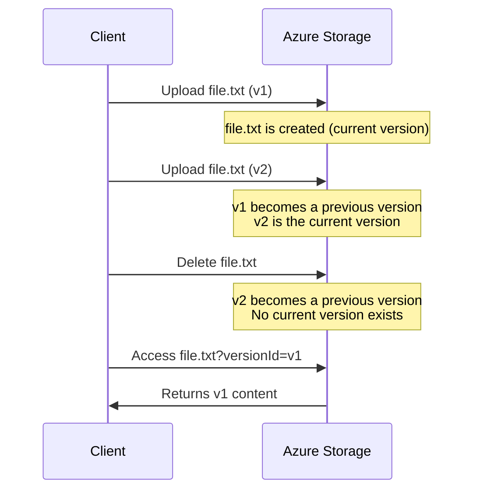

# How to Enable and Manage Blob Versioning in Azure Storage

Author: [nawazdhandala](https://www.github.com/nawazdhandala)

Tags: Azure, Blob Storage, Blob Versioning, Data Protection, Azure Storage, Version Control, Cloud Storage

Description: Learn how to enable blob versioning in Azure Storage to automatically maintain previous versions of your blobs and protect against accidental overwrites.

---

Overwriting a blob in Azure Storage is permanent by default. If someone uploads a new version of a file or an application bug corrupts data, the previous content is gone. Blob versioning changes that by automatically keeping every previous version of a blob whenever it gets modified or deleted. Think of it as automatic version control for your storage account.

This guide covers how to enable versioning, how to work with versions, and the cost and operational considerations you should keep in mind.

## How Blob Versioning Works

When versioning is enabled on a storage account, Azure automatically creates a new version every time a blob is overwritten or deleted. Each version gets a unique version ID, which is a timestamp-based identifier.

The current version of a blob is what you get when you access it by name without specifying a version ID. Previous versions are accessible by appending the version ID to the request.

Here is the flow:



The key thing to understand is that previous versions are read-only. You cannot modify a previous version. You can read it, copy it, or delete it, but not update it in place.

## Enabling Blob Versioning

You can enable versioning at the storage account level. It applies to all containers in the account.

### Using the Azure Portal

1. Navigate to your storage account.
2. Under "Data management," click "Data protection."
3. Check "Enable versioning for blobs."
4. Click "Save."

### Using Azure CLI

```bash
# Enable blob versioning on a storage account
az storage account blob-service-properties update \
  --account-name mystorageaccount \
  --resource-group myresourcegroup \
  --enable-versioning true
```

### Using PowerShell

```powershell
# Enable blob versioning using PowerShell
Update-AzStorageBlobServiceProperty `
  -ResourceGroupName "myresourcegroup" `
  -StorageAccountName "mystorageaccount" `
  -IsVersioningEnabled $true
```

### Using Bicep

```bicep
// Enable blob versioning in a Bicep template
resource blobService 'Microsoft.Storage/storageAccounts/blobServices@2023-01-01' = {
  name: '${storageAccount.name}/default'
  properties: {
    isVersioningEnabled: true
  }
}
```

## Listing Blob Versions

Once versioning is enabled and blobs start accumulating versions, you will want to list them. The Azure CLI provides a way to list all versions of a blob:

```bash
# List all versions of a specific blob
az storage blob list \
  --account-name mystorageaccount \
  --container-name mycontainer \
  --prefix "myfile.txt" \
  --include v \
  --output table
```

The `--include v` flag tells Azure to include version information in the results.

Using the Python SDK, you can list versions like this:

```python
from azure.storage.blob import BlobServiceClient

# Connect to the storage account
blob_service_client = BlobServiceClient.from_connection_string("your-connection-string")
container_client = blob_service_client.get_container_client("mycontainer")

# List all versions of blobs in the container
# The include parameter with "versions" fetches version metadata
blob_list = container_client.list_blobs(
    name_starts_with="myfile.txt",
    include=["versions"]
)

for blob in blob_list:
    # Print each version's name, version ID, and whether it is the current version
    print(f"Name: {blob.name}, Version: {blob.version_id}, Is Current: {blob.is_current_version}")
```

## Accessing a Specific Version

To download a specific version of a blob, you append the version ID to the request. In the SDK, you specify it when creating the blob client:

```python
from azure.storage.blob import BlobServiceClient

blob_service_client = BlobServiceClient.from_connection_string("your-connection-string")

# Access a specific version of a blob by providing the version_id
blob_client = blob_service_client.get_blob_client(
    container="mycontainer",
    blob="myfile.txt",
    version_id="2026-02-16T10:30:00.0000000Z"
)

# Download the versioned blob content
download_stream = blob_client.download_blob()
content = download_stream.readall()
print(f"Content length: {len(content)} bytes")
```

Via REST API, you append `?versionid=<version-id>` to the blob URL.

## Restoring a Previous Version

If you need to restore a previous version as the current version, you copy the old version over the current one:

```python
from azure.storage.blob import BlobServiceClient

blob_service_client = BlobServiceClient.from_connection_string("your-connection-string")
container_client = blob_service_client.get_container_client("mycontainer")

# Get a client for the current blob (destination for the restore)
dest_blob = container_client.get_blob_client("myfile.txt")

# Build the source URL pointing to the specific version you want to restore
source_url = (
    f"https://mystorageaccount.blob.core.windows.net/"
    f"mycontainer/myfile.txt?versionid=2026-02-16T10:30:00.0000000Z"
)

# Copy the old version to become the current version
dest_blob.start_copy_from_url(source_url)
print("Previous version restored as current version")
```

This operation creates a new current version with the content of the old version. The old version is preserved as well.

## Deleting Versions

You can delete specific versions when you no longer need them:

```bash
# Delete a specific version of a blob
az storage blob delete \
  --account-name mystorageaccount \
  --container-name mycontainer \
  --name myfile.txt \
  --version-id "2026-02-16T10:30:00.0000000Z"
```

To bulk-delete old versions, you would typically write a script that lists versions and deletes those older than a certain date. Better yet, use lifecycle management policies to handle this automatically.

## Using Lifecycle Policies to Manage Versions

Versioning without cleanup will cause your storage costs to grow indefinitely. Use lifecycle management policies to automatically delete old versions:

```json
{
  "rules": [
    {
      "enabled": true,
      "name": "cleanup-old-versions",
      "type": "Lifecycle",
      "definition": {
        "actions": {
          "version": {
            "tierToCool": {
              "daysAfterCreationGreaterThan": 30
            },
            "delete": {
              "daysAfterCreationGreaterThan": 90
            }
          }
        },
        "filters": {
          "blobTypes": ["blockBlob"]
        }
      }
    }
  ]
}
```

This moves versions to Cool tier after 30 days and deletes them after 90 days.

## Versioning vs. Snapshots

Azure Storage offers both versioning and snapshots. They serve similar purposes but work differently:

- **Versioning** is automatic. Every modification creates a new version without any client action.
- **Snapshots** are manual. You explicitly create a snapshot at a point in time.
- Versioning creates versions on every write. Snapshots only exist when you create them.
- Versions have unique version IDs. Snapshots have snapshot timestamps.

For most use cases, versioning is the better choice because it requires no changes to your application. Snapshots are useful when you want explicit, deliberate checkpoints before a risky operation.

## Cost Implications

Every version stored counts toward your total storage. If you have a 100 MB file that gets updated 10 times, you have 1 GB of versioned data plus the current version.

The costs come from:

- Storage capacity for all versions
- Transaction costs when versions are created
- Potentially higher costs if versions sit in hot tier unnecessarily

To manage costs:

1. Use lifecycle management policies to tier and delete old versions.
2. Consider whether you need versioning on all containers or just specific ones (note: versioning is account-wide, so you may want separate storage accounts).
3. Monitor your version count and storage usage through Azure Monitor metrics.

## Versioning with Soft Delete

Blob versioning works alongside soft delete. When both are enabled and you delete a blob, the current version becomes a previous version with a deleted state. During the soft delete retention period, you can undelete it. After the retention period, it gets permanently removed.

Combining versioning with soft delete gives you the strongest data protection story - you can recover from both accidental overwrites (versioning) and accidental deletes (soft delete).

## Wrapping Up

Blob versioning is a straightforward feature to enable but has meaningful implications for data protection and storage costs. Turn it on for storage accounts that hold important data, set up lifecycle policies to keep version sprawl under control, and consider pairing it with soft delete for complete protection. The few minutes it takes to configure can save you from a painful data loss incident down the road.
