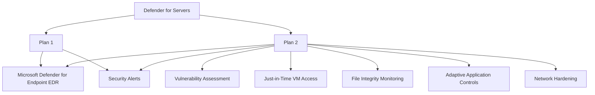

# How to Enable and Review Microsoft Defender for Cloud Workload Protection for Virtual Machines

Author: [nawazdhandala](https://www.github.com/nawazdhandala)

Tags: Azure, Microsoft Defender for Cloud, Virtual Machines, Workload Protection, Endpoint Detection, Security Alerts, Cloud Security

Description: Step-by-step guide to enabling Microsoft Defender for Servers to protect Azure virtual machines with advanced threat detection, vulnerability assessment, and endpoint protection.

---

Virtual machines are often the most targeted workloads in any cloud environment. They run your applications, store data, and have network connectivity that attackers want to exploit. Microsoft Defender for Cloud includes workload protection plans specifically designed for servers, providing threat detection, vulnerability assessment, endpoint detection and response (EDR), and security baseline monitoring.

This guide covers how to enable Defender for Servers, understand the protection tiers, review security alerts, and act on the findings.

## Understanding Defender for Servers Plans

Microsoft Defender for Servers comes in two plans:

**Plan 1** (lower cost):
- Integration with Microsoft Defender for Endpoint (MDE) for EDR
- Licensed access to MDE features
- No vulnerability assessment or just-in-time VM access

**Plan 2** (full protection):
- Everything in Plan 1
- Vulnerability assessment powered by Microsoft Defender Vulnerability Management
- Just-in-time VM access
- File integrity monitoring
- Adaptive application controls
- Network map and adaptive network hardening
- Docker host hardening



For most production environments, Plan 2 is worth the investment because vulnerability assessment and just-in-time access are critical capabilities.

## Prerequisites

You need:
- Azure subscription with VMs to protect
- Owner or Security Administrator role
- Understanding of your VM inventory and which ones need protection

## Step 1: Enable Defender for Servers

### Enable at the Subscription Level

Enabling at the subscription level protects all VMs in the subscription:

1. Navigate to Microsoft Defender for Cloud in the Azure portal.
2. Click Environment settings.
3. Select your subscription.
4. Under Defender plans, find Servers.
5. Toggle it to On and select Plan 2.
6. Click Save.

### Via PowerShell

```powershell
# Enable Defender for Servers Plan 2 on a subscription
Connect-AzAccount

Set-AzSecurityPricing `
    -Name "VirtualMachines" `
    -PricingTier "Standard" `
    -SubPlan "P2"

Write-Host "Defender for Servers Plan 2 enabled."
```

### Via Azure CLI

```bash
# Enable Defender for Servers
az security pricing create \
    --name VirtualMachines \
    --tier Standard \
    --subscription YOUR_SUBSCRIPTION_ID
```

## Step 2: Deploy the Defender for Endpoint Agent

Defender for Servers integrates with Microsoft Defender for Endpoint (MDE) for deep endpoint detection and response. The MDE agent is automatically deployed to VMs when you enable Defender for Servers, but you should verify:

1. In Defender for Cloud, go to Environment settings.
2. Select your subscription and click on Settings and monitoring.
3. Verify that Endpoint protection (Microsoft Defender for Endpoint) is set to On.
4. Verify that the Log Analytics agent or Azure Monitor Agent is configured.

For existing VMs that might not have received the agent:

```powershell
# Check which VMs have the MDE extension installed
$vms = Get-AzVM

foreach ($vm in $vms) {
    $extensions = Get-AzVMExtension -ResourceGroupName $vm.ResourceGroupName -VMName $vm.Name

    $mdeExtension = $extensions | Where-Object {
        $_.ExtensionType -in @("MDE.Windows", "MDE.Linux")
    }

    $status = if ($mdeExtension) { "Installed" } else { "NOT Installed" }
    Write-Host "$($vm.Name) ($($vm.Location)): MDE Agent $status"
}
```

If the agent is missing on a VM, you can trigger deployment:

```powershell
# Manually deploy the MDE extension to a Windows VM
Set-AzVMExtension `
    -ResourceGroupName "production-rg" `
    -VMName "web-server-01" `
    -Name "MDE.Windows" `
    -Publisher "Microsoft.Azure.AzureDefenderForServers" `
    -ExtensionType "MDE.Windows" `
    -TypeHandlerVersion "1.0" `
    -Settings @{}

Write-Host "MDE extension deployment initiated."
```

## Step 3: Review Security Alerts

After enabling protection, Defender for Cloud starts generating alerts. Review them regularly:

1. In Defender for Cloud, click Security alerts.
2. Filter by severity (High, Medium, Low) and by resource type (Virtual Machines).
3. Click on an alert to see details including:
   - What was detected
   - Which VM is affected
   - The MITRE ATT&CK tactics and techniques
   - Recommended remediation steps

Common alert types for VMs:

- **Suspicious process execution**: A process was detected that matches known attack patterns
- **Fileless attack detected**: Memory-only attack technique identified
- **Ransomware activity**: File encryption patterns consistent with ransomware
- **Crypto mining detected**: CPU usage patterns indicating cryptocurrency mining
- **Suspicious outbound communication**: VM communicating with known command and control servers
- **Brute force attack**: Multiple failed SSH or RDP login attempts

### Investigating an Alert

When you click on an alert, Defender for Cloud shows:

```kusto
// Query security alerts for VMs in Log Analytics
SecurityAlert
| where TimeGenerated > ago(24h)
| where AlertType has "VM"
| project
    TimeGenerated,
    AlertName,
    Severity = AlertSeverity,
    Description,
    AffectedVM = tostring(parse_json(ExtendedProperties).["Compromised Host"]),
    AttackTechnique = Tactics,
    RemediationSteps
| sort by Severity asc, TimeGenerated desc
```

For each alert:
1. Determine if it is a true positive or false positive.
2. If true positive, follow the remediation steps.
3. If false positive, suppress the alert to reduce noise.

## Step 4: Configure Vulnerability Assessment

Defender for Servers Plan 2 includes vulnerability assessment. It scans your VMs for known vulnerabilities in the operating system and installed software:

1. In Defender for Cloud, go to Recommendations.
2. Search for "Machines should have vulnerability findings resolved."
3. Click on the recommendation to see all VMs with vulnerabilities.
4. Click on a specific VM to see its vulnerability list.

Each vulnerability shows:
- CVE identifier
- Severity score (CVSS)
- Description of the vulnerability
- Remediation guidance (usually installing a specific update)

```powershell
# Get vulnerability assessment findings via the REST API
$subscriptionId = "YOUR_SUBSCRIPTION_ID"
$uri = "https://management.azure.com/subscriptions/$subscriptionId/providers/Microsoft.Security/subAssessments?api-version=2019-01-01-preview"

$token = (Get-AzAccessToken -ResourceUrl "https://management.azure.com").Token
$headers = @{ Authorization = "Bearer $token" }

$response = Invoke-RestMethod -Uri $uri -Headers $headers
$vulnerabilities = $response.value | Where-Object {
    $_.properties.status.code -eq "Unhealthy"
}

Write-Host "Found $($vulnerabilities.Count) unresolved vulnerabilities."

# Show the top 10 by severity
$vulnerabilities |
    Select-Object @{N='CVE';E={$_.properties.id}},
        @{N='Severity';E={$_.properties.status.severity}},
        @{N='Description';E={$_.properties.displayName}} |
    Sort-Object Severity |
    Select-Object -First 10 |
    Format-Table
```

## Step 5: Configure Just-in-Time VM Access

Just-in-time (JIT) VM access restricts management port access (SSH on port 22, RDP on port 3389) and only opens them when needed:

1. In Defender for Cloud, go to Workload protections.
2. Click Just-in-time VM access.
3. Select a VM and click Enable JIT.
4. Configure the allowed ports:
   - Port 3389 (RDP) or 22 (SSH)
   - Maximum request duration (e.g., 3 hours)
   - Allowed source IPs (specific IPs or any)

When an admin needs to access a VM:

1. Go to the VM in the Azure portal.
2. Click Connect.
3. Request JIT access.
4. Specify the duration and source IP.
5. The NSG rule is automatically created and then automatically removed when the time expires.

```powershell
# Request JIT access to a VM
$vmId = "/subscriptions/SUB_ID/resourceGroups/production-rg/providers/Microsoft.Compute/virtualMachines/web-server-01"

$jitRequest = @{
    VirtualMachines = @(
        @{
            Id = $vmId
            Ports = @(
                @{
                    Number = 3389             # RDP port
                    Duration = "PT3H"         # 3 hours in ISO 8601 duration
                    AllowedSourceAddressPrefix = "203.0.113.50"  # Your IP
                }
            )
        }
    )
    Justification = "Deploying hotfix for production issue #1234"
}

# Initiate the JIT request through the Security Center API
Start-AzJitNetworkAccessPolicy `
    -ResourceGroupName "production-rg" `
    -Location "eastus" `
    -Name "default" `
    -VirtualMachine $jitRequest.VirtualMachines

Write-Host "JIT access requested. Management port will open for 3 hours."
```

## Step 6: Enable File Integrity Monitoring

File integrity monitoring (FIM) tracks changes to critical system files, registry settings, and configuration files:

1. In Defender for Cloud, go to Workload protections.
2. Click File Integrity Monitoring.
3. Select the Log Analytics workspace connected to your VMs.
4. Enable FIM and configure which paths to monitor.

Default monitored paths include:
- Windows: System32, registry hives, boot configuration
- Linux: /etc, /bin, /sbin, /usr/bin, boot files

FIM generates alerts when unexpected changes occur, which can indicate compromise or unauthorized configuration changes.

## Step 7: Review Adaptive Application Controls

Adaptive application controls learn which applications normally run on your VMs and alert you when unknown applications are executed:

1. In Defender for Cloud, go to Workload protections.
2. Click Adaptive application controls.
3. Review the groups of VMs and the recommended allowlists.
4. Approve the recommendations to enforce application control.

This is particularly valuable for production servers where the set of running applications should be predictable and stable.

## Step 8: Set Up Alert Automation

Automate responses to critical VM alerts:

```powershell
# Create a workflow automation that triggers when a high-severity VM alert is generated
# Navigate to Defender for Cloud > Workflow automation > Add workflow automation

# The automation can:
# 1. Send an email to the security team
# 2. Create a ticket in your ITSM system
# 3. Isolate the VM by removing its NIC from the network
# 4. Take a VM snapshot for forensic analysis

# Example: Logic App that isolates a compromised VM
# Trigger: Defender for Cloud alert with severity = High
# Actions:
#   1. Get the VM details from the alert
#   2. Remove the VM's NIC from the NSG (or assign a quarantine NSG)
#   3. Send notification to the security team
#   4. Create an incident in the ticketing system
```

## Monitoring and Reporting

Create a regular review cadence:

- **Daily**: Review high-severity security alerts and take immediate action.
- **Weekly**: Review vulnerability assessment findings and prioritize patching.
- **Monthly**: Review adaptive application control recommendations and FIM changes.
- **Quarterly**: Audit JIT access logs and review which VMs are protected.

```kusto
// Summary of VM security posture
SecurityRecommendation
| where TimeGenerated > ago(1d)
| where RecommendationName has "virtual machine" or RecommendationName has "VM"
| summarize
    Healthy = countif(RecommendationState == "Healthy"),
    Unhealthy = countif(RecommendationState == "Unhealthy")
    by RecommendationName
| where Unhealthy > 0
| sort by Unhealthy desc
```

## Conclusion

Microsoft Defender for Servers provides comprehensive protection for Azure VMs that goes far beyond basic antivirus. The combination of endpoint detection and response, vulnerability assessment, just-in-time access, file integrity monitoring, and adaptive application controls creates multiple layers of defense. Start by enabling Plan 2 at the subscription level, verify agent deployment, review the initial alerts and vulnerability findings, and then progressively enable the advanced features like JIT access and adaptive application controls. The key is not just enabling these features but building operational processes to review and act on the findings they generate.
