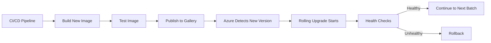

# How to Enable Automatic OS Image Upgrades on Azure VM Scale Sets

Author: [nawazdhandala](https://www.github.com/nawazdhandala)

Tags: Azure, VM Scale Sets, OS Image Upgrades, Patching, Security, Automation

Description: Learn how to enable and configure automatic OS image upgrades on Azure VM Scale Sets for hands-free security patching.

---

Keeping OS images up to date across a fleet of VM Scale Set instances is one of those tasks that is easy to forget and dangerous to neglect. Unpatched operating systems are a security risk, and manually updating dozens of instances is tedious and error-prone. Azure's automatic OS image upgrade feature solves this by automatically detecting when a new version of your OS image is published and rolling it out to your scale set instances using a safe, health-monitored process.

I enabled this feature on every production scale set I manage after spending a weekend patching 200 instances across eight scale sets because a critical kernel vulnerability was disclosed on a Friday afternoon. Never again.

## How It Works

When automatic OS image upgrades are enabled, Azure periodically checks whether a new version of the scale set's configured OS image is available. When a new version is detected, it is rolled out to instances using the same rolling upgrade mechanism I covered in the rolling upgrades post. The process upgrades instances in batches, checks health between batches, and stops if too many instances become unhealthy.

The key difference from a manual rolling upgrade is that you do not trigger it. Azure handles the detection and initiation automatically. Your only job is to configure the policies and ensure health probes are in place.

## Prerequisites

Before enabling automatic OS image upgrades, you need:

1. **Health monitoring**: Either a load balancer health probe or the Application Health Extension must be configured. Automatic OS image upgrades will not work without health monitoring because the system needs a signal to determine if updated instances are healthy.

2. **Rolling or Automatic upgrade policy**: The scale set must use either Rolling or Automatic upgrade policy. Manual upgrade policy is not compatible with automatic OS image upgrades.

3. **Supported image**: The OS image must be a platform image (published by Microsoft or partners) or a Shared Image Gallery image. Custom images uploaded directly as managed images are not supported.

## Enabling Automatic OS Image Upgrades

### Using Azure CLI

```bash
# Enable automatic OS image upgrades on an existing scale set
az vmss update \
  --resource-group myResourceGroup \
  --name myScaleSet \
  --set upgradePolicy.automaticOSUpgradePolicy.enableAutomaticOSUpgrade=true

# Verify the setting
az vmss show \
  --resource-group myResourceGroup \
  --name myScaleSet \
  --query "upgradePolicy.automaticOSUpgradePolicy" -o json
```

### During Scale Set Creation

```bash
# Create a scale set with automatic OS image upgrades enabled
az vmss create \
  --resource-group myResourceGroup \
  --name myScaleSet \
  --image Ubuntu2204 \
  --vm-sku Standard_D2s_v5 \
  --instance-count 4 \
  --upgrade-policy-mode Rolling \
  --max-batch-instance-percent 20 \
  --max-unhealthy-instance-percent 20 \
  --max-unhealthy-upgraded-instance-percent 20 \
  --pause-time-between-batches PT30S \
  --enable-auto-os-upgrade \
  --admin-username azureuser \
  --generate-ssh-keys \
  --lb myLoadBalancer \
  --health-probe myHealthProbe
```

### Using ARM Template

```json
{
  "type": "Microsoft.Compute/virtualMachineScaleSets",
  "apiVersion": "2023-07-01",
  "name": "myScaleSet",
  "location": "eastus",
  "properties": {
    "upgradePolicy": {
      "mode": "Rolling",
      "rollingUpgradePolicy": {
        "maxBatchInstancePercent": 20,
        "maxUnhealthyInstancePercent": 20,
        "maxUnhealthyUpgradedInstancePercent": 20,
        "pauseTimeBetweenBatches": "PT30S"
      },
      "automaticOSUpgradePolicy": {
        "enableAutomaticOSUpgrade": true,
        "disableAutomaticRollback": false,
        "useRollingUpgradePolicy": true
      }
    },
    "virtualMachineProfile": {
      "storageProfile": {
        "imageReference": {
          "publisher": "Canonical",
          "offer": "0001-com-ubuntu-server-jammy",
          "sku": "22_04-lts-gen2",
          "version": "latest"
        }
      }
    }
  }
}
```

## Configuring the Rolling Upgrade Policy for OS Upgrades

The rolling upgrade policy parameters directly affect how OS image upgrades are applied:

```bash
# Configure the rolling upgrade policy
az vmss update \
  --resource-group myResourceGroup \
  --name myScaleSet \
  --set upgradePolicy.rollingUpgradePolicy.maxBatchInstancePercent=20 \
  --set upgradePolicy.rollingUpgradePolicy.maxUnhealthyInstancePercent=20 \
  --set upgradePolicy.rollingUpgradePolicy.maxUnhealthyUpgradedInstancePercent=20 \
  --set upgradePolicy.rollingUpgradePolicy.pauseTimeBetweenBatches=PT2M
```

For OS image upgrades specifically, I recommend slightly more conservative settings than for application upgrades:

- **maxBatchInstancePercent: 20%** - Only upgrade one-fifth of instances at a time. OS upgrades involve a full instance reimage, which takes longer than an application update.
- **pauseTimeBetweenBatches: PT2M to PT5M** - Give instances more time to boot with the new image, run startup scripts, and pass health checks.
- **maxUnhealthyUpgradedInstancePercent: 10-20%** - Be strict about rolling back if upgraded instances are unhealthy. A bad OS image affects every instance, so you want to catch it early.

## Automatic Rollback

If an OS image upgrade causes instances to become unhealthy, automatic rollback reverts affected instances to the previous image version:

```bash
# Enable automatic rollback (enabled by default)
az vmss update \
  --resource-group myResourceGroup \
  --name myScaleSet \
  --set upgradePolicy.automaticOSUpgradePolicy.disableAutomaticRollback=false
```

When a rollback happens, the scale set reimages the unhealthy instances with the previous known-good image version. This is a critical safety net, but it depends entirely on your health probes being accurate. If your health check does not detect the problem, the rollback will not trigger.

## How Azure Detects New Images

For platform images (like Ubuntu, Windows Server), Microsoft publishes new image versions regularly. These contain security patches, bug fixes, and sometimes feature updates. When a new version is published:

1. Azure detects the new version within 24 hours (the check interval varies).
2. If automatic OS image upgrades are enabled, the upgrade is scheduled.
3. The upgrade proceeds using the rolling upgrade policy.

For Shared Image Gallery images, the process is similar. When you publish a new image version to the gallery and the scale set references the image definition (without a pinned version), Azure detects the new version and triggers an upgrade.

```bash
# Configure the scale set to use the latest version from a gallery
az vmss update \
  --resource-group myResourceGroup \
  --name myScaleSet \
  --set virtualMachineProfile.storageProfile.imageReference.id="/subscriptions/<sub-id>/resourceGroups/imageRG/providers/Microsoft.Compute/galleries/myGallery/images/myAppImage"
# Note: Not specifying a version means "use latest"
```

## Monitoring OS Image Upgrades

Track OS image upgrade activity to stay informed:

```bash
# Check the latest rolling upgrade status
az vmss rolling-upgrade get-latest \
  --resource-group myResourceGroup \
  --name myScaleSet \
  -o json

# Check which image version each instance is running
az vmss list-instances \
  --resource-group myResourceGroup \
  --name myScaleSet \
  --query "[].{InstanceId:instanceId, ImageVersion:storageProfile.imageReference.exactVersion, LatestModel:latestModelApplied}" \
  -o table
```

### Setting Up Alerts

Create alerts for OS upgrade events so you know when upgrades happen and whether they succeed:

```bash
# Create an activity log alert for OS upgrade events
az monitor activity-log alert create \
  --resource-group myResourceGroup \
  --name "os-upgrade-alert" \
  --scope "/subscriptions/<sub-id>/resourceGroups/myResourceGroup/providers/Microsoft.Compute/virtualMachineScaleSets/myScaleSet" \
  --condition category=Administrative and operationName="Microsoft.Compute/virtualMachineScaleSets/rollingUpgrades/action" \
  --action-group myActionGroup
```

Pipe these alerts into OneUptime to correlate OS upgrade events with application performance metrics. If response times increase after an OS upgrade, you will spot the pattern immediately.

## Handling Custom Software on OS Upgrades

When an OS image upgrade reimages an instance, anything not part of the image is lost. This includes software installed by Custom Script Extensions, application code deployed after boot, and local configuration files.

This is not a problem if your scale set is set up correctly, because the Custom Script Extension and other extensions re-run after the reimage. But it means your extensions must be idempotent and fast enough to not delay the health check.

Here is the timeline after an OS image upgrade reimages an instance:

1. New OS image boots.
2. VM Agent starts.
3. Extensions run (Custom Script, monitoring agents, etc.).
4. Application starts.
5. Health probe begins checking.
6. Instance is marked healthy and added to the load balancer.

Make sure your Custom Script Extension handles this scenario cleanly:

```bash
#!/bin/bash
# setup.sh - Must work for both initial deployment and OS image upgrades
set -euo pipefail

# Install packages only if not already installed
if ! dpkg -l nginx > /dev/null 2>&1; then
  apt-get update
  apt-get install -y nginx
fi

# Always pull the latest application code
curl -L https://releases.myapp.com/latest.tar.gz -o /tmp/app.tar.gz
tar xzf /tmp/app.tar.gz -C /var/www/myapp

# Restart services
systemctl restart nginx
```

## Maintenance Windows

While Azure does not provide a built-in maintenance window for automatic OS image upgrades, you can approximate one by:

1. Disabling automatic OS image upgrades during business hours.
2. Re-enabling them during a maintenance window.

```bash
# Disable during business hours (run from a scheduled job at 8 AM)
az vmss update \
  --resource-group myResourceGroup \
  --name myScaleSet \
  --set upgradePolicy.automaticOSUpgradePolicy.enableAutomaticOSUpgrade=false

# Re-enable during maintenance window (run from a scheduled job at 2 AM)
az vmss update \
  --resource-group myResourceGroup \
  --name myScaleSet \
  --set upgradePolicy.automaticOSUpgradePolicy.enableAutomaticOSUpgrade=true
```

This approach is not perfect since Azure does not guarantee when during the enabled period the upgrade will occur, but it prevents upgrades during peak hours.

## Platform Images vs. Custom Gallery Images

The approach differs slightly depending on your image source:

**Platform images**: Azure handles new version detection automatically. You do not need to do anything except enable the feature. New images are published by Microsoft and partners on their own schedule.

**Shared Image Gallery images**: You control when new versions are published. This gives you a workflow where your CI/CD pipeline builds and tests a new image, publishes it to the gallery, and the automatic OS image upgrade picks it up and rolls it out. This is the most controlled approach.



## Wrapping Up

Automatic OS image upgrades keep your scale set instances patched without manual effort. The setup requires health probes (which you should have anyway), a rolling upgrade policy with conservative parameters, and automatic rollback enabled. For platform images, it is a set-and-forget feature. For custom gallery images, it integrates naturally into your CI/CD pipeline. Either way, it eliminates the most tedious part of managing a fleet of VMs - keeping them all on the same, current OS version.
