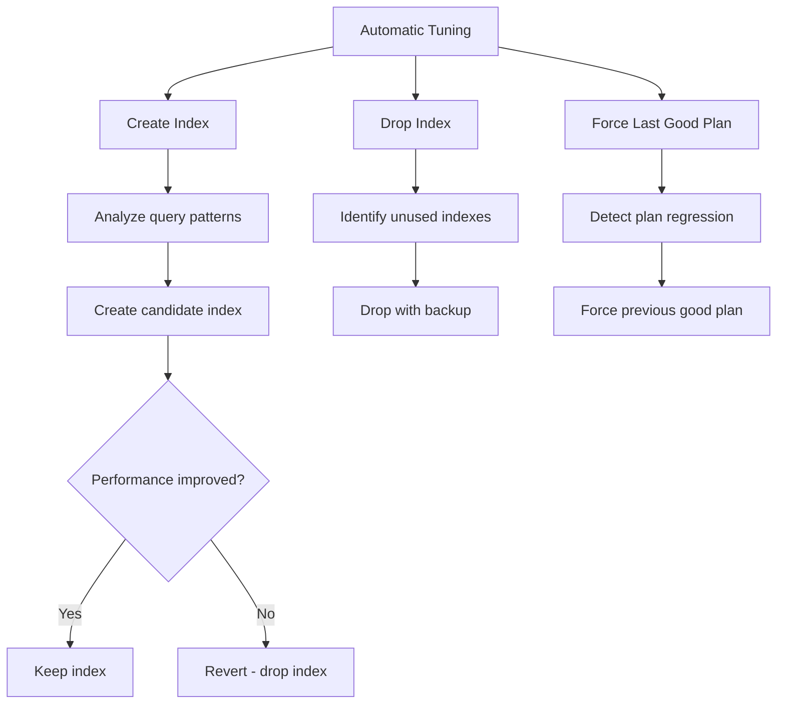

# How to Enable Automatic Tuning in Azure SQL Database

Author: [nawazdhandala](https://www.github.com/nawazdhandala)

Tags: Azure SQL, Automatic Tuning, Performance, Optimization, Azure, Database, Indexing

Description: Learn how to enable and configure automatic tuning in Azure SQL Database to let Azure automatically create indexes, drop unused indexes, and fix plan regressions.

---

Manually tuning a database is time-consuming work. You need to monitor query performance, analyze execution plans, identify missing indexes, test changes, and verify improvements. Azure SQL Database offers automatic tuning that handles much of this work for you. It can automatically create indexes, drop unused indexes, and revert query plan regressions, all without human intervention.

In this post, I will explain how automatic tuning works, how to enable and configure it, and how to monitor what it is doing.

## What Automatic Tuning Does

Azure SQL Database automatic tuning provides three capabilities:

### 1. Create Index

The system analyzes query patterns and identifies columns that would benefit from additional indexes. When it finds a candidate, it creates the index and monitors query performance. If the index improves performance, it keeps it. If the index does not help or causes regressions, it automatically drops it.

### 2. Drop Index

Over time, indexes that were once useful become dead weight. They consume storage, slow down write operations, and never get used by any query. Automatic tuning identifies these unused indexes and drops them. Before dropping, it creates a backup of the index definition so it can be recreated if needed.

### 3. Force Last Good Plan

Sometimes the SQL query optimizer chooses a poor execution plan for a query, even though a better plan was used previously. This is called a plan regression. Automatic tuning detects these regressions and forces the last known good plan, restoring performance without any code changes.



## How It Works Under the Hood

Automatic tuning relies on the Query Store to collect performance data. The Query Store tracks every query's execution statistics - CPU time, duration, logical reads, execution count, and the execution plans used. Automatic tuning analyzes this data to identify opportunities.

The system uses a safe experimentation approach:

1. **Identify a recommendation**: Based on Query Store data, the system proposes a change (create index, drop index, or force plan).
2. **Apply the change**: The change is applied to the database.
3. **Monitor the impact**: The system measures query performance before and after the change.
4. **Verify or revert**: If performance improves, the change is kept. If performance degrades, the change is automatically reverted.

This conservative approach means automatic tuning is safe for production workloads. It will not make things worse.

## Enabling Automatic Tuning via Azure Portal

### Step 1: Navigate to Your Database or Server

You can configure automatic tuning at the server level (applies to all databases) or at the individual database level.

For server-level configuration:
1. Go to the Azure Portal and open your SQL server.
2. Under "Intelligent Performance", click "Automatic tuning".

For database-level configuration:
1. Go to the Azure Portal and open your SQL database.
2. Under "Intelligent Performance", click "Automatic tuning".

### Step 2: Configure the Three Options

For each of the three capabilities, you have three choices:

- **Inherit from server (or Azure defaults)**: Use the parent setting.
- **On**: Explicitly enable this capability.
- **Off**: Explicitly disable this capability.

For most production databases, I recommend:
- **Create Index**: On
- **Drop Index**: On (after a period of observation)
- **Force Last Good Plan**: On

### Step 3: Save

Click "Save" to apply the configuration. Changes take effect immediately.

## Enabling Automatic Tuning via Azure CLI

```bash
# Enable all three automatic tuning options at the server level
az sql server update \
    --resource-group myResourceGroup \
    --name myserver \
    --set tags.auto_tuning_create_index=ON \
    --set tags.auto_tuning_drop_index=ON \
    --set tags.auto_tuning_force_last_good_plan=ON
```

For database-level settings:

```bash
# Enable automatic tuning on a specific database
az sql db update \
    --resource-group myResourceGroup \
    --server myserver \
    --name mydb \
    --set tags.auto_tuning_create_index=ON
```

## Enabling Automatic Tuning via T-SQL

T-SQL provides the most straightforward syntax:

```sql
-- Enable automatic index creation
ALTER DATABASE CURRENT
SET AUTOMATIC_TUNING (CREATE_INDEX = ON);

-- Enable automatic plan correction
ALTER DATABASE CURRENT
SET AUTOMATIC_TUNING (FORCE_LAST_GOOD_PLAN = ON);

-- Enable automatic unused index dropping
ALTER DATABASE CURRENT
SET AUTOMATIC_TUNING (DROP_INDEX = ON);

-- Or enable all three at once
ALTER DATABASE CURRENT
SET AUTOMATIC_TUNING (
    CREATE_INDEX = ON,
    DROP_INDEX = ON,
    FORCE_LAST_GOOD_PLAN = ON
);
```

To check the current automatic tuning configuration:

```sql
-- View current automatic tuning settings
SELECT
    name,
    desired_state_desc,
    actual_state_desc,
    reason_desc
FROM sys.database_automatic_tuning_options;
```

## Monitoring Automatic Tuning Recommendations

The system generates recommendations even when automatic tuning is set to manual (not auto-applied). You can review these recommendations before deciding whether to apply them.

### Via Azure Portal

Go to your database, then "Intelligent Performance" > "Automatic tuning". The page shows current recommendations, their status, and the estimated impact.

Each recommendation includes:
- The type (create index, drop index, or force plan)
- The estimated improvement percentage
- The affected query or queries
- The current status (pending, applied, reverted, etc.)

### Via T-SQL

```sql
-- View current automatic tuning recommendations
SELECT
    reason,
    score,
    state_desc AS current_state,
    is_revertable_action,
    is_executable_action,
    JSON_VALUE(details, '$.indexName') AS index_name,
    JSON_VALUE(details, '$.schemaName') AS schema_name,
    JSON_VALUE(details, '$.tableName') AS table_name,
    JSON_VALUE(details, '$.columnName') AS column_name
FROM sys.dm_db_tuning_recommendations
ORDER BY score DESC;
```

To see the history of applied recommendations:

```sql
-- View history of automatic tuning actions
SELECT
    reason,
    score,
    state_desc,
    execute_action_start_time,
    revert_action_start_time,
    JSON_VALUE(details, '$.indexName') AS index_name,
    JSON_VALUE(state, '$.currentValue') AS current_state
FROM sys.dm_db_tuning_recommendations
WHERE execute_action_start_time IS NOT NULL
ORDER BY execute_action_start_time DESC;
```

## Manually Applying Recommendations

If you prefer to review recommendations before they are applied (a cautious approach), keep automatic tuning in a monitoring-only mode and apply recommendations manually.

```sql
-- Apply a specific recommendation using its name/ID
EXECUTE sp_execute_external_script @language = N'Python',
    @script = N'pass';  -- placeholder
```

Actually, the proper way to apply recommendations manually is through the Portal or by using the T-SQL approach based on the recommendation details:

```sql
-- Example: manually create an index that was recommended
-- The exact index definition comes from the recommendation details
CREATE NONCLUSTERED INDEX [nci_wi_Orders_CustomerId]
ON [dbo].[Orders] ([CustomerId])
INCLUDE ([OrderDate], [TotalAmount]);
```

## Real-World Impact

Let me share what I have seen in practice.

On a medium-sized production database (50 GB, roughly 200 distinct queries), enabling automatic tuning resulted in:
- 5 new indexes created over the first month
- 2 unused indexes dropped
- 3 plan regressions automatically corrected
- Overall query performance improved by roughly 25% as measured by average DTU consumption

The system does not make dramatic changes overnight. It is conservative, testing one recommendation at a time and verifying the results before moving on. The improvements accumulate over weeks.

## Considerations and Limitations

**Query Store must be enabled.** Automatic tuning depends entirely on Query Store data. If Query Store is disabled or has insufficient retention, automatic tuning cannot function.

**Index creation uses resources.** Creating indexes on large tables consumes CPU and I/O. The system tries to avoid creating indexes during peak hours, but be aware that index creation could briefly increase resource usage.

**Drop Index is the most cautious option.** The system only drops indexes that have not been used in a significant period (typically 30+ days of no reads). Even then, it tracks the index definition so it can be recreated.

**Not a replacement for database design.** Automatic tuning handles incremental optimizations. It cannot fix fundamental design problems like poor schema design, missing primary keys, or inappropriate data types.

**Elastic pools considerations.** For databases in elastic pools, automatic tuning is configured per database, not per pool. Each database needs its own configuration.

## Best Practices

**Start with Force Last Good Plan.** This is the safest option and provides immediate value. Plan regressions are common and cause sudden, noticeable performance drops.

**Enable Create Index after observing recommendations.** Turn on the recommendation system first (without auto-apply) and review the suggestions for a week or two. Once you are comfortable with the quality of recommendations, enable auto-apply.

**Be careful with Drop Index in active development.** If you are frequently changing queries and adding new features, an index that is currently unused might be needed by a feature about to be deployed. Consider enabling Drop Index only on stable production databases.

**Monitor the results.** Check the automatic tuning page regularly to see what changes have been made. This builds your understanding of the system and helps you catch any issues early.

**Combine with Query Performance Insight.** Use QPI to understand your workload and automatic tuning to optimize it. They complement each other well.

## Summary

Automatic tuning in Azure SQL Database is a practical tool that handles routine performance optimization tasks. It creates missing indexes, removes unused ones, and fixes query plan regressions - all with automatic verification and rollback if things do not improve. Enable it through the Portal or T-SQL, start with Force Last Good Plan for quick wins, and gradually enable Create Index and Drop Index as you gain confidence in the system. It is not a silver bullet, but it is a solid layer of automation that keeps your database performing well with minimal manual effort.
