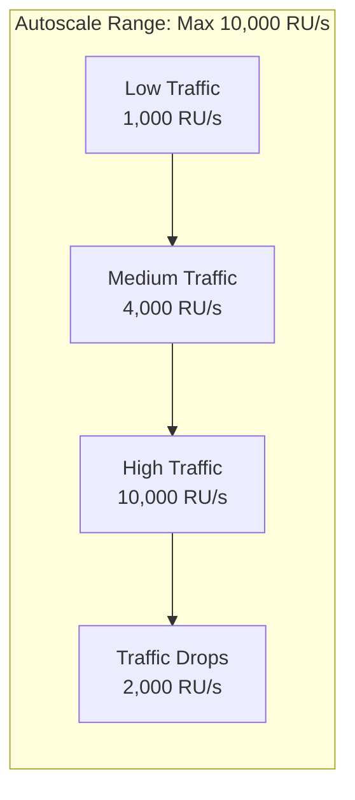

# How to Enable Autoscale Throughput in Azure Cosmos DB

Author: [nawazdhandala](https://www.github.com/nawazdhandala)

Tags: Azure, Cosmos DB, Autoscale, Throughput, Cost Optimization, Performance

Description: Configure autoscale throughput in Azure Cosmos DB to automatically adjust RU/s based on demand and avoid both over-provisioning and throttling.

---

With standard provisioned throughput in Cosmos DB, you set a fixed number of Request Units per second (RU/s) and pay for that capacity around the clock. If traffic spikes above your provisioned level, requests get throttled. If traffic drops below it, you pay for unused capacity. Autoscale solves this by automatically adjusting your throughput between 10% of the maximum and the full maximum based on actual demand.

## How Autoscale Works

When you enable autoscale, you set a maximum RU/s value. Cosmos DB automatically scales between 10% of that max and the full max based on your workload.

For example, if you set a max of 10,000 RU/s:

- Minimum throughput: 1,000 RU/s (10% of max)
- Maximum throughput: 10,000 RU/s
- You are billed for the highest RU/s the system scaled to within each hour



The scaling happens instantly - there is no warm-up period and no delay. Cosmos DB continuously monitors your request rate and adjusts the available throughput in real time.

## Creating a Container with Autoscale

### Using Azure Portal

1. Navigate to your Cosmos DB account
2. Open Data Explorer
3. Click New Container
4. Under Throughput, select Autoscale
5. Set the Max RU/s value
6. Click OK

### Using Azure CLI

```bash
# Create a new container with autoscale throughput
# The max-throughput parameter sets the autoscale ceiling
az cosmosdb sql container create \
    --account-name myCosmosAccount \
    --database-name mydb \
    --name orders \
    --partition-key-path "/customerId" \
    --max-throughput 10000 \
    --resource-group myResourceGroup
```

### Using the .NET SDK

```csharp
// Create a container with autoscale throughput
CosmosClient client = new CosmosClient(endpoint, key);
Database database = client.GetDatabase("mydb");

ContainerProperties containerProperties = new ContainerProperties
{
    Id = "orders",
    PartitionKeyPath = "/customerId"
};

// Specify autoscale with a maximum of 10,000 RU/s
// The system will auto-scale between 1,000 and 10,000 RU/s
ThroughputProperties autoscaleThroughput =
    ThroughputProperties.CreateAutoscaleThroughput(maxThroughput: 10000);

Container container = await database.CreateContainerAsync(
    containerProperties,
    autoscaleThroughput
);

Console.WriteLine("Container created with autoscale throughput.");
```

## Creating a Database with Shared Autoscale Throughput

You can also set autoscale at the database level, and all containers share the throughput:

```bash
# Create a database with shared autoscale throughput
# All containers in this database share the 20,000 RU/s max
az cosmosdb sql database create \
    --account-name myCosmosAccount \
    --name shareddb \
    --max-throughput 20000 \
    --resource-group myResourceGroup

# Create containers in the shared database (no individual throughput)
az cosmosdb sql container create \
    --account-name myCosmosAccount \
    --database-name shareddb \
    --name container1 \
    --partition-key-path "/pk" \
    --resource-group myResourceGroup
```

## Switching Between Manual and Autoscale

You can convert existing containers between manual (standard) throughput and autoscale.

### Manual to Autoscale

```bash
# Migrate a container from manual throughput to autoscale
az cosmosdb sql container throughput migrate \
    --account-name myCosmosAccount \
    --database-name mydb \
    --name orders \
    --throughput-type autoscale \
    --resource-group myResourceGroup
```

When migrating from manual to autoscale, the new max RU/s is set to the current manual value (or higher, based on storage requirements). For example, if your manual throughput is 4,000 RU/s, the autoscale max will be set to 4,000 RU/s with a minimum of 400 RU/s.

### Autoscale to Manual

```bash
# Migrate back from autoscale to manual throughput
az cosmosdb sql container throughput migrate \
    --account-name myCosmosAccount \
    --database-name mydb \
    --name orders \
    --throughput-type manual \
    --resource-group myResourceGroup
```

When converting from autoscale to manual, the throughput is set to the current autoscale max value. You can then lower it manually if needed.

## Changing the Autoscale Max

You can adjust the maximum RU/s at any time:

```bash
# Update the autoscale max throughput
az cosmosdb sql container throughput update \
    --account-name myCosmosAccount \
    --database-name mydb \
    --name orders \
    --max-throughput 20000 \
    --resource-group myResourceGroup
```

```csharp
// Update autoscale max using the .NET SDK
Container container = client.GetContainer("mydb", "orders");

ThroughputProperties newThroughput =
    ThroughputProperties.CreateAutoscaleThroughput(maxThroughput: 20000);

await container.ReplaceThroughputAsync(newThroughput);
```

The minimum allowed max RU/s depends on your storage:

- The formula is: Max RU/s must be at least `MAX(1000, storage_in_GB * 10) * number_of_regions`
- For example, if you have 100 GB of data, your minimum max RU/s is 1,000

## Cost Comparison: Manual vs Autoscale

Autoscale RU/s are priced at 1.5x the rate of manual provisioned RU/s. However, because autoscale can drop to 10% of the max during low traffic, the actual cost depends on your traffic pattern.

Here is an example for a max of 10,000 RU/s:

| Scenario | Manual Cost | Autoscale Cost |
|----------|------------|----------------|
| 100% utilization 24/7 | 10,000 RU/s * rate | 10,000 RU/s * 1.5x rate (50% more expensive) |
| 50% utilization average | 10,000 RU/s * rate | ~5,000 RU/s * 1.5x rate (25% cheaper) |
| 10% utilization average | 10,000 RU/s * rate | ~1,000 RU/s * 1.5x rate (85% cheaper) |
| Bursty (10% most hours, 100% some) | 10,000 RU/s * rate | Varies, usually much cheaper |

The rule of thumb: if your average utilization is below 66% of your peak, autoscale is cheaper. If you are consistently above 66%, manual provisioned is cheaper.

## Monitoring Autoscale Behavior

Track how autoscale is working in your environment:

```bash
# Check current throughput level (what autoscale has scaled to)
az cosmosdb sql container throughput show \
    --account-name myCosmosAccount \
    --database-name mydb \
    --name orders \
    --resource-group myResourceGroup
```

In the Azure Portal under Metrics, monitor these:

- **Provisioned Throughput**: Shows the current autoscale level over time
- **Normalized RU Consumption**: Shows what percentage of available throughput you are using
- **Total Request Units**: Your actual consumption
- **429 Count**: Throttled requests (should be near zero with autoscale)

```csharp
// Programmatically check the current throughput level
Container container = client.GetContainer("mydb", "orders");
ThroughputResponse throughputResponse = await container.ReadThroughputAsync(
    new RequestOptions());

if (throughputResponse.Resource.AutoscaleMaxThroughput.HasValue)
{
    Console.WriteLine($"Autoscale max: {throughputResponse.Resource.AutoscaleMaxThroughput} RU/s");

    // The current throughput is determined by the system
    // You can see it in the portal metrics
}
```

## Autoscale with Shared Throughput Databases

When using autoscale at the database level with shared throughput, all containers in the database share the autoscale range. The system distributes throughput to containers based on demand.

Important considerations:

- If one container is hot and others are cold, the hot container gets most of the throughput
- You can have up to 25 containers in a shared throughput database
- Individual containers can also have dedicated autoscale throughput alongside shared containers

```csharp
// Create a database with shared autoscale and add containers
Database database = await client.CreateDatabaseAsync(
    new DatabaseProperties("shareddb"),
    ThroughputProperties.CreateAutoscaleThroughput(maxThroughput: 40000)
);

// These containers share the database throughput
await database.CreateContainerAsync(new ContainerProperties("users", "/userId"));
await database.CreateContainerAsync(new ContainerProperties("sessions", "/sessionId"));
await database.CreateContainerAsync(new ContainerProperties("logs", "/date"));
```

## Best Practices

1. **Start with autoscale for new workloads**: You can always switch to manual once you understand your traffic patterns.

2. **Set the max slightly above your peak**: If your peak is 8,000 RU/s, set the max to 10,000 to give headroom for growth.

3. **Monitor the normalized RU consumption**: If it is consistently above 70%, increase the max. If it is consistently below 10%, consider lowering the max or switching to manual.

4. **Combine with alerts**: Set up Azure Monitor alerts for when normalized RU consumption exceeds 80% so you can proactively increase the max.

5. **Use for unpredictable workloads**: If your traffic is steady and predictable, manual provisioned throughput at 1x pricing might be cheaper.

6. **Do not forget the 10% minimum**: Even during zero traffic, you are billed for 10% of the max. If your max is 100,000 RU/s, you always pay for at least 10,000 RU/s.

Autoscale is the best default choice for most production Cosmos DB workloads. It eliminates the guesswork of capacity planning, prevents throttling during traffic spikes, and saves money during quiet periods. The 1.5x price premium is easily offset by not paying for idle capacity during off-peak hours.
