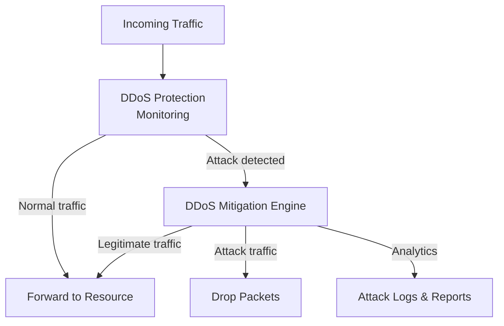

# How to Enable Azure DDoS Protection Standard on a Virtual Network

Author: [nawazdhandala](https://www.github.com/nawazdhandala)

Tags: Azure, DDoS Protection, Network Security, Virtual Network, Azure Networking, Cloud Security

Description: A practical guide to enabling Azure DDoS Protection Standard on your virtual networks to defend against distributed denial-of-service attacks.

---

Distributed denial-of-service (DDoS) attacks are one of those things you do not worry about until they happen, and then they consume your entire day. Azure provides basic DDoS protection automatically for all resources at no extra cost. This basic protection covers infrastructure-level attacks. But for applications that need stronger protection - think adaptive tuning, attack analytics, cost protection guarantees, and rapid response support - you need DDoS Protection Standard (now called DDoS Network Protection).

DDoS Protection Standard monitors your public endpoints, learns your normal traffic patterns, and automatically mitigates attacks. It can absorb massive volumetric attacks (Azure has mitigated attacks exceeding 3.47 Tbps) while keeping legitimate traffic flowing. This guide covers how to set it up.

## Basic vs. Standard DDoS Protection

Azure DDoS Infrastructure Protection (basic) is enabled by default for all Azure services. It handles large-scale network layer attacks but does not know anything about your specific application traffic patterns.

DDoS Network Protection (standard) provides:

- **Adaptive tuning**: Learns your application's traffic profile and adjusts thresholds accordingly
- **Attack analytics**: Real-time metrics and post-attack reports
- **DDoS Rapid Response (DRR)**: Access to the Microsoft DDoS experts during an active attack
- **Cost protection**: If a DDoS attack causes your resources to scale out, Microsoft credits the costs
- **WAF integration**: Works with Application Gateway WAF for both Layer 3/4 and Layer 7 protection

## Prerequisites

- An Azure subscription
- A virtual network with public-facing resources
- Azure CLI installed
- Sufficient permissions (Network Contributor or higher)

## Step 1: Create a DDoS Protection Plan

The DDoS Protection plan is a top-level resource that you link to virtual networks. One plan can protect up to 200 virtual networks across subscriptions within the same tenant.

```bash
# Create a resource group
az group create --name rg-ddos-demo --location eastus

# Create a DDoS Protection plan
az network ddos-protection create \
  --resource-group rg-ddos-demo \
  --name ddos-plan-demo \
  --location eastus
```

Note that DDoS Protection Standard has a fixed monthly cost plus per-GB charges for data processing. The monthly cost covers up to 100 public IP resources. Make sure this fits your budget before proceeding.

## Step 2: Create or Identify Your Virtual Network

If you already have a VNet with public-facing resources, skip to Step 3.

```bash
# Create a VNet
az network vnet create \
  --resource-group rg-ddos-demo \
  --name vnet-production \
  --location eastus \
  --address-prefixes 10.0.0.0/16 \
  --subnet-name subnet-web \
  --subnet-prefixes 10.0.0.0/24
```

## Step 3: Enable DDoS Protection on the Virtual Network

Associate the DDoS Protection plan with your virtual network.

```bash
# Get the DDoS Protection plan ID
DDOS_PLAN_ID=$(az network ddos-protection show \
  --resource-group rg-ddos-demo \
  --name ddos-plan-demo \
  --query id --output tsv)

# Enable DDoS Protection on the VNet
az network vnet update \
  --resource-group rg-ddos-demo \
  --name vnet-production \
  --ddos-protection-plan $DDOS_PLAN_ID \
  --ddos-protection true
```

Once enabled, all public IPs associated with resources in this VNet are protected. This includes public IPs on VMs, load balancers, Application Gateways, and any other resource with a public endpoint.

## Step 4: Verify DDoS Protection Status

```bash
# Check the DDoS protection status of the VNet
az network vnet show \
  --resource-group rg-ddos-demo \
  --name vnet-production \
  --query "{enableDdosProtection:enableDdosProtection, ddosPlan:ddosProtectionPlan.id}" \
  --output table
```

The output should show `enableDdosProtection` as `True` and the DDoS plan ID.

## Step 5: Configure Alerts for DDoS Events

You want to know when an attack is happening. Set up alerts for DDoS metrics on your public IPs.

```bash
# Get the public IP resource ID
PIP_ID=$(az network public-ip show \
  --resource-group rg-ddos-demo \
  --name pip-webserver \
  --query id --output tsv)

# Create an alert for DDoS attack detection
az monitor metrics alert create \
  --resource-group rg-ddos-demo \
  --name "alert-ddos-attack" \
  --scopes $PIP_ID \
  --condition "avg IfUnderDDoSAttack > 0" \
  --window-size 5m \
  --evaluation-frequency 1m \
  --severity 1 \
  --description "DDoS attack detected on public IP"
```

You can also create alerts for specific DDoS metrics:

- `IfUnderDDoSAttack`: Binary metric (0 or 1) indicating an active attack
- `PacketsDroppedDDoS`: Number of packets dropped by DDoS mitigation
- `PacketsForwardedDDoS`: Number of packets forwarded (legitimate traffic)
- `BytesDroppedDDoS`: Bytes dropped by mitigation
- `TCPPacketsDroppedDDoS`: TCP packets dropped

## Step 6: Configure Diagnostic Logging

Enable diagnostic logs for detailed attack information.

```bash
# Create a Log Analytics workspace
az monitor log-analytics workspace create \
  --resource-group rg-ddos-demo \
  --workspace-name law-ddos \
  --location eastus

WORKSPACE_ID=$(az monitor log-analytics workspace show \
  --resource-group rg-ddos-demo \
  --workspace-name law-ddos \
  --query id --output tsv)

# Enable diagnostic logs on the public IP
az monitor diagnostic-settings create \
  --resource $PIP_ID \
  --name diag-ddos \
  --workspace $WORKSPACE_ID \
  --logs '[{"category":"DDoSProtectionNotifications","enabled":true},{"category":"DDoSMitigationFlowLogs","enabled":true},{"category":"DDoSMitigationReports","enabled":true}]' \
  --metrics '[{"category":"AllMetrics","enabled":true}]'
```

The three log categories provide:

- **DDoSProtectionNotifications**: Alerts when an attack starts and stops
- **DDoSMitigationFlowLogs**: Detailed flow information during mitigation
- **DDoSMitigationReports**: Summary reports of mitigated attacks

## Understanding the Protection Mechanism

When DDoS Protection Standard is enabled, here is what happens:



The system continuously monitors traffic to your protected public IPs. It learns your normal traffic baselines over several days. When traffic deviates significantly from the baseline, mitigation kicks in automatically. The mitigation engine scrubs attack traffic while forwarding legitimate requests.

## Multi-VNet Protection

A single DDoS Protection plan can protect multiple virtual networks, even across different subscriptions in the same Azure AD tenant.

```bash
# Associate the same plan with another VNet
az network vnet update \
  --resource-group rg-other-project \
  --name vnet-staging \
  --ddos-protection-plan $DDOS_PLAN_ID \
  --ddos-protection true
```

Since the plan has a fixed monthly cost regardless of how many VNets it protects (up to 100 public IPs included), spreading the cost across multiple VNets makes financial sense.

## DDoS Rapid Response

With DDoS Protection Standard, you can engage the Microsoft DDoS Rapid Response (DRR) team during an active attack. To use this:

1. Create a support case during the attack
2. Select "DDoS" as the problem type
3. The DRR team will work with you on mitigation

You can also pre-engage the DRR team by creating a DDoS Rapid Response profile, which includes your contact information and attack playbook details.

## Cost Protection Guarantee

One of the most valuable features of DDoS Protection Standard is the cost protection guarantee. If a DDoS attack causes your Azure resources to scale out (autoscale VMs, App Service scale, etc.), Microsoft will credit the scale-out costs. You need to file a support case after the attack with the relevant cost data.

## Best Practices

**Enable on all production VNets.** If your VNets have public-facing resources, they should have DDoS protection.

**Set up alerts immediately.** Do not wait for an attack to realize you have no visibility.

**Use with Application Gateway WAF.** DDoS Protection handles Layer 3/4 attacks. WAF handles Layer 7 attacks. Together, they provide comprehensive protection.

**Document your baseline.** DDoS Protection needs a few days to learn your traffic patterns. Allow this learning period before expecting optimal tuning.

## Cleanup

```bash
# First remove DDoS protection from VNets
az network vnet update \
  --resource-group rg-ddos-demo \
  --name vnet-production \
  --ddos-protection false

# Then delete the DDoS plan
az network ddos-protection delete \
  --resource-group rg-ddos-demo \
  --name ddos-plan-demo

# Delete the resource group
az group delete --name rg-ddos-demo --yes --no-wait
```

## Wrapping Up

Azure DDoS Protection Standard provides adaptive, always-on protection for your public-facing Azure resources. The setup is straightforward - create a plan, associate it with your VNets, set up alerts and logging. The real value comes from the adaptive tuning that learns your traffic patterns, the cost protection guarantee, and the DDoS Rapid Response team access. For any production workload with public endpoints, the protection is well worth the investment.
