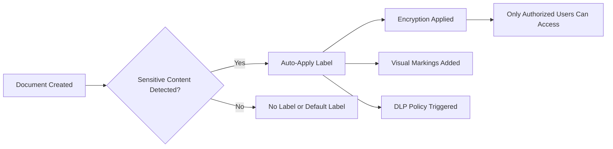

# How to Enable Azure Information Protection Labels and Classify Sensitive Documents Automatically

Author: [nawazdhandala](https://www.github.com/nawazdhandala)

Tags: Azure Information Protection, Data Classification, Sensitivity Labels, Microsoft Purview, DLP, Data Protection, Compliance

Description: A hands-on guide to setting up sensitivity labels in Microsoft Purview to automatically classify and protect documents containing sensitive information.

---

Sensitive data is everywhere in most organizations - credit card numbers in spreadsheets, employee Social Security numbers in HR documents, source code with API keys in shared drives. The problem is not that people intentionally mishandle data; it is that they do not always know what is sensitive or how to protect it. Azure Information Protection (now part of Microsoft Purview Information Protection) solves this by automatically detecting sensitive content and applying labels that control who can access it and what they can do with it.

In this guide, I will walk through creating sensitivity labels, configuring auto-labeling policies, and deploying the whole setup across your organization.

## How Sensitivity Labels Work

Sensitivity labels are metadata tags that travel with the document. When a label is applied, it can:

- Add a visual marking (header, footer, or watermark)
- Apply encryption that restricts who can open or edit the document
- Add rights management that controls printing, copying, and forwarding
- Trigger Data Loss Prevention (DLP) policies based on the label

Labels can be applied manually by users, recommended by the system with a tooltip, or applied automatically without any user interaction.



## Prerequisites

To set up sensitivity labels, you need:

- Microsoft 365 E3 or E5 license (E5 for auto-labeling)
- Global Administrator or Compliance Administrator role
- Access to the Microsoft Purview compliance portal
- Azure Information Protection unified labeling enabled

## Step 1: Create a Label Taxonomy

Before creating labels in the portal, plan your taxonomy. A good labeling scheme is simple enough for users to understand but granular enough to support your data protection requirements.

Here is a common five-tier taxonomy that works for most organizations:

| Label | Description | Protection |
|---|---|---|
| Public | Information intended for external distribution | No restrictions |
| General | Internal information not meant for public sharing | No encryption, DLP monitoring |
| Confidential | Sensitive business data | Encryption, restricted sharing |
| Highly Confidential | Regulated or critical business data | Strong encryption, no forwarding |
| Personal | Employee personal data (GDPR/privacy) | Encryption, restricted to HR |

Each label can also have sub-labels for more specific scenarios, like "Confidential - Finance" or "Highly Confidential - Legal."

## Step 2: Create Sensitivity Labels in Microsoft Purview

Navigate to the Microsoft Purview compliance portal (compliance.microsoft.com) > Information protection > Labels.

Click **Create a label** and configure the first label.

For the "Confidential" label:
1. Name: `Confidential`
2. Display name: `Confidential`
3. Description for users: "Apply to sensitive business information that should only be shared with authorized employees."
4. Scope: Files and emails
5. Encryption: Enable encryption
   - Assign permissions now (do not let users assign)
   - Add "All employees" group with Co-Author permissions
   - Set content expiration to "Never" (or set a date for time-sensitive content)
6. Content marking: Enable
   - Header: "CONFIDENTIAL"
   - Watermark: "Confidential - Internal Use Only"
7. Auto-labeling: Configure in Step 4

You can also create labels using PowerShell for repeatability.

```powershell
# Connect to the Security and Compliance PowerShell module
Connect-IPPSSession

# Create the Confidential sensitivity label with encryption
New-Label `
  -Name "Confidential" `
  -DisplayName "Confidential" `
  -Tooltip "Apply to sensitive business information" `
  -Comment "Business sensitive data - internal only" `
  -ContentType "File, Email" `
  -EncryptionEnabled $true `
  -EncryptionProtectionType "Template" `
  -EncryptionRightsDefinitions "AllStaff@contoso.com:VIEW,VIEWRIGHTSDATA,DOCEDIT,EDIT,PRINT,EXTRACT,OBJMODEL"
```

## Step 3: Publish Labels to Users

Labels are not visible to users until you publish them through a label policy.

Navigate to Information protection > Label policies > Publish labels.

Configure the policy:
1. Select which labels to include (typically all of them)
2. Choose which users and groups see these labels
3. Set a default label (recommended: "General" for documents, "None" for emails)
4. Require users to provide justification when removing or downgrading a label
5. Require users to apply a label to their documents and emails (mandatory labeling)

```powershell
# Create a label policy that publishes labels to all users
New-LabelPolicy `
  -Name "Company-Wide Labels" `
  -Labels "Public","General","Confidential","HighlyConfidential","Personal" `
  -ExchangeLocation "All" `
  -ModernGroupLocation "All" `
  -Settings @{
    "requiredowngradejustification" = "true";
    "mandatory" = "true";
    "defaultlabelid" = "general-label-guid-here"
  }
```

Label policies can take up to 24 hours to propagate to all users. During this time, some users may see the labels while others do not.

## Step 4: Configure Auto-Labeling for Sensitive Content

This is where things get powerful. Auto-labeling scans document content for sensitive information types (like credit card numbers, Social Security numbers, or custom patterns) and applies labels automatically.

Navigate to Information protection > Auto-labeling.

Create a new auto-labeling policy:

1. **Name**: "Auto-label PII and Financial Data"
2. **Choose info types**: Select the sensitive information types to detect
   - Credit Card Number
   - U.S. Social Security Number
   - Bank Account Number
   - Custom sensitive info types (if you have created any)
3. **Conditions**: Set confidence levels and instance counts
   - Example: Apply the "Highly Confidential" label when 5 or more credit card numbers are found with high confidence
4. **Label to apply**: Select "Highly Confidential"
5. **Mode**: Start in simulation mode to see what would be labeled without actually applying labels

Here is how to create the same policy via PowerShell.

```powershell
# Create an auto-labeling policy for credit card numbers
New-AutoSensitivityLabelPolicy `
  -Name "Auto-Label Financial PII" `
  -ExchangeLocation "All" `
  -SharePointLocation "All" `
  -OneDriveLocation "All" `
  -Mode "TestWithNotifications" `
  -ApplySensitivityLabel "HighlyConfidential"

# Add the rule with sensitive info type conditions
New-AutoSensitivityLabelRule `
  -Policy "Auto-Label Financial PII" `
  -Name "Credit Card Detection" `
  -ContentContainsSensitiveInformation @{
    Name = "Credit Card Number";
    MinCount = 1;
    MaxCount = -1;
    MinConfidence = 85;
    MaxConfidence = 100
  }
```

## Step 5: Run the Simulation and Review Results

Before turning on auto-labeling for real, run it in simulation mode for at least a week. This shows you exactly which documents would be labeled and lets you catch false positives.

In the auto-labeling policy, click **Run simulation**. After the simulation completes, review the results:

- How many documents matched?
- Are there false positives (documents that matched but should not have been labeled)?
- Are there false negatives (documents that should have been caught but were not)?

Adjust the confidence thresholds and instance counts based on what you find. If you are getting too many false positives on credit card numbers (test credit card numbers in documentation, for example), increase the minimum confidence to 95%.

## Step 6: Enable Auto-Labeling in Production

Once you are satisfied with the simulation results, turn on the policy.

Navigate to the auto-labeling policy and change the mode from simulation to enforcement. Documents will start being labeled automatically as the service scans content across Exchange, SharePoint, and OneDrive.

Note that auto-labeling runs as a background process and does not label documents instantly. It typically processes new and modified documents within a few hours.

## Step 7: Configure Label-Based DLP Policies

Sensitivity labels become even more powerful when you pair them with Data Loss Prevention policies. For example, you can create a DLP policy that prevents documents labeled "Highly Confidential" from being shared with external recipients.

```powershell
# Create a DLP policy that blocks external sharing of Highly Confidential documents
New-DlpCompliancePolicy `
  -Name "Block External Sharing of HC Documents" `
  -SharePointLocation "All" `
  -OneDriveLocation "All" `
  -ExchangeLocation "All" `
  -Mode "Enable"

New-DlpComplianceRule `
  -Policy "Block External Sharing of HC Documents" `
  -Name "Block HC External" `
  -ContentContainsSensitivityLabels "HighlyConfidential" `
  -BlockAccess $true `
  -BlockAccessScope "NotInOrganization" `
  -NotifyUser "SiteAdmin","LastModifier" `
  -NotifyPolicyTipCustomText "This document is labeled Highly Confidential and cannot be shared externally."
```

## Monitoring Label Usage

Track how labels are being used across your organization using the built-in reports.

Navigate to Microsoft Purview > Information protection > Reports. Key reports include:

- **Label usage summary**: Shows how many documents have each label applied
- **Top labeled content**: Identifies the most-labeled locations
- **Label changes**: Shows when users change or remove labels (including justification text)

You can also query label activity through the unified audit log.

```powershell
# Search the audit log for sensitivity label activities in the last 7 days
Search-UnifiedAuditLog `
  -StartDate (Get-Date).AddDays(-7) `
  -EndDate (Get-Date) `
  -Operations "SensitivityLabelApplied","SensitivityLabelRemoved","SensitivityLabelChanged" `
  -ResultSize 100 |
  Select-Object CreationDate, UserIds, Operations, AuditData
```

## Best Practices

1. **Start with manual labeling before auto-labeling.** Let users get familiar with the labels and provide feedback on the taxonomy before you automate.

2. **Use simulation mode extensively.** Auto-labeling false positives are hard to undo at scale. Run simulations until you are confident in the accuracy.

3. **Keep the taxonomy simple.** Five to seven labels is ideal. More than that and users get confused, leading to inconsistent labeling.

4. **Train your users.** Even with auto-labeling, users should understand what the labels mean and why they matter. A 15-minute training session goes a long way.

5. **Review justifications for label downgrades.** If users frequently downgrade labels, it might indicate that the labels are too aggressive or that users do not understand the policy.

6. **Update sensitive information types regularly.** If your organization creates new types of sensitive data (custom IDs, project codes, etc.), create custom sensitive information types and add them to your auto-labeling rules.

## Wrapping Up

Azure Information Protection with sensitivity labels gives you a systematic way to identify and protect sensitive data across your Microsoft 365 environment. Start with a clear taxonomy, publish labels to users with mandatory labeling, then layer on auto-labeling to catch the content that users miss. Pair labels with DLP policies for enforcement, and monitor usage to continuously improve your data classification posture. The goal is not perfect labeling on day one but steady improvement over time.
