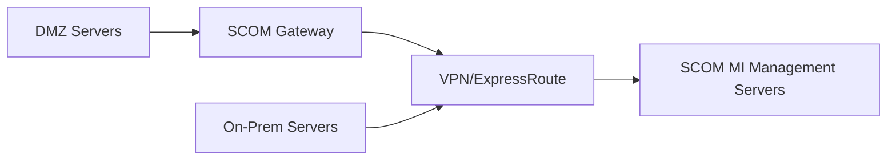

# How to Enable Azure Monitor SCOM Managed Instance for Hybrid Monitoring

Author: [nawazdhandala](https://www.github.com/nawazdhandala)

Tags: Azure Monitor, SCOM, Hybrid Monitoring, System Center, On-Premises, Azure Cloud, Infrastructure Monitoring

Description: Learn how to deploy Azure Monitor SCOM Managed Instance to extend your existing SCOM monitoring into Azure for hybrid infrastructure visibility.

---

If your organization has invested years in System Center Operations Manager (SCOM) with custom management packs, monitoring logic, and runbooks, migrating everything to a cloud-native monitoring solution overnight is not realistic. Azure Monitor SCOM Managed Instance bridges that gap. It lets you run SCOM in Azure as a managed service while keeping your existing management packs and monitoring configurations intact.

This is particularly useful for hybrid environments where you have workloads both on-premises and in Azure. You get the familiarity of SCOM with the operational simplicity of a managed service - no more patching SCOM servers, managing SQL databases, or worrying about high availability for your management group.

## What Is SCOM Managed Instance?

SCOM Managed Instance (SCOM MI) is a fully managed version of System Center Operations Manager that runs in Azure. Microsoft handles the infrastructure - the management servers, the operational database, the data warehouse, and the reporting components. You bring your management packs and monitoring configurations.

Key benefits:

- **No infrastructure management**: Microsoft manages the SCOM servers, SQL backend, and patching
- **Hybrid connectivity**: Monitors on-premises servers, Azure VMs, and other cloud workloads through a single management group
- **Existing investment preservation**: Your management packs, overrides, and custom monitors carry over
- **Azure Monitor integration**: Sends alerts to Azure Monitor for unified alert management

## Prerequisites

Before deploying SCOM MI, you need:

- An Azure subscription with a resource group
- A Virtual Network with connectivity to your on-premises network (via VPN or ExpressRoute)
- A subnet dedicated to SCOM MI (at least /27)
- A SQL Managed Instance for the SCOM databases (SCOM MI creates its own, but you can also bring your own)
- A managed identity or service account for SCOM MI
- Network connectivity between SCOM MI and the machines you want to monitor

The network connectivity piece is critical. SCOM agents on your on-premises servers need to reach the SCOM MI management servers in Azure, and vice versa.

## Step 1: Set Up the Virtual Network

Your SCOM MI deployment needs a VNet with connectivity to your on-premises environment. If you already have a hub-and-spoke topology with VPN or ExpressRoute, you can deploy SCOM MI into a spoke VNet peered with the hub.

Create a dedicated subnet for SCOM MI:

```bash
# Create a subnet for SCOM Managed Instance
az network vnet subnet create \
  --resource-group myRG \
  --vnet-name myHubVNet \
  --name scom-mi-subnet \
  --address-prefix 10.0.10.0/27 \
  --delegations Microsoft.Scom/managedInstances
```

The subnet delegation ensures Azure knows this subnet is reserved for SCOM MI.

## Step 2: Create a Managed Identity

SCOM MI uses a managed identity to access Azure resources and authenticate with the monitoring infrastructure.

```bash
# Create a user-assigned managed identity for SCOM MI
az identity create \
  --resource-group myRG \
  --name scom-mi-identity \
  --location eastus
```

Grant this identity the necessary permissions:

```bash
# Assign the Contributor role for the resource group
az role assignment create \
  --assignee $(az identity show --resource-group myRG --name scom-mi-identity --query principalId -o tsv) \
  --role Contributor \
  --scope /subscriptions/<sub-id>/resourceGroups/myRG
```

## Step 3: Deploy SCOM Managed Instance

You can deploy SCOM MI through the Azure Portal or using ARM/Bicep templates.

In the Azure Portal:

1. Search for "SCOM Managed Instance" in the marketplace
2. Click Create
3. Fill in the basics - subscription, resource group, region, instance name
4. Select the Virtual Network and subnet you created
5. Assign the managed identity
6. Configure the SQL Managed Instance settings (SCOM MI can create a new SQL MI or use an existing one)
7. Review and create

The deployment takes around 45-60 minutes because it provisions the management servers and SQL databases.

For an ARM template deployment, here is the key resource definition:

```json
{
  "type": "Microsoft.Scom/managedInstances",
  "apiVersion": "2023-07-07-preview",
  "name": "mySCOMMI",
  "location": "eastus",
  "identity": {
    "type": "UserAssigned",
    "userAssignedIdentities": {
      "/subscriptions/<sub-id>/resourceGroups/myRG/providers/Microsoft.ManagedIdentity/userAssignedIdentities/scom-mi-identity": {}
    }
  },
  "properties": {
    "virtualNetworkSubnetId": "/subscriptions/<sub-id>/resourceGroups/myRG/providers/Microsoft.Network/virtualNetworks/myHubVNet/subnets/scom-mi-subnet",
    "managementEndpoints": ["10.0.10.4"],
    "databaseInstance": {
      "databaseInstanceId": "/subscriptions/<sub-id>/resourceGroups/myRG/providers/Microsoft.Sql/managedInstances/mySCOMSQL"
    }
  }
}
```

## Step 4: Configure On-Premises Agent Connectivity

Once SCOM MI is deployed, your on-premises servers need to communicate with the management servers. This requires:

1. **Network path**: Ensure your on-premises firewall allows outbound TCP 5723 (SCOM agent communication) to the SCOM MI management server IPs
2. **DNS resolution**: On-premises servers must resolve the SCOM MI management server hostname
3. **Certificate trust**: If using certificate-based authentication, deploy the SCOM MI CA certificate to your on-premises machines

For existing SCOM agents, you can redirect them to the new management group:

```powershell
# PowerShell script to reconfigure an existing SCOM agent to point to SCOM MI
$agent = New-Object -ComObject AgentConfigManager.MgmtSvcCfg

# Remove old management group
$agent.RemoveManagementGroup("OldManagementGroup")

# Add SCOM MI management group
$agent.AddManagementGroup(
    "SCOMMI_MG",          # Management group name
    "scommi.eastus.azure.com",  # Management server hostname
    5723                   # Port
)

# Restart the agent service
Restart-Service HealthService
```

## Step 5: Import Management Packs

Management packs define what SCOM monitors and how. You can import your existing management packs into SCOM MI through the Operations Console.

Connect to the SCOM MI Operations Console:

1. Download the Operations Console installer from the SCOM MI portal page
2. Install it on a management workstation that has network access to SCOM MI
3. Connect using the SCOM MI management server address

Then import management packs:

1. Open the Operations Console
2. Go to Administration > Management Packs
3. Click Import Management Packs
4. Select your .mp or .mpb files
5. Verify dependencies are met and click Install

Common management packs to import first:

- Windows Server Operating System management pack
- SQL Server management pack
- IIS management pack
- Active Directory management pack

## Step 6: Configure Azure Monitor Integration

One of the best features of SCOM MI is that it can forward alerts to Azure Monitor. This means you can use Azure Monitor's alert processing rules, action groups, and notification channels alongside your SCOM monitoring.

Enable the integration in the SCOM MI settings:

1. In the Azure Portal, go to your SCOM MI resource
2. Click on "Azure Monitor integration" in the left menu
3. Enable the integration and select which alert severities to forward
4. Map SCOM alert severity to Azure Monitor alert severity

Once enabled, SCOM alerts appear in Azure Monitor alongside your native Azure alerts. You can create unified alert processing rules that handle both.

## Step 7: Set Up Gateway Servers for DMZ Monitoring

If you have servers in a DMZ or a network segment that cannot directly reach the SCOM MI management servers, deploy a SCOM Gateway server as an intermediary.

The architecture looks like this:



The Gateway server accepts agent connections from the DMZ and forwards them to the management servers in Azure. This avoids opening direct connectivity from the DMZ to Azure.

## Monitoring Azure VMs with SCOM MI

SCOM MI can also monitor Azure VMs, not just on-premises machines. Install the SCOM agent on Azure VMs just like you would on-premises. Since the VMs and SCOM MI are both in Azure (potentially in the same or peered VNets), connectivity is straightforward.

For Azure VMs, you might wonder why you would use SCOM instead of native Azure Monitor. The answer is consistency. If you have hundreds of management pack rules fine-tuned over years, having both Azure VMs and on-premises servers monitored by the same rules eliminates coverage gaps.

## Scaling Considerations

SCOM MI supports scaling the number of management servers based on your agent count:

- Up to 500 agents: 2 management servers (default)
- 500 to 2000 agents: 3-4 management servers
- 2000+ agents: 5+ management servers

You can scale management servers through the Azure Portal or CLI without downtime.

## Cost Structure

SCOM MI pricing includes:

- A per-hour charge for the managed instance
- SQL Managed Instance costs for the databases
- Network egress charges for data flowing between on-premises and Azure
- SCOM agent licensing (existing System Center licenses can be applied)

For organizations with existing System Center licenses, the primary additional cost is the managed instance and SQL MI compute.

## Wrapping Up

SCOM Managed Instance is the right choice for organizations that need to maintain their existing SCOM investment while moving toward Azure-based operations. It removes the burden of managing SCOM infrastructure while preserving the monitoring logic you have built over years. The Azure Monitor integration ensures you are not creating a monitoring silo - SCOM alerts flow into the same alert management pipeline as your cloud-native monitoring.
