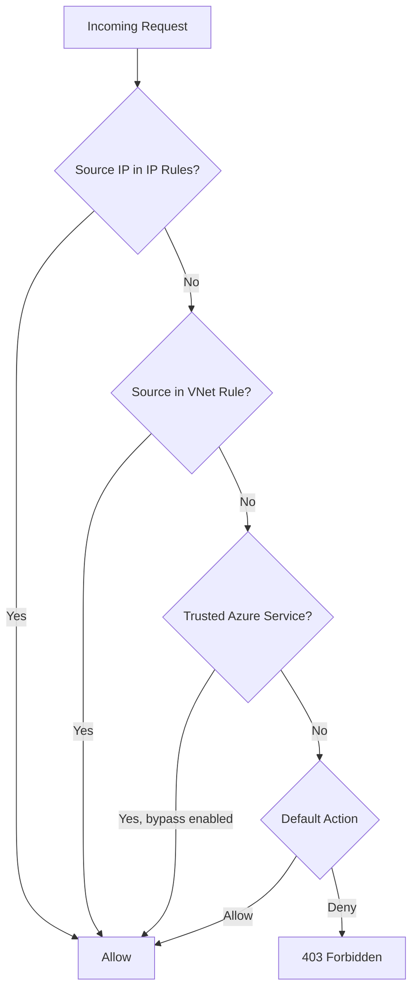

# How to Enable Azure Storage Firewall and Virtual Network Rules

Author: [nawazdhandala](https://www.github.com/nawazdhandala)

Tags: Azure, Storage Firewall, Virtual Network, Network Security, Storage Account, Access Control

Description: Learn how to configure Azure Storage Firewall and virtual network rules to restrict access to your storage accounts from specific networks and IP addresses.

---

By default, Azure Storage accounts accept connections from any network. That is convenient for getting started but unacceptable for production. The Azure Storage Firewall lets you lock down your storage account so only specific virtual networks, IP addresses, and Azure services can reach it. In this post, I will walk through configuring the firewall, setting up virtual network service endpoints, and handling the common scenarios you will encounter.

## How the Storage Firewall Works

The storage firewall operates at the network layer. When you enable it, you switch the default action from "Allow" to "Deny." Then you explicitly whitelist the networks and IPs that should have access.

Any request from a non-whitelisted source gets a 403 Forbidden response. This applies to all storage services - Blob, File, Queue, Table, and Data Lake.

The firewall evaluates rules in this order:

1. Virtual network rules (service endpoints)
2. IP network rules
3. Resource instance rules (trusted Azure services)
4. The default action (allow or deny)

## Enabling the Storage Firewall

```bash
# Set the default action to Deny
# This blocks all access except from whitelisted sources
az storage account update \
  --name mystorageaccount \
  --resource-group my-resource-group \
  --default-action Deny

# Verify the firewall is enabled
az storage account show \
  --name mystorageaccount \
  --resource-group my-resource-group \
  --query "networkRuleSet.defaultAction"
```

Important: After running this command, your own access might be blocked unless you have whitelisted your IP or network. Make sure you add at least one rule before or immediately after changing the default action.

## Adding IP Network Rules

You can whitelist specific public IP addresses or CIDR ranges.

```bash
# Allow access from a specific IP address
az storage account network-rule add \
  --account-name mystorageaccount \
  --resource-group my-resource-group \
  --ip-address 203.0.113.50

# Allow access from a CIDR range
az storage account network-rule add \
  --account-name mystorageaccount \
  --resource-group my-resource-group \
  --ip-address 198.51.100.0/24

# List current IP rules
az storage account network-rule list \
  --account-name mystorageaccount \
  --resource-group my-resource-group \
  --query "ipRules[].{IP:ipAddressOrRange, Action:action}" \
  --output table
```

Note that you can only whitelist public IP addresses. Private IPs (10.x.x.x, 172.16-31.x.x, 192.168.x.x) are not supported in IP rules. For private network access, use virtual network rules or private endpoints.

## Adding Virtual Network Rules

Virtual network rules use service endpoints to allow traffic from specific Azure VNets and subnets.

```bash
# First, enable the storage service endpoint on the subnet
az network vnet subnet update \
  --name my-subnet \
  --vnet-name my-vnet \
  --resource-group my-resource-group \
  --service-endpoints Microsoft.Storage

# Then add the subnet to the storage account's allowed list
SUBNET_ID=$(az network vnet subnet show \
  --name my-subnet \
  --vnet-name my-vnet \
  --resource-group my-resource-group \
  --query id -o tsv)

az storage account network-rule add \
  --account-name mystorageaccount \
  --resource-group my-resource-group \
  --subnet "$SUBNET_ID"

# List virtual network rules
az storage account network-rule list \
  --account-name mystorageaccount \
  --resource-group my-resource-group \
  --query "virtualNetworkRules[].{SubnetId:virtualNetworkResourceId, Action:action}" \
  --output table
```

## Allowing Trusted Azure Services

Many Azure services need to access your storage account for features like diagnostics logging, backup, and event triggers. You can allow these without opening the firewall to the public internet.

```bash
# Allow trusted Microsoft services to access the storage account
# This includes services like Azure Backup, Event Grid, and Azure Monitor
az storage account update \
  --name mystorageaccount \
  --resource-group my-resource-group \
  --bypass AzureServices

# You can combine bypass options: Logging, Metrics, AzureServices, None
az storage account update \
  --name mystorageaccount \
  --resource-group my-resource-group \
  --bypass AzureServices Logging Metrics
```

## Configuring with PowerShell

```powershell
# Set the default action to Deny
Update-AzStorageAccountNetworkRuleSet `
  -ResourceGroupName "my-resource-group" `
  -Name "mystorageaccount" `
  -DefaultAction Deny

# Add an IP rule
Add-AzStorageAccountNetworkRule `
  -ResourceGroupName "my-resource-group" `
  -Name "mystorageaccount" `
  -IPAddressOrRange "203.0.113.50"

# Add a virtual network rule
$subnet = Get-AzVirtualNetwork -Name "my-vnet" -ResourceGroupName "my-resource-group" |
  Get-AzVirtualNetworkSubnetConfig -Name "my-subnet"

Add-AzStorageAccountNetworkRule `
  -ResourceGroupName "my-resource-group" `
  -Name "mystorageaccount" `
  -VirtualNetworkResourceId $subnet.Id

# Allow trusted Azure services
Update-AzStorageAccountNetworkRuleSet `
  -ResourceGroupName "my-resource-group" `
  -Name "mystorageaccount" `
  -Bypass AzureServices, Logging, Metrics
```

## Configuring with ARM Template

```json
{
    "type": "Microsoft.Storage/storageAccounts",
    "apiVersion": "2023-01-01",
    "name": "mystorageaccount",
    "location": "eastus",
    "properties": {
        "networkAcls": {
            "defaultAction": "Deny",
            "bypass": "AzureServices, Logging, Metrics",
            "ipRules": [
                {
                    "value": "203.0.113.50",
                    "action": "Allow"
                },
                {
                    "value": "198.51.100.0/24",
                    "action": "Allow"
                }
            ],
            "virtualNetworkRules": [
                {
                    "id": "/subscriptions/<sub>/resourceGroups/<rg>/providers/Microsoft.Network/virtualNetworks/my-vnet/subnets/my-subnet",
                    "action": "Allow"
                }
            ]
        }
    }
}
```

## Configuring with Terraform

```hcl
resource "azurerm_storage_account" "main" {
  name                     = "mystorageaccount"
  resource_group_name      = azurerm_resource_group.main.name
  location                 = azurerm_resource_group.main.location
  account_tier             = "Standard"
  account_replication_type = "LRS"

  # Enable the firewall with default deny
  network_rules {
    default_action             = "Deny"
    bypass                     = ["AzureServices", "Logging", "Metrics"]
    ip_rules                   = ["203.0.113.50", "198.51.100.0/24"]
    virtual_network_subnet_ids = [azurerm_subnet.main.id]
  }
}
```

## Network Rule Diagram



## Removing Rules

```bash
# Remove an IP rule
az storage account network-rule remove \
  --account-name mystorageaccount \
  --resource-group my-resource-group \
  --ip-address 203.0.113.50

# Remove a virtual network rule
az storage account network-rule remove \
  --account-name mystorageaccount \
  --resource-group my-resource-group \
  --subnet "$SUBNET_ID"

# Reset the firewall to allow all (not recommended for production)
az storage account update \
  --name mystorageaccount \
  --resource-group my-resource-group \
  --default-action Allow
```

## Common Pitfalls

The most common mistake is enabling the firewall without first adding your own IP or network. You will immediately lose access to the storage account. Always add your rules before or in the same command as changing the default action.

Service endpoint activation on a subnet causes a brief connectivity interruption (usually a few seconds). Plan for this during off-peak hours.

The Azure portal always has access to storage account management operations (ARM layer), even with the firewall enabled. But data plane operations (reading blobs, querying tables) from the portal are blocked unless your IP is whitelisted.

Azure Cloud Shell uses a dynamic IP that changes frequently. If you need Cloud Shell access, you may need to temporarily add the current Cloud Shell IP to the whitelist.

The storage firewall is one of the most important security controls for Azure Storage. Enable it on every production storage account, whitelist only the networks that need access, and enable the trusted services bypass for Azure platform features. This puts you in a much stronger security posture with minimal operational overhead.
