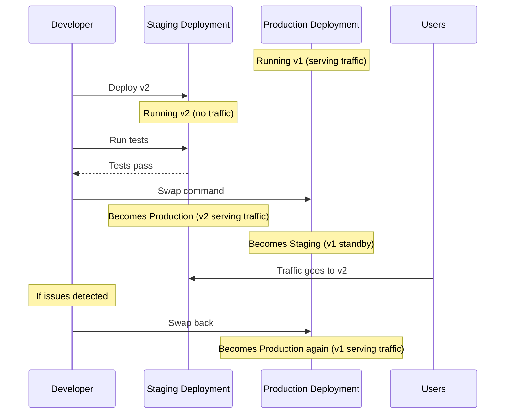

# How to Enable Blue-Green Deployment with Staging Deployments in Azure Spring Apps

Author: [nawazdhandala](https://www.github.com/nawazdhandala)

Tags: Azure, Spring Apps, Blue-Green Deployment, Staging, Zero Downtime, DevOps, CI/CD

Description: Learn how to implement blue-green deployments in Azure Spring Apps using staging deployments for zero-downtime releases and instant rollbacks.

---

Deploying directly to production is risky. If something goes wrong, your users see errors while you scramble to fix or roll back. Blue-green deployment eliminates this risk by maintaining two identical environments - one serving production traffic (blue) and one ready for the next release (green). You deploy to green, test it, and then swap traffic. If the new version has issues, you swap back instantly. Azure Spring Apps supports this pattern natively through staging deployments.

## How Blue-Green Works in Azure Spring Apps

In Azure Spring Apps, each application can have two deployments:

- **Production deployment:** Receives all incoming traffic
- **Staging deployment:** A separate instance that is not exposed to production traffic

You deploy your new version to the staging deployment, run tests against it, and then swap the staging and production deployments. The swap is atomic and takes only a few seconds.

## Step 1: Create an Application with a Default Deployment

When you create an application in Azure Spring Apps, it automatically gets a default deployment called "default" which serves as the production deployment.

```bash
# Create the application with its initial deployment
az spring app create \
  --name order-service \
  --service my-spring-service \
  --resource-group spring-rg \
  --runtime-version Java_17 \
  --assign-endpoint true

# Deploy the current version (v1) to production
az spring app deploy \
  --name order-service \
  --service my-spring-service \
  --resource-group spring-rg \
  --artifact-path target/order-service-1.0.0.jar \
  --deployment default
```

At this point, the production deployment is running v1 and serving traffic.

## Step 2: Create a Staging Deployment

Create a second deployment called "staging" for the next version.

```bash
# Create a staging deployment with the new version
az spring app deployment create \
  --name staging \
  --app order-service \
  --service my-spring-service \
  --resource-group spring-rg \
  --artifact-path target/order-service-2.0.0.jar \
  --runtime-version Java_17 \
  --memory 2Gi \
  --cpu 1 \
  --instance-count 2 \
  --env "SPRING_PROFILES_ACTIVE=production"
```

The staging deployment runs alongside the production deployment but does not receive any production traffic.

## Step 3: Test the Staging Deployment

Azure Spring Apps provides a test endpoint for the staging deployment. Use it to verify the new version before swapping.

```bash
# Get the staging deployment's test URL
az spring app deployment show \
  --name staging \
  --app order-service \
  --service my-spring-service \
  --resource-group spring-rg \
  --query "properties.instances"
```

You can access the staging deployment directly through the test endpoint URL.

```bash
# Get the test endpoint for the spring apps instance
az spring test-endpoint list \
  --service my-spring-service \
  --resource-group spring-rg

# Test the staging deployment
curl https://primary:<test-key>@my-spring-service.test.azuremicroservices.io/order-service/staging/actuator/health
```

Run your integration tests and smoke tests against the staging endpoint.

```bash
# Run integration tests against staging
./mvnw test -Dtest.base-url="https://primary:<test-key>@my-spring-service.test.azuremicroservices.io/order-service/staging"
```

## Step 4: Swap Staging and Production

Once you are satisfied that the staging deployment is working correctly, swap it to production.

```bash
# Swap staging to production - this is the blue-green swap
az spring app set-deployment \
  --name order-service \
  --service my-spring-service \
  --resource-group spring-rg \
  --deployment staging
```

This command does two things:
1. The staging deployment becomes the production deployment (receives all traffic)
2. The old production deployment becomes the staging deployment (no traffic)

The swap happens in seconds. There is no downtime because both deployments are already running and ready to serve requests.

## Step 5: Verify the Swap

Confirm that the production deployment is now running the new version.

```bash
# Check which deployment is serving production traffic
az spring app show \
  --name order-service \
  --service my-spring-service \
  --resource-group spring-rg \
  --query "properties.activeDeployment.name"

# Check the production endpoint
curl https://order-service-my-spring-service.azuremicroservices.io/actuator/info
```

## Step 6: Roll Back if Needed

If the new version has issues, swap back immediately. The old version is still running on what is now the staging deployment.

```bash
# Instant rollback - swap back to the previous version
az spring app set-deployment \
  --name order-service \
  --service my-spring-service \
  --resource-group spring-rg \
  --deployment default
```

This takes the same few seconds as the original swap. Your users see the old, working version almost immediately.

## Blue-Green Deployment Flow



## Step 7: Automate with GitHub Actions

Integrate blue-green deployments into your CI/CD pipeline.

```yaml
# .github/workflows/blue-green-deploy.yml
name: Blue-Green Deploy
on:
  push:
    branches: [main]

jobs:
  deploy:
    runs-on: ubuntu-latest
    steps:
      - uses: actions/checkout@v4

      - name: Set up JDK 17
        uses: actions/setup-java@v3
        with:
          java-version: '17'
          distribution: 'temurin'

      - name: Build with Maven
        run: ./mvnw clean package -DskipTests

      - name: Login to Azure
        uses: azure/login@v1
        with:
          creds: ${{ secrets.AZURE_CREDENTIALS }}

      - name: Deploy to staging
        run: |
          az spring app deployment create \
            --name staging \
            --app order-service \
            --service my-spring-service \
            --resource-group spring-rg \
            --artifact-path target/order-service-*.jar \
            --runtime-version Java_17

      - name: Wait for staging to be ready
        run: |
          for i in $(seq 1 30); do
            STATUS=$(az spring app deployment show \
              --name staging \
              --app order-service \
              --service my-spring-service \
              --resource-group spring-rg \
              --query "properties.provisioningState" -o tsv)
            if [ "$STATUS" = "Succeeded" ]; then
              echo "Staging is ready"
              break
            fi
            echo "Waiting for staging... ($i/30)"
            sleep 10
          done

      - name: Run smoke tests against staging
        run: |
          # Add your smoke test commands here
          echo "Running smoke tests..."

      - name: Swap staging to production
        run: |
          az spring app set-deployment \
            --name order-service \
            --service my-spring-service \
            --resource-group spring-rg \
            --deployment staging
```

## Database Migration Considerations

Blue-green deployments require extra care with database schema changes:

1. **Make migrations backward-compatible.** During the swap, both versions briefly handle traffic. The old version must work with the new schema, and the new version must work with the old schema.

2. **Use expand-contract pattern.** First, expand the schema (add new columns/tables). Deploy the new version. Then contract (remove old columns/tables in a later release).

3. **Avoid renaming columns.** Instead, add a new column, migrate data, deploy the new version that uses the new column, then remove the old column later.

```sql
-- Step 1: Expand (add new column)
ALTER TABLE orders ADD COLUMN customer_email VARCHAR(255);

-- Step 2: Migrate data
UPDATE orders SET customer_email = (SELECT email FROM customers WHERE customers.id = orders.customer_id);

-- Step 3: Deploy new version that uses customer_email
-- Step 4: Contract (remove old reference) in a future release
```

## Cost Implications

Running two deployments means double the compute cost during the staging period. To minimize this:

- Keep the staging deployment small (fewer instances) during testing
- Scale it up to match production just before the swap
- Delete the old staging deployment after confirming the production deployment is stable

```bash
# Delete the old staging deployment after verification
az spring app deployment delete \
  --name default \
  --app order-service \
  --service my-spring-service \
  --resource-group spring-rg
```

## Troubleshooting

**Swap fails with an error:** Both deployments must be in a "Succeeded" state before swapping. Check that the staging deployment has started successfully.

**Different behavior between staging and production:** Ensure both deployments have the same environment variables, secrets, and configuration. A common mistake is forgetting to set environment variables on the staging deployment.

**Slow swap:** The swap itself is fast, but DNS caching might mean some users still hit the old deployment for a short time. This is typically less than a minute.

## Summary

Blue-green deployment in Azure Spring Apps is a built-in feature that gives you zero-downtime releases and instant rollbacks. Deploy to a staging slot, test thoroughly, and swap to production with confidence. The swap takes seconds and can be reversed just as quickly. For production use, automate the process in your CI/CD pipeline and pay attention to database migration compatibility. This approach dramatically reduces the risk of deploying new versions to your users.
