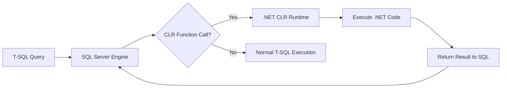

# How to Enable CLR Integration in Azure SQL Managed Instance

Author: [nawazdhandala](https://www.github.com/nawazdhandala)

Tags: Azure SQL, Managed Instance, CLR, .NET, SQL Server, Azure, Database

Description: Learn how to enable and use CLR integration in Azure SQL Managed Instance to run .NET code directly inside the database engine for advanced functionality.

---

Common Language Runtime (CLR) integration allows you to run .NET code inside the SQL Server engine. This is a feature that many on-premises SQL Server installations use for tasks that are difficult or impossible with plain T-SQL - complex string manipulation, regular expressions, custom aggregation functions, file system access, and integration with external APIs. Azure SQL Managed Instance supports CLR integration, making it one of the key reasons teams choose Managed Instance over Azure SQL Database when migrating.

In this post, I will show you how to enable CLR, create and deploy CLR assemblies, and use CLR functions and stored procedures in your Managed Instance.

## What Is CLR Integration?

CLR integration embeds the .NET Common Language Runtime directly into the SQL Server database engine. This lets you:

- Write stored procedures, functions, triggers, user-defined types, and user-defined aggregates in C# or VB.NET
- Access the full .NET Framework class library (with some restrictions)
- Perform operations that T-SQL handles poorly, like complex string parsing or mathematical computations
- Call external web services or APIs from within the database (with EXTERNAL_ACCESS or UNSAFE permissions)

The CLR assembly (a compiled .NET DLL) is stored inside the database and executed within the SQL Server process.



## Permission Levels

CLR assemblies have three permission levels:

**SAFE**: The most restrictive. The code can only access data within the database using the SQL Server managed provider. No file system access, no network access, no registry access. This is the default and recommended level.

**EXTERNAL_ACCESS**: Allows the code to access external resources like file systems, network endpoints, and environment variables. Requires the database to be trustworthy or the assembly to be signed with a certificate.

**UNSAFE**: Full, unrestricted access, including calling unmanaged code. This is a significant security risk and should be avoided unless absolutely necessary.

## Enabling CLR Integration

In Azure SQL Managed Instance, CLR integration is enabled by default at the instance level. You can verify this:

```sql
-- Check if CLR is enabled on the instance
-- A value of 1 means CLR integration is enabled
SELECT name, value_in_use
FROM sys.configurations
WHERE name = 'clr enabled';
```

If it shows 0, enable it:

```sql
-- Enable CLR integration on the Managed Instance
EXEC sp_configure 'clr enabled', 1;
RECONFIGURE;
```

Additionally, for assemblies with EXTERNAL_ACCESS or UNSAFE permission, you need to configure the database:

```sql
-- Allow EXTERNAL_ACCESS and UNSAFE assemblies
-- Method 1: Set the database as trustworthy (simpler but less secure)
ALTER DATABASE [MyDatabase] SET TRUSTWORTHY ON;
```

A more secure approach uses certificate-based signing, which I will cover later.

## Creating a CLR Assembly

Let me walk through a practical example: creating a CLR function that validates email addresses using .NET regular expressions. T-SQL does not natively support regex, making this a common use case for CLR.

### Step 1: Write the .NET Code

Create a C# class library project targeting .NET Framework 4.x:

```csharp
using System;
using System.Data.SqlTypes;
using System.Text.RegularExpressions;
using Microsoft.SqlServer.Server;

// A CLR function class for Azure SQL Managed Instance
// Contains utility functions that are difficult to implement in pure T-SQL
public class StringUtilities
{
    // Validates whether a string matches a standard email format
    // Returns 1 for valid emails, 0 for invalid
    [SqlFunction(IsDeterministic = true, IsPrecise = true)]
    public static SqlBoolean IsValidEmail(SqlString email)
    {
        if (email.IsNull)
            return SqlBoolean.False;

        string pattern = @"^[a-zA-Z0-9._%+-]+@[a-zA-Z0-9.-]+\.[a-zA-Z]{2,}$";
        bool isValid = Regex.IsMatch(email.Value, pattern);
        return new SqlBoolean(isValid);
    }

    // Performs regex pattern matching on a string
    // Returns 1 if the pattern matches, 0 otherwise
    [SqlFunction(IsDeterministic = true, IsPrecise = true)]
    public static SqlBoolean RegexMatch(SqlString input, SqlString pattern)
    {
        if (input.IsNull || pattern.IsNull)
            return SqlBoolean.False;

        bool matches = Regex.IsMatch(input.Value, pattern.Value);
        return new SqlBoolean(matches);
    }

    // Extracts the first match of a regex pattern from the input string
    // Returns NULL if no match is found
    [SqlFunction(IsDeterministic = true, IsPrecise = true)]
    public static SqlString RegexExtract(SqlString input, SqlString pattern)
    {
        if (input.IsNull || pattern.IsNull)
            return SqlString.Null;

        Match match = Regex.Match(input.Value, pattern.Value);
        if (match.Success)
            return new SqlString(match.Value);
        return SqlString.Null;
    }

    // Replaces all matches of a pattern with a replacement string
    [SqlFunction(IsDeterministic = true, IsPrecise = true)]
    public static SqlString RegexReplace(SqlString input, SqlString pattern, SqlString replacement)
    {
        if (input.IsNull || pattern.IsNull || replacement.IsNull)
            return SqlString.Null;

        string result = Regex.Replace(input.Value, pattern.Value, replacement.Value);
        return new SqlString(result);
    }
}
```

### Step 2: Compile the Assembly

Compile the project to produce a DLL file. For deployment to Managed Instance, you need the DLL as a hex string or as a file accessible from the instance.

### Step 3: Deploy the Assembly to Managed Instance

Since you cannot directly access the file system of a Managed Instance, deploy the assembly using the binary content:

```sql
-- Create the assembly from binary content
-- The hex string is the compiled DLL converted to hexadecimal
CREATE ASSEMBLY [StringUtilities]
FROM 0x4D5A90000300000004000000FFFF0000...  -- (actual binary content of the DLL)
WITH PERMISSION_SET = SAFE;
```

Alternatively, you can deploy from Azure Blob Storage:

```sql
-- Create a credential to access Azure Blob Storage
CREATE CREDENTIAL [https://mystorageaccount.blob.core.windows.net/assemblies]
WITH IDENTITY = 'SHARED ACCESS SIGNATURE',
SECRET = 'your-sas-token';

-- Deploy the assembly from Blob Storage
CREATE ASSEMBLY [StringUtilities]
FROM 'https://mystorageaccount.blob.core.windows.net/assemblies/StringUtilities.dll'
WITH PERMISSION_SET = SAFE;
```

### Step 4: Create SQL Functions That Map to CLR Methods

```sql
-- Create a scalar function that maps to the CLR IsValidEmail method
CREATE FUNCTION dbo.IsValidEmail(@email NVARCHAR(256))
RETURNS BIT
AS EXTERNAL NAME [StringUtilities].[StringUtilities].[IsValidEmail];
GO

-- Create a function for regex matching
CREATE FUNCTION dbo.RegexMatch(@input NVARCHAR(MAX), @pattern NVARCHAR(MAX))
RETURNS BIT
AS EXTERNAL NAME [StringUtilities].[StringUtilities].[RegexMatch];
GO

-- Create a function for regex extraction
CREATE FUNCTION dbo.RegexExtract(@input NVARCHAR(MAX), @pattern NVARCHAR(MAX))
RETURNS NVARCHAR(MAX)
AS EXTERNAL NAME [StringUtilities].[StringUtilities].[RegexExtract];
GO

-- Create a function for regex replacement
CREATE FUNCTION dbo.RegexReplace(
    @input NVARCHAR(MAX),
    @pattern NVARCHAR(MAX),
    @replacement NVARCHAR(MAX)
)
RETURNS NVARCHAR(MAX)
AS EXTERNAL NAME [StringUtilities].[StringUtilities].[RegexReplace];
GO
```

### Step 5: Use the Functions

Now you can use these functions in regular T-SQL queries:

```sql
-- Validate email addresses in a table
SELECT
    CustomerID,
    Email,
    dbo.IsValidEmail(Email) AS IsValid
FROM Customers;

-- Find rows where a phone number matches a specific pattern
SELECT *
FROM Contacts
WHERE dbo.RegexMatch(Phone, '^\+1-\d{3}-\d{3}-\d{4}$') = 1;

-- Extract domain names from email addresses
SELECT
    Email,
    dbo.RegexExtract(Email, '@(.+)$') AS Domain
FROM Customers;

-- Clean up formatting in a column
UPDATE Products
SET SKU = dbo.RegexReplace(SKU, '[^A-Za-z0-9]', '');
```

## CLR Stored Procedures

You can also create CLR stored procedures for more complex operations:

```csharp
// A CLR stored procedure that performs batch validation
[SqlProcedure]
public static void ValidateEmails()
{
    using (SqlConnection conn = new SqlConnection("context connection=true"))
    {
        conn.Open();

        // Read emails that need validation
        SqlCommand selectCmd = new SqlCommand(
            "SELECT CustomerID, Email FROM Customers WHERE IsValidated = 0",
            conn);

        // Update validation results
        using (SqlDataReader reader = selectCmd.ExecuteReader())
        {
            // Process each row
            while (reader.Read())
            {
                int customerId = reader.GetInt32(0);
                string email = reader.GetString(1);
                bool isValid = Regex.IsMatch(email,
                    @"^[a-zA-Z0-9._%+-]+@[a-zA-Z0-9.-]+\.[a-zA-Z]{2,}$");

                // Send results back to the caller
                SqlContext.Pipe.Send(
                    $"Customer {customerId}: {email} is {(isValid ? "valid" : "invalid")}");
            }
        }
    }
}
```

Map it to a T-SQL procedure:

```sql
-- Create a stored procedure that maps to the CLR method
CREATE PROCEDURE dbo.ValidateEmails
AS EXTERNAL NAME [StringUtilities].[StringUtilities].[ValidateEmails];
GO

-- Execute the CLR stored procedure
EXEC dbo.ValidateEmails;
```

## Managing CLR Assemblies

### Viewing Deployed Assemblies

```sql
-- List all CLR assemblies in the current database
SELECT
    name,
    permission_set_desc,
    create_date,
    modify_date
FROM sys.assemblies
WHERE is_user_defined = 1;
```

### Updating an Assembly

```sql
-- Update an existing assembly with a new version
ALTER ASSEMBLY [StringUtilities]
FROM 0x4D5A90000300000004000000FFFF0000...  -- new binary
WITH PERMISSION_SET = SAFE;
```

### Dropping an Assembly

```sql
-- First drop all dependent objects
DROP FUNCTION dbo.IsValidEmail;
DROP FUNCTION dbo.RegexMatch;

-- Then drop the assembly
DROP ASSEMBLY [StringUtilities];
```

## Security Best Practices

**Use SAFE permission level whenever possible.** Most CLR use cases (regex, string manipulation, custom math) work fine with SAFE. Only elevate to EXTERNAL_ACCESS or UNSAFE when absolutely necessary.

**Sign assemblies with certificates.** Instead of setting TRUSTWORTHY ON, sign your assembly with a certificate and create a corresponding login with the appropriate permissions. This is more secure.

**Audit CLR usage.** Monitor which assemblies are deployed and who deployed them. CLR code runs inside the database engine process, so malicious or buggy code can impact the entire instance.

**Test thoroughly.** CLR code that crashes can take down the SQL Server process. Test all edge cases, handle exceptions gracefully, and never let unhandled exceptions escape from CLR methods.

**Keep assemblies simple.** Use CLR for specific tasks that T-SQL cannot handle well. Do not build entire application layers inside CLR assemblies.

## Performance Considerations

CLR functions are faster than T-SQL for certain operations (regex, complex math, string parsing) but slower for simple set-based operations. The overhead of crossing between T-SQL and CLR execution contexts is small but measurable.

For best performance:
- Mark functions as IsDeterministic = true when applicable (enables caching)
- Avoid row-by-row processing in CLR when set-based T-SQL would work
- Keep CLR functions focused and lightweight
- Precompile regex patterns if used repeatedly

## Summary

CLR integration in Azure SQL Managed Instance lets you run .NET code directly in the database engine, extending T-SQL capabilities with the full power of the .NET Framework. It is particularly useful for regex operations, complex string manipulation, custom aggregations, and integration scenarios. Enable CLR at the instance level, deploy assemblies with the lowest required permission set, and map .NET methods to SQL functions or procedures. Follow security best practices by using SAFE permission level, signing assemblies with certificates, and testing thoroughly before deploying to production.
