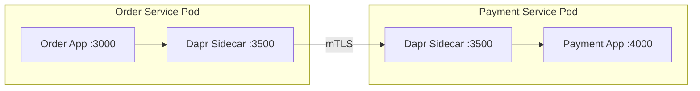

# How to Enable Dapr Service-to-Service Invocation in Azure Container Apps

Author: [nawazdhandala](https://www.github.com/nawazdhandala)

Tags: Azure, Container Apps, Dapr, Microservices, Service Invocation, Cloud Native, Distributed Systems

Description: Step-by-step guide to enabling Dapr sidecar and configuring service-to-service invocation between microservices on Azure Container Apps.

---

When you have multiple microservices running in Azure Container Apps, they need to talk to each other. You could hardcode URLs and manage service discovery yourself, but Dapr (Distributed Application Runtime) provides a much cleaner approach. Dapr runs as a sidecar alongside your container and handles service-to-service calls, retries, mTLS encryption, and observability out of the box. Azure Container Apps has first-class Dapr integration, so enabling it is a matter of configuration rather than installing anything.

## What Is Dapr Service Invocation?

Dapr service invocation lets one microservice call another using a simple HTTP or gRPC call to the local Dapr sidecar. Instead of calling `http://order-service:3000/api/orders`, your app calls `http://localhost:3500/v1.0/invoke/order-service/method/api/orders`. Dapr handles the service discovery, load balancing, mTLS, and retries.

The benefits are significant:

- Your code does not need to know the actual network address of other services
- All inter-service traffic is automatically encrypted with mTLS
- Built-in retries with configurable policies
- Distributed tracing is automatically instrumented
- Access control policies can restrict which services can call which

## Step 1: Enable Dapr on Your Container Apps

Each container app that participates in Dapr service invocation needs the Dapr sidecar enabled. You do this by specifying a Dapr app ID and the port your app listens on.

Here is how to create two services - an order service and a payment service - with Dapr enabled.

```bash
# Create the order service with Dapr enabled
az containerapp create \
  --name order-service \
  --resource-group my-rg \
  --environment my-env \
  --image myregistry.azurecr.io/order-service:v1 \
  --target-port 3000 \
  --ingress internal \
  --enable-dapr true \
  --dapr-app-id order-service \
  --dapr-app-port 3000 \
  --dapr-app-protocol http
```

```bash
# Create the payment service with Dapr enabled
az containerapp create \
  --name payment-service \
  --resource-group my-rg \
  --environment my-env \
  --image myregistry.azurecr.io/payment-service:v1 \
  --target-port 4000 \
  --ingress internal \
  --enable-dapr true \
  --dapr-app-id payment-service \
  --dapr-app-port 4000 \
  --dapr-app-protocol http
```

The key parameters are:

- `--enable-dapr true` starts the Dapr sidecar alongside your container
- `--dapr-app-id` is the unique identifier other services use to call this one
- `--dapr-app-port` is the port your app listens on so Dapr can forward requests to it
- `--dapr-app-protocol` can be `http` or `grpc`

## Step 2: Call Another Service Using Dapr

From within the order service, you can now call the payment service through the Dapr sidecar. Your application makes an HTTP call to localhost on port 3500 (the default Dapr HTTP port).

Here is an example in Node.js.

```javascript
// Call the payment service through the Dapr sidecar
// Dapr handles service discovery, mTLS, and retries
const axios = require('axios');

async function processPayment(orderId, amount) {
  const daprPort = process.env.DAPR_HTTP_PORT || 3500;

  // The URL format is: http://localhost:{daprPort}/v1.0/invoke/{app-id}/method/{route}
  const url = `http://localhost:${daprPort}/v1.0/invoke/payment-service/method/api/payments`;

  const response = await axios.post(url, {
    orderId: orderId,
    amount: amount,
    currency: 'USD'
  });

  return response.data;
}
```

And here is the same thing in Python.

```python
import os
import requests

def process_payment(order_id, amount):
    # Get the Dapr sidecar port from environment variable
    dapr_port = os.getenv("DAPR_HTTP_PORT", "3500")

    # Invoke the payment service through Dapr
    url = f"http://localhost:{dapr_port}/v1.0/invoke/payment-service/method/api/payments"

    response = requests.post(url, json={
        "orderId": order_id,
        "amount": amount,
        "currency": "USD"
    })

    return response.json()
```

Notice that the code only references `localhost`. Your application never needs to know where the payment service is actually running. Dapr figures that out.

## Step 3: Use Dapr SDK for Cleaner Code

The raw HTTP approach works, but the Dapr SDKs provide a cleaner abstraction. Here is the same call using the Dapr SDK for Node.js.

```javascript
// Using the Dapr SDK for cleaner service invocation
const { DaprClient, HttpMethod } = require('@dapr/dapr');

const client = new DaprClient();

async function processPayment(orderId, amount) {
  // The SDK handles URL construction and sidecar communication
  const result = await client.invoker.invoke(
    'payment-service',          // Target app ID
    'api/payments',             // Method/route
    HttpMethod.POST,            // HTTP method
    {
      orderId: orderId,
      amount: amount,
      currency: 'USD'
    }
  );

  return result;
}
```

## Step 4: Configure Access Control Policies

By default, any Dapr-enabled app can invoke any other Dapr-enabled app. In production, you should restrict this with access control policies.

Create a Dapr configuration component that specifies which apps can call which.

```yaml
# dapr-config.yaml - Access control policy
apiVersion: dapr.io/v1alpha1
kind: Configuration
metadata:
  name: payment-service-config
spec:
  accessControl:
    defaultAction: deny
    policies:
      - appId: order-service
        defaultAction: allow
        operations:
          - name: /api/payments
            httpVerb: ["POST"]
            action: allow
      - appId: refund-service
        defaultAction: allow
        operations:
          - name: /api/refunds
            httpVerb: ["POST"]
            action: allow
```

This configuration ensures that only the order service and refund service can call the payment service, and only on specific endpoints.

## Architecture Overview

Here is how the Dapr sidecar architecture works in Azure Container Apps.



Each app talks to its local Dapr sidecar over localhost. The sidecars communicate with each other over mTLS, handling service discovery through the Azure Container Apps environment.

## Step 5: Handle Errors and Retries

Dapr provides built-in retry policies for service invocation. You can configure them through a resiliency spec.

```yaml
# resiliency.yaml - Configure retry policies
apiVersion: dapr.io/v1alpha1
kind: Resiliency
metadata:
  name: my-resiliency
spec:
  policies:
    retries:
      retryForever:
        policy: constant
        maxRetries: -1
        duration: 5s
      retry3Times:
        policy: exponential
        maxRetries: 3
        maxInterval: 15s
    circuitBreakers:
      paymentCB:
        maxRequests: 1
        interval: 60s
        timeout: 30s
        trip: consecutiveFailures > 5
  targets:
    apps:
      payment-service:
        retry: retry3Times
        circuitBreaker: paymentCB
```

This configuration retries failed calls to the payment service up to 3 times with exponential backoff. If 5 consecutive failures occur, the circuit breaker opens and stops sending requests for 30 seconds.

## Step 6: Monitor Service Invocations

Dapr automatically generates distributed traces for all service invocations. In Azure Container Apps, these traces are sent to Azure Monitor.

You can query them in Log Analytics.

```kusto
// View all Dapr service invocation calls
ContainerAppConsoleLogs_CL
| where Log_s contains "dapr"
| where Log_s contains "invoke"
| project TimeGenerated, ContainerAppName_s, Log_s
| order by TimeGenerated desc
| take 50
```

## Troubleshooting

**Service invocation returns 500 errors:** Check that the target app's Dapr app ID matches what you are using in the invoke call. Also verify that the target port is correct.

**Sidecar not starting:** Make sure `--enable-dapr true` is set. Check the container app logs for Dapr sidecar startup errors.

**Calls timing out:** The default timeout for Dapr service invocation is 60 seconds. If your service takes longer, you may need to adjust the timeout in your resiliency configuration.

**mTLS certificate errors in logs:** This usually resolves itself. Dapr rotates certificates automatically, and temporary errors during rotation are normal.

## Summary

Dapr service invocation on Azure Container Apps gives you a clean, infrastructure-aware way to handle inter-service communication. You get mTLS, service discovery, retries, and observability without changing your application architecture. The setup is minimal - enable the Dapr sidecar, assign an app ID, and start making calls to localhost. For production workloads, add access control policies and resiliency configurations to make your system robust.
