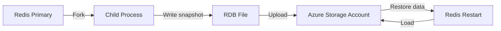

# How to Enable Data Persistence with RDB Snapshots in Azure Cache for Redis

Author: [nawazdhandala](https://www.github.com/nawazdhandala)

Tags: Azure, Redis, RDB Persistence, Data Persistence, Azure Cache for Redis, Premium Tier, Snapshots

Description: Learn how to enable and configure RDB snapshot persistence in Azure Cache for Redis Premium Tier to protect cached data from loss during restarts and failures.

---

Redis is an in-memory data store, which means everything lives in RAM. Fast? Absolutely. But what happens when the server restarts, crashes, or Azure needs to patch the underlying VM? Without persistence, all your cached data vanishes and your application has to rebuild the cache from scratch - a process called a "cold start" that can hammer your backend database and degrade user experience.

Azure Cache for Redis Premium Tier supports RDB (Redis Database) snapshot persistence, which periodically saves your Redis data to durable Azure Storage. When the cache restarts, it reloads the snapshot and your data is back. In this post, I will walk through how RDB persistence works, how to configure it, and when it makes sense for your workload.

## How RDB Persistence Works

RDB persistence creates point-in-time snapshots of your Redis data at configurable intervals. Here is the process:

1. Redis forks a child process.
2. The child process writes all data to a temporary RDB file.
3. Once the write completes, the RDB file replaces the previous snapshot.
4. The RDB file is stored in an Azure Storage account that you control.



When the cache starts (or restarts), Redis loads the most recent RDB file from storage and repopulates the in-memory dataset.

### RDB vs. AOF Persistence

Azure Cache for Redis supports two persistence options:

| Feature | RDB Snapshots | AOF (Append-Only File) |
|---------|--------------|----------------------|
| How it works | Periodic full snapshots | Logs every write operation |
| Data loss risk | Up to one snapshot interval | Up to one second |
| Performance impact | Brief CPU spike during snapshot | Constant, small overhead |
| Recovery speed | Fast (load one file) | Slower (replay log) |
| Storage usage | Compact | Grows continuously |

RDB is the more common choice because it is simpler, has less performance impact during normal operations, and recovers faster. AOF provides better durability (less potential data loss) but at the cost of higher I/O overhead.

## When to Use RDB Persistence

RDB persistence is valuable when:

- Your cache holds data that is expensive to regenerate (complex queries, API aggregations, ML model results).
- A cold start would overwhelm your backend databases.
- Your cache serves as a session store and losing sessions would force all users to re-authenticate.
- You use Redis as a secondary data store (not just a cache), and the data would take significant time to rebuild.

If your cache is a pure pass-through cache where data can be quickly regenerated from the source, persistence might not be necessary. The cost and complexity may not justify the benefit.

## Prerequisites

- Azure Cache for Redis on the **Premium tier** (Standard and Basic tiers do not support persistence).
- An Azure Storage account in the same region as the cache (Azure creates and manages this automatically, but you can use your own).

## Enabling RDB Persistence

### During Cache Creation

```bash
# Create a Premium Redis cache with RDB persistence enabled
az redis create \
  --resource-group myResourceGroup \
  --name my-redis-persistent \
  --location eastus \
  --sku Premium \
  --vm-size P1 \
  --enable-non-ssl-port false \
  --redis-configuration '{"rdb-backup-enabled": "true", "rdb-backup-frequency": "60", "rdb-backup-max-snapshot-count": "1"}'
```

### On an Existing Cache

```bash
# Enable RDB persistence on an existing Premium cache
az redis update \
  --resource-group myResourceGroup \
  --name my-redis-existing \
  --set "redisConfiguration.rdb-backup-enabled=true" \
  --set "redisConfiguration.rdb-backup-frequency=60" \
  --set "redisConfiguration.rdb-backup-max-snapshot-count=1"
```

### Using the Azure Portal

1. Navigate to your Azure Cache for Redis instance.
2. Click "Data persistence" in the left menu under Settings.
3. Toggle "RDB" to Enabled.
4. Select the backup frequency.
5. Choose the storage account (or let Azure manage it).
6. Click "Save."

## Configuring Backup Frequency

The backup frequency determines how often RDB snapshots are taken:

| Frequency | Data Loss Window | Performance Impact | Storage Usage |
|-----------|-----------------|-------------------|---------------|
| Every 15 minutes | Up to 15 minutes | Frequent, small spikes | Higher |
| Every 30 minutes | Up to 30 minutes | Moderate | Moderate |
| Every 60 minutes | Up to 60 minutes | Infrequent spikes | Lower |
| Every 6 hours | Up to 6 hours | Rare spikes | Lowest |
| Every 12 hours | Up to 12 hours | Very rare | Lowest |
| Every 24 hours | Up to 24 hours | Minimal | Lowest |

Choose based on your tolerance for data loss:

- **Session store**: 15-30 minutes. Losing 15 minutes of sessions is annoying but survivable.
- **Application cache**: 60 minutes. The data can be regenerated; you just want to avoid cold starts.
- **Development/staging**: 6-24 hours. Persistence is nice to have but not critical.

```bash
# Set backup frequency to every 30 minutes
az redis update \
  --resource-group myResourceGroup \
  --name my-redis-persistent \
  --set "redisConfiguration.rdb-backup-frequency=30"
```

## Storage Configuration

### Managed Storage (Default)

By default, Azure manages the storage account for your RDB snapshots. This is the simplest option - you do not need to create or manage a separate storage account.

### Custom Storage Account

If you need more control (for example, to set retention policies or access the RDB files directly):

```bash
# Create a storage account for Redis persistence
az storage account create \
  --resource-group myResourceGroup \
  --name myredisbackupstorage \
  --location eastus \
  --sku Standard_LRS \
  --kind StorageV2

# Get the storage connection string
STORAGE_CONNECTION=$(az storage account show-connection-string \
  --resource-group myResourceGroup \
  --name myredisbackupstorage \
  --query "connectionString" \
  --output tsv)

# Configure Redis to use the custom storage account
az redis update \
  --resource-group myResourceGroup \
  --name my-redis-persistent \
  --set "redisConfiguration.rdb-storage-connection-string=$STORAGE_CONNECTION"
```

Important considerations for the storage account:

- It must be in the same region as the cache.
- Use Standard performance (Premium storage is not necessary for backups).
- Do not enable storage firewall restrictions that would block Redis access.
- Do not delete the storage account while the cache is using it.

## Monitoring Persistence

### Check Persistence Status

```bash
# View the current persistence configuration
az redis show \
  --resource-group myResourceGroup \
  --name my-redis-persistent \
  --query "redisConfiguration"
```

### Monitor Backup Success

Use Azure Monitor to track persistence metrics:

```bash
# Set up an alert for persistence failures
az monitor metrics alert create \
  --name redis-persistence-alert \
  --resource-group myResourceGroup \
  --scopes "/subscriptions/{sub-id}/resourceGroups/myResourceGroup/providers/Microsoft.Cache/redis/my-redis-persistent" \
  --condition "total errors > 0" \
  --description "Redis persistence error detected" \
  --action-group myActionGroup
```

In the Azure portal, check the "Data persistence" blade for the last successful backup time and any errors.

### From Within Redis

Connect to the cache and check the last save time:

```bash
# Connect to the cache
redis-cli -h my-redis-persistent.redis.cache.windows.net \
  -p 6380 \
  -a your-access-key \
  --tls
```

```
# Check when the last RDB save completed
INFO persistence
# Look for: rdb_last_save_time, rdb_last_bgsave_status
```

## Performance Impact

RDB snapshots have a performance cost that you should understand:

### CPU Spike During Fork

When Redis creates a snapshot, it forks the main process. The fork itself is fast (milliseconds), but on large datasets, the copy-on-write mechanism can cause increased memory usage temporarily.

### Memory Overhead

During snapshot creation, Redis needs extra memory for the copy-on-write pages. As a rule of thumb, plan for up to 2x memory usage during the snapshot window if your workload has heavy writes.

```bash
# Monitor memory usage during snapshots
# Connect via redis-cli and check
INFO memory
# Look for: used_memory, used_memory_peak, mem_fragmentation_ratio
```

### Write Latency

Some write operations may experience slightly higher latency during the snapshot fork. This is usually in the single-digit millisecond range and imperceptible for most applications.

## Handling Cache Restarts

When the cache restarts with RDB persistence enabled:

1. Redis starts and checks for an RDB file in the configured storage.
2. If found, Redis loads the file into memory.
3. The cache becomes available with the data from the last snapshot.
4. Any data written after the last snapshot but before the restart is lost.

The restart process:

```
Cache Restart -> Load RDB from Storage -> Cache Available
```

The time to reload depends on the RDB file size:

| Cache Size | Approximate Reload Time |
|-----------|------------------------|
| 1 GB | 10-30 seconds |
| 6 GB | 30-90 seconds |
| 13 GB | 1-3 minutes |
| 26 GB | 2-5 minutes |
| 53 GB | 5-10 minutes |

## Persistence with Clustering

If you have a clustered cache, RDB persistence works across all shards:

- Each shard creates its own RDB snapshot independently.
- All snapshots use the same storage account.
- During restart, each shard loads its own snapshot.

```bash
# Create a clustered cache with RDB persistence
az redis create \
  --resource-group myResourceGroup \
  --name my-redis-cluster-persistent \
  --location eastus \
  --sku Premium \
  --vm-size P1 \
  --shard-count 3 \
  --enable-non-ssl-port false \
  --redis-configuration '{"rdb-backup-enabled": "true", "rdb-backup-frequency": "60"}'
```

## Disabling Persistence

If you decide persistence is not needed:

```bash
# Disable RDB persistence
az redis update \
  --resource-group myResourceGroup \
  --name my-redis-persistent \
  --set "redisConfiguration.rdb-backup-enabled=false"
```

Existing RDB files in storage are not deleted automatically. Clean them up manually if you no longer need them.

## Best Practices

1. **Set the right frequency**: Balance data loss tolerance against performance impact. 60 minutes is a good default.
2. **Monitor backup success**: A failed backup means your safety net is gone.
3. **Account for memory overhead**: During snapshots, memory usage spikes. Leave headroom in your cache size.
4. **Use managed storage unless you need custom control**: It is simpler and requires no maintenance.
5. **Test recovery**: Occasionally force a restart and verify the cache recovers with data intact.
6. **Combine with application-level cache warming**: Even with persistence, have a strategy for populating hot keys quickly after restart.

## Troubleshooting

**Backup failing silently**: Check the storage account is accessible and has not been accidentally firewalled or deleted.

**Cache restart takes too long**: Large RDB files take longer to load. Consider if all the data in the cache actually needs to be persisted, or if you can reduce the dataset.

**High memory usage during backup**: Reduce write load during backup windows, or increase the cache size to accommodate the copy-on-write overhead.

**Data missing after restart**: The data was written after the last snapshot. Reduce the backup frequency to minimize the data loss window.

## Summary

RDB persistence in Azure Cache for Redis Premium Tier protects your cached data from loss during restarts, patches, and failures. Enable it for any cache where a cold start would impact your application significantly. Choose a backup frequency that balances your tolerance for data loss against the performance overhead of snapshots, and monitor backup health to ensure your safety net is always in place. For most production caches, the small cost of persistence is well worth the reliability it provides.
