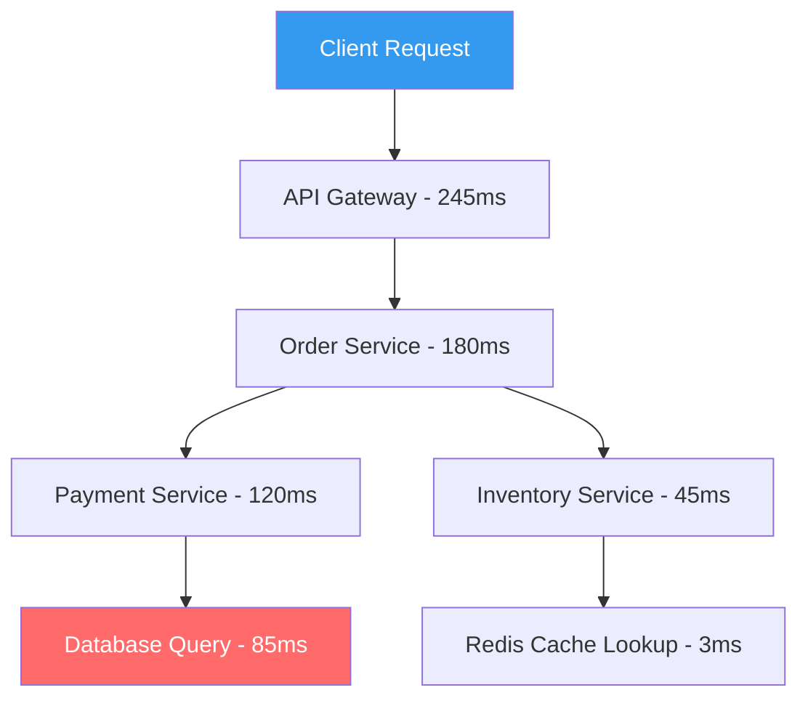

# How to Enable Distributed Tracing with Application Insights in Azure Spring Apps

Author: [nawazdhandala](https://www.github.com/nawazdhandala)

Tags: Azure Spring Apps, Application Insights, Distributed Tracing, Spring Boot, Observability, Monitoring, Java

Description: Step-by-step guide to enabling distributed tracing with Application Insights in Azure Spring Apps to trace requests across microservices and identify performance bottlenecks.

---

When your Spring Boot application grows from a single service to a set of microservices, debugging becomes significantly harder. A single user request might touch five or six services, and when something is slow, you need to figure out which service in the chain is causing the delay. Distributed tracing solves this by assigning a unique trace ID to each request and propagating it across all services. Azure Application Insights integrates with Azure Spring Apps to provide this capability out of the box. This guide shows how to set it up and use it effectively.

## How Distributed Tracing Works

Distributed tracing follows a simple concept: when a request enters your system, it gets a unique trace ID. As that request flows through different services (via HTTP calls, message queues, or database operations), each service records a "span" with timing information and attaches it to the trace ID. You can then visualize the entire request as a tree of spans, see exactly how long each service took, and identify where bottlenecks are.


```mermaid
graph TD
    A[Client Request] --> B[API Gateway - 245ms]
    B --> C[Order Service - 180ms]
    C --> D[Payment Service - 120ms]
    C --> E[Inventory Service - 45ms]
    D --> F[Database Query - 85ms]
    E --> G[Redis Cache Lookup - 3ms]

    style F fill:#ff6b6b,color:#fff
    style A fill:#339af0,color:#fff
```

In the diagram above, the database query taking 85ms out of the payment service's 120ms immediately tells you where to optimize.

## Prerequisites

- Azure Spring Apps instance (Basic/Standard or Enterprise; existing plans are in retirement but supported until March 31, 2028)
- One or more Spring Boot applications deployed
- An Azure Application Insights resource (or you can let Spring Apps create one)
- Azure CLI with the spring extension

## Step 1: Create an Application Insights Resource

If you do not already have an Application Insights resource, create one:

```bash
# Create an Application Insights resource

RESOURCE_GROUP="rg-spring-production"
APP_INSIGHTS_NAME="ai-spring-apps"

az monitor app-insights component create \
    --app $APP_INSIGHTS_NAME \
    --location eastus \
    --resource-group $RESOURCE_GROUP \
    --kind web \
    --application-type web

# Get the connection string (you will need this)
CONNECTION_STRING=$(az monitor app-insights component show \
    --app $APP_INSIGHTS_NAME \
    --resource-group $RESOURCE_GROUP \
    --query "connectionString" -o tsv)

echo "Connection String: $CONNECTION_STRING"
```

## Step 2: Enable Application Insights on Azure Spring Apps

Azure Spring Apps has built-in Application Insights integration. You can enable it at the service level, which applies to all apps:

```bash
# Enable Application Insights for the entire Spring Apps service
az spring app-insights update \
    --name myorg-spring-apps \
    --resource-group $RESOURCE_GROUP \
    --app-insights-key "$CONNECTION_STRING" \
    --sampling-rate 100
```

The sampling percentage controls how many requests are traced. In production, you probably want to set this to 10 or 25 percent to reduce costs and overhead. For initial setup and debugging, 100 percent lets you see every request.

Alternatively, if you are attaching or packaging the Application Insights Java agent yourself for a single app, set the connection string on that app:

```bash
# Set the connection string for a specific app
az spring app update \
    --name order-service \
    --service myorg-spring-apps \
    --resource-group $RESOURCE_GROUP \
    --env "APPLICATIONINSIGHTS_CONNECTION_STRING=$CONNECTION_STRING"
```

## Step 3: Configure the Spring Boot Application

Azure Spring Apps injects the Application Insights Java agent automatically when you enable it at the service level. However, for fine-grained control over what gets traced, add the OpenTelemetry API and annotations to your project:

```xml
<!-- pom.xml - Application Insights dependencies -->
<dependencies>
    <!-- OpenTelemetry annotations for custom spans -->
    <dependency>
        <groupId>io.opentelemetry.instrumentation</groupId>
        <artifactId>opentelemetry-instrumentation-annotations</artifactId>
        <version>1.32.0</version>
    </dependency>

    <!-- OpenTelemetry API for span attributes and manual spans -->
    <dependency>
        <groupId>io.opentelemetry</groupId>
        <artifactId>opentelemetry-api</artifactId>
        <version>1.0.0</version>
    </dependency>

    <!-- Micrometer integration for metrics -->
    <dependency>
        <groupId>io.micrometer</groupId>
        <artifactId>micrometer-registry-azure-monitor</artifactId>
    </dependency>
</dependencies>
```

Configure Application Insights Java agent options in applicationinsights.json:

```json
{
    "instrumentation": {
        "logging": {
            "level": "INFO"
        }
    }
}
```

Configure the Spring Boot logging pattern to include trace context:

```yaml
# Configure the logging pattern to include trace context
logging:
  pattern:
    console: "%d{yyyy-MM-dd HH:mm:ss} [%thread] [trace_id=%X{trace_id} span_id=%X{span_id}] %-5level %logger{36} - %msg%n"
```

The `%X{trace_id}` and `%X{span_id}` values in the logging pattern add the active OpenTelemetry trace and span IDs to every log line. This is incredibly useful when you are looking at logs and want to jump to the trace view.

## Step 4: Add Custom Spans for Business Operations

The automatic instrumentation captures HTTP calls, database queries, and Redis operations. For custom business logic that you want to trace, add manual spans:

```java
// OrderProcessingService.java - Custom tracing for business operations
import io.opentelemetry.api.trace.Span;
import io.opentelemetry.instrumentation.annotations.WithSpan;
import org.springframework.stereotype.Service;

@Service
public class OrderProcessingService {

    private final PaymentClient paymentClient;
    private final InventoryClient inventoryClient;

    public OrderProcessingService(PaymentClient paymentClient,
                                   InventoryClient inventoryClient) {
        this.paymentClient = paymentClient;
        this.inventoryClient = inventoryClient;
    }

    @WithSpan("OrderProcessing")
    public OrderResult processOrder(OrderRequest request) {
        try {
            // Validate the order
            validateOrder(request);

            Span.current().setAttribute("order.value", request.getTotalAmount().doubleValue());
            Span.current().setAttribute("order.item_count", request.getItems().size());

            // Process payment (HTTP call - automatically traced)
            PaymentResult payment = paymentClient.processPayment(request.getPaymentDetails());

            // Update inventory (HTTP call - automatically traced)
            inventoryClient.reserveItems(request.getItems());

            return new OrderResult(true, payment.getTransactionId());

        } catch (Exception e) {
            Span.current().recordException(e);
            throw e;
        }
    }

    @WithSpan("OrderValidation")
    private void validateOrder(OrderRequest request) {
        // Validation logic here
    }
}
```

## Step 5: Query Traces in Application Insights

Once data is flowing (give it 2 to 5 minutes), you can query traces in the Azure portal or use Kusto queries.

In the Azure portal:
1. Open your Application Insights resource
2. Go to **Transaction Search** to find specific requests
3. Use **Application Map** to see a visual overview of service dependencies
4. Use **Performance** to identify slow operations

For programmatic queries, use the Log Analytics integration:

```kusto
// Find the slowest requests in the last hour
requests
| where timestamp > ago(1h)
| where success == true
| summarize
    AvgDuration = avg(duration),
    P95Duration = percentile(duration, 95),
    P99Duration = percentile(duration, 99),
    RequestCount = count()
    by name
| where RequestCount > 10
| order by P95Duration desc

// Trace a specific request through all services
// Replace the operation_id with an actual trace ID from your logs
let traceId = "abc123def456";
union requests, dependencies, exceptions
| where operation_Id == traceId
| project timestamp, itemType, name, duration, success,
    target, resultCode
| order by timestamp asc
```

## Step 6: Set Up Alerts on Trace Data

Create alerts for abnormal latency or failure rates:

```bash
# Create an alert for high latency on the order service endpoint
az monitor metrics alert create \
    --name "OrderService-HighLatency" \
    --resource-group $RESOURCE_GROUP \
    --scopes "/subscriptions/<sub-id>/resourceGroups/$RESOURCE_GROUP/providers/microsoft.insights/components/$APP_INSIGHTS_NAME" \
    --condition "avg requests/duration > 2000" \
    --window-size 5m \
    --evaluation-frequency 1m \
    --action "/subscriptions/<sub-id>/resourceGroups/$RESOURCE_GROUP/providers/Microsoft.Insights/actionGroups/ops-team"
```

## Correlation Across Services

The real power of distributed tracing shows when you have multiple Spring Boot services. Application Insights automatically propagates the trace context through HTTP headers (using the W3C Trace Context standard). When Service A calls Service B, the trace ID carries over, and you see both services' spans in a single trace view.

For this to work seamlessly across all your Spring Apps:

1. Enable Application Insights on the Spring Apps service level (not per-app), so all apps use the same connection string
2. Use Spring's RestTemplate or WebClient for inter-service calls (both support automatic trace context propagation)
3. If you use messaging (like Azure Service Bus or Kafka), make sure the Application Insights agent version supports message correlation

```java
// WebClientConfig.java - WebClient with automatic trace propagation
import org.springframework.context.annotation.Bean;
import org.springframework.context.annotation.Configuration;
import org.springframework.http.HttpHeaders;
import org.springframework.http.MediaType;
import org.springframework.web.reactive.function.client.WebClient;

@Configuration
public class WebClientConfig {

    @Bean
    public WebClient.Builder webClientBuilder() {
        // The Application Insights agent automatically instruments WebClient
        // No additional configuration needed for trace propagation
        return WebClient.builder()
            .defaultHeader(HttpHeaders.CONTENT_TYPE, MediaType.APPLICATION_JSON_VALUE);
    }
}
```

## Sampling Strategies for Production

Tracing every request in production generates a lot of data and costs money. Here are practical sampling strategies:

- **Fixed-rate sampling**: Set `--sampling-rate` on Azure Spring Apps or `sampling.percentage` in the Java agent configuration to 10-25% for steady-state production. This gives you a representative sample without excessive cost.
- **Rate-limited sampling**: Application Insights can limit telemetry to a target number of requests per second. Enable this for bursty workloads.
- **Per-operation sampling**: Keep 100% sampling for critical operations (like payments) while sampling less for health checks and static content.

Configure rate-limited sampling and sampling overrides in applicationinsights.json:

```json
{
    "sampling": {
        "requestsPerSecond": 5,
        "overrides": [
            {
                "telemetryType": "request",
                "attributes": [
                    {
                        "key": "url.path",
                        "value": "/actuator/health",
                        "matchType": "strict"
                    }
                ],
                "percentage": 0
            }
        ]
    }
}
```

This configuration limits general request telemetry to about 5 requests per second but drops health check requests (which are noisy and uninteresting for tracing purposes).

## Summary

Distributed tracing with Application Insights in Azure Spring Apps gives you visibility into how requests flow through your microservices. The setup is minimal - enable Application Insights at the service level, add the OpenTelemetry API for custom spans, and let the automatic instrumentation handle HTTP calls and database queries. Use the Application Map for a high-level view, Transaction Search for drilling into specific traces, and Kusto queries for advanced analysis. In production, tune your sampling rate to balance visibility with cost.
