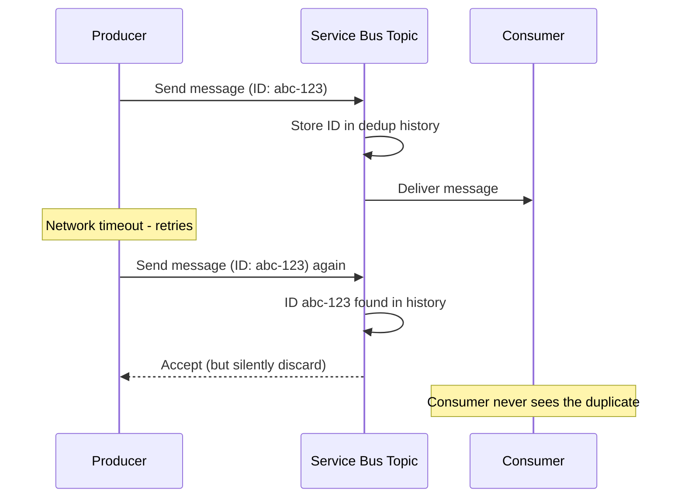

# How to Enable Duplicate Detection in Azure Service Bus Topics

Author: [nawazdhandala](https://www.github.com/nawazdhandala)

Tags: Azure Service Bus, Duplicate Detection, Idempotency, Topics, Azure, Messaging, Reliability

Description: Configure and use duplicate detection in Azure Service Bus topics to prevent processing the same message multiple times in distributed systems.

---

In distributed systems, duplicates are a fact of life. A network timeout during message sending might cause the producer to retry, sending the same message twice. A load balancer failover might replay a batch of messages. A consumer might crash after processing but before acknowledging, leading to redelivery. Azure Service Bus offers built-in duplicate detection at the broker level that catches these duplicates before they reach your consumers.

In this post, I will explain how duplicate detection works, how to configure it on topics and queues, and what its limitations are so you can use it effectively.

## How Duplicate Detection Works

When duplicate detection is enabled, Service Bus maintains a history of all message IDs received within a configurable time window. If a new message arrives with a `MessageId` that matches one already in the history, the duplicate is silently discarded. The sender receives a success response (so it does not keep retrying), but consumers never see the duplicate.



The key mechanism is the `MessageId` property. You must set it to a deterministic value that uniquely identifies the message content. If you leave it empty or use a random GUID each time, duplicate detection will not work because every send looks like a unique message.

## Enabling Duplicate Detection

Duplicate detection must be enabled when creating the topic or queue. It cannot be enabled on an existing entity.

```bash
# Create a topic with duplicate detection enabled
# The detection window is the time period during which duplicates are checked
az servicebus topic create \
  --name order-events \
  --namespace-name my-servicebus \
  --resource-group my-rg \
  --enable-duplicate-detection true \
  --duplicate-detection-history-time-window "PT10M"

# Create a queue with duplicate detection
az servicebus queue create \
  --name orders \
  --namespace-name my-servicebus \
  --resource-group my-rg \
  --enable-duplicate-detection true \
  --duplicate-detection-history-time-window "PT10M"
```

The `duplicate-detection-history-time-window` parameter specifies how long Service Bus keeps message IDs in its dedup history. The format is ISO 8601 duration. `PT10M` means 10 minutes. The maximum is 7 days, but longer windows consume more memory on the broker.

## Setting Meaningful Message IDs

The entire duplicate detection mechanism hinges on the `MessageId` being deterministic and meaningful. Here are strategies for different scenarios.

```csharp
using Azure.Messaging.ServiceBus;

public class DeterministicPublisher
{
    private readonly ServiceBusSender _sender;

    public DeterministicPublisher(ServiceBusClient client)
    {
        _sender = client.CreateSender("order-events");
    }

    // Good: Use a business key as the message ID
    // The same order event will always produce the same message ID
    public async Task PublishOrderEvent(string orderId, string eventType, int version)
    {
        var message = new ServiceBusMessage(BinaryData.FromObjectAsJson(new
        {
            OrderId = orderId,
            EventType = eventType,
            Version = version,
            Timestamp = DateTime.UtcNow
        }))
        {
            // Deterministic message ID based on business keys
            // If this exact event is sent again, the duplicate will be caught
            MessageId = $"{orderId}-{eventType}-v{version}",
            ContentType = "application/json",
            Subject = eventType
        };

        await _sender.SendMessageAsync(message);
    }

    // Good: Use a hash of the content for idempotent commands
    public async Task PublishCommand(CommandPayload command)
    {
        // Create a deterministic ID from the command content
        var contentHash = ComputeHash(command);

        var message = new ServiceBusMessage(BinaryData.FromObjectAsJson(command))
        {
            MessageId = $"cmd-{command.Type}-{contentHash}",
            ContentType = "application/json"
        };

        await _sender.SendMessageAsync(message);
    }

    // Bad: Using Guid.NewGuid() defeats duplicate detection entirely
    public async Task PublishBadExample(object payload)
    {
        var message = new ServiceBusMessage(BinaryData.FromObjectAsJson(payload))
        {
            // Every send generates a new ID - duplicates will never be detected
            MessageId = Guid.NewGuid().ToString()
        };

        await _sender.SendMessageAsync(message);
    }

    private string ComputeHash(object obj)
    {
        var json = System.Text.Json.JsonSerializer.Serialize(obj);
        var bytes = System.Security.Cryptography.SHA256.HashData(
            System.Text.Encoding.UTF8.GetBytes(json));
        return Convert.ToHexString(bytes)[..16]; // First 16 chars of SHA256
    }
}
```

## Duplicate Detection with Topics and Subscriptions

When duplicate detection is enabled on a topic, it applies to the topic level. If a duplicate message is detected, it is discarded before it reaches any subscription.

```csharp
// Publishing to a topic with duplicate detection
public class EventPublisher
{
    private readonly ServiceBusSender _topicSender;
    private readonly ILogger<EventPublisher> _logger;

    public EventPublisher(ServiceBusClient client, ILogger<EventPublisher> logger)
    {
        _topicSender = client.CreateSender("order-events");
        _logger = logger;
    }

    // Publish with retry logic - duplicate detection prevents double processing
    public async Task PublishWithRetryAsync(OrderEvent orderEvent)
    {
        // The message ID is deterministic, so retries produce the same ID
        var messageId = $"{orderEvent.OrderId}-{orderEvent.EventType}-{orderEvent.Version}";

        var message = new ServiceBusMessage(BinaryData.FromObjectAsJson(orderEvent))
        {
            MessageId = messageId,
            ContentType = "application/json",
            Subject = orderEvent.EventType
        };

        int maxRetries = 3;
        for (int attempt = 1; attempt <= maxRetries; attempt++)
        {
            try
            {
                await _topicSender.SendMessageAsync(message);
                _logger.LogInformation(
                    "Published event {Id} on attempt {Attempt}",
                    messageId, attempt);
                return;
            }
            catch (ServiceBusException ex) when (ex.IsTransient)
            {
                _logger.LogWarning(
                    "Transient error on attempt {Attempt}: {Error}",
                    attempt, ex.Message);

                if (attempt < maxRetries)
                {
                    await Task.Delay(TimeSpan.FromSeconds(Math.Pow(2, attempt)));
                }
                else
                {
                    throw;
                }
            }
        }
    }
}
```

Even if the first send actually succeeded (but the response was lost due to a network issue), the retry will be deduplicated by Service Bus. The consumer sees the message exactly once.

## Checking Duplicate Detection Configuration

You can verify the duplicate detection settings on existing entities.

```csharp
using Azure.Messaging.ServiceBus.Administration;

public async Task CheckDuplicateDetectionSettings(string entityName, bool isTopic)
{
    var adminClient = new ServiceBusAdministrationClient(
        Environment.GetEnvironmentVariable("ServiceBusConnection"));

    if (isTopic)
    {
        var topic = await adminClient.GetTopicAsync(entityName);
        Console.WriteLine($"Topic: {topic.Value.Name}");
        Console.WriteLine($"Duplicate Detection: {topic.Value.RequiresDuplicateDetection}");
        Console.WriteLine($"Detection Window: {topic.Value.DuplicateDetectionHistoryTimeWindow}");
    }
    else
    {
        var queue = await adminClient.GetQueueAsync(entityName);
        Console.WriteLine($"Queue: {queue.Value.Name}");
        Console.WriteLine($"Duplicate Detection: {queue.Value.RequiresDuplicateDetection}");
        Console.WriteLine($"Detection Window: {queue.Value.DuplicateDetectionHistoryTimeWindow}");
    }
}
```

## Adjusting the Detection Window

The detection window is a tradeoff between safety and resource usage. A longer window catches duplicates that arrive further apart in time but uses more memory.

```bash
# Update the detection window on an existing topic
# (You can change the window but cannot disable detection once enabled)
az servicebus topic update \
  --name order-events \
  --namespace-name my-servicebus \
  --resource-group my-rg \
  --duplicate-detection-history-time-window "PT30M"
```

Guidelines for choosing the window size:
- **1-5 minutes**: Suitable for catching retries from network timeouts and client failures. This is enough for most API-driven scenarios.
- **10-30 minutes**: Good for batch processing where the same batch might be replayed after a failure.
- **1-24 hours**: Needed when upstream systems might replay events from hours ago (like data pipeline replays).
- **7 days (maximum)**: Only for scenarios where very long-delayed duplicates are possible.

## Limitations of Duplicate Detection

Duplicate detection is not a silver bullet. Here are the important limitations to understand.

First, it only works within the detection window. If you send the same message ID after the window expires, it will be treated as a new message.

Second, it only checks the `MessageId` property. If you change the message body but keep the same ID, the duplicate will still be discarded. If you change the ID but keep the same body, both messages will be delivered.

Third, there is a performance cost. Duplicate detection adds latency to message sends because Service Bus must check the dedup history. For very high-throughput scenarios (millions of messages per second), this overhead can be significant.

Fourth, it does not work with batched sends in all scenarios. When sending a batch of messages, if any message in the batch is a duplicate, just that message is discarded while the rest are accepted.

## Combining with Consumer-Side Idempotency

For maximum reliability, combine broker-level duplicate detection with consumer-side idempotency checks. The broker catches most duplicates, and your consumer handles any that slip through.

```csharp
[Function("ProcessOrderEvent")]
public async Task ProcessEvent(
    [ServiceBusTrigger("order-events", "processor",
        Connection = "ServiceBusConnection")]
    ServiceBusReceivedMessage message,
    ServiceBusMessageActions messageActions)
{
    var orderEvent = message.Body.ToObjectFromJson<OrderEvent>();

    // Consumer-side idempotency check as a safety net
    // This catches duplicates that arrive outside the broker detection window
    if (await _idempotencyStore.HasBeenProcessedAsync(message.MessageId))
    {
        _logger.LogInformation(
            "Duplicate message {Id} detected at consumer, skipping",
            message.MessageId);
        await messageActions.CompleteMessageAsync(message);
        return;
    }

    // Process the event
    await ProcessOrderEvent(orderEvent);

    // Record that we processed this message
    await _idempotencyStore.MarkAsProcessedAsync(
        message.MessageId, TimeSpan.FromDays(7));

    await messageActions.CompleteMessageAsync(message);
}
```

## Summary

Duplicate detection in Azure Service Bus provides broker-level deduplication that prevents consumers from seeing the same message twice within a configurable time window. The key requirement is using deterministic, content-based message IDs - random GUIDs will not work. Enable duplicate detection when creating topics or queues, size the detection window appropriately for your retry patterns, and combine with consumer-side idempotency for defense in depth. This two-layer approach handles the vast majority of duplicate scenarios in distributed systems.
