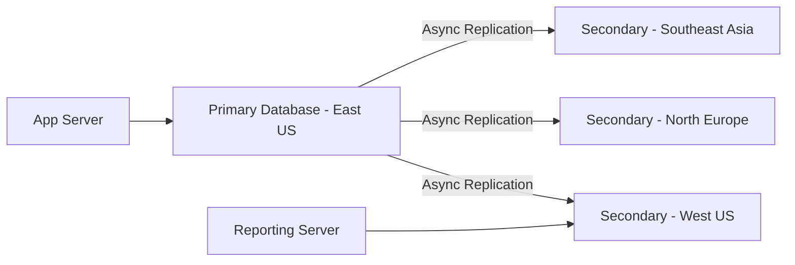

# How to Enable Geo-Replication for Azure SQL Database

Author: [nawazdhandala](https://www.github.com/nawazdhandala)

Tags: Azure SQL, Geo-Replication, Disaster Recovery, High Availability, Azure, Database, Replication

Description: A practical guide to setting up active geo-replication for Azure SQL Database to protect against regional outages and improve read performance.

---

Regional outages happen. Data centers can go offline due to natural disasters, power failures, or network issues. If your Azure SQL Database is in a single region and that region goes down, your application goes down with it. Active geo-replication solves this by maintaining readable copies of your database in different Azure regions.

In this post, I will cover how geo-replication works, how to set it up through the Azure Portal and CLI, and how to handle failover when things go wrong.

## What Is Active Geo-Replication?

Active geo-replication is a feature that lets you create up to four readable secondary databases in different Azure regions. These secondaries are continuously synchronized with the primary database using asynchronous replication. The key characteristics are:

- **Asynchronous replication**: Transactions commit on the primary without waiting for the secondary. This means there is a small replication lag, typically under 5 seconds, but the primary's performance is not affected.
- **Readable secondaries**: The secondary databases are not just standby copies. They are fully readable, so you can offload reporting queries or serve read traffic from a closer region.
- **Manual failover**: You decide when to fail over. This gives you control but requires your application or operations team to initiate the switch.
- **Independent pricing**: Each secondary is a separate database with its own pricing tier. The secondary does not have to match the primary's tier, though it is recommended to use the same or higher tier.

## Geo-Replication vs. Failover Groups

Before we set things up, let me clarify the difference between geo-replication and failover groups, since they are related but distinct features.

**Active geo-replication** gives you fine-grained control over individual database replicas. You manage each secondary separately and handle failover manually.

**Failover groups** build on top of geo-replication and add automatic failover, a listener endpoint that automatically redirects traffic, and the ability to group multiple databases together. If you want automatic failover, use failover groups instead (covered in a separate post).

For this guide, we focus on active geo-replication.



## Prerequisites

- An existing Azure SQL Database (the primary)
- Access to multiple Azure regions
- The primary database must be at least Standard S3 or General Purpose tier (geo-replication is not available on Basic tier)

## Setting Up Geo-Replication via Azure Portal

### Step 1: Navigate to Your Database

Go to the Azure Portal and open your primary database (not the server, the specific database).

### Step 2: Open Replicas Settings

In the left menu, under "Data management", click "Replicas". You will see a map showing your current database and any existing replicas.

### Step 3: Create a Geo-Replica

Click "Create replica". A wizard opens with these options:

**Replica type**: Select "Geo replica".

**Server**: You need a logical SQL server in the target region. If you do not have one, click "Create new" and set up a server in your desired region. The server needs its own admin credentials and firewall rules.

**Database name**: By default, the replica has the same name as the primary. This is required for geo-replication. You cannot rename it.

**Compute + storage**: Choose the pricing tier for the secondary. I recommend matching or exceeding the primary's tier. A secondary with fewer resources can fall behind on replication, especially during heavy write periods.

### Step 4: Review and Create

Review the configuration and click "Create". The initial seeding process begins, copying all data from the primary to the secondary. Depending on the database size, this can take minutes to hours.

### Step 5: Verify Replication

Once the deployment completes, go back to the Replicas page. You should see the new secondary listed with a "Readable" status and the replication lag.

## Setting Up Geo-Replication via Azure CLI

The CLI approach is useful for automation and infrastructure-as-code workflows.

First, make sure you have a target server in the secondary region:

```bash
# Create a logical SQL server in the secondary region
az sql server create \
    --resource-group myResourceGroup \
    --name myserver-secondary \
    --location westus \
    --admin-user sqladmin \
    --admin-password 'YourStrongPassword123!'
```

Now create the geo-replica:

```bash
# Create a geo-replica of the primary database
az sql db replica create \
    --resource-group myResourceGroup \
    --server myserver-primary \
    --name mydb \
    --partner-server myserver-secondary \
    --partner-resource-group myResourceGroup
```

To check the replication status:

```bash
# List all replication links for a database
az sql db replica list-links \
    --resource-group myResourceGroup \
    --server myserver-primary \
    --name mydb \
    --output table
```

## Setting Up Geo-Replication via T-SQL

You can also configure geo-replication using T-SQL from the primary server's master database:

```sql
-- Create a geo-replica on a secondary server
-- Run this on the primary server's master database
ALTER DATABASE [mydb]
ADD SECONDARY ON SERVER [myserver-secondary];
```

To check replication status:

```sql
-- Check replication state and lag
SELECT
    partner_server,
    partner_database,
    replication_state_desc,
    role_desc,
    secondary_allow_connections_desc
FROM sys.geo_replication_links;
```

## Performing a Manual Failover

If you need to fail over to the secondary (either for disaster recovery or planned maintenance), you initiate the failover from the secondary server.

Via Azure Portal:
1. Navigate to the secondary database.
2. Click "Replicas" in the left menu.
3. Click "Failover" and confirm.

Via Azure CLI:

```bash
# Initiate failover to the secondary (run against the secondary server)
az sql db replica set-primary \
    --resource-group myResourceGroup \
    --server myserver-secondary \
    --name mydb
```

Via T-SQL (run on the secondary server):

```sql
-- Promote the secondary to primary (planned failover)
ALTER DATABASE [mydb] FAILOVER;
```

After failover:
- The old secondary becomes the new primary.
- The old primary becomes a secondary.
- Your connection strings need to point to the new primary server.
- Replication continues in the reverse direction.

## Forced Failover

In a disaster scenario where the primary region is completely unavailable, you can perform a forced failover. This may result in some data loss because the secondary may not have received the latest transactions.

```bash
# Forced failover when primary is unavailable (may lose data)
az sql db replica set-primary \
    --resource-group myResourceGroup \
    --server myserver-secondary \
    --name mydb \
    --allow-data-loss
```

Only use forced failover when the primary is truly unreachable and you need to restore service immediately.

## Monitoring Replication Health

Keeping an eye on replication lag is important. If the secondary falls too far behind, a failover could mean significant data loss.

```sql
-- Monitor replication lag on the secondary database
SELECT
    partner_server,
    replication_state_desc,
    last_replication,
    replication_lag_sec
FROM sys.dm_geo_replication_link_status;
```

Set up Azure Monitor alerts for:
- Replication lag exceeding 30 seconds
- Replication state changing from "Seeding" or "Catch up" to anything abnormal
- Secondary database becoming unreachable

## Performance Considerations

**Secondary tier selection**: The secondary should have equal or greater resources than the primary. A weaker secondary will accumulate replication lag during write-heavy periods, which defeats the purpose.

**Read workload offloading**: Use the secondary for read-only queries like reporting, analytics, or search indexing. This reduces load on the primary and makes use of resources you are already paying for.

**Connection string management**: Your application needs separate connection strings for read-write (primary) and read-only (secondary) workloads. Plan for this in your application architecture.

**Replication lag awareness**: Since replication is asynchronous, reads from the secondary may return slightly stale data. Make sure your application can tolerate this. For most reporting and analytics workloads, a few seconds of lag is acceptable.

## Cost Implications

Each geo-replica is a fully billed database. If your primary is a General Purpose 4 vCore database, and you create two secondaries at the same tier, you are paying for three databases. Factor this into your cost planning.

You can use a lower tier for the secondary if it is only used for disaster recovery and not for read offloading, but be aware that replication lag may increase during peak write periods.

## Cleaning Up

To remove a geo-replica, delete the secondary database or remove the replication link:

```bash
# Remove a geo-replication link
az sql db replica delete-link \
    --resource-group myResourceGroup \
    --server myserver-primary \
    --name mydb \
    --partner-server myserver-secondary
```

## Summary

Active geo-replication in Azure SQL Database gives you control over disaster recovery with readable secondaries across Azure regions. Set it up through the Portal, CLI, or T-SQL, choose your secondary regions based on your users' locations and compliance requirements, and monitor replication lag to ensure your recovery objectives are met. For most production workloads, I recommend combining geo-replication with failover groups to get automatic failover capabilities on top of the manual control that geo-replication provides.
