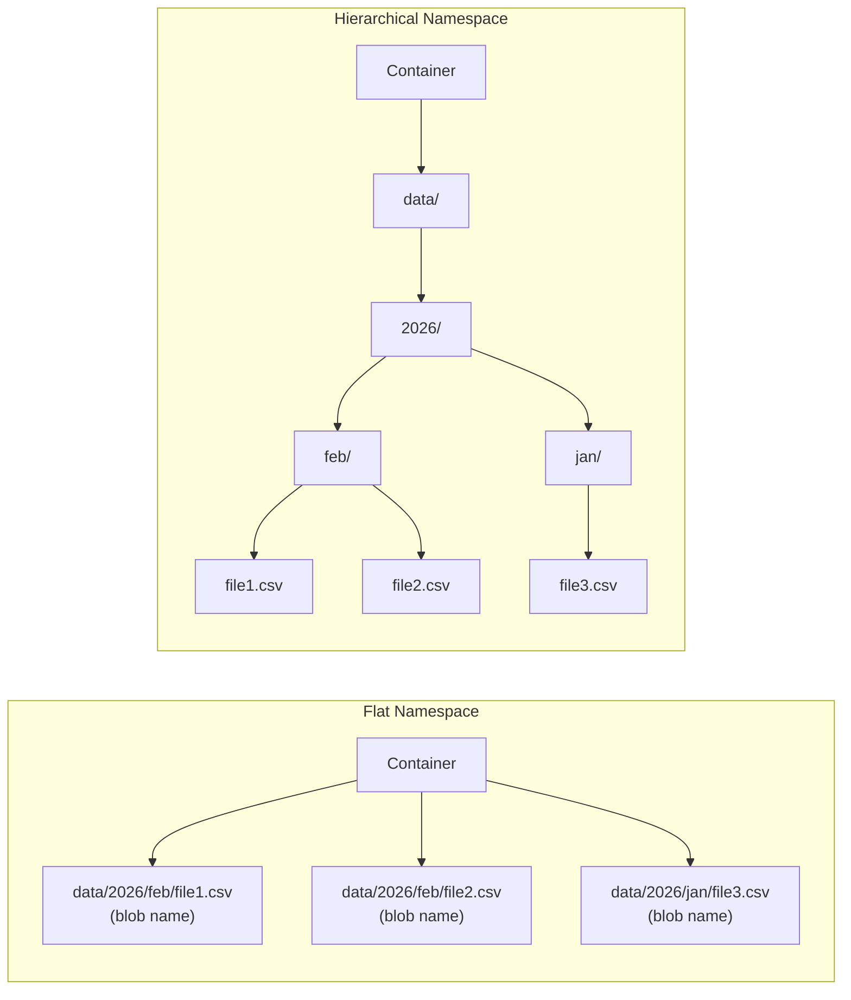

# How to Enable Hierarchical Namespace for Azure Data Lake Storage Gen2

Author: [nawazdhandala](https://www.github.com/nawazdhandala)

Tags: Azure, Data Lake Storage, Hierarchical Namespace, Gen2, Big Data, Storage Account

Description: Learn how to enable hierarchical namespace on Azure Storage accounts to unlock Data Lake Storage Gen2 capabilities for big data analytics workloads.

---

Azure Data Lake Storage Gen2 is built on top of Azure Blob Storage, but with one critical feature that transforms how it handles file system operations: the hierarchical namespace. Enabling this feature changes your storage account from a flat blob namespace into a true directory-based file system. In this post, I will explain what the hierarchical namespace does, how to enable it, and why it matters for data-intensive workloads.

## What Is the Hierarchical Namespace?

Standard Azure Blob Storage uses a flat namespace. When you create a blob with the path `data/2026/february/sales.csv`, there are no actual directories. The entire path is just the blob name, and the slashes are just characters in that name. Listing all files in "data/2026/february/" requires scanning all blobs in the container and filtering by prefix.

With the hierarchical namespace enabled, directories are real objects in the storage system. Renaming a directory is an atomic operation rather than a blob-by-blob copy and delete. Listing files in a directory is a direct operation rather than a prefix scan. This is Data Lake Storage Gen2.

The performance difference is dramatic for big data workloads. Consider renaming a directory containing 10,000 files. With flat blob storage, that requires 10,000 copy operations followed by 10,000 delete operations. With hierarchical namespace, it is a single metadata operation that completes in milliseconds.

## Enabling Hierarchical Namespace on a New Storage Account

You can only enable the hierarchical namespace when creating a storage account. It cannot be enabled on an existing account (with one exception I will cover later).

### Using Azure CLI

```bash
# Create a storage account with hierarchical namespace enabled
# The --hns flag is the key parameter that enables Data Lake Storage Gen2
az storage account create \
  --name mydatalakeaccount \
  --resource-group my-resource-group \
  --location eastus \
  --sku Standard_LRS \
  --kind StorageV2 \
  --hns true

# Verify that hierarchical namespace is enabled
az storage account show \
  --name mydatalakeaccount \
  --resource-group my-resource-group \
  --query "isHnsEnabled"
```

### Using Azure PowerShell

```powershell
# Create a storage account with hierarchical namespace
New-AzStorageAccount `
  -ResourceGroupName "my-resource-group" `
  -AccountName "mydatalakeaccount" `
  -Location "eastus" `
  -SkuName "Standard_LRS" `
  -Kind "StorageV2" `
  -EnableHierarchicalNamespace $true

# Verify the setting
$account = Get-AzStorageAccount -ResourceGroupName "my-resource-group" -AccountName "mydatalakeaccount"
Write-Output "HNS Enabled: $($account.EnableHierarchicalNamespace)"
```

### Using ARM Template

If you deploy infrastructure as code, here is the relevant section of an ARM template.

```json
{
    "type": "Microsoft.Storage/storageAccounts",
    "apiVersion": "2023-01-01",
    "name": "mydatalakeaccount",
    "location": "eastus",
    "kind": "StorageV2",
    "sku": {
        "name": "Standard_LRS"
    },
    "properties": {
        "isHnsEnabled": true,
        "accessTier": "Hot",
        "supportsHttpsTrafficOnly": true,
        "minimumTlsVersion": "TLS1_2"
    }
}
```

### Using Terraform

```hcl
resource "azurerm_storage_account" "datalake" {
  name                     = "mydatalakeaccount"
  resource_group_name      = azurerm_resource_group.main.name
  location                 = azurerm_resource_group.main.location
  account_tier             = "Standard"
  account_replication_type = "LRS"
  account_kind             = "StorageV2"

  # This is the flag that enables Data Lake Storage Gen2
  is_hns_enabled = true
}
```

## Migrating an Existing Account to Hierarchical Namespace

Azure now supports migrating existing storage accounts to enable HNS, though with some prerequisites and limitations.

```bash
# Check if your existing account is eligible for HNS migration
az storage account show \
  --name myexistingaccount \
  --resource-group my-resource-group \
  --query "{kind: kind, sku: sku.name, hns: isHnsEnabled}"

# Start the migration (one-way, cannot be reversed)
az storage account hns-migration start \
  --name myexistingaccount \
  --resource-group my-resource-group \
  --type validation

# If validation passes, run the actual migration
az storage account hns-migration start \
  --name myexistingaccount \
  --resource-group my-resource-group \
  --type upgrade
```

Before running the migration, be aware of these requirements:

- The account must be StorageV2 (General Purpose v2).
- Blob versioning must be disabled.
- Blob snapshots should not exist on any blobs.
- The account cannot have any custom domain configured.
- SFTP and NFS 3.0 must be disabled during migration.

## What Changes After Enabling HNS

Once the hierarchical namespace is enabled, several things change about how your storage account behaves.



**Directory operations become atomic.** Renaming or deleting a directory with thousands of files is a single operation.

**POSIX-like permissions.** You can set access control lists (ACLs) on files and directories, similar to a Linux file system.

**Improved listing performance.** Listing files in a directory is a direct operation, not a prefix scan.

**Hadoop-compatible access.** The ABFS (Azure Blob File System) driver provides Hadoop-compatible access for big data frameworks.

## Working with the Hierarchical Namespace

Once enabled, you can create and manage directories using the Data Lake SDK.

```python
from azure.storage.filedatalake import DataLakeServiceClient
import os

# Connect to the Data Lake Storage account
connection_string = os.environ["AZURE_STORAGE_CONNECTION_STRING"]
service_client = DataLakeServiceClient.from_connection_string(connection_string)

# Create a file system (equivalent to a container)
file_system_client = service_client.create_file_system("analytics")

# Create directories - these are real directory objects
directory_client = file_system_client.create_directory("raw-data/2026/february")

# Create a file inside the directory
file_client = directory_client.create_file("sales.csv")

# Upload data to the file
with open("local-sales.csv", "rb") as f:
    file_client.upload_data(f, overwrite=True)

print("File uploaded to raw-data/2026/february/sales.csv")
```

## Atomic Directory Operations

Here is where the hierarchical namespace really shines.

```python
# Rename an entire directory tree - this is atomic and instant
# regardless of how many files are inside
file_system_client = service_client.get_file_system_client("analytics")
directory_client = file_system_client.get_directory_client("raw-data/2026/february")

# Rename the directory (atomic operation)
directory_client.rename_directory("raw-data/2026/feb-processed")
print("Directory renamed atomically")

# Delete an entire directory tree - also atomic
processed_dir = file_system_client.get_directory_client("raw-data/2026/feb-processed")
processed_dir.delete_directory()
print("Directory deleted")
```

## Feature Compatibility

Enabling HNS makes some Blob Storage features unavailable while unlocking new capabilities.

Features available with HNS: blob tiering, soft delete (for containers), lifecycle management, static website hosting, Azure Functions triggers.

Features not available with HNS: blob versioning, blob snapshots (use directory-level snapshots instead), change feed, object replication.

Make sure the features you depend on are compatible before enabling HNS.

## Choosing the Right SKU

Data Lake Storage Gen2 works with several redundancy options.

- **Standard_LRS**: Locally redundant, cheapest option, good for dev/test.
- **Standard_ZRS**: Zone-redundant, protects against datacenter failures.
- **Standard_GRS**: Geo-redundant, replicates to a secondary region.
- **Premium_LRS**: Premium SSD-backed storage for low-latency workloads.

For most analytics workloads, Standard_LRS or Standard_ZRS provides the best balance of cost and reliability. Premium storage is worth considering if your workload is latency-sensitive.

## Verification and Testing

After creating your Data Lake Storage Gen2 account, verify everything is working.

```bash
# List file systems (containers) in the account
az storage fs list \
  --account-name mydatalakeaccount \
  --auth-mode login

# Create a test directory
az storage fs directory create \
  --name test-dir \
  --file-system analytics \
  --account-name mydatalakeaccount \
  --auth-mode login

# Upload a test file
az storage fs file upload \
  --source ./test-file.txt \
  --path test-dir/test-file.txt \
  --file-system analytics \
  --account-name mydatalakeaccount \
  --auth-mode login

# List files in the directory
az storage fs file list \
  --file-system analytics \
  --path test-dir \
  --account-name mydatalakeaccount \
  --auth-mode login \
  --output table
```

The hierarchical namespace is the foundation for everything you do with Azure Data Lake Storage Gen2. It transforms a blob store into a proper file system capable of supporting big data analytics at scale. The key takeaway is that you need to enable it at account creation time (or go through the migration process), so plan accordingly when setting up your data lake infrastructure.
