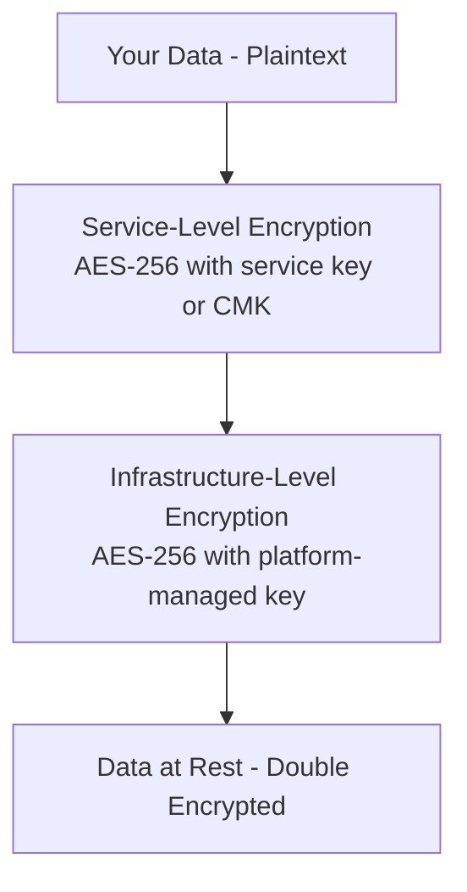

# How to Enable Infrastructure Encryption (Double Encryption) for Azure Storage

Author: [nawazdhandala](https://www.github.com/nawazdhandala)

Tags: Azure, Storage Encryption, Infrastructure Encryption, Double Encryption, Security, Compliance, Data Protection

Description: How to enable infrastructure-level double encryption for Azure Storage accounts to meet strict compliance requirements with two independent layers of encryption.

---

Azure Storage encrypts all data at rest by default using 256-bit AES encryption. For most workloads, this single layer of encryption is sufficient. But if your organization operates in a regulated industry - finance, healthcare, government - or needs to meet compliance standards that explicitly require double encryption, Azure offers infrastructure encryption as a second layer. This guide explains what it does, when you need it, and how to enable it.

## Understanding the Two Encryption Layers

When infrastructure encryption is enabled, your data is encrypted twice with two different encryption algorithms and two different keys:



**Layer 1 - Service-level encryption**: This is the standard Azure Storage encryption that is always on. You can use Microsoft-managed keys, customer-managed keys (CMK) stored in Azure Key Vault, or customer-provided keys.

**Layer 2 - Infrastructure encryption**: This is the additional encryption layer applied at the infrastructure level before data is written to physical media. It uses a different key and potentially a different cipher implementation than the service-level encryption.

The two layers use different encryption keys, so even if one key were compromised, the data would still be protected by the other. The two layers may also use different hardware or software implementations, protecting against implementation-level vulnerabilities.

## When Do You Need Double Encryption?

Most applications do not need double encryption. The standard service-level encryption with Microsoft-managed or customer-managed keys meets the requirements of the vast majority of security standards.

You should consider infrastructure encryption when:

- **Regulatory requirements explicitly mandate double encryption**: Some government and financial regulations require data at rest to be encrypted with two independent mechanisms.
- **Compliance frameworks require defense in depth for encryption**: Certain frameworks (like NIST 800-171 or specific DoD IL5 requirements) may interpret encryption defense-in-depth as requiring two layers.
- **Your risk assessment identifies a need for it**: If your threat model includes scenarios where a single encryption key compromise could expose data, double encryption provides an additional barrier.
- **Customer contracts require it**: Enterprise customers, particularly in regulated industries, may contractually require double encryption of their data.

If none of these apply, standard encryption is fine. Adding infrastructure encryption does not improve performance, and it adds a small amount of overhead.

## Enabling Infrastructure Encryption

Infrastructure encryption can only be enabled when creating a new storage account. You cannot enable it on an existing storage account. This is important to know upfront.

### Using Azure CLI

```bash
# Create a storage account with infrastructure encryption enabled
# The --require-infrastructure-encryption flag enables the second layer
az storage account create \
  --name securestorage2026 \
  --resource-group security-rg \
  --location eastus \
  --sku Standard_GRS \
  --kind StorageV2 \
  --access-tier Hot \
  --require-infrastructure-encryption true
```

### Using Azure Portal

1. Go to the Azure Portal and start creating a new storage account
2. Fill in the basics (name, region, performance, redundancy)
3. Navigate to the "Encryption" tab
4. Under "Infrastructure encryption," check "Enable infrastructure encryption"
5. Complete the creation

### Using ARM Template

```json
{
  "$schema": "https://schema.management.azure.com/schemas/2019-04-01/deploymentTemplate.json#",
  "contentVersion": "1.0.0.0",
  "parameters": {
    "storageAccountName": {
      "type": "string"
    },
    "location": {
      "type": "string",
      "defaultValue": "[resourceGroup().location]"
    }
  },
  "resources": [
    {
      "type": "Microsoft.Storage/storageAccounts",
      "apiVersion": "2023-01-01",
      "name": "[parameters('storageAccountName')]",
      "location": "[parameters('location')]",
      "sku": {
        "name": "Standard_GRS"
      },
      "kind": "StorageV2",
      "properties": {
        "accessTier": "Hot",
        "encryption": {
          "services": {
            "blob": {
              "enabled": true,
              "keyType": "Account"
            },
            "file": {
              "enabled": true,
              "keyType": "Account"
            },
            "table": {
              "enabled": true,
              "keyType": "Account"
            },
            "queue": {
              "enabled": true,
              "keyType": "Account"
            }
          },
          "keySource": "Microsoft.Storage",
          "requireInfrastructureEncryption": true
        }
      }
    }
  ]
}
```

### Using Terraform

```hcl
resource "azurerm_storage_account" "secure" {
  name                     = "securestorage2026"
  resource_group_name      = azurerm_resource_group.security.name
  location                 = azurerm_resource_group.security.location
  account_tier             = "Standard"
  account_replication_type = "GRS"
  account_kind             = "StorageV2"

  # Enable infrastructure encryption (double encryption)
  infrastructure_encryption_enabled = true
}
```

### Using Bicep

```bicep
resource storageAccount 'Microsoft.Storage/storageAccounts@2023-01-01' = {
  name: 'securestorage2026'
  location: resourceGroup().location
  sku: {
    name: 'Standard_GRS'
  }
  kind: 'StorageV2'
  properties: {
    accessTier: 'Hot'
    encryption: {
      services: {
        blob: { enabled: true, keyType: 'Account' }
        file: { enabled: true, keyType: 'Account' }
        table: { enabled: true, keyType: 'Account' }
        queue: { enabled: true, keyType: 'Account' }
      }
      keySource: 'Microsoft.Storage'
      requireInfrastructureEncryption: true
    }
  }
}
```

## Verifying Infrastructure Encryption Is Enabled

After creating the storage account, verify that infrastructure encryption is active:

```bash
# Check if infrastructure encryption is enabled
az storage account show \
  --name securestorage2026 \
  --resource-group security-rg \
  --query "encryption.requireInfrastructureEncryption" -o tsv
```

This should return `true`. You can also check the full encryption configuration:

```bash
# Show the complete encryption settings
az storage account show \
  --name securestorage2026 \
  --resource-group security-rg \
  --query "encryption" -o json
```

## Combining with Customer-Managed Keys

For the highest level of control, combine infrastructure encryption with customer-managed keys (CMK). This gives you:

- Layer 1: Encryption with your own key from Azure Key Vault
- Layer 2: Infrastructure encryption with a platform-managed key

### Step 1: Create a Key Vault and Key

```bash
# Create a Key Vault
az keyvault create \
  --name secure-kv-2026 \
  --resource-group security-rg \
  --location eastus \
  --enable-purge-protection true \
  --enable-soft-delete true

# Create an encryption key
az keyvault key create \
  --vault-name secure-kv-2026 \
  --name storage-encryption-key \
  --kty RSA \
  --size 2048
```

### Step 2: Create Storage Account with Both CMK and Infrastructure Encryption

```bash
# Get the key vault URI and key name
KEY_VAULT_URI=$(az keyvault show --name secure-kv-2026 --query "properties.vaultUri" -o tsv)

# Create storage account with infrastructure encryption
az storage account create \
  --name securestorage2026 \
  --resource-group security-rg \
  --location eastus \
  --sku Standard_GRS \
  --kind StorageV2 \
  --require-infrastructure-encryption true \
  --encryption-key-source Microsoft.Keyvault \
  --encryption-key-vault "${KEY_VAULT_URI}" \
  --encryption-key-name storage-encryption-key \
  --identity-type SystemAssigned
```

### Step 3: Grant Key Vault Access

The storage account needs permission to use the key:

```bash
# Get the storage account's managed identity principal ID
PRINCIPAL_ID=$(az storage account show \
  --name securestorage2026 \
  --resource-group security-rg \
  --query "identity.principalId" -o tsv)

# Grant the storage account access to the key vault
az keyvault set-policy \
  --name secure-kv-2026 \
  --object-id "${PRINCIPAL_ID}" \
  --key-permissions get wrapKey unwrapKey
```

## Encryption Scopes with Infrastructure Encryption

Encryption scopes let you use different encryption keys for different blobs within the same storage account. You can enable infrastructure encryption at the scope level too:

```bash
# Create an encryption scope with infrastructure encryption
az storage account encryption-scope create \
  --account-name securestorage2026 \
  --resource-group security-rg \
  --name "sensitive-data-scope" \
  --key-source Microsoft.Storage \
  --require-infrastructure-encryption true
```

Then use the scope when uploading blobs:

```python
from azure.storage.blob import BlobServiceClient
from azure.identity import DefaultAzureCredential

credential = DefaultAzureCredential()
blob_service = BlobServiceClient(
    "https://securestorage2026.blob.core.windows.net",
    credential=credential
)

container_client = blob_service.get_container_client("sensitive")
blob_client = container_client.get_blob_client("patient-data.json")

# Upload with a specific encryption scope
# This blob uses the double-encrypted scope
blob_client.upload_blob(
    data=b'{"patient": "data"}',
    overwrite=True,
    encryption_scope="sensitive-data-scope"
)
```

## Performance Impact

Infrastructure encryption adds a second encryption/decryption pass for every read and write operation. In practice, the performance impact is minimal because:

- Modern CPUs have hardware AES acceleration (AES-NI instruction set)
- The encryption happens at the storage infrastructure level, not in your application
- Azure's storage infrastructure is optimized for this workload

I have not observed measurable latency differences in my testing, but for extremely latency-sensitive workloads (sub-millisecond requirements), you should benchmark with your specific access patterns.

## Auditing Encryption Configuration

For compliance audits, you can use Azure Policy to enforce infrastructure encryption across all storage accounts:

```json
{
  "if": {
    "allOf": [
      {
        "field": "type",
        "equals": "Microsoft.Storage/storageAccounts"
      },
      {
        "field": "Microsoft.Storage/storageAccounts/encryption.requireInfrastructureEncryption",
        "notEquals": true
      }
    ]
  },
  "then": {
    "effect": "deny"
  }
}
```

This policy prevents creating storage accounts without infrastructure encryption, ensuring compliance across your organization.

## Migrating Existing Data

Since infrastructure encryption can only be enabled at account creation time, migrating existing data requires creating a new account and copying the data:

```bash
# Create the new storage account with infrastructure encryption
az storage account create \
  --name newsecurestorage \
  --resource-group security-rg \
  --location eastus \
  --sku Standard_GRS \
  --kind StorageV2 \
  --require-infrastructure-encryption true

# Copy data from the old account to the new one using AzCopy
azcopy copy \
  "https://oldstorage.blob.core.windows.net/?{source-sas}" \
  "https://newsecurestorage.blob.core.windows.net/?{dest-sas}" \
  --recursive
```

This is a non-trivial migration for large storage accounts. Plan for the data transfer time and update all application configurations to point to the new account.

## Key Takeaways

Infrastructure encryption is a straightforward feature with a clear purpose: providing a second independent encryption layer for compliance scenarios that require it. The setup is simple, the performance impact is negligible, and once enabled, it works transparently without any changes to your application code. The main thing to remember is that it must be enabled at account creation time, so make this decision early in your storage account design. If your compliance requirements call for double encryption, enable it and move on - it just works.
