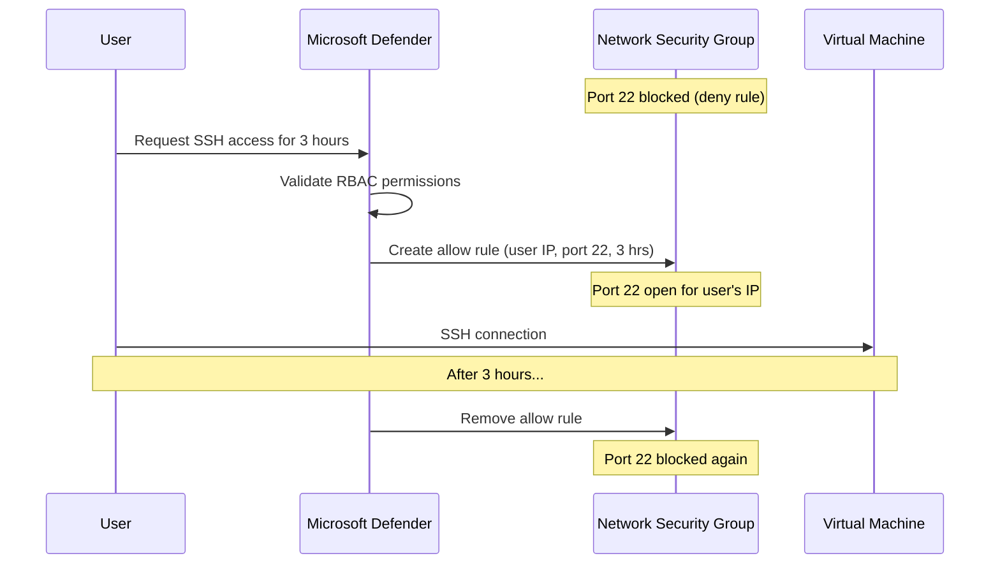

# How to Enable Just-In-Time VM Access in Azure Security Center

Author: [nawazdhandala](https://www.github.com/nawazdhandala)

Tags: Azure, Just-In-Time Access, Security Center, Virtual Machine, NSG, Zero Trust, Microsoft Defender

Description: How to configure Just-In-Time VM access in Microsoft Defender for Cloud to lock down management ports and grant access only when needed.

---

Management ports like SSH (22) and RDP (3389) are the most targeted ports by attackers. Leaving them permanently open, even with strong NSG rules, increases your attack surface. Just-In-Time (JIT) VM access solves this by keeping management ports closed by default and opening them only when an authorized user requests access, for a limited time, from a specific IP address.

This is the cloud equivalent of "deny all, allow on request." In this guide, I will show you how to set up and use JIT VM access in Microsoft Defender for Cloud (formerly Azure Security Center).

## How JIT Access Works

The JIT workflow is straightforward:

1. JIT creates NSG deny rules on the management ports (SSH, RDP, etc.) that block all inbound traffic.
2. When an authorized user needs access, they request it through the portal, CLI, or API.
3. JIT creates temporary NSG allow rules for the requesting user's IP address, for a specified duration.
4. When the time expires, JIT automatically removes the allow rules.



This dramatically reduces the window of opportunity for attackers. Instead of ports being open 24/7, they are only open for the specific duration needed.

## Prerequisites

JIT VM access requires:

- **Microsoft Defender for Servers (Plan 2)**: JIT is a feature of Defender for Cloud. You need at least Plan 2 enabled for the subscription.
- **Supported NSG configuration**: The VM must have an NSG associated with it (either at the NIC or subnet level).
- **RBAC permissions**: Users requesting access need the Reader role on the VM and the VM Contributor role (or a custom role with specific JIT permissions).

## Enabling Defender for Servers

If you have not already enabled Defender for Servers:

```bash
# Enable Defender for Servers Plan 2 on a subscription
az security pricing create \
  --name VirtualMachines \
  --tier Standard
```

In the portal:
1. Go to "Microsoft Defender for Cloud."
2. Click "Environment settings."
3. Select your subscription.
4. Enable "Servers" plan and select Plan 2.

## Configuring JIT on a VM

### Through the Azure Portal

1. Navigate to Microsoft Defender for Cloud.
2. Click "Workload protections" in the left menu.
3. Click "Just-in-time VM access."
4. You will see three tabs: "Configured," "Not configured," and "Unsupported."
5. Find your VM in the "Not configured" tab.
6. Select the VM and click "Enable JIT on VM."
7. Configure the ports:
   - Default ports are SSH (22), RDP (3389), and WinRM (5985, 5986).
   - Set the maximum allowed time (e.g., 3 hours).
   - Set allowed source IPs (specific IPs or "any").
8. Click "Save."

### Through the Azure CLI

```bash
# Enable JIT on a VM with SSH and RDP ports
az rest --method put \
  --uri "https://management.azure.com/subscriptions/{sub-id}/resourceGroups/myResourceGroup/providers/Microsoft.Security/locations/eastus/jitNetworkAccessPolicies/default?api-version=2020-01-01" \
  --body '{
    "kind": "Basic",
    "properties": {
      "virtualMachines": [
        {
          "id": "/subscriptions/{sub-id}/resourceGroups/myResourceGroup/providers/Microsoft.Compute/virtualMachines/myVM",
          "ports": [
            {
              "number": 22,
              "protocol": "TCP",
              "allowedSourceAddressPrefix": "*",
              "maxRequestAccessDuration": "PT3H"
            },
            {
              "number": 3389,
              "protocol": "TCP",
              "allowedSourceAddressPrefix": "*",
              "maxRequestAccessDuration": "PT3H"
            }
          ]
        }
      ]
    }
  }'
```

The `maxRequestAccessDuration` uses ISO 8601 duration format: `PT3H` means 3 hours, `PT30M` means 30 minutes.

## Requesting Access

### Through the Portal

1. Navigate to your VM.
2. Click "Connect" in the top menu.
3. You will see a "Request access" button if JIT is enabled.
4. Select the ports you need access to.
5. Set the duration (up to the maximum allowed).
6. Specify your source IP or select "My IP."
7. Enter a justification (optional but recommended).
8. Click "Request access."

Access is granted immediately if you have the right RBAC permissions.

### Through the Azure CLI

```bash
# Request JIT access for SSH from your current IP
az rest --method post \
  --uri "https://management.azure.com/subscriptions/{sub-id}/resourceGroups/myResourceGroup/providers/Microsoft.Security/locations/eastus/jitNetworkAccessPolicies/default/initiate?api-version=2020-01-01" \
  --body '{
    "virtualMachines": [
      {
        "id": "/subscriptions/{sub-id}/resourceGroups/myResourceGroup/providers/Microsoft.Compute/virtualMachines/myVM",
        "ports": [
          {
            "number": 22,
            "duration": "PT2H",
            "allowedSourceAddressPrefix": "203.0.113.50"
          }
        ]
      }
    ]
  }'
```

### Through PowerShell

```powershell
# Request JIT access using the Az PowerShell module
$JitPolicy = @{
    id    = "/subscriptions/{sub-id}/resourceGroups/myResourceGroup/providers/Microsoft.Compute/virtualMachines/myVM"
    ports = @(
        @{
            number                     = 22
            duration                   = "PT2H"
            allowedSourceAddressPrefix = @("203.0.113.50")
        }
    )
}

Start-AzJitNetworkAccessPolicy `
    -ResourceGroupName "myResourceGroup" `
    -Location "eastus" `
    -Name "default" `
    -VirtualMachine $JitPolicy
```

## What Happens in the NSG

When JIT is configured, it adds deny rules to the NSG for the management ports. These rules have a priority number that blocks traffic.

When access is requested, JIT creates allow rules with a higher priority (lower number) that permit traffic from the requesting IP. When the time expires, the allow rules are removed.

You can see these rules in the NSG:

```bash
# List NSG rules to see the JIT-managed rules
az network nsg rule list \
  --resource-group myResourceGroup \
  --nsg-name myNSG \
  --output table
```

JIT-managed rules have names starting with "SecurityCenter-JITRule" and include the expiration time in the rule description.

## Customizing JIT Policies

You can customize which ports are protected and what access parameters are allowed:

**Adding custom ports**: If your application uses a management port other than SSH or RDP (e.g., a web admin panel on port 8443), you can add it to the JIT policy.

**Restricting source IPs**: Instead of allowing "any" source IP in requests, you can pre-configure allowed IP ranges. This means users can only request access from approved networks.

**Setting shorter maximum durations**: For high-security environments, reduce the maximum request duration to 1 hour or less.

## Monitoring JIT Activity

Track who requested access and when:

In the portal:
1. Go to Microsoft Defender for Cloud > "Just-in-time VM access."
2. Click on the "Configured" tab.
3. Select a VM and click the "..." menu > "Activity log."

This shows all access requests, including who made them, when, and the duration.

You can also query the Activity Log:

```bash
# List JIT access requests from the activity log
az monitor activity-log list \
  --resource-group myResourceGroup \
  --caller "user@example.com" \
  --offset 7d \
  --query "[?contains(operationName.value, 'jitNetworkAccessPolicies')]" \
  --output table
```

## Integration with Azure Bastion

JIT and Bastion complement each other well:

- **Bastion** eliminates the need for public IPs and provides browser-based access.
- **JIT** controls when the ports are open, even within the virtual network.

When combined, traffic must go through Bastion (no direct internet access) and the ports must be explicitly opened by JIT before the connection can be made. This is defense in depth at its best.

## RBAC for JIT

Control who can configure JIT policies and who can request access:

- **Configuring JIT policies**: Requires Security Admin or Owner role on the subscription.
- **Requesting access**: Requires Reader and Virtual Machine Contributor roles on the VM. You can create a custom role with only the JIT initiate permission for least-privilege access.

Custom role definition for JIT access only:

```json
{
  "Name": "JIT Access User",
  "Description": "Can request JIT access to VMs",
  "Actions": [
    "Microsoft.Security/locations/jitNetworkAccessPolicies/initiate/action",
    "Microsoft.Security/locations/jitNetworkAccessPolicies/*/read",
    "Microsoft.Compute/virtualMachines/read",
    "Microsoft.Network/networkInterfaces/*/read"
  ],
  "AssignableScopes": [
    "/subscriptions/{sub-id}"
  ]
}
```

## Best Practices

1. **Enable JIT on all VMs with management ports.** Even VMs behind a VPN benefit from the time-limited access model.
2. **Set short maximum durations.** 2-3 hours is sufficient for most maintenance tasks. Users can request access again if needed.
3. **Require justification.** Enable the justification field so you have an audit trail of why access was requested.
4. **Review access logs weekly.** Look for unusual patterns like access requests at odd hours or from unexpected IPs.
5. **Combine with Bastion.** Use both for maximum security - Bastion removes public IPs, JIT controls when ports are accessible.
6. **Use Azure Policy to enforce JIT.** Audit or require JIT on all VMs in your subscription.

## Wrapping Up

JIT VM access is a simple but powerful security control. By keeping management ports closed by default and opening them only when needed, you dramatically reduce your attack surface. The setup takes a few minutes per VM, and the day-to-day workflow adds only a small step before connecting. For any organization serious about cloud security, JIT should be enabled on every VM that has management ports.
