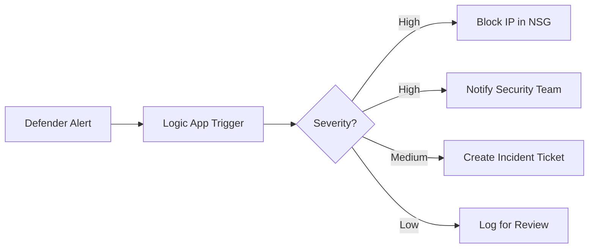

# How to Enable Microsoft Defender for Azure Cosmos DB to Detect NoSQL Injection Attacks

Author: [nawazdhandala](https://www.github.com/nawazdhandala)

Tags: Azure, Microsoft Defender, Cosmos DB, NoSQL Injection, Database Security, Threat Detection, Cloud Security

Description: Learn how to enable and configure Microsoft Defender for Azure Cosmos DB to detect NoSQL injection attempts and other database threats in real time.

---

NoSQL injection is one of those attack vectors that gets less attention than its SQL counterpart, but it is just as dangerous. When you are running Azure Cosmos DB, attackers can craft malicious queries through your application to extract data, bypass authentication, or even modify records. Microsoft Defender for Azure Cosmos DB adds a layer of threat detection that specifically watches for these kinds of attacks, along with other suspicious database activity.

In this post, I will walk through enabling Defender for Cosmos DB, explain what it actually detects, and show you how to configure alerts so your security team knows the moment something suspicious happens.

## What Microsoft Defender for Cosmos DB Detects

Before we set anything up, let us understand what we are getting. Defender for Cosmos DB uses behavioral analytics and threat intelligence to detect several categories of threats:

**NoSQL injection attacks** - This is the headline feature. Defender analyzes the queries hitting your Cosmos DB account and flags patterns that look like injection attempts. This includes things like unusual operators in query predicates, attempts to manipulate query logic through embedded expressions, and queries that contain suspicious string patterns.

**Anomalous access patterns** - If someone starts querying your database from an unusual location, at an unusual time, or with an unusual volume of requests, Defender will flag it.

**Potential data exfiltration** - Large data extractions that deviate from normal patterns get flagged. This is useful for detecting compromised credentials being used to dump your data.

**Suspicious database activities** - This covers things like enumeration of containers, unusual metadata queries, and access patterns consistent with reconnaissance.

## How NoSQL Injection Works in Cosmos DB

To understand why this protection matters, let us look at a quick example of a NoSQL injection vulnerability. Suppose you have an API endpoint that queries Cosmos DB based on user input.

This is a vulnerable Node.js query where user input is directly concatenated into the query string:

```javascript
// VULNERABLE CODE - Do not use this pattern
// User input is directly inserted into the query without sanitization
app.get('/api/users', async (req, res) => {
    const username = req.query.username;

    // This is dangerous - the user could inject query operators
    const query = `SELECT * FROM c WHERE c.username = '${username}'`;

    const { resources } = await container.items
        .query(query)
        .fetchAll();

    res.json(resources);
});
```

An attacker could send a request like `/api/users?username=' OR 1=1 --` and potentially dump all user records. Defender for Cosmos DB is designed to catch these patterns at the database level, providing defense in depth even when application code has vulnerabilities.

Of course, the correct approach is to use parameterized queries:

```javascript
// SAFE CODE - Use parameterized queries to prevent injection
app.get('/api/users', async (req, res) => {
    const username = req.query.username;

    // Parameters are safely handled by the SDK, preventing injection
    const query = {
        query: "SELECT * FROM c WHERE c.username = @username",
        parameters: [
            { name: "@username", value: username }
        ]
    };

    const { resources } = await container.items
        .query(query)
        .fetchAll();

    res.json(resources);
});
```

## Step 1: Enable Defender for Cosmos DB at the Subscription Level

The simplest way to enable protection is at the subscription level, which covers all Cosmos DB accounts in that subscription.

This Azure CLI command enables Defender for Cosmos DB across your entire subscription:

```bash
# Enable Microsoft Defender for Cosmos DB at the subscription level
az security pricing create \
  --name CosmosDbs \
  --tier Standard

# Verify it is enabled
az security pricing show \
  --name CosmosDbs \
  --query "{name:name, tier:pricingTier, status:freeTrialRemainingTime}"
```

## Step 2: Enable Defender on a Specific Cosmos DB Account

If you prefer to enable protection on specific accounts only (maybe you want it on production but not development), you can do that at the resource level.

This enables Defender for a specific Cosmos DB account using the resource ID:

```bash
# Get the resource ID of your Cosmos DB account
COSMOS_ID=$(az cosmosdb show \
  --name mycosmosaccount \
  --resource-group rg-production \
  --query id -o tsv)

# Enable Defender for this specific account
az security pricing create \
  --name CosmosDbs \
  --tier Standard \
  --extensions "[{\"name\":\"CosmosDbs\",\"isEnabled\":\"True\"}]"
```

Alternatively, you can enable it through the Azure portal. Navigate to your Cosmos DB account, click on "Microsoft Defender for Cloud" in the left menu under Security, and click "Enable Microsoft Defender for Azure Cosmos DB."

## Step 3: Configure Alert Notifications

Defender generates security alerts when it detects threats, but those alerts are useless if nobody sees them. You need to configure notifications so your security team gets notified immediately.

This configures email notifications for security alerts on your subscription:

```bash
# Configure email notifications for security alerts
az security contact create \
  --name default \
  --email "security-team@yourcompany.com" \
  --alert-notifications on \
  --alerts-to-admins on

# You can also add multiple email addresses
az security contact create \
  --name default \
  --email "security-team@yourcompany.com;oncall@yourcompany.com" \
  --alert-notifications on \
  --alerts-to-admins on
```

For more sophisticated alerting, I recommend setting up an integration with Microsoft Sentinel or your SIEM of choice. Defender for Cloud alerts automatically flow into Sentinel if you have the connector enabled.

## Step 4: Review and Respond to Alerts

Once Defender is enabled, alerts will appear in the Microsoft Defender for Cloud dashboard under "Security alerts." Each alert includes:

- **Severity level** (High, Medium, Low) indicating the confidence and potential impact.
- **Description** of what was detected.
- **Affected resource** showing which Cosmos DB account was targeted.
- **Attack details** including the suspicious query patterns, source IP addresses, and timestamps.
- **Recommended actions** for investigation and remediation.

You can also query alerts programmatically using the Security Center API or Azure Resource Graph.

This KQL query in Azure Resource Graph finds all Cosmos DB security alerts from the last 7 days:

```kusto
// Find all Cosmos DB related security alerts from the past week
SecurityAlert
| where TimeGenerated > ago(7d)
| where AlertType contains "Cosmos" or AlertType contains "NoSQL"
| project
    TimeGenerated,
    AlertName,
    AlertSeverity,
    Description,
    ResourceId,
    RemediationSteps
| order by TimeGenerated desc
```

## Step 5: Set Up Automated Response with Logic Apps

For critical alerts, you might want an automated response. A common pattern is to use a Logic App triggered by Defender alerts that automatically takes action, like temporarily blocking the source IP or disabling a compromised account.

Here is the general flow for setting up automated response:



You can set this up in the Azure portal under Defender for Cloud by going to "Workflow automation" and creating a new automation that triggers on specific alert types.

## Step 6: Tune Detection Settings

After running Defender for a while, you might notice some false positives, especially if your application uses complex query patterns that look similar to injection attempts. You can suppress specific alerts by creating suppression rules.

In the Defender for Cloud portal, navigate to Security alerts, find the false positive alert, and click "Create suppression rule." You can suppress based on alert type, resource name, or specific entities in the alert.

A word of caution: be very selective with suppression rules. Every suppressed alert type is a potential blind spot. I recommend investigating each false positive thoroughly before suppressing it, and set an expiration date on suppression rules so they get reviewed periodically.

## Pricing and Cost Considerations

Microsoft Defender for Cosmos DB is billed per Cosmos DB account per month. As of my last check, it costs around $10 per account per month, which is quite reasonable for the level of threat detection you get. There is also a 30-day free trial when you first enable it.

The cost is per account, not per database or container, so a single account with 50 containers costs the same as one with a single container. Keep this in mind when planning your Cosmos DB account architecture.

## Best Practices for Cosmos DB Security

Enabling Defender is an important step, but it should be part of a broader security strategy:

1. **Always use parameterized queries.** This is your first line of defense against injection attacks.
2. **Apply the principle of least privilege.** Use role-based access control to limit who and what can access your Cosmos DB accounts.
3. **Enable diagnostic logging.** Beyond Defender, enable Cosmos DB diagnostic logs and send them to a Log Analytics workspace for deeper analysis.
4. **Use private endpoints.** Keep your Cosmos DB accounts off the public internet whenever possible.
5. **Rotate keys regularly.** If you are using access keys instead of Entra ID authentication, rotate them on a schedule.
6. **Review firewall rules.** Restrict access to known IP ranges and virtual networks.

## Wrapping Up

Enabling Microsoft Defender for Cosmos DB is a quick win that adds meaningful security to your NoSQL databases. The NoSQL injection detection alone justifies the modest cost, and the anomalous access pattern detection can catch compromised credentials before significant damage is done. It takes about five minutes to enable, and once it is running, you get continuous monitoring without any changes to your application code. Combine it with good coding practices like parameterized queries and proper access controls, and you have a solid defense-in-depth approach for your Cosmos DB workloads.
