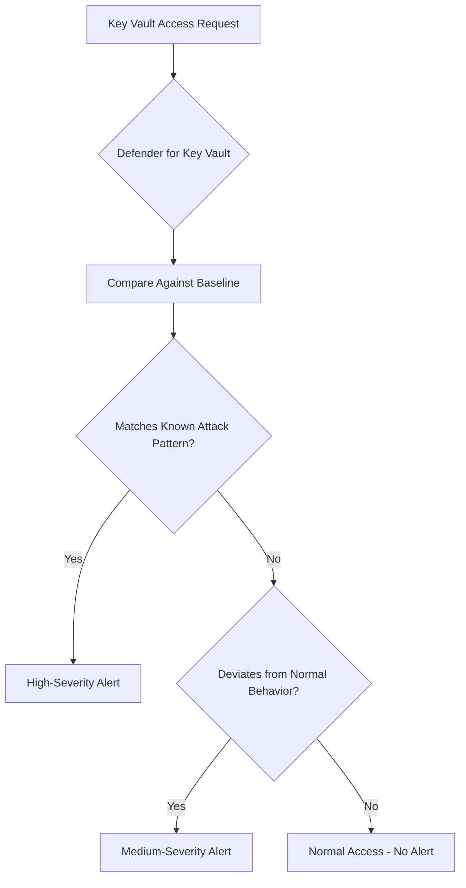

# How to Enable Microsoft Defender for Key Vault to Detect Unusual Secret Access Patterns

Author: [nawazdhandala](https://www.github.com/nawazdhandala)

Tags: Microsoft Defender, Azure Key Vault, Secret Management, Threat Detection, Security Monitoring, Cloud Security, Azure

Description: Learn how to enable and configure Microsoft Defender for Key Vault to detect suspicious access patterns, credential theft attempts, and anomalous secret operations.

---

Azure Key Vault stores your most sensitive data - encryption keys, API secrets, connection strings, certificates. If an attacker gains access to your Key Vault, they have the keys to your entire kingdom. Microsoft Defender for Key Vault monitors access patterns to your vaults and alerts you when something looks wrong, like secrets being listed from an unusual location, keys being accessed at unusual times, or someone probing your vault from a Tor exit node.

This guide covers how to enable Defender for Key Vault, understand the alerts it generates, and build a response workflow so your team can act quickly when suspicious activity is detected.

## What Defender for Key Vault Detects

Defender for Key Vault uses behavioral analytics to build a baseline of normal access patterns for each vault. It then flags deviations from that baseline. The detection categories include:

**Suspicious secret listing**: Someone enumerates all secrets in a vault, which often indicates reconnaissance. Legitimate applications typically access specific named secrets, not list all of them.

**Unusual access patterns**: A vault that normally receives requests from a specific set of IPs or service principals suddenly gets requests from a new location, a new identity, or at an unusual time of day.

**Access from suspicious IP addresses**: Requests originating from Tor exit nodes, known malicious IPs, or anonymizing proxy services.

**High-volume operations**: A sudden spike in secret read operations, which could indicate credential theft or data exfiltration.

**Access from unexpected Azure services**: A vault being accessed from an Azure service that has never accessed it before, potentially indicating lateral movement.

**Potential credential compromise**: Access patterns that match known attack techniques, such as accessing a vault immediately after a password reset or from an unfamiliar location following a risky sign-in.



## Step 1: Enable Defender for Key Vault

Enable Defender for Key Vault at the subscription level to protect all vaults automatically.

```bash
# Enable Microsoft Defender for Key Vault
az security pricing create \
  --name KeyVaults \
  --tier Standard
```

Verify the protection is active.

```bash
# Check the Defender for Key Vault pricing tier
az security pricing show \
  --name KeyVaults \
  --query '{name: name, tier: pricingTier}'
```

You can also enable it through the Azure portal: navigate to Microsoft Defender for Cloud > Environment settings > Your subscription > Defender plans, and toggle Key Vaults to On.

Once enabled, Defender starts monitoring all Key Vaults in the subscription immediately. There is a learning period of about 30 days during which the system builds behavioral baselines for each vault. During this period, you may see more alerts than usual as the system calibrates.

## Step 2: Configure Alert Notifications

Set up email notifications so your security team is alerted immediately when Defender detects suspicious Key Vault activity.

```bash
# Configure security contact for Defender alerts
az security contact create \
  --name "default1" \
  --emails "security-ops@contoso.com" \
  --alert-notifications on \
  --alerts-to-admins on
```

For more targeted routing, create an Azure Monitor action group that sends Key Vault alerts to specific teams.

```bash
# Create an action group for Key Vault security alerts
az monitor action-group create \
  --resource-group monitoring-rg \
  --name "keyvault-security-alerts" \
  --short-name "KVSecurity" \
  --action email security-team security-ops@contoso.com \
  --action email vault-admins keyvault-admins@contoso.com \
  --action webhook pagerduty "https://events.pagerduty.com/integration/YOUR_KEY/enqueue"
```

## Step 3: Understand the Alert Types

Here are the specific alerts Defender for Key Vault can generate:

| Alert Type | Severity | Description |
|---|---|---|
| KV_OperationVolumeAnomaly | Medium | Unusually high number of vault operations |
| KV_SecretListingAnomaly | Medium | Suspicious listing of secrets in a vault |
| KV_AccessFromUnusualIP | Medium | Access from an IP not seen before for this vault |
| KV_AccessFromTorNode | High | Access from a known Tor exit node |
| KV_AccessFromSuspiciousIP | High | Access from a known malicious IP address |
| KV_SuspiciousAppAccess | Medium | Access from a potentially compromised application |
| KV_UnusualPolicy | Medium | Vault access policy was changed in an unusual way |
| KV_SecretExfiltration | High | Pattern suggesting bulk secret extraction |

## Step 4: Investigate an Alert

When you receive an alert, here is a systematic investigation workflow.

First, pull the alert details.

```bash
# Get details of a specific Key Vault security alert
az security alert list \
  --query "[?contains(alertType, 'KV_')].{type: alertType, severity: severity, vault: compromisedEntity, time: timeGeneratedUtc, description: description}" \
  --output table
```

Next, check the Key Vault's diagnostic logs to understand what operations were performed.

```kql
// Query Key Vault diagnostic logs for the suspicious time window
AzureDiagnostics
| where ResourceProvider == "MICROSOFT.KEYVAULT"
| where ResourceType == "VAULTS"
| where Resource == "MYKEYVAULT"
| where TimeGenerated between (datetime(2026-02-16T10:00:00Z) .. datetime(2026-02-16T12:00:00Z))
| project TimeGenerated, OperationName, CallerIPAddress,
    Identity = identity_claim_upn_s,
    ResultType, ResultSignature,
    SecretName = id_s
| order by TimeGenerated desc
```

Look for patterns that confirm or dismiss the alert:
- Is the caller IP recognized as legitimate?
- Is the identity (user or service principal) authorized to access this vault?
- Are the operations consistent with the application's normal behavior?
- Were secrets actually read, or just listed?

```kql
// Find all unique identities that accessed the vault in the alert timeframe
AzureDiagnostics
| where ResourceProvider == "MICROSOFT.KEYVAULT"
| where Resource == "MYKEYVAULT"
| where TimeGenerated > ago(24h)
| summarize
    OperationCount = count(),
    UniqueOperations = dcount(OperationName),
    FirstSeen = min(TimeGenerated),
    LastSeen = max(TimeGenerated)
    by CallerIPAddress, identity_claim_upn_s
| order by OperationCount desc
```

## Step 5: Set Up Automated Response

For high-severity alerts (like access from Tor or suspicious IPs), an automated response can contain the threat while your team investigates.

Here is a Logic App workflow that responds to Key Vault alerts by temporarily restricting vault network access.

```powershell
# PowerShell script for automated Key Vault lockdown
# Triggered by a Logic App on high-severity Defender alerts

param(
    [string]$VaultName,
    [string]$ResourceGroupName,
    [string]$SuspiciousIP
)

# Record the current network rules for rollback
$vault = Get-AzKeyVault -VaultName $VaultName -ResourceGroupName $ResourceGroupName
$currentRules = $vault.NetworkAcls

# Lock down the vault to deny all public network access
Update-AzKeyVaultNetworkRuleSet `
    -VaultName $VaultName `
    -ResourceGroupName $ResourceGroupName `
    -DefaultAction Deny `
    -Bypass AzureServices

Write-Output "Key Vault $VaultName locked down - public access denied"
Write-Output "Previous default action: $($currentRules.DefaultAction)"

# Log the incident for tracking
$incident = @{
    Timestamp = Get-Date -Format "o"
    VaultName = $VaultName
    Action = "NetworkLockdown"
    SuspiciousIP = $SuspiciousIP
    PreviousRules = $currentRules | ConvertTo-Json
}

Write-Output ($incident | ConvertTo-Json)
```

After investigation, restore the original network rules if the alert was a false positive.

```powershell
# Restore vault network rules after investigation
Update-AzKeyVaultNetworkRuleSet `
    -VaultName $VaultName `
    -ResourceGroupName $ResourceGroupName `
    -DefaultAction Allow
```

## Step 6: Enable Key Vault Diagnostic Logging

Defender for Key Vault generates alerts, but diagnostic logging provides the detailed forensic data you need for investigation. Enable logging for all your vaults.

```bash
# Enable diagnostic logging to Log Analytics for a Key Vault
az monitor diagnostic-settings create \
  --name "kv-diagnostics" \
  --resource "/subscriptions/YOUR_SUB/resourceGroups/myResourceGroup/providers/Microsoft.KeyVault/vaults/myKeyVault" \
  --workspace "/subscriptions/YOUR_SUB/resourceGroups/monitoring-rg/providers/Microsoft.OperationalInsights/workspaces/central-workspace" \
  --logs '[{"category":"AuditEvent","enabled":true,"retentionPolicy":{"enabled":true,"days":365}}]' \
  --metrics '[{"category":"AllMetrics","enabled":true,"retentionPolicy":{"enabled":true,"days":90}}]'
```

With logging enabled, you can create custom detection rules in Microsoft Sentinel that complement Defender's built-in detections.

```kql
// Custom detection: Alert when secrets are listed by an identity that has never listed secrets before
let known_listers = AzureDiagnostics
    | where ResourceProvider == "MICROSOFT.KEYVAULT"
    | where OperationName == "SecretList"
    | where TimeGenerated between (ago(30d) .. ago(1d))
    | distinct identity_claim_upn_s;
AzureDiagnostics
| where ResourceProvider == "MICROSOFT.KEYVAULT"
| where OperationName == "SecretList"
| where TimeGenerated > ago(1d)
| where identity_claim_upn_s !in (known_listers)
| project TimeGenerated, VaultName = Resource, CallerIP = CallerIPAddress,
    NewIdentity = identity_claim_upn_s, ResultType
```

## Step 7: Reduce Your Attack Surface

Defender detects threats, but reducing the attack surface prevents them in the first place.

```bash
# Restrict Key Vault to VNet access only
az keyvault update \
  --name myKeyVault \
  --default-action Deny \
  --bypass AzureServices

# Add specific VNet rules for applications that need access
az keyvault network-rule add \
  --name myKeyVault \
  --vnet-name app-vnet \
  --subnet app-subnet

# Enable RBAC authorization instead of access policies
# RBAC provides more granular control and better audit trails
az keyvault update \
  --name myKeyVault \
  --enable-rbac-authorization true

# Assign minimum required roles to service principals
az role assignment create \
  --assignee-object-id "app-sp-object-id" \
  --assignee-principal-type ServicePrincipal \
  --role "Key Vault Secrets User" \
  --scope "/subscriptions/YOUR_SUB/resourceGroups/myResourceGroup/providers/Microsoft.KeyVault/vaults/myKeyVault"
```

Using RBAC instead of access policies is important because RBAC assignments are logged in the Entra ID audit log, providing a complete trail of who was granted access and when.

## Monitoring Best Practices

1. **Set up a Key Vault security dashboard in Sentinel.** Combine Defender alerts with diagnostic logs to create a single view of all Key Vault security events.

2. **Alert on access policy changes.** Any change to a vault's access policy or RBAC assignments should generate a notification, even if Defender does not flag it as suspicious.

3. **Monitor for secret version changes.** If a secret's value changes unexpectedly, it could indicate an attacker modifying credentials to maintain persistence.

4. **Track certificate expirations alongside security.** An expired certificate can force your team to make rushed changes that weaken security, like temporarily opening network rules.

5. **Review the Defender recommendations page.** Defender for Cloud provides security recommendations specific to Key Vault, such as enabling soft delete, purge protection, and diagnostic logging.

## Cost Considerations

Defender for Key Vault is priced per vault per month. The cost is typically around $0.02 per 10,000 operations. For most organizations, this is negligible compared to the value of the secrets stored in the vaults.

You get a 30-day free trial when you first enable the plan, which is enough time to evaluate the detection quality and alert volume in your environment.

## Wrapping Up

Microsoft Defender for Key Vault adds a critical security layer to your most sensitive infrastructure. It detects suspicious access patterns, alerts on known attack indicators, and gives your team the context they need to investigate and respond quickly. Enable it across your subscription, set up alert notifications, configure diagnostic logging for forensics, and build automated response playbooks for high-severity alerts. The combination of behavioral detection and automated response means threats to your secrets are caught and contained quickly, before they can escalate into a full breach.
