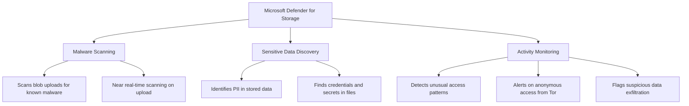

# How to Enable Microsoft Defender for Storage to Detect Malware Uploads and Sensitive Data Exposure

Author: [nawazdhandala](https://www.github.com/nawazdhandala)

Tags: Azure, Microsoft Defender, Storage Security, Malware Detection, Data Loss Prevention, Blob Storage, Security

Description: Learn how to enable and configure Microsoft Defender for Storage to detect malware in blob uploads and identify sensitive data exposure in your Azure storage accounts.

---

Azure Storage accounts are one of the most commonly used services in any Azure environment, and they are also a frequent attack target. Users upload files that might contain malware, developers accidentally store sensitive data in publicly accessible containers, and misconfigured access controls expose data to the internet. Microsoft Defender for Storage addresses these risks with built-in malware scanning, sensitive data discovery, and activity monitoring.

This guide covers how to enable Defender for Storage, configure its features, and respond to the alerts it generates.

## What Defender for Storage Protects Against

Defender for Storage provides three main capabilities:



**Malware Scanning** uses Microsoft Defender Antivirus to scan blobs as they are uploaded. This catches viruses, trojans, and other malicious content before it can spread.

**Sensitive Data Discovery** scans your storage for personally identifiable information (PII), credentials, and other sensitive data types. This is essentially data loss prevention for storage.

**Activity Monitoring** analyzes access patterns and alerts on suspicious behavior like anonymous access from Tor exit nodes, access from unusual locations, or potential data exfiltration.

## Prerequisites

You need:

- Azure subscription
- Owner or Contributor role on the subscription or storage account
- Microsoft Defender for Cloud enabled (Defender for Storage is a plan within Defender for Cloud)

## Step 1: Enable Defender for Storage at the Subscription Level

The easiest way to protect all storage accounts is to enable the plan at the subscription level:

### Via the Azure Portal

1. Navigate to Microsoft Defender for Cloud in the Azure portal.
2. Go to Environment settings.
3. Select your subscription.
4. Under Defender plans, find Storage.
5. Toggle it to On.
6. Click on Settings to configure the plan details.
7. Under Malware scanning, enable it and set a monthly cap for scanning costs (per storage account).
8. Under Sensitive data discovery, enable it.
9. Click Continue, then Save.

### Via Azure CLI

```bash
# Enable Defender for Storage on a subscription
# This protects all storage accounts in the subscription
az security pricing create \
    --name StorageAccounts \
    --tier Standard \
    --subscription YOUR_SUBSCRIPTION_ID

# Configure malware scanning settings
# Set a monthly cap to control scanning costs (in GB)
az security pricing create \
    --name StorageAccounts \
    --tier Standard \
    --subscription YOUR_SUBSCRIPTION_ID \
    --extensions '[
        {
            "name": "OnUploadMalwareScanning",
            "isEnabled": "True",
            "additionalExtensionProperties": {
                "CapGBPerMonthPerStorageAccount": "5000"
            }
        },
        {
            "name": "SensitiveDataDiscovery",
            "isEnabled": "True"
        }
    ]'
```

### Via PowerShell

```powershell
# Enable Defender for Storage with all features
# Connect to Azure first
Connect-AzAccount

# Enable the Defender for Storage plan
Set-AzSecurityPricing `
    -Name "StorageAccounts" `
    -PricingTier "Standard"

Write-Host "Defender for Storage enabled at the subscription level."
```

## Step 2: Enable on Individual Storage Accounts

If you prefer to enable Defender for Storage on specific storage accounts only (perhaps just production accounts), you can do that at the resource level:

```powershell
# Enable Defender for Storage on a specific storage account
$storageAccountResourceId = "/subscriptions/SUB_ID/resourceGroups/myRG/providers/Microsoft.Storage/storageAccounts/mystorageaccount"

# Enable the plan on the specific resource
$uri = "https://management.azure.com$storageAccountResourceId/providers/Microsoft.Security/defenderForStorageSettings/current?api-version=2022-12-01-preview"

$body = @{
    properties = @{
        isEnabled = $true
        malwareScanning = @{
            onUpload = @{
                isEnabled = $true
                capGBPerMonth = 5000  # Monthly scanning cap in GB
            }
        }
        sensitiveDataDiscovery = @{
            isEnabled = $true
        }
        overrideSubscriptionLevelSettings = $true
    }
} | ConvertTo-Json -Depth 5

$token = (Get-AzAccessToken -ResourceUrl "https://management.azure.com").Token
$headers = @{
    Authorization = "Bearer $token"
    "Content-Type" = "application/json"
}

Invoke-RestMethod -Uri $uri -Method PUT -Headers $headers -Body $body
Write-Host "Defender for Storage enabled on the specific storage account."
```

## Step 3: Configure Malware Scanning Response

When malware is detected, you want to automatically respond. Defender for Storage publishes scan results as blob index tags and can trigger Event Grid events that you can use for automation.

### Understanding Scan Results

After a blob is scanned, the following index tags are added:

- `Malware Scanning scan result`: "Malicious" or "No threats found"
- `Malware Scanning scan time`: The timestamp of the scan
- `Malware type`: The type of malware detected (if any)

You can query these tags to find malicious files:

```powershell
# Find all blobs tagged as malicious in a container
$context = New-AzStorageContext -StorageAccountName "mystorageaccount" -StorageAccountKey "YOUR_KEY"

# List blobs with the malicious tag
$maliciousBlobs = Get-AzStorageBlob `
    -Container "uploads" `
    -Context $context `
    -TagCondition """""Malware Scanning scan result"""" = 'Malicious'"

foreach ($blob in $maliciousBlobs) {
    Write-Host "Malicious file found: $($blob.Name)"
    Write-Host "  Last modified: $($blob.LastModified)"
}
```

### Automated Quarantine with Event Grid

Set up an Azure Function that automatically moves malicious files to a quarantine container:

```powershell
# This is the Azure Function code that handles malware scan events
# Triggered by Event Grid when Defender for Storage completes a scan

param($eventGridEvent, $TriggerMetadata)

# Parse the scan result from the event
$scanResult = $eventGridEvent.data.scanResultType
$blobUrl = $eventGridEvent.data.blobUri
$containerName = ($blobUrl -split '/')[3]
$blobName = ($blobUrl -split "/$containerName/")[1]

Write-Host "Scan completed for: $blobName - Result: $scanResult"

if ($scanResult -eq "Malicious") {
    Write-Host "MALWARE DETECTED in $blobName - Moving to quarantine."

    # Move the blob to a quarantine container
    $storageAccount = "mystorageaccount"
    $context = New-AzStorageContext -StorageAccountName $storageAccount

    # Copy to quarantine
    Start-AzStorageBlobCopy `
        -SrcContainer $containerName `
        -SrcBlob $blobName `
        -DestContainer "quarantine" `
        -DestBlob $blobName `
        -Context $context `
        -Force

    # Delete the original
    Remove-AzStorageBlob `
        -Container $containerName `
        -Blob $blobName `
        -Context $context `
        -Force

    Write-Host "Malicious blob quarantined and original deleted."
}
```

## Step 4: Review Sensitive Data Discovery Results

Sensitive data discovery runs periodically and reports findings through Defender for Cloud:

1. Go to Microsoft Defender for Cloud.
2. Click on Inventory or Recommendations.
3. Look for alerts related to sensitive data in storage.
4. The findings include the type of sensitive data found (e.g., credit card numbers, social security numbers, passwords) and the specific containers and blobs affected.

Common sensitive data types detected:

- Credit card numbers
- Social security numbers
- Passwords and API keys in configuration files
- Email addresses and phone numbers
- Medical record numbers
- Passport numbers

When sensitive data is found, you should:

1. Verify whether the data should be there.
2. If not, move or delete it.
3. If it should be there, ensure the storage account has proper access controls (no public access, encryption enabled, proper RBAC).
4. Consider enabling customer-managed keys for encryption at rest.

## Step 5: Monitor Activity Alerts

Defender for Storage generates activity alerts for suspicious behavior. Common alert types include:

- **Access from a Tor exit node**: Someone accessed the storage account through the Tor anonymity network.
- **Access from an unusual location**: Access from a geography that has not been seen before.
- **Unusual amount of data extracted**: A large volume of data was downloaded in a short period.
- **Unusual anonymous access**: Public containers being accessed in patterns that suggest reconnaissance.
- **Access from an unusual application**: Access from a client that has not been seen before.

Review these alerts in Defender for Cloud under Security alerts:

```kusto
// Query storage security alerts in Sentinel
// This helps you track and investigate storage-related threats
SecurityAlert
| where TimeGenerated > ago(7d)
| where ProductName == "Azure Defender for Storage"
| project
    TimeGenerated,
    AlertName,
    Description,
    Severity,
    StorageAccount = tostring(parse_json(ExtendedProperties).["Storage account name"]),
    AttackerIP = tostring(parse_json(ExtendedProperties).["Client IP address"]),
    Status
| sort by TimeGenerated desc
```

## Step 6: Configure Cost Management

Malware scanning costs are based on the volume of data scanned. To control costs:

1. Set a monthly cap per storage account (the `capGBPerMonth` setting). When the cap is reached, scanning pauses until the next month.
2. Focus protection on storage accounts that accept external uploads or user-generated content.
3. Skip internal-only storage accounts that contain known-safe data like backups and logs.
4. Monitor scanning volume in the Defender for Cloud cost analysis.

## Best Practices

From working with Defender for Storage in production environments, here are the key practices:

Enable malware scanning on any storage account that accepts uploads from users or external systems. This is your first line of defense against malicious content.

Set up automated quarantine. Do not rely on manual review of malware alerts. By the time someone sees the alert, the malicious file may have already been downloaded by other users.

Use blob index tags to track scan status. Applications can check the scan result tag before serving content to users, adding an extra layer of protection.

Regularly review sensitive data discovery findings. Developers often store test data with real PII, or configuration files containing secrets end up in storage. Catching these early prevents data breaches.

Combine Defender for Storage with network controls. Use private endpoints and firewall rules to restrict who can access storage accounts in the first place. Defender for Storage is a detective control; network restrictions are a preventive control.

## Conclusion

Microsoft Defender for Storage adds essential security capabilities to Azure Storage accounts that are not available through standard configuration. Malware scanning catches threats at upload time, sensitive data discovery identifies data that should not be exposed, and activity monitoring alerts you to suspicious access patterns. Enable it at the subscription level for comprehensive coverage, set up automated responses for malware detection, and regularly review the findings. In a world where storage accounts are frequent targets for both external attackers and accidental data exposure, these protections are well worth the investment.
