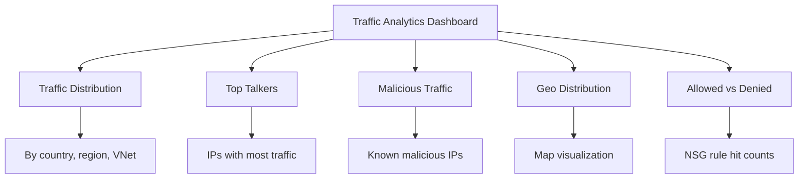

# How to Enable Network Watcher Flow Logs for Network Security Groups

Author: [nawazdhandala](https://www.github.com/nawazdhandala)

Tags: Azure, Network Watcher, Flow Logs, NSG, Network Monitoring, Traffic Analysis, Azure Networking

Description: Step-by-step instructions for enabling NSG flow logs with Azure Network Watcher to monitor and analyze network traffic patterns.

---

When something goes wrong with network connectivity in Azure, the first question is usually "what traffic is actually flowing?" NSG flow logs answer this question by recording information about IP traffic flowing through your Network Security Groups. Every connection attempt - whether allowed or denied - gets logged with source and destination IPs, ports, protocol, and the action taken.

These logs are essential for security auditing, compliance, traffic analysis, and troubleshooting. Azure Network Watcher manages the flow log collection and stores the data in a storage account. You can then analyze the logs directly, feed them into Azure Traffic Analytics for visual insights, or export them to a SIEM for security monitoring.

## What NSG Flow Logs Capture

Each flow log entry contains:

- Timestamp
- Source and destination IP addresses
- Source and destination ports
- Protocol (TCP, UDP, ICMP)
- Traffic direction (inbound or outbound)
- NSG rule that was applied
- Action (allow or deny)
- Byte and packet counts (Version 2 only)
- Flow state (begin, continuing, end) (Version 2 only)

Version 2 flow logs provide significantly more detail than Version 1, including byte counts and flow state information. Always use Version 2.

## Prerequisites

- An Azure subscription
- A virtual network with NSGs attached to subnets or NICs
- Azure CLI installed
- A storage account for storing flow logs

## Step 1: Ensure Network Watcher Is Enabled

Network Watcher is automatically enabled for each Azure region when you create or update a virtual network. Verify it exists.

```bash
# List Network Watcher instances
az network watcher list --output table
```

If Network Watcher is not enabled for your region, enable it:

```bash
# Enable Network Watcher for a specific region
az network watcher configure \
  --resource-group NetworkWatcherRG \
  --locations eastus \
  --enabled true
```

## Step 2: Create a Storage Account for Flow Logs

Flow logs are stored as JSON files in a blob storage account. Create one if you do not have one already.

```bash
# Create a resource group
az group create --name rg-flowlogs-demo --location eastus

# Create a storage account for flow logs
az storage account create \
  --resource-group rg-flowlogs-demo \
  --name stflowlogsdemo2026 \
  --location eastus \
  --sku Standard_LRS \
  --kind StorageV2
```

The storage account must be in the same region as the NSG you want to monitor. Flow logs from a NSG in East US cannot be stored in a West US storage account.

## Step 3: Create an NSG (If You Do Not Have One)

For this demo, let us create a VNet, subnet, and NSG.

```bash
# Create a VNet
az network vnet create \
  --resource-group rg-flowlogs-demo \
  --name vnet-demo \
  --location eastus \
  --address-prefixes 10.0.0.0/16 \
  --subnet-name subnet-web \
  --subnet-prefixes 10.0.0.0/24

# Create an NSG
az network nsg create \
  --resource-group rg-flowlogs-demo \
  --name nsg-web \
  --location eastus

# Add a rule to the NSG
az network nsg rule create \
  --resource-group rg-flowlogs-demo \
  --nsg-name nsg-web \
  --name AllowHTTP \
  --priority 100 \
  --direction Inbound \
  --access Allow \
  --protocol Tcp \
  --source-address-prefixes '*' \
  --destination-port-ranges 80

# Associate the NSG with the subnet
az network vnet subnet update \
  --resource-group rg-flowlogs-demo \
  --vnet-name vnet-demo \
  --name subnet-web \
  --network-security-group nsg-web
```

## Step 4: Enable NSG Flow Logs

Now enable flow logs on the NSG. We will use Version 2 for the additional byte count and flow state data.

```bash
# Get the NSG resource ID
NSG_ID=$(az network nsg show \
  --resource-group rg-flowlogs-demo \
  --name nsg-web \
  --query id --output tsv)

# Enable NSG flow logs (Version 2)
az network watcher flow-log create \
  --resource-group rg-flowlogs-demo \
  --name flowlog-nsg-web \
  --nsg $NSG_ID \
  --storage-account stflowlogsdemo2026 \
  --enabled true \
  --format JSON \
  --log-version 2 \
  --retention 30 \
  --location eastus
```

The `--retention 30` flag keeps logs for 30 days. Adjust this based on your compliance and cost requirements. Setting it to 0 means logs are kept forever (or until you delete them manually).

## Step 5: Enable Traffic Analytics (Optional but Recommended)

Traffic Analytics processes flow logs and provides visual dashboards in the Azure portal showing traffic patterns, top talkers, security threats, and more.

```bash
# Create a Log Analytics workspace (required for Traffic Analytics)
az monitor log-analytics workspace create \
  --resource-group rg-flowlogs-demo \
  --workspace-name law-traffic-analytics \
  --location eastus

# Get the workspace ID
WORKSPACE_ID=$(az monitor log-analytics workspace show \
  --resource-group rg-flowlogs-demo \
  --workspace-name law-traffic-analytics \
  --query id --output tsv)

# Update flow logs to enable Traffic Analytics
az network watcher flow-log update \
  --resource-group rg-flowlogs-demo \
  --name flowlog-nsg-web \
  --enabled true \
  --traffic-analytics true \
  --workspace $WORKSPACE_ID \
  --interval 10 \
  --location eastus
```

The `--interval 10` sets the Traffic Analytics processing interval to 10 minutes. The other option is 60 minutes. A shorter interval gives you faster insights but costs more.

## Step 6: Verify Flow Logs Are Working

Check the flow log status.

```bash
# Show flow log configuration
az network watcher flow-log show \
  --resource-group rg-flowlogs-demo \
  --name flowlog-nsg-web \
  --location eastus
```

After a few minutes of traffic flowing through the NSG, check the storage account for flow log files.

```bash
# List blobs in the flow log container
az storage blob list \
  --account-name stflowlogsdemo2026 \
  --container-name insights-logs-networksecuritygroupflowevent \
  --output table
```

## Understanding Flow Log Format

Flow log files are JSON with a nested structure. Here is what a Version 2 entry looks like:

```json
{
  "time": "2026-02-16T10:30:00.0000000Z",
  "systemId": "abc123",
  "macAddress": "00224820XXXX",
  "category": "NetworkSecurityGroupFlowEvent",
  "resourceId": "/subscriptions/.../nsg-web",
  "operationName": "NetworkSecurityGroupFlowEvents",
  "properties": {
    "Version": 2,
    "flows": [
      {
        "rule": "AllowHTTP",
        "flows": [
          {
            "mac": "00224820XXXX",
            "flowTuples": [
              "1708080600,203.0.113.50,10.0.0.4,54321,80,T,I,A,B,,,,",
              "1708080660,203.0.113.50,10.0.0.4,54321,80,T,I,A,C,128,2,256,4"
            ]
          }
        ]
      }
    ]
  }
}
```

The flow tuple fields are:
- Timestamp, Source IP, Destination IP, Source Port, Destination Port
- Protocol (T=TCP, U=UDP)
- Direction (I=Inbound, O=Outbound)
- Action (A=Allow, D=Deny)
- Flow State (B=Begin, C=Continuing, E=End)
- Packets (source to destination)
- Bytes (source to destination)
- Packets (destination to source)
- Bytes (destination to source)

## Analyzing Flow Logs with Traffic Analytics

Once Traffic Analytics is processing your flow logs, navigate to the Network Watcher section in the Azure portal and click "Traffic Analytics." You will see dashboards showing:



Traffic Analytics is particularly valuable for identifying:

- Unexpected traffic patterns that might indicate a security breach
- Overly permissive NSG rules that allow traffic that should be blocked
- Network bottlenecks where specific hosts generate disproportionate traffic
- Geographic anomalies where traffic comes from unexpected regions

## Cost Considerations

NSG flow logs have costs in several areas:

- **Storage costs** for the flow log files in blob storage
- **Log Analytics ingestion** costs if using Traffic Analytics
- **Traffic Analytics processing** charges

For cost optimization:

- Use retention policies to automatically delete old flow logs
- Choose the 60-minute Traffic Analytics interval if near real-time insights are not required
- Only enable flow logs on NSGs that matter (not every NSG needs them)

## Cleanup

```bash
# Delete the resource group
az group delete --name rg-flowlogs-demo --yes --no-wait
```

## Wrapping Up

NSG flow logs are one of the most important monitoring tools in Azure networking. They give you visibility into every connection attempt through your NSGs, whether it was allowed or denied. Enable Version 2 for the byte counts and flow state data, and pair them with Traffic Analytics for visual dashboards and security insights. The setup takes only a few commands, but the visibility you gain is invaluable for troubleshooting, security auditing, and understanding your network traffic patterns.
