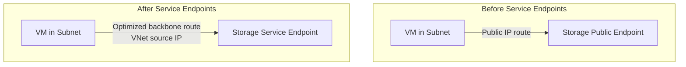

# How to Enable Service Endpoints for Azure Storage on a Virtual Network Subnet

Author: [nawazdhandala](https://www.github.com/nawazdhandala)

Tags: Azure, Service Endpoints, Azure Storage, Virtual Network, Network Security, Cloud Networking

Description: Learn how to enable Azure service endpoints for Storage on a VNet subnet to secure traffic and restrict access to your storage accounts.

---

By default, when a virtual machine in Azure accesses a storage account, the traffic goes out to the public endpoint of the storage service. Even though this traffic stays within Azure's network, it uses the storage account's public IP address. This means your storage account is technically accessible from the internet, and you rely entirely on access keys and Azure AD for security.

Service endpoints change this equation. When you enable a service endpoint for Azure Storage on a subnet, traffic from that subnet to the storage service takes an optimized route over the Azure backbone and presents the VM's private VNet IP to the storage service. This lets you lock down the storage account to accept traffic only from specific subnets, effectively removing public internet access.

## Why Service Endpoints Matter

There are three main reasons to enable service endpoints:

1. **Better security posture.** You can configure the storage account to reject all traffic except from specific VNet subnets. This means even if someone gets your storage account key, they cannot access the data unless they are on an approved network.

2. **Optimal routing.** Traffic takes the most direct path over the Azure backbone rather than going through the internet edge. This typically results in lower latency.

3. **Simpler than private endpoints.** Service endpoints are free and quick to set up. Private endpoints offer even more isolation but come with additional complexity and cost. For many scenarios, service endpoints are the sweet spot.

## Prerequisites

- An Azure subscription
- A virtual network with at least one subnet
- A storage account you want to secure
- Azure CLI installed and configured

## Step 1: Create the Networking Resources

If you already have a VNet and storage account, skip to Step 2. Otherwise, let us set things up.

```bash
# Create a resource group
az group create --name rg-service-endpoints-demo --location eastus

# Create a virtual network with a subnet
az network vnet create \
  --resource-group rg-service-endpoints-demo \
  --name vnet-demo \
  --location eastus \
  --address-prefixes 10.0.0.0/16 \
  --subnet-name subnet-apps \
  --subnet-prefixes 10.0.0.0/24

# Create a storage account
az storage account create \
  --resource-group rg-service-endpoints-demo \
  --name stserviceendpointdemo \
  --location eastus \
  --sku Standard_LRS \
  --kind StorageV2
```

## Step 2: Enable the Service Endpoint on the Subnet

This is where you tell the subnet to create a direct route to the Azure Storage service.

```bash
# Enable the Microsoft.Storage service endpoint on the subnet
az network vnet subnet update \
  --resource-group rg-service-endpoints-demo \
  --vnet-name vnet-demo \
  --name subnet-apps \
  --service-endpoints Microsoft.Storage
```

After this command completes, VMs in `subnet-apps` will route storage traffic over the Azure backbone and present their VNet identity to the storage service. Note that enabling a service endpoint can cause a brief connectivity interruption for VMs in the subnet (usually a few seconds), so plan accordingly for production workloads.

## Step 3: Configure the Storage Account Network Rules

Enabling the service endpoint on the subnet is only half the story. You also need to configure the storage account to accept traffic from that subnet and deny everything else.

```bash
# Set the default action to Deny (block all traffic by default)
az storage account update \
  --resource-group rg-service-endpoints-demo \
  --name stserviceendpointdemo \
  --default-action Deny

# Add a network rule to allow traffic from the specific subnet
az storage account network-rule add \
  --resource-group rg-service-endpoints-demo \
  --account-name stserviceendpointdemo \
  --vnet-name vnet-demo \
  --subnet subnet-apps
```

The first command changes the default action from "Allow" to "Deny." This means no one can reach the storage account unless they are explicitly permitted. The second command adds the subnet as an allowed source.

## Step 4: Verify the Configuration

Check that everything is configured correctly.

```bash
# Check the service endpoints on the subnet
az network vnet subnet show \
  --resource-group rg-service-endpoints-demo \
  --vnet-name vnet-demo \
  --name subnet-apps \
  --query serviceEndpoints \
  --output table

# Check the network rules on the storage account
az storage account network-rule list \
  --resource-group rg-service-endpoints-demo \
  --account-name stserviceendpointdemo \
  --output table
```

The first command should show `Microsoft.Storage` with a provisioning state of `Succeeded`. The second command should list your subnet as an allowed virtual network rule.

## Step 5: Allow Azure Portal and Trusted Services

When you set the default action to Deny, you might lock yourself out of the storage account in the Azure Portal. You should add exceptions for trusted Microsoft services and optionally your own IP address.

```bash
# Allow trusted Microsoft services to access the storage account
az storage account update \
  --resource-group rg-service-endpoints-demo \
  --name stserviceendpointdemo \
  --bypass AzureServices Logging Metrics

# Optionally, add your own IP for portal access
az storage account network-rule add \
  --resource-group rg-service-endpoints-demo \
  --account-name stserviceendpointdemo \
  --ip-address 203.0.113.50
```

The `--bypass AzureServices` exception is important. Without it, Azure services like Azure Backup, Azure Monitor, and diagnostic logging cannot access the storage account.

## Understanding the Traffic Flow

Here is what happens before and after enabling service endpoints:



Before service endpoints, the VM's traffic exits to the storage public endpoint and the source IP seen by storage is the VM's public IP (or NAT IP). After enabling service endpoints, the traffic takes an optimized backbone route and the source IP is the VM's private VNet IP. This is what makes the VNet-based access rules possible.

## Multiple Service Endpoints

You can enable multiple service endpoints on the same subnet. Common ones include:

- `Microsoft.Storage` - Azure Storage (Blob, File, Queue, Table)
- `Microsoft.Sql` - Azure SQL Database
- `Microsoft.KeyVault` - Azure Key Vault
- `Microsoft.EventHub` - Azure Event Hubs
- `Microsoft.ServiceBus` - Azure Service Bus
- `Microsoft.AzureCosmosDB` - Cosmos DB

```bash
# Enable multiple service endpoints at once
az network vnet subnet update \
  --resource-group rg-service-endpoints-demo \
  --vnet-name vnet-demo \
  --name subnet-apps \
  --service-endpoints Microsoft.Storage Microsoft.Sql Microsoft.KeyVault
```

## Service Endpoints vs. Private Endpoints

A common question is when to use service endpoints versus private endpoints. Here is the short version:

**Service endpoints** are free, easy to configure, and provide network-level access restrictions. Traffic still goes to the service's public IP, but via an optimized route. The service sees the VNet source IP.

**Private endpoints** assign a private IP address from your VNet to the service. Traffic stays entirely within your VNet and never touches a public IP. They cost money (per hour plus data processing charges) and require DNS configuration.

For most scenarios where you just need to restrict access to specific VNets, service endpoints are the simpler and more cost-effective choice. Use private endpoints when you need to access Azure services from on-premises networks over VPN/ExpressRoute, or when compliance requirements demand that traffic never touches a public endpoint.

## Troubleshooting

If VMs in the subnet cannot reach the storage account after configuration:

- Verify the service endpoint is provisioned (state should be `Succeeded`)
- Check that the VNet rule on the storage account references the correct subnet
- Make sure the default action is not still set to `Allow` (in which case VNet rules are ignored)
- Check NSG rules on the subnet - they need to allow outbound traffic to the `Storage` service tag

## Cleanup

```bash
# Remove all demo resources
az group delete --name rg-service-endpoints-demo --yes --no-wait
```

## Wrapping Up

Enabling service endpoints for Azure Storage is one of the quickest wins you can get for improving your network security posture. It takes two commands - enable the endpoint on the subnet and add the network rule on the storage account - and you immediately reduce the attack surface of your storage resources. Combine this with the deny-by-default approach on the storage account, and you have a solid baseline for securing data at rest and in transit.
