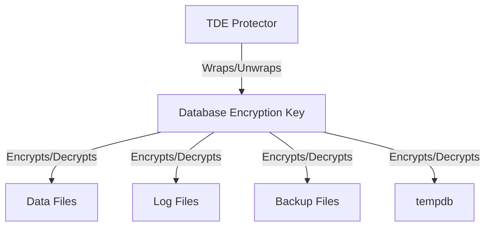

# How to Enable Transparent Data Encryption (TDE) in Azure SQL Database

Author: [nawazdhandala](https://www.github.com/nawazdhandala)

Tags: Azure SQL, TDE, Encryption, Security, Azure Key Vault, Database, Compliance

Description: Learn how to enable and configure Transparent Data Encryption in Azure SQL Database using service-managed keys or your own keys from Azure Key Vault.

---

Transparent Data Encryption, commonly called TDE, encrypts your Azure SQL Database data at rest. This means the physical files on disk - the data files, log files, and backup files - are encrypted. If someone gains access to the underlying storage or steals a backup, they cannot read the data without the encryption key.

The good news is that TDE is enabled by default on all new Azure SQL databases. But understanding how it works, how to manage the keys, and when to use customer-managed keys is important for security and compliance.

## How TDE Works

TDE performs real-time encryption and decryption of data at the page level. When data is written to disk, it gets encrypted. When data is read from disk into memory, it gets decrypted. This happens transparently to your application - no code changes are needed, and query performance impact is minimal (typically 3-5%).

The encryption hierarchy works like this:

1. **Database Encryption Key (DEK)**: A symmetric key that actually encrypts and decrypts the data. Each database has its own DEK.
2. **TDE Protector**: Protects (wraps) the DEK. This is either a service-managed certificate or a customer-managed key in Azure Key Vault.



When the database starts, Azure unwraps the DEK using the TDE Protector, and the unwrapped DEK is held in memory for the life of the database process. If the TDE Protector becomes unavailable (e.g., a Key Vault key is deleted), the database becomes inaccessible.

## Service-Managed Keys vs Customer-Managed Keys

**Service-Managed Keys (default)**: Azure manages the TDE Protector certificate for you. It is automatically rotated and stored securely within Azure infrastructure. You do not have to manage anything. This is the simplest option and works well for most teams.

**Customer-Managed Keys (BYOK)**: You create and manage the TDE Protector key in Azure Key Vault. This gives you full control over the key lifecycle - you decide when to rotate it, and you can revoke it to make the database inaccessible. This is required for some compliance frameworks and gives you the ability to "shred" data by deleting the key.

## Verifying TDE Status

Since TDE is enabled by default, let us first check the current status.

### Via Azure Portal

1. Navigate to your database in the Azure Portal.
2. In the left menu under "Security", click "Transparent data encryption".
3. You will see whether TDE is enabled and which key type is being used (service-managed or customer-managed).

### Via T-SQL

```sql
-- Check TDE status for the current database
SELECT
    db.name AS DatabaseName,
    dek.encryption_state,
    dek.key_algorithm,
    dek.key_length,
    CASE dek.encryption_state
        WHEN 0 THEN 'No encryption key present'
        WHEN 1 THEN 'Unencrypted'
        WHEN 2 THEN 'Encryption in progress'
        WHEN 3 THEN 'Encrypted'
        WHEN 4 THEN 'Key change in progress'
        WHEN 5 THEN 'Decryption in progress'
        WHEN 6 THEN 'Protection change in progress'
    END AS encryption_state_desc
FROM sys.dm_database_encryption_keys dek
JOIN sys.databases db ON dek.database_id = db.database_id;
```

### Via Azure CLI

```bash
# Check TDE status for a database
az sql db tde show \
    --resource-group myResourceGroup \
    --server myserver \
    --database mydb
```

## Enabling TDE with Service-Managed Keys

If TDE is somehow disabled (which would only happen if it was explicitly turned off), you can re-enable it.

### Via Azure Portal

1. Go to your database's "Transparent data encryption" page.
2. Toggle "Data encryption" to ON.
3. Select "Service-managed key" as the key type.
4. Click "Save".

### Via Azure CLI

```bash
# Enable TDE with service-managed key
az sql db tde set \
    --resource-group myResourceGroup \
    --server myserver \
    --database mydb \
    --status Enabled
```

### Via PowerShell

```powershell
# Enable TDE with service-managed key
Set-AzSqlDatabaseTransparentDataEncryption `
    -ResourceGroupName "myResourceGroup" `
    -ServerName "myserver" `
    -DatabaseName "mydb" `
    -State Enabled
```

## Setting Up Customer-Managed Keys (BYOK)

This is the more involved configuration but gives you full control over the encryption key.

### Step 1: Create an Azure Key Vault

If you do not already have a Key Vault:

```bash
# Create a Key Vault for storing the TDE protector
az keyvault create \
    --resource-group myResourceGroup \
    --name mykeyvault \
    --location eastus \
    --enable-soft-delete true \
    --enable-purge-protection true
```

Important: Enable soft-delete and purge protection. If the key is accidentally deleted without these protections, you will permanently lose access to your database.

### Step 2: Create a Key

```bash
# Create an RSA key in the Key Vault for TDE
az keyvault key create \
    --vault-name mykeyvault \
    --name tde-protector-key \
    --kty RSA \
    --size 2048
```

### Step 3: Grant the SQL Server Access to Key Vault

The SQL server needs a managed identity to access the Key Vault.

```bash
# Assign a system-managed identity to the SQL server
az sql server update \
    --resource-group myResourceGroup \
    --name myserver \
    --assign-identity

# Get the server's principal ID
SERVER_PRINCIPAL_ID=$(az sql server show \
    --resource-group myResourceGroup \
    --name myserver \
    --query identity.principalId \
    --output tsv)

# Grant the server access to the Key Vault keys
az keyvault set-policy \
    --name mykeyvault \
    --object-id $SERVER_PRINCIPAL_ID \
    --key-permissions get unwrapKey wrapKey
```

### Step 4: Set the TDE Protector to the Customer-Managed Key

```bash
# Get the key URI
KEY_URI=$(az keyvault key show \
    --vault-name mykeyvault \
    --name tde-protector-key \
    --query key.kid \
    --output tsv)

# Add the key to the SQL server
az sql server key create \
    --resource-group myResourceGroup \
    --server myserver \
    --kid $KEY_URI

# Set the key as the TDE protector
az sql server tde-key set \
    --resource-group myResourceGroup \
    --server myserver \
    --server-key-type AzureKeyVault \
    --kid $KEY_URI
```

### Step 5: Verify the Configuration

```bash
# Verify the TDE protector
az sql server tde-key show \
    --resource-group myResourceGroup \
    --server myserver
```

## Key Rotation

Regularly rotating encryption keys is a security best practice and a requirement for many compliance standards.

### Rotating Service-Managed Keys

Azure automatically rotates service-managed keys. You do not need to do anything.

### Rotating Customer-Managed Keys

Create a new version of the key in Key Vault:

```bash
# Create a new version of the TDE protector key
az keyvault key create \
    --vault-name mykeyvault \
    --name tde-protector-key \
    --kty RSA \
    --size 2048

# Get the new key URI (it includes the version)
NEW_KEY_URI=$(az keyvault key show \
    --vault-name mykeyvault \
    --name tde-protector-key \
    --query key.kid \
    --output tsv)

# Update the SQL server's TDE protector
az sql server key create \
    --resource-group myResourceGroup \
    --server myserver \
    --kid $NEW_KEY_URI

az sql server tde-key set \
    --resource-group myResourceGroup \
    --server myserver \
    --server-key-type AzureKeyVault \
    --kid $NEW_KEY_URI
```

After rotation, the old key version is still needed to decrypt existing backups. Do not delete old key versions until all backups encrypted with them have expired.

## Revoking Access (Emergency Key Revocation)

If you suspect a breach, you can revoke the SQL server's access to the Key Vault key, making the database inaccessible:

```bash
# Remove the SQL server's Key Vault access policy
az keyvault delete-policy \
    --name mykeyvault \
    --object-id $SERVER_PRINCIPAL_ID
```

After revoking access, the database becomes inaccessible within approximately 10 minutes. All connections fail. To restore access, re-grant the Key Vault permissions.

This is a powerful but dangerous operation. Only use it when you are certain the data needs to be made inaccessible immediately.

## What TDE Does Not Protect

It is important to understand the boundaries of TDE:

- **Data in transit**: TDE only covers data at rest. Use TLS/SSL for data in transit (enabled by default in Azure SQL).
- **Data in memory**: Unencrypted data is held in memory during query processing. TDE does not encrypt RAM.
- **Query results**: Data returned to the client is not encrypted by TDE. Use Always Encrypted if you need client-side encryption.
- **Column-level access**: TDE encrypts everything at the page level. It does not provide column-level encryption or access control.

## Performance Impact

TDE's performance impact is generally 3-5% on most workloads. The encryption and decryption happen at the I/O level, so workloads that are CPU-bound rather than I/O-bound will see less impact.

The impact is slightly higher during:
- Full database scans (more pages to decrypt)
- Backup and restore operations
- Tempdb-heavy operations (tempdb is also encrypted when TDE is enabled)

For most production workloads, this overhead is acceptable and well worth the security benefit.

## Compliance Considerations

TDE helps meet requirements for several compliance standards:

- **PCI DSS**: Requires encryption of cardholder data at rest
- **HIPAA**: Requires protection of electronic health information
- **GDPR**: Requires appropriate technical measures to protect personal data
- **SOC 2**: Requires controls for data protection

Customer-managed keys provide additional compliance value because they demonstrate that the organization, not the cloud provider, controls the encryption keys.

## Summary

TDE in Azure SQL Database encrypts your data at rest with minimal performance impact and zero application changes. Service-managed keys work well for most scenarios and require no key management effort. Customer-managed keys in Azure Key Vault give you full control over the key lifecycle and meet stricter compliance requirements. Always enable soft-delete and purge protection on your Key Vault, rotate keys regularly, and understand that TDE protects data at rest but not data in memory or in transit.
