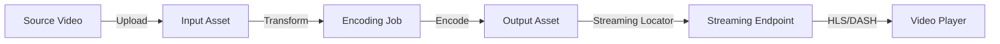
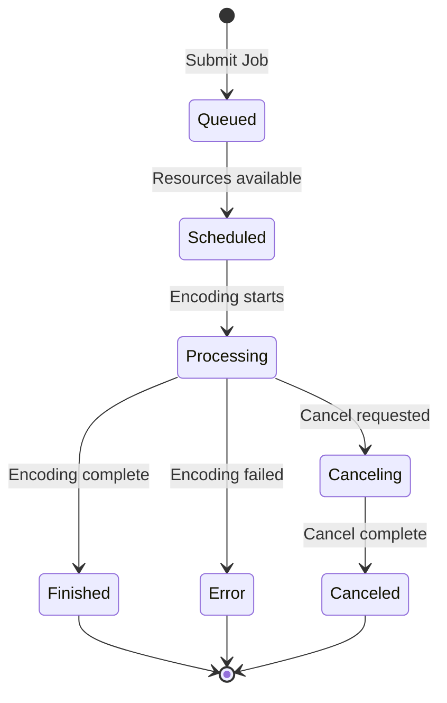

# How to Encode Video Files with Custom Presets Using Azure Media Services Encoding Jobs

Author: [nawazdhandala](https://www.github.com/nawazdhandala)

Tags: Azure Media Services, Video Encoding, Transcoding, Custom Presets, Adaptive Bitrate, Media Processing, Video Streaming

Description: Learn how to encode video files with custom presets using Azure Media Services encoding jobs for adaptive bitrate streaming and optimized delivery.

---

Raw video files from cameras, screen recordings, and editing software are rarely in the right format for streaming to end users. They are too large, use the wrong codec, or exist as a single bitrate that either looks terrible on fast connections or buffers constantly on slow ones. Video encoding (also called transcoding) converts source files into optimized formats for streaming. Azure Media Services provides a cloud-based encoding engine that takes your source video and produces multiple bitrate renditions packaged for adaptive bitrate streaming over HLS and DASH.

While Azure provides built-in encoding presets that work for most cases, custom presets give you precise control over resolution, bitrate, codec settings, audio channels, and output formats. This guide covers creating encoding jobs with both built-in and custom presets.

## Understanding Encoding in Azure Media Services

The encoding pipeline in Azure Media Services follows a straightforward flow:



Key concepts:

- **Asset** - A container in Azure Storage that holds media files
- **Transform** - A recipe that defines encoding settings (like a template)
- **Job** - A specific encoding task that applies a Transform to an Input Asset and produces an Output Asset
- **Streaming Locator** - Generates URLs for playing the encoded content

## Prerequisites

You need an Azure Media Services account with a running streaming endpoint.

```bash
# Create a Media Services account
az ams account create \
  --name my-media-services \
  --resource-group media-rg \
  --location eastus \
  --storage-account mediastorage
```

Install the SDK for programmatic access.

```bash
# Python SDK
pip install azure-mgmt-media azure-identity azure-storage-blob
```

## Step 1: Upload a Source Video

First, create an input asset and upload your source video file.

```python
# upload_video.py - Upload a source video to an input asset
from azure.identity import DefaultAzureCredential
from azure.mgmt.media import AzureMediaServices
from azure.mgmt.media.models import Asset
from azure.storage.blob import BlobServiceClient

# Configuration
subscription_id = "your-subscription-id"
resource_group = "media-rg"
account_name = "my-media-services"

credential = DefaultAzureCredential()
client = AzureMediaServices(credential, subscription_id)

def create_input_asset(asset_name: str, video_file_path: str) -> Asset:
    """Create an input asset and upload the source video."""
    # Create the asset
    asset = client.assets.create_or_update(
        resource_group_name=resource_group,
        account_name=account_name,
        asset_name=asset_name,
        parameters=Asset(description="Source video for encoding")
    )

    # Get a SAS URL for uploading to the asset's storage container
    sas_response = client.assets.list_container_sas(
        resource_group_name=resource_group,
        account_name=account_name,
        asset_name=asset_name,
        parameters={"permissions": "ReadWrite", "expiry_time": "2026-02-17T00:00:00Z"}
    )

    sas_url = sas_response.asset_container_sas_urls[0]

    # Upload the video file using the SAS URL
    blob_service = BlobServiceClient(account_url=sas_url)
    container_name = sas_url.split("/")[-1].split("?")[0]
    container_client = blob_service.get_container_client(container_name)

    # Upload the file
    import os
    blob_name = os.path.basename(video_file_path)
    with open(video_file_path, "rb") as video_file:
        container_client.upload_blob(name=blob_name, data=video_file, overwrite=True)

    print(f"Uploaded {video_file_path} to asset {asset_name}")
    return asset

# Upload a source video
create_input_asset("source-video-001", "/path/to/my-video.mp4")
```

## Step 2: Create a Transform with a Built-In Preset

Transforms define the encoding recipe. Start with a built-in preset for common scenarios.

```python
# create_transform.py - Create an encoding transform
from azure.mgmt.media.models import (
    Transform,
    TransformOutput,
    BuiltInStandardEncoderPreset
)

def create_builtin_transform(transform_name: str, preset_name: str):
    """Create a transform using a built-in preset.

    Common presets:
    - AdaptiveStreaming: Auto-generates adaptive bitrate ladder
    - H265AdaptiveStreaming: Same but with HEVC codec (better compression)
    - ContentAwareEncoding: AI-optimized encoding based on content analysis
    - H264MultipleBitrate720p: Multiple bitrates at 720p max
    """
    transform_output = TransformOutput(
        preset=BuiltInStandardEncoderPreset(
            preset_name=preset_name
        )
    )

    transform = client.transforms.create_or_update(
        resource_group_name=resource_group,
        account_name=account_name,
        transform_name=transform_name,
        parameters=Transform(outputs=[transform_output])
    )

    print(f"Created transform: {transform_name} with preset: {preset_name}")
    return transform

# Create a transform with adaptive streaming preset
create_builtin_transform("adaptive-streaming-transform", "AdaptiveStreaming")
```

The `AdaptiveStreaming` preset automatically generates multiple bitrate renditions based on the input resolution and bitrate. For a 1080p source, it typically produces renditions at 1080p, 720p, 540p, 360p, and 270p with appropriate bitrates for each.

## Step 3: Create a Transform with a Custom Preset

Custom presets give you full control over every encoding parameter. Here is an example that creates specific output renditions.

```python
# custom_preset.py - Create a transform with a custom encoding preset
from azure.mgmt.media.models import (
    Transform,
    TransformOutput,
    StandardEncoderPreset,
    H264Layer,
    H264Video,
    AacAudio,
    Mp4Format,
    PngImage,
    PngLayer,
    PngFormat
)

def create_custom_transform(transform_name: str):
    """Create a transform with a custom encoding preset.

    This preset produces:
    - 1080p at 4500 kbps
    - 720p at 2500 kbps
    - 480p at 1000 kbps
    - 360p at 500 kbps
    - AAC audio at 128 kbps
    - Thumbnail images
    """
    # Define the video encoding layers
    video_codec = H264Video(
        key_frame_interval="PT2S",  # Keyframe every 2 seconds
        layers=[
            H264Layer(
                bitrate=4500000,    # 4500 kbps
                width="1920",
                height="1080",
                label="1080p",
                buffer_window="PT5S",
                b_frames=3,
                profile="High",
                level="4.0"
            ),
            H264Layer(
                bitrate=2500000,    # 2500 kbps
                width="1280",
                height="720",
                label="720p",
                buffer_window="PT5S",
                b_frames=3,
                profile="High",
                level="3.1"
            ),
            H264Layer(
                bitrate=1000000,    # 1000 kbps
                width="854",
                height="480",
                label="480p",
                buffer_window="PT5S",
                b_frames=3,
                profile="Main",
                level="3.0"
            ),
            H264Layer(
                bitrate=500000,     # 500 kbps
                width="640",
                height="360",
                label="360p",
                buffer_window="PT5S",
                b_frames=3,
                profile="Main",
                level="3.0"
            )
        ]
    )

    # Define audio encoding
    audio_codec = AacAudio(
        channels=2,
        sampling_rate=48000,
        bitrate=128000,      # 128 kbps stereo AAC
        profile="AacLc"
    )

    # Define thumbnail generation
    thumbnail_codec = PngImage(
        start="PT0S",        # Start from the beginning
        step="PT10S",        # One thumbnail every 10 seconds
        range="PT1H",        # For up to 1 hour of content
        layers=[
            PngLayer(
                width="320",
                height="180"
            )
        ]
    )

    # Define the output format
    preset = StandardEncoderPreset(
        codecs=[video_codec, audio_codec, thumbnail_codec],
        formats=[
            Mp4Format(
                filename_pattern="Video-{Basename}-{Label}-{Bitrate}{Extension}"
            ),
            PngFormat(
                filename_pattern="Thumbnail-{Basename}-{Index}{Extension}"
            )
        ]
    )

    transform_output = TransformOutput(preset=preset)

    transform = client.transforms.create_or_update(
        resource_group_name=resource_group,
        account_name=account_name,
        transform_name=transform_name,
        parameters=Transform(outputs=[transform_output])
    )

    print(f"Created custom transform: {transform_name}")
    return transform

create_custom_transform("custom-encoding-transform")
```

## Step 4: Submit an Encoding Job

A job applies a transform to a specific input asset and produces an output asset.

```python
# submit_job.py - Submit an encoding job
from azure.mgmt.media.models import (
    Job,
    JobInputAsset,
    JobOutputAsset,
    Asset
)
import time

def submit_encoding_job(transform_name: str, input_asset_name: str,
                       output_asset_name: str, job_name: str) -> dict:
    """Submit an encoding job and wait for completion."""

    # Create the output asset
    client.assets.create_or_update(
        resource_group_name=resource_group,
        account_name=account_name,
        asset_name=output_asset_name,
        parameters=Asset(description="Encoded output")
    )

    # Define job input and output
    job_input = JobInputAsset(asset_name=input_asset_name)
    job_output = JobOutputAsset(asset_name=output_asset_name)

    # Submit the job
    job = client.jobs.create(
        resource_group_name=resource_group,
        account_name=account_name,
        transform_name=transform_name,
        job_name=job_name,
        parameters=Job(
            input=job_input,
            outputs=[job_output],
            description=f"Encoding {input_asset_name} with {transform_name}"
        )
    )

    print(f"Job submitted: {job_name}")
    print(f"State: {job.state}")

    # Poll for completion
    while True:
        job = client.jobs.get(
            resource_group_name=resource_group,
            account_name=account_name,
            transform_name=transform_name,
            job_name=job_name
        )

        print(f"  Job state: {job.state}")

        if job.state in ("Finished", "Error", "Canceled"):
            break

        # Check individual output progress
        for output in job.outputs:
            print(f"  Output progress: {output.progress}%")

        time.sleep(10)  # Check every 10 seconds

    if job.state == "Finished":
        print(f"Encoding complete! Output asset: {output_asset_name}")
        return {"status": "success", "output_asset": output_asset_name}
    else:
        error_msg = job.outputs[0].error.message if job.outputs[0].error else "Unknown error"
        print(f"Encoding failed: {error_msg}")
        return {"status": "error", "message": error_msg}


# Submit the job
result = submit_encoding_job(
    transform_name="custom-encoding-transform",
    input_asset_name="source-video-001",
    output_asset_name="encoded-video-001",
    job_name="encoding-job-001"
)
```

## Step 5: Create a Streaming Locator for Playback

Once encoding is complete, create a streaming locator to generate playback URLs.

```python
# create_locator.py - Generate streaming URLs for the encoded asset
from azure.mgmt.media.models import StreamingLocator

def create_streaming_locator(asset_name: str, locator_name: str) -> list:
    """Create a streaming locator and return playback URLs."""
    # Create the locator
    locator = client.streaming_locators.create(
        resource_group_name=resource_group,
        account_name=account_name,
        streaming_locator_name=locator_name,
        parameters=StreamingLocator(
            asset_name=asset_name,
            streaming_policy_name="Predefined_ClearStreamingOnly"
        )
    )

    # Get the streaming paths
    paths = client.streaming_locators.list_paths(
        resource_group_name=resource_group,
        account_name=account_name,
        streaming_locator_name=locator_name
    )

    # Get the streaming endpoint hostname
    endpoint = client.streaming_endpoints.get(
        resource_group_name=resource_group,
        account_name=account_name,
        streaming_endpoint_name="default"
    )
    hostname = endpoint.host_name

    # Build the full URLs
    urls = []
    for path in paths.streaming_paths:
        for p in path.paths:
            url = f"https://{hostname}{p}"
            urls.append({
                "protocol": path.streaming_protocol,
                "encryption": path.encryption_scheme,
                "url": url
            })

    return urls

# Generate streaming URLs
urls = create_streaming_locator("encoded-video-001", "locator-001")
for url_info in urls:
    print(f"{url_info['protocol']}: {url_info['url']}")
```

## Content-Aware Encoding

Azure Media Services offers a content-aware encoding preset that analyzes the source video and determines the optimal encoding ladder automatically. Instead of a fixed set of bitrates and resolutions, it adapts based on the content complexity. A talking-head video gets lower bitrates (because there is less motion), while an action scene gets higher bitrates.

```python
# Content-aware encoding preset
from azure.mgmt.media.models import (
    Transform,
    TransformOutput,
    BuiltInStandardEncoderPreset
)

def create_content_aware_transform():
    transform_output = TransformOutput(
        preset=BuiltInStandardEncoderPreset(
            preset_name="ContentAwareEncoding"
        ),
        # Set relative priority for the encoding job
        relative_priority="Normal"
    )

    transform = client.transforms.create_or_update(
        resource_group_name=resource_group,
        account_name=account_name,
        transform_name="content-aware-transform",
        parameters=Transform(outputs=[transform_output])
    )

    return transform
```

Content-aware encoding typically reduces file sizes by 20-50% compared to fixed presets at the same visual quality. The trade-off is longer encoding time because the service needs to analyze the content first.

## Encoding Job Lifecycle

Here is the state machine for encoding jobs.



## Monitoring Encoding Jobs

Use Event Grid to get notified when jobs complete instead of polling.

```bash
# Subscribe to job state change events
AMS_RESOURCE_ID=$(az ams account show \
  --name my-media-services \
  --resource-group media-rg \
  --query id -o tsv)

az eventgrid event-subscription create \
  --name encoding-job-events \
  --source-resource-id "$AMS_RESOURCE_ID" \
  --endpoint-type azurefunction \
  --endpoint "/subscriptions/{sub-id}/resourceGroups/media-rg/providers/Microsoft.Web/sites/encoding-handler/functions/ProcessJobEvent" \
  --included-event-types \
    "Microsoft.Media.JobFinished" \
    "Microsoft.Media.JobErrored" \
    "Microsoft.Media.JobCanceled"
```

## Cost Optimization Tips

Encoding costs are based on the duration of encoding output and the complexity of the transform. Here are ways to keep costs down:

- Use content-aware encoding to reduce the number of output renditions while maintaining quality
- Encode only the resolutions your audience actually uses. If 90% of your viewers watch on mobile, you might not need 4K output
- Use reserved encoding units for predictable workloads instead of on-demand pricing
- Delete source assets after encoding is complete to avoid storage costs
- Use the lowest output quality that meets your requirements - H.265 produces smaller files than H.264 at the same quality

## Wrapping Up

Azure Media Services encoding transforms raw video files into optimized, multi-bitrate streams ready for adaptive delivery to any device. Built-in presets cover the common scenarios well, but custom presets give you precise control over every encoding parameter when you need it. The content-aware encoding preset is often the best starting point because it automatically adapts to your content. Start with a built-in preset to get the pipeline working, then customize the encoding ladder based on your actual audience devices and network conditions. The key to efficient encoding is matching the output quality to what your viewers need, not producing more renditions than anyone will use.
