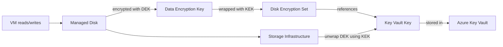

# How to Encrypt Azure Managed Disks with Customer-Managed Keys

Author: [nawazdhandala](https://www.github.com/nawazdhandala)

Tags: Azure, Managed Disks, Encryption, Customer-Managed Keys, Key Vault, Security, Compliance

Description: Learn how to encrypt Azure Managed Disks using customer-managed keys stored in Azure Key Vault for enhanced data security and regulatory compliance.

---

All Azure Managed Disks are encrypted at rest by default using Microsoft-managed keys. For many workloads, this is sufficient. But if your organization requires control over the encryption keys - for compliance with regulations like HIPAA, PCI DSS, or internal security policies - you need customer-managed keys (CMK). This post walks through setting up CMK encryption for managed disks using Azure Key Vault.

## How Disk Encryption Works

Azure Managed Disks support two types of server-side encryption.

**Platform-managed keys (PMK)**: The default. Azure manages the encryption keys. You get encryption at rest with zero configuration.

**Customer-managed keys (CMK)**: You create and manage the encryption key in Azure Key Vault. Azure uses your key to encrypt and decrypt the disk data. You can rotate, disable, or revoke the key at any time.

There is also a third option: **double encryption**, which applies both platform-managed and customer-managed encryption. This provides two layers of encryption for maximum protection.

The encryption happens transparently at the storage layer. The VM sees an unencrypted disk - all encryption and decryption is handled by the storage infrastructure using your key.

## Prerequisites

To set up CMK encryption, you need:

1. An Azure Key Vault (or Key Vault Managed HSM)
2. An encryption key in the vault
3. A disk encryption set that links the key to your disks
4. Proper access policies configured

## Step 1: Create a Key Vault

```bash
# Create a Key Vault with soft delete and purge protection enabled
# Purge protection prevents permanent deletion of keys - required for disk encryption
az keyvault create \
  --name my-disk-encryption-kv \
  --resource-group my-resource-group \
  --location eastus \
  --enable-soft-delete true \
  --enable-purge-protection true \
  --sku standard
```

Purge protection is mandatory for disk encryption. Without it, accidentally deleting the key could make your disks permanently unreadable.

## Step 2: Create an Encryption Key

```bash
# Create an RSA key in the Key Vault
# RSA 2048 is the minimum; RSA 3072 or 4096 provide stronger encryption
az keyvault key create \
  --vault-name my-disk-encryption-kv \
  --name disk-encryption-key \
  --kty RSA \
  --size 3072

# Verify the key was created
az keyvault key show \
  --vault-name my-disk-encryption-kv \
  --name disk-encryption-key \
  --query "{name:key.kid, keyType:key.kty, keySize:key.n}" \
  --output table
```

## Step 3: Create a Disk Encryption Set

The disk encryption set is the bridge between your Key Vault key and your managed disks. It is a resource that references the key and can be assigned to one or more disks.

```bash
# Get the Key Vault key ID
KEY_URL=$(az keyvault key show \
  --vault-name my-disk-encryption-kv \
  --name disk-encryption-key \
  --query "key.kid" -o tsv)

# Create the disk encryption set
az disk-encryption-set create \
  --name my-disk-encryption-set \
  --resource-group my-resource-group \
  --location eastus \
  --key-url "$KEY_URL" \
  --source-vault my-disk-encryption-kv \
  --encryption-type EncryptionAtRestWithCustomerKey

# Get the disk encryption set's identity (it uses a system-assigned managed identity)
DES_IDENTITY=$(az disk-encryption-set show \
  --name my-disk-encryption-set \
  --resource-group my-resource-group \
  --query "identity.principalId" -o tsv)

echo "Disk Encryption Set Identity: $DES_IDENTITY"
```

## Step 4: Grant Key Vault Access

The disk encryption set needs permission to access the key in Key Vault.

```bash
# Grant the disk encryption set access to the Key Vault
# It needs get, wrapKey, and unwrapKey permissions
az keyvault set-policy \
  --name my-disk-encryption-kv \
  --object-id "$DES_IDENTITY" \
  --key-permissions get wrapKey unwrapKey

# If using Key Vault RBAC mode instead of access policies:
az role assignment create \
  --assignee "$DES_IDENTITY" \
  --role "Key Vault Crypto Service Encryption User" \
  --scope "/subscriptions/<sub-id>/resourceGroups/my-resource-group/providers/Microsoft.KeyVault/vaults/my-disk-encryption-kv"
```

## Step 5: Create an Encrypted Managed Disk

Now you can create managed disks that use your customer-managed key.

```bash
# Get the disk encryption set resource ID
DES_ID=$(az disk-encryption-set show \
  --name my-disk-encryption-set \
  --resource-group my-resource-group \
  --query "id" -o tsv)

# Create a new managed disk with CMK encryption
az disk create \
  --name encrypted-data-disk \
  --resource-group my-resource-group \
  --location eastus \
  --sku Premium_LRS \
  --size-gb 128 \
  --encryption-type EncryptionAtRestWithCustomerKey \
  --disk-encryption-set "$DES_ID"

# Verify the encryption
az disk show \
  --name encrypted-data-disk \
  --resource-group my-resource-group \
  --query "{name:name, encryption:encryption.type, desId:encryption.diskEncryptionSetId}" \
  --output table
```

## Encrypting Existing Disks

You can also apply CMK encryption to existing disks. The VM must be deallocated first.

```bash
# Deallocate the VM (required for changing encryption)
az vm deallocate \
  --name my-vm \
  --resource-group my-resource-group

# Update the OS disk to use CMK
az disk update \
  --name my-vm-osdisk \
  --resource-group my-resource-group \
  --encryption-type EncryptionAtRestWithCustomerKey \
  --disk-encryption-set "$DES_ID"

# Update data disks too
az disk update \
  --name my-vm-datadisk-01 \
  --resource-group my-resource-group \
  --encryption-type EncryptionAtRestWithCustomerKey \
  --disk-encryption-set "$DES_ID"

# Start the VM back up
az vm start \
  --name my-vm \
  --resource-group my-resource-group
```

## Setting Up with PowerShell

```powershell
# Create a disk encryption set
$keyVault = Get-AzKeyVault -VaultName "my-disk-encryption-kv"
$key = Get-AzKeyVaultKey -VaultName "my-disk-encryption-kv" -Name "disk-encryption-key"

$desConfig = New-AzDiskEncryptionSetConfig `
  -Location "eastus" `
  -SourceVaultId $keyVault.ResourceId `
  -KeyUrl $key.Key.Kid `
  -IdentityType "SystemAssigned" `
  -EncryptionType "EncryptionAtRestWithCustomerKey"

$des = New-AzDiskEncryptionSet `
  -ResourceGroupName "my-resource-group" `
  -Name "my-disk-encryption-set" `
  -DiskEncryptionSet $desConfig

# Grant Key Vault access to the disk encryption set
Set-AzKeyVaultAccessPolicy `
  -VaultName "my-disk-encryption-kv" `
  -ObjectId $des.Identity.PrincipalId `
  -PermissionsToKeys get, wrapKey, unwrapKey

# Create an encrypted disk
$diskConfig = New-AzDiskConfig `
  -Location "eastus" `
  -CreateOption "Empty" `
  -DiskSizeGB 128 `
  -SkuName "Premium_LRS" `
  -EncryptionSettingsEnabled $false `
  -DiskEncryptionSetId $des.Id

New-AzDisk -ResourceGroupName "my-resource-group" -DiskName "encrypted-disk" -Disk $diskConfig
```

## Key Rotation

Rotating your encryption key is a security best practice. When you create a new version of the key, the disk encryption set can be updated to use it.

```bash
# Create a new version of the key
az keyvault key create \
  --vault-name my-disk-encryption-kv \
  --name disk-encryption-key \
  --kty RSA \
  --size 3072

# Get the new key version URL
NEW_KEY_URL=$(az keyvault key show \
  --vault-name my-disk-encryption-kv \
  --name disk-encryption-key \
  --query "key.kid" -o tsv)

# Update the disk encryption set to use the new key version
az disk-encryption-set update \
  --name my-disk-encryption-set \
  --resource-group my-resource-group \
  --key-url "$NEW_KEY_URL"
```

After updating the disk encryption set, Azure re-wraps the data encryption keys with the new key version. This does not require decrypting and re-encrypting the actual disk data - only the envelope key is updated, which is fast.

## Encryption Architecture



## Double Encryption

For maximum security, you can enable double encryption, which applies both a platform-managed key and your customer-managed key.

```bash
# Create a disk with double encryption
az disk create \
  --name double-encrypted-disk \
  --resource-group my-resource-group \
  --location eastus \
  --sku Premium_LRS \
  --size-gb 128 \
  --encryption-type EncryptionAtRestWithPlatformAndCustomerKeys \
  --disk-encryption-set "$DES_ID"
```

## Best Practices

Enable purge protection on your Key Vault. If someone deletes the key without purge protection, your disks become permanently inaccessible.

Set up key rotation on a regular schedule. Quarterly rotation is a common baseline, but check your compliance requirements.

Monitor Key Vault access logs for unauthorized attempts to access or modify the encryption key.

Use separate Key Vaults for different environments (production, staging, development) to limit the blast radius of a key compromise.

Test your disaster recovery process. Make sure you can restore from backups if the key becomes unavailable.

Customer-managed keys give you full control over your disk encryption, which is essential for organizations with strict security and compliance requirements. The setup is more involved than using platform-managed keys, but the process is straightforward once you understand the relationships between Key Vault, disk encryption sets, and managed disks.
