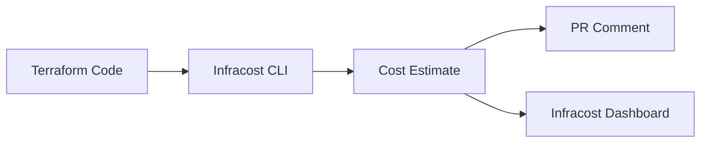

# How to Estimate Azure Infrastructure Costs Before Deployment Using Infracost with Terraform

Author: [nawazdhandala](https://www.github.com/nawazdhandala)

Tags: Infracost, Terraform, Azure, Cost Estimation, FinOps, Infrastructure as Code, DevOps

Description: Use Infracost with Terraform to estimate Azure infrastructure costs before deployment and integrate cost visibility into your pull request review workflow.

---

Nothing kills a cloud project faster than an unexpected bill. You deploy what seems like a reasonable set of Azure resources, and a month later finance is asking why the bill jumped by 40%. The problem is that Terraform tells you what will change but not what it will cost. Infracost fills that gap - it analyzes your Terraform code and estimates the monthly cost before you deploy anything.

In this post, I will show you how to set up Infracost for Azure Terraform projects, integrate it into your CI/CD pipeline, and get cost estimates directly in your pull requests.

## What Is Infracost?

Infracost is an open-source tool that estimates cloud costs from Terraform code. It understands Azure pricing for hundreds of resource types and calculates monthly estimates based on your configuration. It can also show cost differences between the current state and proposed changes - which is incredibly useful in pull request reviews.

The flow looks like this:



## Installation and Setup

Install the Infracost CLI:

```bash
# macOS
brew install infracost

# Linux
curl -fsSL https://raw.githubusercontent.com/infracost/infracost/master/scripts/install.sh | sh

# Verify installation
infracost --version
```

Register for a free API key (required for pricing data):

```bash
# Register and save your API key
infracost auth login

# Or set it manually
export INFRACOST_API_KEY="your-api-key"
```

## Basic Cost Estimation

Let me use a typical Azure Terraform project as an example. Here is the infrastructure:

```hcl
# main.tf - Azure infrastructure to estimate costs for

provider "azurerm" {
  features {}
}

resource "azurerm_resource_group" "main" {
  name     = "rg-myapp-prod"
  location = "eastus2"
}

# App Service Plan - Premium tier
resource "azurerm_service_plan" "main" {
  name                = "asp-myapp-prod"
  location            = azurerm_resource_group.main.location
  resource_group_name = azurerm_resource_group.main.name
  os_type             = "Linux"
  sku_name            = "P1v3"
}

# Web App
resource "azurerm_linux_web_app" "main" {
  name                = "app-myapp-prod"
  location            = azurerm_resource_group.main.location
  resource_group_name = azurerm_resource_group.main.name
  service_plan_id     = azurerm_service_plan.main.id
  site_config {}
}

# PostgreSQL Flexible Server
resource "azurerm_postgresql_flexible_server" "main" {
  name                = "psql-myapp-prod"
  location            = azurerm_resource_group.main.location
  resource_group_name = azurerm_resource_group.main.name
  sku_name            = "GP_Standard_D2s_v3"
  storage_mb          = 65536
  version             = "16"
  zone                = "1"

  authentication {
    active_directory_auth_enabled = true
    password_auth_enabled         = false
  }
}

# Redis Cache
resource "azurerm_redis_cache" "main" {
  name                = "redis-myapp-prod"
  location            = azurerm_resource_group.main.location
  resource_group_name = azurerm_resource_group.main.name
  capacity            = 1
  family              = "C"
  sku_name            = "Standard"
  minimum_tls_version = "1.2"
}

# Application Gateway with WAF
resource "azurerm_application_gateway" "main" {
  name                = "agw-myapp-prod"
  location            = azurerm_resource_group.main.location
  resource_group_name = azurerm_resource_group.main.name

  sku {
    name     = "WAF_v2"
    tier     = "WAF_v2"
    capacity = 2
  }

  gateway_ip_configuration {
    name      = "gateway-ip-config"
    subnet_id = azurerm_subnet.gateway.id
  }

  frontend_port {
    name = "https"
    port = 443
  }

  frontend_ip_configuration {
    name                 = "public"
    public_ip_address_id = azurerm_public_ip.gateway.id
  }

  backend_address_pool {
    name = "app-pool"
  }

  backend_http_settings {
    name                  = "http-settings"
    cookie_based_affinity = "Disabled"
    port                  = 443
    protocol              = "Https"
    request_timeout       = 30
  }

  http_listener {
    name                           = "https-listener"
    frontend_ip_configuration_name = "public"
    frontend_port_name             = "https"
    protocol                       = "Https"
  }

  request_routing_rule {
    name                       = "default-rule"
    priority                   = 1
    rule_type                  = "Basic"
    http_listener_name         = "https-listener"
    backend_address_pool_name  = "app-pool"
    backend_http_settings_name = "http-settings"
  }
}
```

Run the cost estimate:

```bash
# Generate a cost breakdown for the Terraform directory
infracost breakdown --path .
```

The output shows something like:

```
Project: myapp-prod

 Name                                        Monthly Qty  Unit        Monthly Cost

 azurerm_application_gateway.main
 - Gateway (WAF_v2)                                  730  hours            $547.50
 - Capacity units                                    730  hours             $18.25

 azurerm_postgresql_flexible_server.main
 - Compute (GP_Standard_D2s_v3)                      730  hours            $175.93
 - Storage                                            64  GB                $7.68

 azurerm_redis_cache.main
 - Cache (C1, Standard)                              730  hours             $40.15

 azurerm_service_plan.main
 - Linux app service plan (P1v3)                     730  hours            $136.51

 OVERALL TOTAL                                                             $926.02
```

## Cost Differences for Pull Requests

The real power comes from comparing costs between the current state and proposed changes. This is what goes into PR comments.

First, generate a baseline from the main branch:

```bash
# On the main branch, generate the baseline cost
git checkout main
infracost breakdown --path . --format json --out-file infracost-base.json

# Switch to the feature branch and generate the new cost
git checkout feature/scale-up-database
infracost breakdown --path . --format json --out-file infracost-feature.json

# Generate a diff showing cost changes
infracost diff --path . --compare-to infracost-base.json
```

The diff output highlights exactly what changed:

```
Monthly cost will increase by $352.97

+ azurerm_postgresql_flexible_server.main
  + Compute (GP_Standard_D4s_v3)              +$175.93 ($175.93 -> $351.86)
  + Storage                                    +$7.68 ($7.68 -> $15.36)

+ azurerm_redis_cache.main
  - Cache (C1, Standard)                      -$40.15
  + Cache (P1, Premium)                       +$209.51
```

## GitHub Actions Integration

Here is a complete GitHub Actions workflow that posts cost estimates as PR comments:

```yaml
# .github/workflows/infracost.yml
name: Infracost Cost Estimation

on:
  pull_request:
    paths:
      - '**/*.tf'
      - '**/*.tfvars'

permissions:
  contents: read
  pull-requests: write  # Required to post comments

jobs:
  infracost:
    name: Estimate Infrastructure Costs
    runs-on: ubuntu-latest

    steps:
      - name: Checkout base branch
        uses: actions/checkout@v4
        with:
          ref: ${{ github.event.pull_request.base.ref }}

      - name: Setup Infracost
        uses: infracost/actions/setup@v3
        with:
          api-key: ${{ secrets.INFRACOST_API_KEY }}

      - name: Generate base cost
        run: |
          infracost breakdown \
            --path . \
            --format json \
            --out-file /tmp/infracost-base.json

      - name: Checkout PR branch
        uses: actions/checkout@v4

      - name: Generate cost diff
        run: |
          infracost diff \
            --path . \
            --compare-to /tmp/infracost-base.json \
            --format json \
            --out-file /tmp/infracost-diff.json

      - name: Post PR comment
        uses: infracost/actions/comment@v1
        with:
          path: /tmp/infracost-diff.json
          behavior: update  # Update the same comment on subsequent pushes
```

The PR comment looks clean and professional. It shows a table of resources with their current cost, proposed cost, and the difference. Reviewers can immediately see the financial impact of a change.

## Usage-Based Cost Estimation

Some Azure resources have usage-based pricing that Infracost cannot determine from the Terraform code alone (like data transfer, API calls, or storage transactions). You can provide usage estimates in a YAML file:

```yaml
# infracost-usage.yml - Usage estimates for accurate cost calculation

version: 0.1

resource_usage:
  # Estimate storage account transaction volumes
  azurerm_storage_account.main:
    storage_gb: 500                    # 500 GB of blob storage
    monthly_write_operations: 100000   # 100k write operations per month
    monthly_read_operations: 500000    # 500k read operations per month
    monthly_data_retrieval_gb: 200     # 200 GB data retrieval

  # Estimate Application Gateway data processed
  azurerm_application_gateway.main:
    monthly_data_processed_gb: 100     # 100 GB of traffic per month

  # Estimate Azure Functions execution volume
  azurerm_function_app.main:
    monthly_executions: 1000000        # 1 million executions per month
    execution_duration_ms: 500         # Average 500ms per execution
    monthly_memory_gb_s: 200000        # Memory-seconds consumed
```

Run with the usage file:

```bash
# Include usage-based estimates for more accurate pricing
infracost breakdown --path . --usage-file infracost-usage.yml
```

## Setting Cost Policies

You can set guardrails to prevent expensive changes from being merged without review:

```yaml
# .infracost/policy.yml - Cost policies for the project

version: 0.1

policies:
  # Warn if monthly cost exceeds $5000
  - name: Monthly cost budget
    type: monthly_cost
    threshold:
      value: 5000
    action: warn

  # Block if a single PR increases cost by more than $500
  - name: PR cost increase limit
    type: cost_increase
    threshold:
      value: 500
      percentage: 20  # OR more than 20% increase
    action: deny
```

## Multi-Environment Cost Tracking

For projects with multiple environments, estimate each separately:

```bash
# Estimate costs for each environment
infracost breakdown --path environments/dev --format json --out-file costs-dev.json
infracost breakdown --path environments/staging --format json --out-file costs-staging.json
infracost breakdown --path environments/production --format json --out-file costs-prod.json

# Combine into a single report
infracost output \
  --path "costs-*.json" \
  --format table \
  --show-skipped
```

This gives you a consolidated view of costs across all environments, which is invaluable for budget planning.

## Cost Optimization Tips from Infracost Output

Infracost does not just estimate costs - it can highlight optimization opportunities. Look for:

- Resources using premium SKUs in development environments
- Over-provisioned VMs (high SKU but low utilization)
- Redundant resources (geo-redundant storage in dev)
- Resources that could use reserved instances for significant savings

## Wrapping Up

Infracost brings cost visibility to the point where infrastructure decisions are made - in the pull request. Instead of discovering cost overruns after deployment, teams see the financial impact of every change before it merges. The setup takes minutes, the CI/CD integration is straightforward, and the value is immediate. Make cost estimation a required check on your Terraform pull requests, and you will never be surprised by an Azure bill again.
