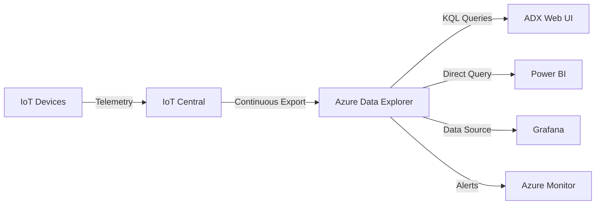

# How to Export Telemetry Data from Azure IoT Central to Azure Data Explorer

Author: [nawazdhandala](https://www.github.com/nawazdhandala)

Tags: Azure IoT Central, Azure Data Explorer, Data Export, Telemetry Analytics, Kusto Query, IoT Data Pipeline, Time Series Data

Description: A step-by-step guide to exporting IoT Central telemetry data to Azure Data Explorer for advanced analytics, long-term storage, and complex queries.

---

Azure IoT Central is great for real-time monitoring and basic dashboards, but its built-in analytics are limited when you need to run complex queries across millions of data points, detect anomalies over historical data, or join telemetry with external datasets. Azure Data Explorer (ADX) is purpose-built for exactly this kind of time-series analysis. It can ingest millions of events per second and query billions of records in seconds using the Kusto Query Language (KQL).

This guide shows you how to set up continuous data export from IoT Central to Azure Data Explorer, create the right table schema, and write useful queries against your telemetry data.

## Why Azure Data Explorer for IoT Data

IoT Central retains telemetry data for 30 days by default. If you need longer retention, historical trend analysis, or the ability to correlate IoT data with other sources, you need an external analytics store. ADX is a natural fit because:

- It is optimized for append-only time-series data, which is exactly what IoT telemetry is
- KQL is more expressive than SQL for time-series operations like time bucketing, interpolation, and anomaly detection
- It scales horizontally to handle petabytes of data
- It integrates natively with Power BI, Grafana, and Azure Monitor for visualization
- It supports streaming ingestion for near-real-time analytics

## Step 1: Create an Azure Data Explorer Cluster

If you do not already have an ADX cluster, create one using the Azure CLI.

```bash
# Create a resource group
az group create --name iot-analytics-rg --location eastus

# Create an ADX cluster (Dev/Test SKU for learning, Standard for production)
az kusto cluster create \
  --cluster-name iot-adx-cluster \
  --resource-group iot-analytics-rg \
  --location eastus \
  --sku name="Dev(No SLA)_Standard_E2a_v4" tier="Basic" capacity=1

# Create a database with 365-day retention
az kusto database create \
  --cluster-name iot-adx-cluster \
  --resource-group iot-analytics-rg \
  --database-name iot-telemetry \
  --soft-delete-period P365D \
  --hot-cache-period P31D
```

The `hot-cache-period` controls how much data stays in SSD cache for fastest query performance. Set it to cover your most common query window - 31 days is a good starting point.

## Step 2: Create the Telemetry Table

Connect to your ADX cluster using the Azure Data Explorer web UI (https://dataexplorer.azure.com) and create a table to receive the exported data.

IoT Central exports data in a specific JSON format. Here is a table schema that matches the export structure.

```sql
// Create the telemetry table with columns matching IoT Central export format
.create table DeviceTelemetry (
    enqueuedTime: datetime,
    deviceId: string,
    deviceName: string,
    templateId: string,
    templateName: string,
    enrichments: dynamic,
    telemetry: dynamic,
    messageProperties: dynamic
)

// Create a JSON ingestion mapping that maps the export payload to table columns
.create table DeviceTelemetry ingestion json mapping 'TelemetryMapping'
'['
'  {"column": "enqueuedTime", "path": "$.enqueuedTime", "datatype": "datetime"},'
'  {"column": "deviceId", "path": "$.device.id", "datatype": "string"},'
'  {"column": "deviceName", "path": "$.device.name", "datatype": "string"},'
'  {"column": "templateId", "path": "$.device.templateId", "datatype": "string"},'
'  {"column": "templateName", "path": "$.device.templateName", "datatype": "string"},'
'  {"column": "enrichments", "path": "$.enrichments", "datatype": "dynamic"},'
'  {"column": "telemetry", "path": "$.telemetry", "datatype": "dynamic"},'
'  {"column": "messageProperties", "path": "$.messageProperties", "datatype": "dynamic"}'
']'

// Enable streaming ingestion on the table for low latency
.alter table DeviceTelemetry policy streamingingestion enable
```

The `telemetry` column uses the `dynamic` type, which stores the full telemetry JSON object. This is flexible because different device templates can send different telemetry fields, and they all land in the same table without schema conflicts.

## Step 3: Configure Data Export in IoT Central

In your IoT Central application, navigate to Data export in the left menu.

**Create a new export:**

1. Click "New export"
2. Give it a name like "Telemetry to ADX"
3. Under "Type of data," select "Telemetry"
4. Optionally add filters to export only specific device templates or telemetry fields
5. Under "Destinations," click "Create a new one"

**Configure the ADX destination:**

1. Select "Azure Data Explorer" as the destination type
2. Enter your cluster URI (e.g., `https://iot-adx-cluster.eastus.kusto.windows.net`)
3. Enter the database name: `iot-telemetry`
4. Enter the table name: `DeviceTelemetry`
5. For authentication, use a service principal or managed identity

If using a service principal, you need to grant it permissions on the ADX database.

```sql
// Grant the service principal ingestor and viewer roles
.add database iot-telemetry ingestors ('aadapp=<service-principal-app-id>;<tenant-id>')
.add database iot-telemetry viewers ('aadapp=<service-principal-app-id>;<tenant-id>')
```

Enable the export and IoT Central will begin streaming telemetry data to your ADX table.

## Step 4: Verify Data Ingestion

Wait a few minutes for data to flow, then run a simple query to verify.

```sql
// Check recent records
DeviceTelemetry
| take 10

// Count records by device
DeviceTelemetry
| summarize count() by deviceId
| order by count_ desc

// Check the time range of ingested data
DeviceTelemetry
| summarize min(enqueuedTime), max(enqueuedTime)
```

## Step 5: Write Analytical Queries

Now for the fun part. Here are practical KQL queries for common IoT analytics tasks.

**Average temperature per hour for a specific device:**

```sql
// Hourly temperature average for device sensor-01 over the last 7 days
DeviceTelemetry
| where deviceId == "sensor-01"
| where enqueuedTime > ago(7d)
| extend temperature = todouble(telemetry.temperature)
| summarize avgTemp = avg(temperature) by bin(enqueuedTime, 1h)
| render timechart
```

**Detect temperature anomalies using built-in anomaly detection:**

```sql
// Find temperature anomalies across all devices
DeviceTelemetry
| extend temperature = todouble(telemetry.temperature)
| where isnotnull(temperature)
| make-series avgTemp = avg(temperature) on enqueuedTime from ago(7d) to now() step 1h
| extend anomalies = series_decompose_anomalies(avgTemp)
| mv-expand enqueuedTime, avgTemp, anomalies
| where toint(anomalies) != 0
| project enqueuedTime, avgTemp, anomalyScore = toint(anomalies)
```

**Compare telemetry across devices:**

```sql
// Side-by-side comparison of temperature readings from multiple devices
DeviceTelemetry
| where deviceId in ("sensor-01", "sensor-02", "sensor-03")
| where enqueuedTime > ago(24h)
| extend temperature = todouble(telemetry.temperature)
| summarize avgTemp = avg(temperature) by bin(enqueuedTime, 15m), deviceId
| render timechart
```

**Find devices with missing data (silence detection):**

```sql
// Find devices that haven't sent data in the last 30 minutes
let activeDevices = DeviceTelemetry
| where enqueuedTime > ago(30m)
| distinct deviceId;
DeviceTelemetry
| where enqueuedTime > ago(7d)
| distinct deviceId
| where deviceId !in (activeDevices)
| project silentDeviceId = deviceId
```

**Calculate daily statistics with percentiles:**

```sql
// Daily temperature statistics including percentiles
DeviceTelemetry
| where enqueuedTime > ago(30d)
| extend temperature = todouble(telemetry.temperature)
| summarize
    avgTemp = avg(temperature),
    minTemp = min(temperature),
    maxTemp = max(temperature),
    p50 = percentile(temperature, 50),
    p95 = percentile(temperature, 95),
    p99 = percentile(temperature, 99),
    sampleCount = count()
    by bin(enqueuedTime, 1d)
| order by enqueuedTime asc
```

## Data Flow Architecture

Here is the complete data pipeline from device to analytics.



## Optimizing Query Performance

As your data grows, query performance becomes important. Here are optimization tips.

**Create materialized views for common aggregations:**

```sql
// Create a materialized view for hourly aggregates
.create materialized-view HourlyTelemetry on table DeviceTelemetry
{
    DeviceTelemetry
    | extend temperature = todouble(telemetry.temperature),
             humidity = todouble(telemetry.humidity)
    | summarize avgTemp = avg(temperature),
                avgHumidity = avg(humidity),
                messageCount = count()
      by deviceId, bin(enqueuedTime, 1h)
}
```

**Set up a data retention policy to automatically drop old raw data while keeping aggregates:**

```sql
// Keep raw data for 90 days, aggregates for 2 years
.alter table DeviceTelemetry policy retention softdelete = 90d
.alter materialized-view HourlyTelemetry policy retention softdelete = 730d
```

**Use update policies to extract frequently queried fields from the dynamic column:**

```sql
// Create an expanded table with parsed telemetry fields
.create table ParsedTelemetry (
    enqueuedTime: datetime,
    deviceId: string,
    temperature: real,
    humidity: real,
    pressure: real,
    airQualityIndex: int
)

// Create an update policy that automatically parses incoming data
.alter table ParsedTelemetry policy update
@'[{"IsEnabled": true, "Source": "DeviceTelemetry", "Query": "DeviceTelemetry | extend temperature=todouble(telemetry.temperature), humidity=todouble(telemetry.humidity), pressure=todouble(telemetry.pressure), airQualityIndex=toint(telemetry.airQualityIndex) | project enqueuedTime, deviceId, temperature, humidity, pressure, airQualityIndex", "IsTransactional": true}]'
```

## Cost Considerations

ADX pricing is based on cluster size and data volume. For development and small deployments, the Dev/Test SKU is free for the first cluster. For production, choose a cluster size based on your ingestion rate and query complexity. A few pointers:

- The hot cache period determines how much SSD storage you need. More hot cache means faster queries but higher cost.
- Streaming ingestion uses more resources than batched ingestion. Only enable it if you need sub-minute latency.
- Materialized views consume compute resources. Create them only for queries you run frequently.

## Wrapping Up

Exporting IoT Central telemetry to Azure Data Explorer unlocks a level of analytics that is simply not possible within IoT Central alone. The combination of continuous export for the data pipeline and KQL for analysis gives you the tools to find patterns, detect anomalies, and make data-driven decisions about your IoT fleet. Start with the basic export setup, verify data is flowing, and then gradually build out your query library as you discover what questions your data can answer.
