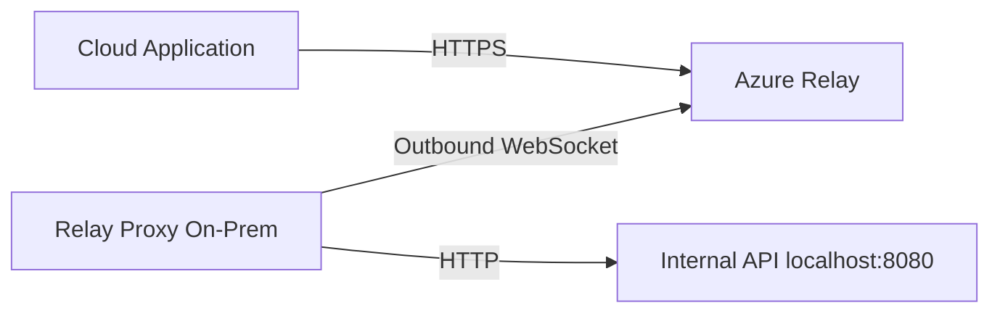

# How to Expose On-Premises APIs Through Azure Relay Without Opening Firewall Ports

Author: [nawazdhandala](https://www.github.com/nawazdhandala)

Tags: Azure, Relay, API, On-Premises, Firewall, Hybrid Cloud, Security

Description: Expose your on-premises REST APIs to cloud applications securely using Azure Relay without opening any inbound firewall ports.

---

You have a REST API running inside your corporate network. A cloud application needs to call it. The traditional approach would be to set up a VPN, configure firewall rules, get approvals from the security team, and hope nothing breaks when the network topology changes. Azure Relay offers a simpler path: your on-premises service connects outward to Azure, and cloud applications send requests through the relay. No inbound ports, no VPN tunnels, and the security team stays happy.

In this post, I will show you how to build a relay proxy that sits on your on-premises network, forwards requests from Azure Relay to your internal API, and returns the responses. The end result is a cloud-accessible endpoint that proxies to your internal service.

## Architecture

The setup has three components:



The relay proxy is a lightweight application that:
1. Opens an outbound connection to Azure Relay.
2. Receives requests forwarded by the relay.
3. Calls your internal API with the same method, path, headers, and body.
4. Returns the internal API's response through the relay.

Your cloud application thinks it is calling a regular HTTPS endpoint. Your internal API does not know it is being accessed through a relay. The proxy handles all the translation.

## Setting Up the Relay

Create the relay namespace and hybrid connection if you have not already.

```bash
# Create the relay infrastructure
az relay namespace create \
  --name api-relay-ns \
  --resource-group rg-relay \
  --location eastus

az relay hyco create \
  --name internal-api \
  --namespace-name api-relay-ns \
  --resource-group rg-relay \
  --requires-client-authorization true

# Create listener and sender rules
az relay hyco authorization-rule create \
  --name proxy-listen \
  --hybrid-connection-name internal-api \
  --namespace-name api-relay-ns \
  --resource-group rg-relay \
  --rights Listen

az relay hyco authorization-rule create \
  --name cloud-send \
  --hybrid-connection-name internal-api \
  --namespace-name api-relay-ns \
  --resource-group rg-relay \
  --rights Send
```

## Building the Relay Proxy

The proxy listens on the hybrid connection and forwards requests to your internal API. Install the required packages.

```bash
npm install hyco-https axios
```

Here is the proxy implementation.

```javascript
// relay-proxy.js - Proxy that forwards relay requests to an internal API
const { RelayedServer } = require('hyco-https');
const axios = require('axios');

// Configuration
const relayNamespace = process.env.RELAY_NAMESPACE; // e.g., api-relay-ns.servicebus.windows.net
const hybridConnectionName = 'internal-api';
const listenerKeyName = process.env.RELAY_KEY_NAME;
const listenerKey = process.env.RELAY_KEY;

// The internal API endpoint this proxy forwards to
const internalApiBase = process.env.INTERNAL_API_URL || 'http://localhost:8080';

// Allowed paths - restrict which internal endpoints can be accessed
const allowedPaths = ['/api/v1/', '/api/v2/', '/health'];

function isPathAllowed(path) {
  return allowedPaths.some(allowed => path.startsWith(allowed));
}

// Create the relayed HTTP server
const server = RelayedServer.createRelayedServer(
  {
    server: relayNamespace,
    path: hybridConnectionName,
    token: () => {
      return RelayedServer.createRelayToken(
        `https://${relayNamespace}/${hybridConnectionName}`,
        listenerKeyName,
        listenerKey
      );
    }
  },
  async (relayReq, relayRes) => {
    const method = relayReq.method;
    const path = relayReq.url;

    console.log(`[Relay] ${method} ${path}`);

    // Security check: only forward requests to allowed paths
    if (!isPathAllowed(path)) {
      relayRes.writeHead(403, { 'Content-Type': 'application/json' });
      relayRes.end(JSON.stringify({ error: 'Path not allowed' }));
      return;
    }

    // Read the request body from the relay
    let body = '';
    relayReq.on('data', chunk => { body += chunk; });

    relayReq.on('end', async () => {
      try {
        // Forward the request to the internal API
        const internalUrl = `${internalApiBase}${path}`;

        // Copy relevant headers from the relay request
        const headers = {};
        if (relayReq.headers['content-type']) {
          headers['Content-Type'] = relayReq.headers['content-type'];
        }
        if (relayReq.headers['accept']) {
          headers['Accept'] = relayReq.headers['accept'];
        }

        // Forward any custom application headers
        Object.keys(relayReq.headers).forEach(key => {
          if (key.startsWith('x-app-')) {
            headers[key] = relayReq.headers[key];
          }
        });

        const response = await axios({
          method: method.toLowerCase(),
          url: internalUrl,
          headers: headers,
          data: body || undefined,
          timeout: 30000, // 30 second timeout for internal calls
          validateStatus: () => true // Don't throw on non-2xx responses
        });

        // Send the internal API's response back through the relay
        const responseHeaders = {
          'Content-Type': response.headers['content-type'] || 'application/json'
        };

        relayRes.writeHead(response.status, responseHeaders);
        relayRes.end(
          typeof response.data === 'string'
            ? response.data
            : JSON.stringify(response.data)
        );

        console.log(`[Relay] ${method} ${path} -> ${response.status}`);

      } catch (err) {
        console.error(`[Relay] Error forwarding request:`, err.message);

        if (err.code === 'ECONNREFUSED') {
          relayRes.writeHead(503, { 'Content-Type': 'application/json' });
          relayRes.end(JSON.stringify({ error: 'Internal service unavailable' }));
        } else if (err.code === 'ECONNABORTED') {
          relayRes.writeHead(504, { 'Content-Type': 'application/json' });
          relayRes.end(JSON.stringify({ error: 'Internal service timeout' }));
        } else {
          relayRes.writeHead(502, { 'Content-Type': 'application/json' });
          relayRes.end(JSON.stringify({ error: 'Bad gateway' }));
        }
      }
    });
  }
);

server.listen(() => {
  console.log(`Relay proxy running. Forwarding to ${internalApiBase}`);
});

server.on('error', (err) => {
  console.error('Relay server error:', err);
  process.exit(1);
});
```

## Calling the Relayed API from the Cloud

From the cloud application's perspective, the internal API is now accessible through the relay endpoint.

```javascript
// cloud-client.js - Call the on-premises API through the relay
const https = require('https');
const crypto = require('crypto');

class RelayClient {
  constructor(namespace, hybridConnection, keyName, key) {
    this.namespace = namespace;
    this.hybridConnection = hybridConnection;
    this.keyName = keyName;
    this.key = key;
  }

  // Generate a SAS token for authentication
  createToken(expirySeconds = 3600) {
    const uri = encodeURIComponent(`https://${this.namespace}/${this.hybridConnection}`);
    const expiry = Math.round(Date.now() / 1000) + expirySeconds;
    const signature = crypto
      .createHmac('sha256', this.key)
      .update(`${uri}\n${expiry}`)
      .digest('base64');

    return `SharedAccessSignature sr=${uri}&sig=${encodeURIComponent(signature)}&se=${expiry}&skn=${this.keyName}`;
  }

  // Make a request through the relay
  async request(method, path, body) {
    const token = this.createToken();
    const payload = body ? JSON.stringify(body) : '';

    return new Promise((resolve, reject) => {
      const options = {
        hostname: this.namespace,
        path: `/${this.hybridConnection}${path}`,
        method: method,
        headers: {
          'ServiceBusAuthorization': token,
          'Content-Type': 'application/json',
          'Content-Length': Buffer.byteLength(payload)
        }
      };

      const req = https.request(options, (res) => {
        let data = '';
        res.on('data', chunk => { data += chunk; });
        res.on('end', () => {
          resolve({
            status: res.statusCode,
            data: data ? JSON.parse(data) : null
          });
        });
      });

      req.on('error', reject);
      if (payload) req.write(payload);
      req.end();
    });
  }

  // Convenience methods
  get(path) { return this.request('GET', path); }
  post(path, body) { return this.request('POST', path, body); }
  put(path, body) { return this.request('PUT', path, body); }
  delete(path) { return this.request('DELETE', path); }
}

// Usage
const client = new RelayClient(
  'api-relay-ns.servicebus.windows.net',
  'internal-api',
  'cloud-send',
  process.env.RELAY_SENDER_KEY
);

async function main() {
  // These calls go through Azure Relay to your on-premises API
  const users = await client.get('/api/v1/users');
  console.log('Users:', users.data);

  const newUser = await client.post('/api/v1/users', {
    name: 'Jane Smith',
    email: 'jane@example.com'
  });
  console.log('Created user:', newUser.data);
}

main().catch(console.error);
```

## Security Considerations

The relay proxy is a gateway into your internal network, so security matters.

**Path restriction.** Only forward requests to specific API paths. The `allowedPaths` check in the proxy prevents someone from using the relay to scan your internal network.

**Header filtering.** Do not blindly forward all headers from the relay to the internal API. Only pass through headers you explicitly expect.

**Rate limiting.** Add rate limiting to the proxy to prevent abuse.

```javascript
// rate-limiter.js - Simple rate limiting for the relay proxy
const requestCounts = new Map();
const WINDOW_MS = 60000; // 1 minute window
const MAX_REQUESTS = 100; // Max requests per window

function checkRateLimit(clientId) {
  const now = Date.now();
  const windowStart = now - WINDOW_MS;

  if (!requestCounts.has(clientId)) {
    requestCounts.set(clientId, []);
  }

  const requests = requestCounts.get(clientId);

  // Remove old entries outside the current window
  while (requests.length > 0 && requests[0] < windowStart) {
    requests.shift();
  }

  if (requests.length >= MAX_REQUESTS) {
    return false; // Rate limit exceeded
  }

  requests.push(now);
  return true; // Allowed
}
```

**Logging.** Log every request that passes through the proxy. This gives you an audit trail of what was accessed and when.

**Authentication.** The SAS token on the relay provides transport-level authentication. For application-level authentication, include an API key or JWT in the request headers and validate it in the proxy before forwarding.

## Running as a Service

In production, run the relay proxy as a system service so it starts automatically and restarts on failure.

On Linux, create a systemd service file.

```ini
[Unit]
Description=Azure Relay Proxy
After=network.target

[Service]
Type=simple
User=relayproxy
WorkingDirectory=/opt/relay-proxy
ExecStart=/usr/bin/node relay-proxy.js
Restart=always
RestartSec=10
Environment=RELAY_NAMESPACE=api-relay-ns.servicebus.windows.net
Environment=RELAY_KEY_NAME=proxy-listen
EnvironmentFile=/etc/relay-proxy/secrets.env

[Install]
WantedBy=multi-user.target
```

On Windows, use a tool like node-windows or PM2 to run it as a Windows service.

## Wrapping Up

Exposing on-premises APIs through Azure Relay is a practical alternative to VPNs for many scenarios. The relay proxy pattern gives your cloud applications HTTP-level access to internal services without any inbound firewall changes. Build the proxy with path restrictions and proper logging, run it as a service on your on-premises network, and your cloud applications can call internal APIs as if they were regular HTTPS endpoints. The setup is simpler than a VPN, more targeted in what it exposes, and easier for security teams to approve.
