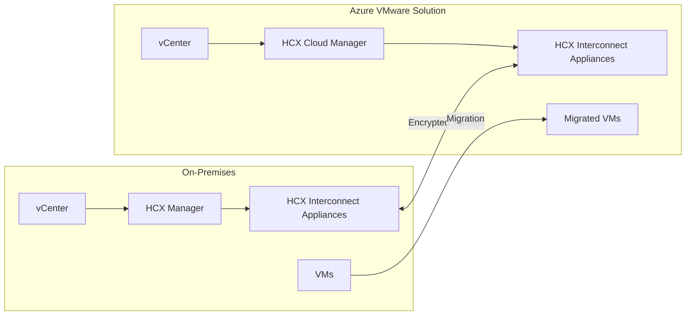

# How to Extend On-Premises VMware Workloads to Azure VMware Solution with HCX

Author: [nawazdhandala](https://www.github.com/nawazdhandala)

Tags: Azure, VMware, HCX, Migration, Hybrid Cloud, Workload Mobility, vSphere

Description: Step-by-step guide to extending on-premises VMware workloads to Azure VMware Solution using VMware HCX for seamless migration and network extension.

---

Migrating VMware workloads to the cloud traditionally means downtime, re-IP-ing VMs, and reconfiguring network dependencies. VMware HCX changes that equation entirely. It provides live migration capabilities between your on-premises vSphere environment and Azure VMware Solution (AVS), extending Layer 2 networks so VMs keep their IP addresses and network connections during migration. VMs can even be migrated while they are running with zero downtime.

This guide covers installing, configuring, and using HCX to extend your on-premises VMware environment to Azure VMware Solution.

## How HCX Works

HCX creates a secure overlay network between your on-premises data center and AVS. It deploys virtual appliances on both sides that establish encrypted tunnels for VM traffic, management, and vMotion data.



The key components are:

- **HCX Manager** - Deployed on-premises, manages the pairing with the cloud side.
- **HCX Cloud Manager** - Deployed automatically in AVS.
- **Service Mesh** - The collection of appliance pairs that handle different types of traffic (management, vMotion, network extension, WAN optimization).

## Prerequisites

- Azure VMware Solution private cloud deployed and accessible.
- On-premises vSphere 6.5 or later with vCenter Server.
- On-premises network with sufficient bandwidth to AVS (minimum 100 Mbps recommended).
- Network ports opened for HCX communication (443, 4500, 8123, 9443 among others).
- A /26 or larger CIDR block for HCX appliance management IPs.

## Step 1: Enable HCX in Azure VMware Solution

HCX Advanced is included with AVS at no extra charge. Enable it through the Azure portal or CLI.

```bash
# Enable HCX on your Azure VMware Solution private cloud
az vmware addon hcx create \
  --resource-group myResourceGroup \
  --private-cloud myAVSPrivateCloud \
  --offer "VMware MaaS Cloud Provider"
```

This deploys the HCX Cloud Manager in your AVS private cloud. Deployment takes about 30 minutes.

Retrieve the HCX activation key.

```bash
# Generate an HCX activation key for the on-premises connector
az vmware hcx-enterprise-site create \
  --resource-group myResourceGroup \
  --private-cloud myAVSPrivateCloud \
  --name "OnPremisesSite" \
  --query "activationKey" \
  --output tsv
```

Save this activation key - you need it when setting up the on-premises HCX Manager.

## Step 2: Download and Deploy HCX On-Premises

Get the HCX Connector OVA from the HCX Cloud Manager URL. You can find this URL in the Azure portal under your AVS private cloud's Add-ons section.

1. Log in to the HCX Cloud Manager URL.
2. Go to Administration > System Updates.
3. Download the HCX Connector OVA.

Deploy the OVA in your on-premises vCenter.

```
In vCenter:
1. Right-click your cluster > Deploy OVF Template
2. Select the downloaded HCX Connector OVA
3. Follow the wizard:
   - Name: HCX-Connector
   - Network: Management network
   - IP configuration: Assign a static IP on your management network
   - Gateway, DNS, and NTP settings
4. Power on the appliance
```

After deployment, access the HCX Manager web interface at `https://<hcx-manager-ip>:9443`.

## Step 3: Activate and Configure On-Premises HCX

Log in to the HCX Manager and complete the initial setup.

1. Enter the activation key from Step 1.
2. Provide your on-premises vCenter Server details.
3. Configure the SSO/PSC connection.
4. Set up the location (this helps with latency calculations).

After activation, the HCX Manager connects to your vCenter and appears as a plugin in the vSphere client.

## Step 4: Create the Site Pairing

Site pairing establishes the connection between your on-premises HCX Manager and the AVS HCX Cloud Manager.

1. In the vSphere client, go to HCX > Site Pairing.
2. Click "Add a site pairing."
3. Enter the AVS HCX Cloud Manager URL (found in the Azure portal).
4. Provide the cloudadmin credentials for AVS.
5. Click Connect.

The pairing process verifies connectivity and establishes a trust relationship between the two sites.

## Step 5: Create Network Profiles

Network profiles define the IP pools and networks that HCX appliances use. You need profiles for:

- **Management** - For appliance management traffic.
- **vMotion** - For live migration traffic.
- **Uplink** - For external connectivity.

```
In HCX Manager:
1. Go to Interconnect > Network Profiles
2. Create Management profile:
   - Network: Your management VLAN/portgroup
   - IP Pool: Reserve 2-3 IPs for HCX appliances
   - Gateway and DNS
3. Create vMotion profile:
   - Network: Your vMotion VLAN/portgroup
   - IP Pool: Reserve 2-3 IPs
4. Create Uplink profile:
   - Network: Your uplink/WAN VLAN
   - IP Pool: Reserve 2-3 IPs
```

## Step 6: Create Compute Profiles

Compute profiles define which resources HCX can use for migration.

1. Go to Interconnect > Compute Profiles.
2. Click "Create Compute Profile."
3. Name it (for example, "OnPrem-Production").
4. Select the cluster(s) to enable for HCX.
5. Select the datastore(s) for appliance deployment.
6. Assign the network profiles created in Step 5.
7. Complete the wizard.

## Step 7: Create the Service Mesh

The service mesh deploys the actual appliance pairs that handle traffic between sites.

1. Go to Interconnect > Service Mesh.
2. Click "Create Service Mesh."
3. Select the local and remote compute profiles.
4. Choose the services to enable:
   - **Interconnect** - Required for all operations.
   - **vMotion** - For live migration.
   - **Bulk Migration** - For large-scale batch migration.
   - **Network Extension** - For stretching L2 networks.
   - **WAN Optimization** - For bandwidth efficiency.
5. Review the configuration and click Create.

Appliance deployment takes 15-20 minutes. The service mesh creates matched pairs of appliances on both sides, connected through encrypted tunnels.

```bash
# Verify the service mesh status using the AVS CLI
az vmware workload-network list \
  --resource-group myResourceGroup \
  --private-cloud myAVSPrivateCloud
```

## Step 8: Extend On-Premises Networks

Network extension stretches your on-premises L2 network segments to AVS, allowing VMs to keep their IP addresses after migration.

1. Go to Services > Network Extension.
2. Click "Create a Network Extension."
3. Select the on-premises network (port group) to extend.
4. Choose the destination NSX-T segment in AVS.
5. Set the gateway IP (usually the same as on-premises).
6. Click Submit.

The extension creates a tunnel that makes the remote network segment appear as a local extension of your on-premises network. VMs migrated to AVS continue to use their existing IPs and can communicate with on-premises resources without any routing changes.

## Step 9: Migrate VMs

With the service mesh and network extension in place, you can start migrating VMs. HCX supports several migration types:

**vMotion Migration** - Zero downtime. The VM moves while running. Best for individual critical VMs.

**Bulk Migration** - Low downtime (seconds). Creates a replica, synchronizes changes, then cuts over. Best for batch migration of many VMs.

**Cold Migration** - VM is powered off during migration. Simplest but causes downtime.

To perform a migration through the vSphere client:

1. Go to HCX > Migration.
2. Click "Migrate."
3. Select the VMs to migrate.
4. Choose the destination (AVS cluster, datastore, network).
5. Select the migration type.
6. For bulk migration, set the switchover schedule (immediate or scheduled).
7. Click Validate and then Go.

For scripted batch migration, use the HCX REST API.

```python
# Python script to trigger bulk migration via HCX REST API
import requests
import json

hcx_url = "https://hcx-manager-ip:9443"
headers = {
    "Content-Type": "application/json",
    "Accept": "application/json"
}

# Authenticate and get a session token
auth_response = requests.post(
    f"{hcx_url}/hybridity/api/sessions",
    headers=headers,
    json={"username": "admin", "password": "your-password"},
    verify=False
)
token = auth_response.headers.get("x-hm-authorization")
headers["x-hm-authorization"] = token

# Define the migration request for a batch of VMs
migration_payload = {
    "items": [
        {
            "entityName": "web-server-01",
            "srcComputeContainerName": "OnPrem-Cluster",
            "tgtComputeContainerName": "AVS-Cluster",
            "tgtDatastoreName": "vsanDatastore",
            "tgtNetworkName": "workload-segment-1",
            "migrationType": "bulk",
            "scheduleStartTime": "2026-02-16T22:00:00Z"
        },
        {
            "entityName": "web-server-02",
            "srcComputeContainerName": "OnPrem-Cluster",
            "tgtComputeContainerName": "AVS-Cluster",
            "tgtDatastoreName": "vsanDatastore",
            "tgtNetworkName": "workload-segment-1",
            "migrationType": "bulk",
            "scheduleStartTime": "2026-02-16T22:00:00Z"
        }
    ]
}

# Submit the migration request
response = requests.post(
    f"{hcx_url}/hybridity/api/migrations",
    headers=headers,
    json=migration_payload,
    verify=False
)

print(f"Migration submitted: {response.status_code}")
print(json.dumps(response.json(), indent=2))
```

## Monitoring Migration Progress

Track migration status through the HCX dashboard in the vSphere client or through the Azure portal.

Key metrics to monitor:

- **Replication progress** - Percentage of data replicated for bulk migrations.
- **Network throughput** - Data transfer rate between sites.
- **Tunnel health** - Status of the encrypted tunnels in the service mesh.

## Summary

HCX makes VMware migration to Azure VMware Solution practical for production environments. The network extension capability is the real differentiator because it eliminates the need to re-IP VMs or reconfigure dependent services. The workflow is deploy HCX, pair the sites, create the service mesh, extend networks, and migrate. For large environments with hundreds of VMs, the bulk migration with scheduled switchover keeps the disruption minimal while the HCX REST API enables scripted batch operations.
