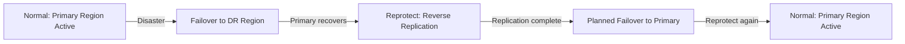

# How to Fail Back Azure VMs to the Primary Region After a Disaster Recovery Event

Author: [nawazdhandala](https://www.github.com/nawazdhandala)

Tags: Azure Site Recovery, Failback, Disaster Recovery, Azure VMs, Reprotect, Business Continuity, Region Recovery

Description: Step-by-step guide to failing back Azure VMs from the DR region to the primary region after a disaster recovery event, including reprotection and reverse replication.

---

You executed a failover to the secondary region during an outage. Your applications are running, customers are served, and the crisis is under control. Now the primary region is back online, and you need to move everything back. This process - called failback - is where many DR strategies fall apart because teams only planned the forward direction.

Azure Site Recovery supports failback through a process called reprotection, which reverses the replication direction. This guide covers the entire failback workflow, from verifying the primary region is healthy to completing the move back.

## The Failback Process at a High Level

Failback is essentially a reverse migration. After a failover, your VMs are running in the secondary (DR) region. To get back to the primary region, you need to:

1. Verify the primary region is healthy and available
2. Reprotect the VMs (this sets up reverse replication from DR back to primary)
3. Wait for initial replication to complete
4. Perform a planned failover back to the primary region
5. Reprotect again to restore the original DR configuration



## Prerequisites for Failback

Before starting the failback process, verify:

- The primary region is fully operational (check Azure Service Health)
- The original resource group and virtual network in the primary region still exist (or recreate them)
- The Recovery Services vault is accessible
- You have completed all necessary data validation in the DR region
- A maintenance window is scheduled for the failback cutover

## Step 1: Verify Primary Region Health

Do not rush the failback. Just because Azure reports the region is back does not mean every service is performing normally. Check the following:

```powershell
# Verify the primary region's resource group and network infrastructure
# These must exist for the VMs to fail back into

# Check resource group
$rgExists = Get-AzResourceGroup -Name "rg-production-eastus2" -ErrorAction SilentlyContinue
if ($rgExists) {
    Write-Output "Resource group exists: $($rgExists.ResourceGroupName)"
} else {
    Write-Output "WARNING: Resource group not found - needs to be recreated"
}

# Check virtual network
$vnetExists = Get-AzVirtualNetwork -Name "vnet-production-eastus2" -ResourceGroupName "rg-production-eastus2" -ErrorAction SilentlyContinue
if ($vnetExists) {
    Write-Output "Virtual network exists with subnets:"
    $vnetExists.Subnets | ForEach-Object { Write-Output "  - $($_.Name): $($_.AddressPrefix)" }
} else {
    Write-Output "WARNING: Virtual network not found - needs to be recreated"
}

# Check cache storage account availability in primary region
$cacheStorage = Get-AzStorageAccount -ResourceGroupName "rg-production-eastus2" -Name "stcacheeastus2" -ErrorAction SilentlyContinue
if ($cacheStorage) {
    Write-Output "Cache storage account available"
} else {
    Write-Output "Cache storage account needs to be created for reverse replication"
}
```

If any infrastructure was destroyed during the regional outage, recreate it before proceeding with reprotection.

## Step 2: Reprotect the VMs

Reprotection sets up reverse replication from the DR region back to the primary region. This is the most critical step in the failback process.

### Using the Portal

1. In the Recovery Services vault, go to "Replicated items"
2. Select a VM that was failed over (its status should show "Failover committed")
3. Click "Re-protect"
4. Configure the reprotection settings:
   - **Target resource group**: The original resource group in the primary region
   - **Target virtual network**: The original virtual network
   - **Cache storage account**: A storage account in the DR region (source for reverse replication)
   - **Target availability set**: The original availability set (if applicable)
5. Click "OK"

### Using PowerShell for Multiple VMs

```powershell
# Reprotect multiple VMs after failover
# This sets up reverse replication from DR region back to primary

$vault = Get-AzRecoveryServicesVault -Name "rsv-dr-centralus-001" -ResourceGroupName "rg-dr-centralus"
Set-AzRecoveryServicesAsrVaultContext -Vault $vault

# Get all failed-over VMs
$container = Get-AzRecoveryServicesAsrProtectionContainer
$failedOverItems = Get-AzRecoveryServicesAsrReplicationProtectedItem -ProtectionContainer $container |
    Where-Object { $_.ActiveLocation -eq "Recovery" }

# Cache storage account in the DR region for reverse replication
$cacheStorageId = "/subscriptions/<sub-id>/resourceGroups/rg-dr-centralus/providers/Microsoft.Storage/storageAccounts/stcachecentralus"

foreach ($item in $failedOverItems) {
    Write-Output "Reprotecting: $($item.FriendlyName)"

    # Start reprotection (reverse replication)
    $reprotectJob = Update-AzRecoveryServicesAsrProtectionDirection `
        -AzureToAzure `
        -ReplicationProtectedItem $item `
        -ProtectionContainerMapping $reverseContainerMapping `
        -LogStorageAccountId $cacheStorageId

    Write-Output "Reprotection started for $($item.FriendlyName)"
}

Write-Output "All VMs submitted for reprotection"
```

## Step 3: Monitor Reverse Replication

After reprotection is initiated, Azure Site Recovery performs a full initial replication of the VM disks from the DR region to the primary region. This is the same process as the original replication, just in reverse.

Monitor the progress:

1. In the vault, check "Replicated items"
2. Each VM shows the reverse replication progress
3. Wait for the status to change to "Protected"

The time required depends on disk sizes and network bandwidth between regions. For a typical VM with 256 GB of disks, expect 1-4 hours for initial reverse replication.

During this time, the VMs continue running in the DR region without interruption. Your applications stay up while the reverse replication completes in the background.

## Step 4: Validate Before Failback

Before executing the actual failback, perform the same validations you would for any migration:

**Test failover to primary region** - Run a test failover to verify the VMs will start correctly in the primary region. Use an isolated test network, just as you would for a regular test failover.

**Check DNS and networking** - Ensure that DNS records, load balancers, and firewall rules in the primary region are ready to handle traffic again.

**Verify dependent services** - Databases, caches, and external integrations in the primary region should be operational.

**Notify stakeholders** - Communicate the failback maintenance window. Even though it should be quick, there will be a brief interruption.

## Step 5: Execute the Planned Failback

A planned failover is different from an unplanned failover. It ensures zero data loss by:

1. Pausing workloads on the DR VMs
2. Synchronizing the final delta to the primary region
3. Creating VMs in the primary region from the synchronized disks
4. Starting the VMs in the primary region

Execute the planned failover:

1. In the Recovery Services vault, go to "Replicated items"
2. Select the reprotected VM
3. Click "Failover"
4. Verify that the direction is from DR to Primary
5. Select "Latest" as the recovery point (to capture all recent data)
6. Check "Shut down machine before beginning failover" for zero data loss
7. Click "OK"

For multiple VMs, use a recovery plan to orchestrate the failback in the correct order.

```powershell
# Execute planned failback for a recovery plan
# This fails all VMs back to the primary region in the defined order

$vault = Get-AzRecoveryServicesVault -Name "rsv-dr-centralus-001" -ResourceGroupName "rg-dr-centralus"
Set-AzRecoveryServicesAsrVaultContext -Vault $vault

# Get the recovery plan
$recoveryPlan = Get-AzRecoveryServicesAsrRecoveryPlan -Name "rp-erp-application"

# Start the planned failover
$failbackJob = Start-AzRecoveryServicesAsrPlannedFailoverJob `
    -RecoveryPlan $recoveryPlan `
    -Direction RecoveryToPrimary `
    -CreateVmErrorAction "AlertOnly"

# Monitor the failback job
while ($failbackJob.State -eq "InProgress") {
    Start-Sleep -Seconds 30
    $failbackJob = Get-AzRecoveryServicesAsrJob -Job $failbackJob
    Write-Output "Failback status: $($failbackJob.State) - $($failbackJob.StateDescription)"
}

Write-Output "Failback completed: $($failbackJob.State)"
```

## Step 6: Commit the Failback

After the VMs are running in the primary region and you have verified everything works:

1. Go to the replicated item
2. Click "Commit"
3. Confirm the commit

Committing deletes the DR region VMs and finalizes the failback. Until you commit, you have the option to fail back to the DR region if something goes wrong.

## Step 7: Re-establish DR Protection

After the failback is complete, you are running in the primary region again, but you no longer have DR protection. Re-enable it:

1. Reprotect the VMs (this time from primary to DR, the original direction)
2. Wait for initial replication to complete
3. Verify replication health shows "Protected"

This restores your original DR configuration. If another disaster occurs, you can fail over to the DR region again.

## Common Failback Challenges

**Primary region infrastructure was modified.** If someone changed the virtual network, subnets, or NSGs in the primary region during the outage, the VMs may fail to start or have incorrect network configuration. Review and restore the infrastructure before reprotection.

**IP address conflicts.** If temporary resources were created in the primary region during the outage (e.g., for testing), they may be using IP addresses that the original VMs need. Clean up any temporary resources.

**Data drift during the outage.** If the outage was prolonged and applications were serving traffic from the DR region for days or weeks, substantial data changes occurred in DR. Ensure the reverse replication has enough time to sync all these changes back.

**Licensing and compliance.** Some software licenses are tied to specific regions or subscriptions. Verify that your licenses are valid in the primary region after failback.

**DNS propagation delays.** After switching DNS back to primary region IPs, some clients may still be routed to the DR region due to DNS caching. Use low TTL values before the failback to minimize this window.

## Automation for Repeatable Failback

For organizations that want to codify the entire failback process, combine the above steps into an Azure Automation runbook or Azure DevOps pipeline:

1. Health check on primary region infrastructure
2. Reprotect all VMs
3. Wait for replication to complete (polling loop)
4. Run test failover
5. Validate test results
6. Clean up test failover
7. Execute planned failover
8. Validate production
9. Commit failover
10. Re-establish DR protection

This reduces human error and ensures consistency every time a failback is needed.

## Wrapping Up

Failback completes the disaster recovery lifecycle. Without a tested failback process, you might get stuck running in the DR region indefinitely, which is usually more expensive and further from your users. Plan the failback as carefully as you plan the failover. Verify the primary region infrastructure, reprotect the VMs, let reverse replication complete, and execute a planned failover for zero data loss. Once you are back in the primary region, immediately re-establish DR protection so you are ready for the next event.
