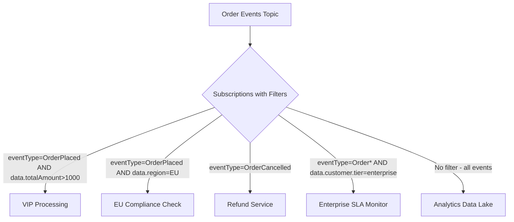

# How to Filter Azure Event Grid Subscription Events with Advanced Filters

Author: [nawazdhandala](https://www.github.com/nawazdhandala)

Tags: Azure, Event Grid, Advanced Filters, Event Routing, Event Subscriptions, Cloud Messaging, Serverless

Description: Master Azure Event Grid advanced filtering to route only the events you need to each subscriber, reducing noise and cost.

---

Event Grid subscriptions can filter events before delivering them. Basic filtering on event type is useful, but advanced filters let you filter on any field in the event - including your custom data properties. This is how you build precise event routing without writing filter logic in your event handlers.

## Why Filter at the Subscription Level?

Without filters, every subscriber gets every event. That means your order processing function receives inventory events it does not care about, your analytics pipeline gets test events it should ignore, and your notification service processes events for regions it does not serve. Filtering at the subscription level means subscribers only receive events they can act on. This reduces processing costs, lowers latency, and simplifies handler code.

## Basic Event Type Filtering

The simplest filter is on `eventType`. This is always your first line of defense.

```bash
# Subscribe only to OrderPlaced events
az eventgrid event-subscription create \
  --name sub-order-processor \
  --source-resource-id "/subscriptions/{sub-id}/resourceGroups/rg-events/providers/Microsoft.EventGrid/topics/topic-orders" \
  --endpoint "https://func-orders.azurewebsites.net/api/process" \
  --included-event-types "Orders.OrderPlaced" "Orders.OrderUpdated"
```

## Subject Filtering

You can filter on the event `subject` using prefix and suffix matching.

```bash
# Only receive events where the subject starts with /orders/premium/
az eventgrid event-subscription create \
  --name sub-premium-orders \
  --source-resource-id "/subscriptions/{sub-id}/resourceGroups/rg-events/providers/Microsoft.EventGrid/topics/topic-orders" \
  --endpoint "https://func-premium.azurewebsites.net/api/handle" \
  --subject-begins-with "/orders/premium/" \
  --subject-ends-with ".urgent"
```

## Advanced Filters

Advanced filters let you filter on any property in the event, including nested fields inside the `data` payload. This is where things get powerful.

Event Grid supports these filter operators:

- **NumberGreaterThan, NumberLessThan, NumberIn, NumberNotIn** - for numeric comparisons
- **StringContains, StringBeginsWith, StringEndsWith, StringIn, StringNotIn** - for string matching
- **BoolEquals** - for boolean fields
- **IsNullOrUndefined, IsNotNull** - for existence checks
- **NumberGreaterThanOrEquals, NumberLessThanOrEquals, NumberInRange, NumberNotInRange** - for range checks

## Advanced Filter Examples

Let's build some real-world filters.

Filter for high-value orders only (where `data.totalAmount` is greater than 1000):

```bash
az eventgrid event-subscription create \
  --name sub-high-value-orders \
  --source-resource-id "/subscriptions/{sub-id}/resourceGroups/rg-events/providers/Microsoft.EventGrid/topics/topic-orders" \
  --endpoint "https://func-vip.azurewebsites.net/api/handle" \
  --advanced-filter data.totalAmount NumberGreaterThan 1000
```

Filter for orders from specific regions:

```bash
az eventgrid event-subscription create \
  --name sub-us-orders \
  --source-resource-id "/subscriptions/{sub-id}/resourceGroups/rg-events/providers/Microsoft.EventGrid/topics/topic-orders" \
  --endpoint "https://func-us-orders.azurewebsites.net/api/handle" \
  --advanced-filter data.region StringIn "us-east" "us-west" "us-central"
```

## Combining Multiple Filters

You can combine up to 25 advanced filters on a single subscription. All filters must match for an event to be delivered (AND logic).

```bash
# High-value orders from US region with express shipping
az eventgrid event-subscription create \
  --name sub-express-us-vip \
  --source-resource-id "/subscriptions/{sub-id}/resourceGroups/rg-events/providers/Microsoft.EventGrid/topics/topic-orders" \
  --endpoint "https://func-express.azurewebsites.net/api/handle" \
  --included-event-types "Orders.OrderPlaced" \
  --advanced-filter data.totalAmount NumberGreaterThan 500 \
  --advanced-filter data.region StringIn "us-east" "us-west" \
  --advanced-filter data.shippingMethod StringContains "express"
```

## Using ARM/Bicep for Advanced Filters

For production deployments, define your filters in Bicep.

```bicep
// Event subscription with multiple advanced filters
param topicName string = 'topic-orders'
param functionAppId string

resource eventSubscription 'Microsoft.EventGrid/topics/eventSubscriptions@2022-06-15' = {
  name: '${topicName}/sub-filtered-orders'
  properties: {
    destination: {
      endpointType: 'AzureFunction'
      properties: {
        resourceId: '${functionAppId}/functions/ProcessOrder'
        maxEventsPerBatch: 1
        preferredBatchSizeInKilobytes: 64
      }
    }
    filter: {
      // Include only these event types
      includedEventTypes: [
        'Orders.OrderPlaced'
        'Orders.OrderUpdated'
      ]
      // Subject prefix filter
      subjectBeginsWith: '/orders/'
      // Advanced filters - all must match (AND logic)
      advancedFilters: [
        {
          operatorType: 'NumberGreaterThanOrEquals'
          key: 'data.totalAmount'
          value: 100
        }
        {
          operatorType: 'StringIn'
          key: 'data.customerTier'
          values: ['gold', 'platinum']
        }
        {
          operatorType: 'BoolEquals'
          key: 'data.isVerified'
          value: true
        }
        {
          operatorType: 'IsNotNull'
          key: 'data.shippingAddress'
        }
      ]
    }
    retryPolicy: {
      maxDeliveryAttempts: 30
      eventTimeToLiveInMinutes: 1440
    }
  }
}
```

## Filter on Nested Properties

Advanced filters support dotted notation for nested objects. If your event data looks like this:

```json
{
  "data": {
    "customer": {
      "tier": "premium",
      "address": {
        "country": "US",
        "state": "CA"
      }
    },
    "items": [
      { "category": "electronics" }
    ]
  }
}
```

You can filter on nested fields:

```bash
# Filter on nested customer tier
az eventgrid event-subscription create \
  --name sub-premium-customers \
  --source-resource-id "/subscriptions/{sub-id}/resourceGroups/rg-events/providers/Microsoft.EventGrid/topics/topic-orders" \
  --endpoint "https://func-premium.azurewebsites.net/api/handle" \
  --advanced-filter data.customer.tier StringIn "premium" "enterprise"
```

Note that filtering on array elements is limited. You cannot filter on `data.items[0].category`. If you need array filtering, restructure your event to put filterable fields at the top level.

## Filter Architecture Pattern

Here is a common pattern where a single topic fans out to multiple subscribers, each with different filters.



## Debugging Filters

When events are not reaching your subscriber, the filter is usually the culprit. Here are some debugging strategies.

**Check metrics.** In the Azure Portal, look at the Matched Events metric for your subscription. If it is zero, your filter is not matching any events.

**Create an unfiltered subscription.** Temporarily create a subscription with no filters pointing to a storage queue or event hub. This captures all events so you can inspect their structure and see what fields are available.

**Verify field names.** Filters are case-sensitive. `data.TotalAmount` is not the same as `data.totalAmount`. Make sure your event payload matches your filter exactly.

**Check for null values.** If a field is sometimes missing from your events, the filter will not match. Use `IsNotNull` checks or ensure your publishers always include required fields.

## Performance and Limits

Advanced filtering happens at the Event Grid service level before delivery. There is no extra cost for filtering - you only pay for matched events that get delivered. Some limits to keep in mind:

- Maximum 25 advanced filters per subscription
- String values in filters are limited to 512 characters
- StringIn and StringNotIn support up to 25 values
- NumberIn and NumberNotIn support up to 25 values

If you need more complex filtering logic (like OR conditions across different fields), create multiple subscriptions pointing to the same endpoint. Each subscription evaluates independently, giving you OR behavior between them.

## Summary

Advanced filtering in Azure Event Grid is a powerful tool for building precise event routing. Start with event type filtering, add subject prefix/suffix matching where it makes sense, and use advanced filters for data-level filtering. Keep field names consistent, always include filterable fields in your events, and monitor your matched event metrics to make sure your filters are working as expected.
