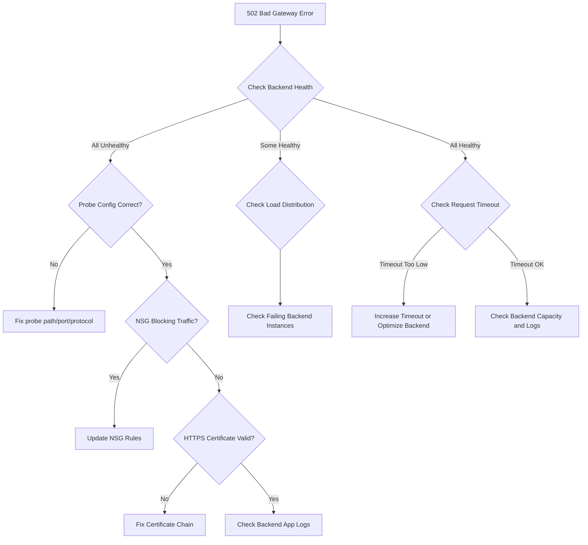

# How to Fix '502 Bad Gateway' Errors in Azure Application Gateway

Author: [nawazdhandala](https://www.github.com/nawazdhandala)

Tags: Azure, Application Gateway, 502 Bad Gateway, Troubleshooting, Networking, Load Balancing, Cloud

Description: Learn how to diagnose and fix 502 Bad Gateway errors in Azure Application Gateway with step-by-step troubleshooting techniques and configuration fixes.

---

If you have been running workloads behind Azure Application Gateway for any length of time, you have probably encountered the dreaded 502 Bad Gateway error at least once. It is one of the most common issues teams hit, and unfortunately the root cause is not always obvious. The error means the Application Gateway tried to forward a request to a backend server and either got an invalid response, no response at all, or a connection timeout.

In this post, I will walk through the most common causes and how to fix each one systematically.

## What Does a 502 Bad Gateway Actually Mean?

When Application Gateway returns a 502, it is telling you that it successfully received the client request, but something went wrong when it tried to communicate with the backend pool member. The gateway acts as a reverse proxy, so when the backend is unreachable, returns garbage, or takes too long to respond, the client sees a 502.

There are several flavors of this problem, and the fix depends on which one you are dealing with.

## Step 1: Check Backend Health

The very first thing to do is check the backend health status in the Azure portal. Navigate to your Application Gateway resource, then go to **Backend health** under the Monitoring section.

You will see one of three statuses for each backend pool member:

- **Healthy** - The backend is responding to health probes correctly.
- **Unhealthy** - The health probe is failing.
- **Unknown** - The health probe has not completed or the gateway cannot reach the backend.

If backends show as Unhealthy, the 502 is almost certainly caused by failed health probes. The gateway will not route traffic to unhealthy backends, and if all backends are unhealthy, every request returns a 502.

## Step 2: Verify Health Probe Configuration

Misconfigured health probes are the number one cause of 502 errors I have seen in production. Here is what to check:

**Probe path**: Make sure the probe path actually returns a 200 OK on your backend. A common mistake is using a path like `/health` when the application does not have that endpoint, or using `/` when the app redirects to `/login` with a 302.

**Probe protocol and port**: If your backend runs on port 8080 with HTTP but the probe is configured for HTTPS on port 443, the probe will fail.

**Timeout and interval settings**: The default probe timeout is 30 seconds. If your backend is slow to start or has occasional latency spikes, the probe might time out.

You can test the probe manually by SSHing into a VM in the same VNet and running curl against the backend:

```bash
# Test the health probe endpoint directly from within the VNet
# Replace with your actual backend IP and probe path
curl -v http://10.0.1.4:8080/health

# Check if the backend is listening on the expected port
nc -zv 10.0.1.4 8080
```

## Step 3: Check NSG and Firewall Rules

Azure Network Security Groups (NSGs) can silently block traffic between the Application Gateway subnet and your backend pool. Application Gateway v2 requires specific inbound rules on its subnet.

Make sure the following are in place:

- The Application Gateway subnet NSG allows inbound traffic on ports 65503-65534 for the v1 SKU, or ports 65200-65535 for the v2 SKU. These ports are used by Azure infrastructure for health communication.
- The backend subnet NSG allows inbound traffic from the Application Gateway subnet on the port your application listens on.
- If you are using a custom firewall appliance or Azure Firewall between the gateway and backend, make sure it allows the traffic through.

Here is what the NSG rule should look like for Application Gateway v2 infrastructure ports:

```bash
# Create an NSG rule allowing Azure infrastructure health probes
az network nsg rule create \
  --resource-group myResourceGroup \
  --nsg-name myAppGwSubnetNSG \
  --name AllowGatewayManager \
  --priority 100 \
  --direction Inbound \
  --access Allow \
  --protocol Tcp \
  --source-address-prefixes GatewayManager \
  --destination-port-ranges 65200-65535 \
  --description "Allow Azure infrastructure health communication for App Gateway v2"
```

## Step 4: Validate Backend Server Certificates (HTTPS Backends)

If your Application Gateway is configured to use HTTPS when communicating with backend servers, certificate issues are a frequent cause of 502 errors.

The backend server certificate must meet these requirements:

- It must not be expired.
- If it is self-signed, the root certificate must be uploaded to the Application Gateway trusted root certificates (for v2 SKU) or authentication certificates (for v1 SKU).
- The Common Name (CN) or Subject Alternative Name (SAN) must match the hostname the gateway uses to reach the backend.
- The full certificate chain must be presented by the backend server.

You can check the certificate from within the VNet:

```bash
# Inspect the SSL certificate presented by the backend server
# Look at the CN, SAN, expiry date, and certificate chain
openssl s_client -connect 10.0.1.4:443 -servername mybackend.example.com < /dev/null 2>/dev/null | openssl x509 -noout -subject -dates -ext subjectAltName
```

## Step 5: Look at Connection Timeouts

Application Gateway has a request timeout setting (default 20 seconds for v1, 20 seconds for v2). If your backend takes longer than this to respond, the gateway closes the connection and returns a 502.

This is especially common with:

- API endpoints that run heavy database queries
- File upload endpoints
- Report generation endpoints

You can increase the timeout in the HTTP settings:

```bash
# Update the request timeout to 60 seconds on the backend HTTP settings
az network application-gateway http-settings update \
  --resource-group myResourceGroup \
  --gateway-name myAppGateway \
  --name myBackendHttpSettings \
  --timeout 60
```

But bumping the timeout is just a bandaid. If your backend regularly takes more than 20 seconds to respond, you should investigate why and consider moving long-running operations to a background queue.

## Step 6: Check Backend Pool Member Registration

A subtle cause of 502 errors is having the wrong IP addresses or FQDNs in the backend pool. This happens more often than you would think, especially in environments where infrastructure gets recreated frequently.

- If you are using IP addresses, verify they match the actual private IPs of your backend VMs or containers.
- If you are using FQDNs, verify DNS resolves correctly from the Application Gateway subnet.
- If you are pointing at an App Service, make sure you are using the App Service FQDN (myapp.azurewebsites.net) and not a custom domain that might not resolve internally.

## Step 7: Check for Backend Capacity Issues

Sometimes the backend is technically reachable but overwhelmed. If all your backend instances are maxing out CPU or memory, they might fail to respond to health probes in time, or they might accept connections but never send a response.

Check the following on your backend servers:

- CPU and memory utilization
- Active connection count
- Application-level error logs
- Thread pool exhaustion (common in Java and .NET apps)

## Step 8: Review Application Gateway Diagnostics Logs

Enable diagnostics logging if you have not already. The Access log and Performance log give you detailed information about every request, including backend response codes and latency.

```bash
# Enable diagnostics logging for the Application Gateway
az monitor diagnostic-settings create \
  --resource /subscriptions/<sub-id>/resourceGroups/myRG/providers/Microsoft.Network/applicationGateways/myAppGw \
  --name myDiagSettings \
  --workspace /subscriptions/<sub-id>/resourceGroups/myRG/providers/Microsoft.OperationalInsights/workspaces/myWorkspace \
  --logs '[{"category":"ApplicationGatewayAccessLog","enabled":true},{"category":"ApplicationGatewayPerformanceLog","enabled":true},{"category":"ApplicationGatewayFirewallLog","enabled":true}]'
```

Once logs are flowing into Log Analytics, you can query for 502 errors specifically:

```kusto
// Find all 502 responses and show the backend details
AzureDiagnostics
| where ResourceType == "APPLICATIONGATEWAYS"
| where httpStatus_d == 502
| project TimeGenerated, requestUri_s, backendAddress_s, backendResponseCode_d, timeTaken_d
| order by TimeGenerated desc
| take 50
```

## Step 9: Verify the Application Gateway Subnet Size

Application Gateway v2 requires a dedicated subnet, and it needs enough IP addresses for the number of instances plus any private frontend IPs. If the subnet is too small (like a /29), the gateway might not be able to scale out, leading to intermittent 502 errors under load.

Microsoft recommends a /24 subnet for Application Gateway v2, which gives you room to grow. A /26 is the minimum practical size.

## Quick Troubleshooting Flowchart

Here is a decision tree to help you quickly narrow down the cause:



## Wrapping Up

The 502 Bad Gateway error in Azure Application Gateway almost always comes down to one of a few causes: failed health probes, NSG rules blocking traffic, certificate mismatches on HTTPS backends, or backend servers that are unreachable or too slow. Start with the backend health status in the portal, then work through the checklist above.

The key takeaway is to always verify your health probes are actually testing something meaningful and that network-level connectivity between the gateway subnet and backend subnet is solid. Once those two things are confirmed, the remaining causes are usually application-level and show up in your backend server logs.
