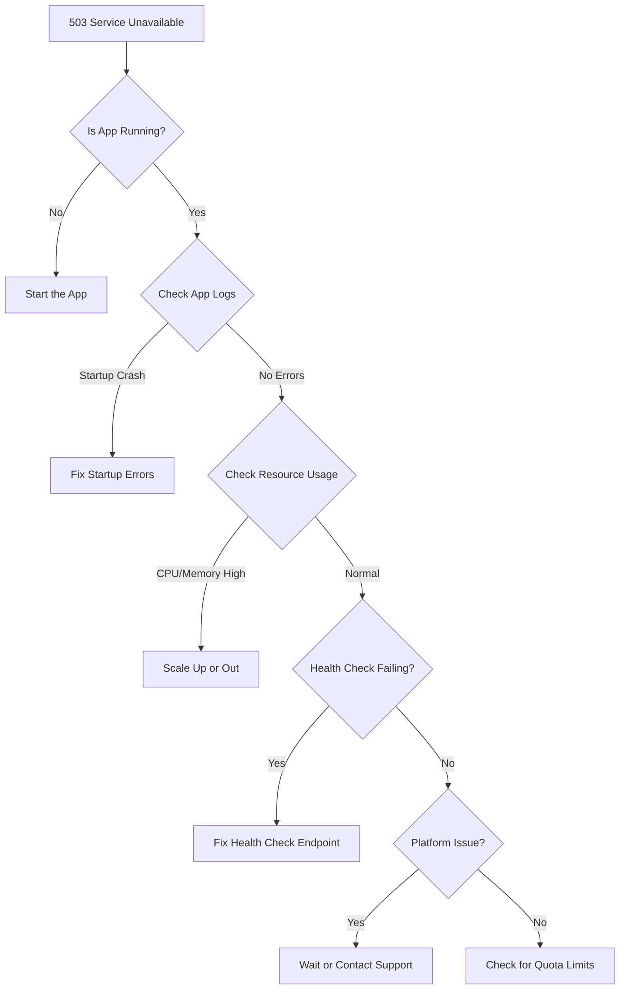

# How to Fix '503 Service Unavailable' Errors in Azure App Service

Author: [nawazdhandala](https://www.github.com/nawazdhandala)

Tags: Azure, App Service, 503 Error, Troubleshooting, Web Apps, Cloud, Performance

Description: Diagnose and resolve 503 Service Unavailable errors in Azure App Service with practical debugging steps and configuration fixes.

---

A 503 Service Unavailable error from Azure App Service tells you the server exists, it received your request, but it cannot handle it right now. Unlike a 500 Internal Server Error which usually means your app code blew up, a 503 typically means the platform itself is struggling to serve the request. This could be because the app has not started, a worker process crashed, or the platform is throttling your instance.

Let me walk you through the most common root causes and how to fix each one.

## Understanding the 503 Error in App Service Context

Azure App Service runs your web application on managed infrastructure. When you see a 503, the request made it to the App Service frontend load balancer, but the worker instance running your app could not serve it. The most frequent reasons are:

- The application is still starting up (cold start)
- The worker process has crashed and is restarting
- You have exceeded the resource limits for your App Service Plan tier
- The app has been stopped or is in a failed state
- Auto-scaling has not kicked in fast enough for a traffic spike

## Step 1: Check If the App Is Actually Running

This seems obvious, but it catches people more than you would expect. Go to your App Service in the Azure portal and check the **Overview** page. Look at the **Status** field. If it says "Stopped," your app is not running and every request will get a 503.

```bash
# Check the current state of your App Service
az webapp show \
  --resource-group myResourceGroup \
  --name myWebApp \
  --query "state" \
  --output tsv

# If stopped, start it
az webapp start \
  --resource-group myResourceGroup \
  --name myWebApp
```

Also check if the App Service Plan itself is in a healthy state. If you are on a Free or Shared tier, your app can be stopped automatically when you hit the daily CPU quota.

## Step 2: Check Application Logs for Startup Failures

If the app is supposed to be running but keeps returning 503, the worker process might be crashing on startup. This is extremely common with Node.js and Python apps where a missing dependency or bad configuration prevents the process from starting.

Enable application logging first:

```bash
# Enable application logging to the filesystem
az webapp log config \
  --resource-group myResourceGroup \
  --name myWebApp \
  --application-logging filesystem \
  --level verbose \
  --detailed-error-messages true \
  --failed-request-tracing true
```

Then stream the logs in real time:

```bash
# Stream live logs from the App Service
# This shows stdout and stderr from your application process
az webapp log tail \
  --resource-group myResourceGroup \
  --name myWebApp
```

Look for errors during startup. Common culprits include:

- Missing environment variables that the app needs to initialize
- Database connection strings pointing to unreachable hosts
- Port binding issues (App Service expects your app to listen on the port specified in the `PORT` environment variable or `WEBSITES_PORT` app setting)
- Missing native dependencies or incompatible runtime versions

## Step 3: Verify the Health Check Configuration

If you have configured a health check path for your App Service, instances that fail the health check will be removed from the load balancer rotation. If all instances fail, you get 503s across the board.

Check your health check configuration:

```bash
# View the current health check path
az webapp show \
  --resource-group myResourceGroup \
  --name myWebApp \
  --query "siteConfig.healthCheckPath" \
  --output tsv
```

Make sure the health check path returns a 200 status within the timeout period. If your health check endpoint hits a database or external service, a failure in that dependency will make the health check fail, even though your app might be perfectly capable of serving other requests.

I have seen cases where teams set the health check to `/api/health` which queries the database, and when the database has a brief network blip, every single instance gets marked unhealthy and all traffic fails with 503. Keep your health check simple - a basic endpoint that confirms the process is running is usually enough.

## Step 4: Check Resource Limits and Quotas

Every App Service Plan tier has limits on CPU, memory, connections, and storage. When your app hits these limits, the platform may return 503 errors.

For Free and Shared tiers, these limits are quite aggressive:

- Free tier: 60 CPU minutes per day
- Shared tier: 240 CPU minutes per day

Once you exceed the CPU quota, your app is stopped until the next day. If you are running anything beyond a personal project, move to at least the Basic tier.

For Standard and Premium tiers, resource limits are per-instance. Check the **App Service Plan** metrics:

```bash
# Check CPU and memory percentage for the App Service Plan
az monitor metrics list \
  --resource /subscriptions/<sub-id>/resourceGroups/myRG/providers/Microsoft.Web/serverfarms/myAppPlan \
  --metric "CpuPercentage,MemoryPercentage" \
  --interval PT5M \
  --output table
```

If CPU or memory is consistently above 80%, you need to either scale up (bigger instance) or scale out (more instances).

## Step 5: Investigate Worker Process Crashes

On Windows App Service, the worker process is managed by IIS through the `w3wp.exe` process. On Linux, it is whatever process your runtime uses (Node, Python, .NET, Java, etc.). If this process crashes repeatedly, App Service will eventually stop restarting it for a cooldown period, during which you get 503s.

Check the **Diagnose and solve problems** blade in the Azure portal. Under **Availability and Performance**, look for **Web App Restarted** and **Application Crashes** detectors. These give you a timeline of when crashes happened and often include the crash stack trace.

For .NET applications specifically, check if you have the `stdoutLogEnabled` setting turned on in your web.config:

```xml
<!-- Enable stdout logging to capture crash details -->
<!-- Set stdoutLogEnabled to true for debugging, but disable in production after fixing the issue -->
<aspNetCore processPath="dotnet"
            arguments=".\MyApp.dll"
            stdoutLogEnabled="true"
            stdoutLogFile="\\?\%home%\LogFiles\stdout"
            hostingModel="inprocess" />
```

## Step 6: Handle Cold Start Issues

Cold starts happen when your app needs to be loaded onto a fresh instance - either because it has been idle, because a new instance is being spun up during auto-scaling, or after a deployment. During this time, requests may get 503 errors.

To mitigate cold starts:

**Use Always On**: In your App Service configuration, enable **Always On**. This sends periodic requests to keep your app warm. Note that Always On requires Basic tier or above.

```bash
# Enable Always On to prevent cold starts from idle timeout
az webapp config set \
  --resource-group myResourceGroup \
  --name myWebApp \
  --always-on true
```

**Use deployment slots with warm-up**: Deploy to a staging slot, wait for it to warm up, then swap to production. The swap operation warms up the destination slot before routing traffic.

**Pre-warm with health check**: If you have the health check feature enabled, App Service will wait for the health check to pass before routing traffic to a new instance.

## Step 7: Check for Platform-Level Issues

Sometimes the 503 is not your fault at all. Azure platform incidents can affect App Service availability. Check:

- [Azure Status Page](https://status.azure.com) for ongoing incidents
- The **Resource health** blade on your App Service for platform-detected issues
- The **Diagnose and solve problems** blade for platform alerts

```bash
# Check the resource health status
az resource show \
  --ids /subscriptions/<sub-id>/resourceGroups/myRG/providers/Microsoft.Web/sites/myWebApp/providers/Microsoft.ResourceHealth/availabilityStatuses/current \
  --api-version 2020-05-01
```

## Step 8: Review Auto-Scale Configuration

If you are using auto-scaling and your scale rules are too conservative, traffic spikes can overwhelm your existing instances before new ones come online. This leads to 503 errors during the scale-out period.

Review your auto-scale settings:

- Decrease the cool-down period so new instances can be added faster
- Set a higher minimum instance count during known peak hours
- Use schedule-based scaling in addition to metric-based scaling for predictable traffic patterns

```bash
# View current autoscale settings for your App Service Plan
az monitor autoscale show \
  --resource-group myResourceGroup \
  --name myAutoScaleSetting \
  --output yaml
```

## A Diagnostic Flowchart

Here is a visual guide for working through 503 errors:



## Prevention Tips

To avoid 503 errors in production:

1. Always use at least the Basic tier for production workloads. Free and Shared tiers have daily quotas that will shut your app down.
2. Enable Always On to prevent idle unloading.
3. Set up auto-scaling with sensible thresholds so you can handle traffic spikes.
4. Use deployment slots for zero-downtime deployments.
5. Keep health check endpoints lightweight - do not let them depend on external services.
6. Set up monitoring and alerts on HTTP 503 responses so you catch issues early.

The 503 error in App Service is almost always a capacity or startup issue. Once you identify which category your problem falls into, the fix is usually straightforward.
