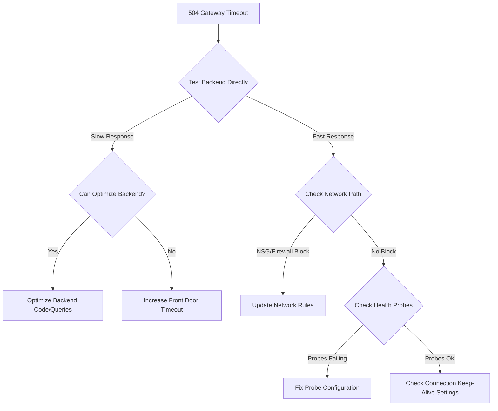

# How to Fix '504 Gateway Timeout' Errors in Azure Front Door

Author: [nawazdhandala](https://www.github.com/nawazdhandala)

Tags: Azure, Front Door, 504 Gateway Timeout, Troubleshooting, CDN, Networking, Performance

Description: Step-by-step guide to diagnosing and resolving 504 Gateway Timeout errors in Azure Front Door with practical fixes.

---

Azure Front Door is a global load balancer and CDN that sits in front of your backend services. When it returns a 504 Gateway Timeout, it means Front Door sent a request to your backend origin but did not get a response within the configured timeout period. The client is left waiting, and eventually Front Door gives up and returns the 504.

This is a frustrating error because the problem could be anywhere in the chain - the backend could be slow, the network path could have issues, or the timeout configuration might just be too aggressive. Let me break down how to find the actual cause and fix it.

## How Azure Front Door Handles Requests

Before diving into fixes, it helps to understand the request flow. When a client makes a request to your Front Door endpoint:

1. The request hits the nearest Front Door POP (Point of Presence).
2. Front Door evaluates routing rules to determine which backend pool to use.
3. It forwards the request to the healthiest and closest backend in that pool.
4. The backend processes the request and sends the response back through Front Door to the client.

A 504 happens when step 4 does not complete in time. Front Door has a default origin response timeout of 60 seconds (for Azure Front Door Standard/Premium) or 30 seconds (for classic Front Door).

## Step 1: Check the Backend Response Time

The most common cause of 504 errors is simply that your backend is too slow. Start by checking how long your backend actually takes to respond, bypassing Front Door entirely.

```bash
# Hit the backend origin directly to measure response time
# Replace with your actual backend URL
curl -o /dev/null -s -w "Total time: %{time_total}s\nConnect: %{time_connect}s\nTTFB: %{time_starttransfer}s\n" https://mybackend.azurewebsites.net/api/slow-endpoint

# If you need to test from a specific region, use Azure Cloud Shell
# in that region or an Azure VM
```

If the backend takes longer than the Front Door timeout to respond, that is your problem. You have two options: optimize the backend to respond faster, or increase the timeout.

## Step 2: Increase the Origin Response Timeout

If the slow response time is expected (for example, a report generation endpoint), you can increase the timeout in Front Door.

For Azure Front Door Standard/Premium:

```bash
# Update the origin response timeout for a Front Door route
# Maximum allowed value is 240 seconds
az afd route update \
  --resource-group myResourceGroup \
  --profile-name myFrontDoor \
  --endpoint-name myEndpoint \
  --route-name myRoute \
  --origin-response-timeout-seconds 120
```

For classic Azure Front Door, the timeout is set at the profile level:

```bash
# Update the backend timeout for classic Front Door
az network front-door update \
  --resource-group myResourceGroup \
  --name myFrontDoor \
  --send-recv-timeout 120
```

Keep in mind that increasing the timeout means clients wait longer for a response. For user-facing endpoints, anything over 30 seconds is a poor experience. Consider using asynchronous patterns (return a 202 Accepted and poll for results) for long-running operations.

## Step 3: Check Backend Health Probes

Front Door uses health probes to determine if backends are available. If health probes are failing or if the backend is being marked unhealthy, Front Door might route traffic to a less optimal backend that is further away or overloaded, increasing response times and causing timeouts.

Check the backend health status:

```bash
# View the health probe results for your backend pool
az network front-door backend-pool show \
  --resource-group myResourceGroup \
  --front-door-name myFrontDoor \
  --name myBackendPool \
  --output yaml
```

Common health probe issues that indirectly cause 504s:

- Probe path returns a redirect (301/302) instead of a 200. Front Door classic does not follow redirects for health probes.
- Probe interval is too frequent, adding load to the backend.
- Healthy backends are incorrectly marked as unhealthy, forcing traffic to fewer backends.

## Step 4: Investigate Network Connectivity

The network path between Front Door and your backend can introduce latency or connection failures. Here are the common network issues:

**NSG or Firewall blocking Front Door**: If your backend is behind an NSG or Azure Firewall, make sure traffic from the `AzureFrontDoor.Backend` service tag is allowed.

```bash
# Allow inbound traffic from Azure Front Door to your backend
az network nsg rule create \
  --resource-group myResourceGroup \
  --nsg-name myBackendNSG \
  --name AllowFrontDoor \
  --priority 100 \
  --direction Inbound \
  --access Allow \
  --protocol Tcp \
  --source-address-prefixes AzureFrontDoor.Backend \
  --destination-port-ranges 443 \
  --description "Allow traffic from Azure Front Door"
```

**Private Link origins**: If you are using Private Link to connect Front Door to your backend, the Private Endpoint must be approved and the connection must be in a "Connected" state. A pending or rejected Private Link connection will cause timeouts.

**Backend in a different region**: If your backend is geographically far from the nearest Front Door POP, the added network latency eats into your timeout budget. Consider deploying backend instances in multiple regions.

## Step 5: Check for Connection Draining and Keep-Alive Issues

Front Door reuses TCP connections to backends when possible. If your backend closes connections aggressively or has a very short keep-alive timeout, Front Door might try to send a request on a connection that the backend has already closed. This results in a failed request and a retry, which can push total time past the timeout threshold.

Make sure your backend's keep-alive timeout is longer than Front Door's idle timeout. For most web servers:

```nginx
# Nginx - set keepalive timeout higher than Front Door's idle timeout
# Front Door has a 90-second idle timeout
keepalive_timeout 95s;

# Also increase proxy timeouts if Nginx is reverse proxying to an app server
proxy_connect_timeout 60s;
proxy_read_timeout 120s;
proxy_send_timeout 60s;
```

For IIS or Kestrel backends, configure similar keep-alive settings.

## Step 6: Analyze Front Door Diagnostics Logs

Front Door diagnostics logs give you detailed information about every request, including the backend response time, the origin it selected, and error details.

Enable diagnostics:

```bash
# Enable Front Door access logs to Log Analytics
az monitor diagnostic-settings create \
  --resource "/subscriptions/<sub-id>/resourceGroups/myRG/providers/Microsoft.Cdn/profiles/myFrontDoor" \
  --name myDiagSettings \
  --workspace "/subscriptions/<sub-id>/resourceGroups/myRG/providers/Microsoft.OperationalInsights/workspaces/myWorkspace" \
  --logs '[{"category":"FrontDoorAccessLog","enabled":true},{"category":"FrontDoorHealthProbeLog","enabled":true}]'
```

Query for 504 errors:

```kusto
// Find 504 errors with backend timing details
AzureDiagnostics
| where ResourceProvider == "MICROSOFT.CDN"
| where httpStatusCode_d == 504
| project TimeGenerated, requestUri_s, originName_s, originResponseTime_s, routeName_s, clientIp_s
| order by TimeGenerated desc
| take 100
```

The `originResponseTime_s` field tells you how long Front Door waited for the backend. If this is close to your timeout setting, the backend is genuinely slow.

## Step 7: Check for Large Request or Response Bodies

Large request payloads (like file uploads) or large response bodies (like big API responses) can cause timeouts if the transfer takes too long. Front Door has limits on request body size:

- Standard/Premium: 2 GB maximum
- Classic: Request body is not buffered, but the transfer must complete within the timeout

If you are dealing with large file uploads, consider using direct-to-storage upload patterns (generate a SAS token and let the client upload directly to Azure Blob Storage) instead of routing through Front Door.

## Step 8: Review Origin Group Load Balancing Settings

If you have multiple origins in an origin group, Front Door distributes traffic based on the load balancing configuration. If one origin is consistently slower than others, it can cause 504s for a percentage of requests.

Check the weight and priority settings:

```bash
# List origins and their weights in an origin group
az afd origin list \
  --resource-group myResourceGroup \
  --profile-name myFrontDoor \
  --origin-group-name myOriginGroup \
  --output table
```

Consider removing or reducing the weight of slow origins, or investigate why specific origins are slower (perhaps they are in a region with less capacity).

## Troubleshooting Decision Tree



## Summary

504 errors in Azure Front Door boil down to the backend not responding fast enough. Start by testing the backend directly to measure actual response time. If the backend is genuinely slow, optimize it or increase the timeout. If the backend responds quickly when hit directly but times out through Front Door, focus on network connectivity - NSGs, firewalls, Private Link status, and keep-alive configuration.

Enable diagnostic logging from the start. Having access to per-request timing data makes troubleshooting dramatically faster. And if you are running long-running operations behind Front Door, architect them to use asynchronous patterns instead of making the client wait.
