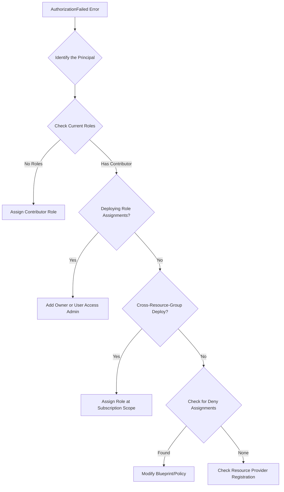

# How to Fix 'AuthorizationFailed' Errors When Deploying Azure Resources with ARM Templates

Author: [nawazdhandala](https://www.github.com/nawazdhandala)

Tags: Azure, ARM Templates, Authorization, RBAC, Troubleshooting, Infrastructure as Code, Deployment

Description: Learn how to diagnose and resolve AuthorizationFailed errors during Azure ARM template deployments with RBAC troubleshooting techniques.

---

You have your ARM template ready, you kick off the deployment, and within seconds you get hit with an AuthorizationFailed error. The message usually looks something like:

```
The client '<object-id>' with object id '<object-id>' does not have authorization
to perform action 'Microsoft.Compute/virtualMachines/write' over scope
'/subscriptions/<sub-id>/resourceGroups/myRG/providers/Microsoft.Compute/virtualMachines/myVM'
```

This is Azure's way of telling you that the identity running the deployment does not have permission to create or modify the resource you are trying to deploy. The fix is always about RBAC (Role-Based Access Control), but figuring out exactly which permission is missing and where to grant it takes some detective work.

## Understanding the Error

The AuthorizationFailed error tells you three things:

1. **Who** is trying to perform the action (the object ID of the principal)
2. **What** action they are trying to perform (like `Microsoft.Compute/virtualMachines/write`)
3. **Where** they are trying to perform it (the resource scope)

The identity could be a user, a service principal, a managed identity, or an Azure DevOps service connection. The first step is figuring out which identity is involved and what roles it currently has.

## Step 1: Identify the Deploying Principal

If you are deploying from the CLI, the identity is your logged-in user or service principal:

```bash
# Check which identity you are currently using
az account show --query "{user: user.name, type: user.type, subscriptionId: id}" --output table

# If using a service principal, find its details
az ad sp show --id <object-id-from-error> --query "{displayName: displayName, appId: appId}" --output table
```

If you are deploying from Azure DevOps or GitHub Actions, the identity is the service connection's service principal. You can find its object ID in the pipeline logs or in the Azure portal under App registrations.

## Step 2: Check Current Role Assignments

Once you know who the principal is, check what roles they have:

```bash
# List role assignments for a specific principal at the subscription level
az role assignment list \
  --assignee <object-id-or-email> \
  --subscription <subscription-id> \
  --output table

# List role assignments at a specific resource group
az role assignment list \
  --assignee <object-id-or-email> \
  --resource-group myResourceGroup \
  --output table

# Include inherited assignments from higher scopes
az role assignment list \
  --assignee <object-id-or-email> \
  --all \
  --output table
```

Common roles and what they allow:

- **Reader**: Can view resources but not create or modify them
- **Contributor**: Can create and modify resources but cannot manage RBAC
- **Owner**: Full access including RBAC management
- **Custom roles**: May have specific permissions that do not cover what you need

## Step 3: Determine the Required Permissions

The error message tells you exactly which action is being denied. Match this to the right role. Azure has hundreds of built-in roles, and each grants a specific set of permissions.

```bash
# Find which built-in roles include a specific action
# For example, find roles that allow creating virtual machines
az role definition list \
  --query "[?contains(permissions[0].actions, 'Microsoft.Compute/virtualMachines/write')].{roleName: roleName, description: description}" \
  --output table
```

For ARM template deployments that create multiple resource types, you might need permissions for several different resource providers. A typical web application deployment might need:

- `Microsoft.Web/sites/write` (App Service)
- `Microsoft.Web/serverfarms/write` (App Service Plan)
- `Microsoft.Sql/servers/write` (SQL Server)
- `Microsoft.Storage/storageAccounts/write` (Storage)
- `Microsoft.Network/virtualNetworks/write` (VNet)

The Contributor role covers all of these. If you are using a more restrictive custom role, you need to add each action explicitly.

## Step 4: Grant the Necessary Role

Once you know which role is needed, assign it at the appropriate scope:

```bash
# Assign the Contributor role at the resource group level
# This is the most common scope for deployment service principals
az role assignment create \
  --assignee <object-id-or-email> \
  --role "Contributor" \
  --resource-group myResourceGroup

# Or assign at the subscription level if deploying to multiple resource groups
az role assignment create \
  --assignee <object-id-or-email> \
  --role "Contributor" \
  --scope "/subscriptions/<subscription-id>"
```

RBAC changes can take up to 5 minutes to propagate. If you assign a role and immediately retry the deployment, it might still fail. Wait a few minutes and try again.

## Common Scenarios and Fixes

### Scenario 1: Service Principal Has Contributor but Still Fails

If the principal has Contributor at the resource group level but the ARM template tries to create resources at the subscription level (like resource groups themselves, or policy assignments), the deployment will fail.

When your template includes `Microsoft.Resources/resourceGroups` or deploys across multiple resource groups, the principal needs permissions at the subscription level.

```bash
# Grant Contributor at subscription level for cross-resource-group deployments
az role assignment create \
  --assignee <service-principal-id> \
  --role "Contributor" \
  --scope "/subscriptions/<subscription-id>"
```

### Scenario 2: Deploying Role Assignments in the Template

If your ARM template includes role assignments (assigning RBAC roles as part of the deployment), the deploying identity needs the `Microsoft.Authorization/roleAssignments/write` permission. The Contributor role does NOT include this.

You need either the Owner role or the User Access Administrator role:

```bash
# Grant User Access Administrator to allow creating role assignments
az role assignment create \
  --assignee <service-principal-id> \
  --role "User Access Administrator" \
  --resource-group myResourceGroup
```

A safer approach is to create a custom role that only allows specific role assignment operations:

```json
{
  "Name": "RBAC Deployer",
  "Description": "Can assign specific roles during ARM deployments",
  "Actions": [
    "Microsoft.Authorization/roleAssignments/write",
    "Microsoft.Authorization/roleAssignments/delete"
  ],
  "NotActions": [],
  "AssignableScopes": [
    "/subscriptions/<subscription-id>/resourceGroups/myResourceGroup"
  ]
}
```

### Scenario 3: Managed Identity Permissions

If your ARM template uses a user-assigned managed identity for deployment (via `deploymentScripts` or deployment stacks), that managed identity needs the right roles too.

```bash
# Assign Contributor to a managed identity
az role assignment create \
  --assignee-object-id <managed-identity-principal-id> \
  --assignee-principal-type ServicePrincipal \
  --role "Contributor" \
  --resource-group myResourceGroup
```

### Scenario 4: Deny Assignments Blocking Access

Azure has Deny assignments that explicitly block actions, and they take precedence over role assignments. Azure Blueprints and some management group policies use deny assignments.

```bash
# Check for deny assignments on a resource group
az rest \
  --method GET \
  --url "https://management.azure.com/subscriptions/<sub-id>/resourceGroups/myRG/providers/Microsoft.Authorization/denyAssignments?api-version=2022-04-01"
```

If a deny assignment is blocking you, you need to either modify the blueprint/policy that created it or find a way to work within its constraints.

### Scenario 5: Resource Provider Not Registered

Sometimes what looks like an authorization error is actually a resource provider registration issue. If the resource provider is not registered in the subscription, the deployment fails with a confusing error.

```bash
# Check if a resource provider is registered
az provider show \
  --namespace Microsoft.Compute \
  --query "registrationState" \
  --output tsv

# Register a resource provider
az provider register --namespace Microsoft.Compute
```

## Debugging with Azure Activity Log

The Azure Activity Log records every authorization failure with details about what was attempted and why it failed:

```bash
# Query activity log for authorization failures in the last hour
az monitor activity-log list \
  --resource-group myResourceGroup \
  --start-time $(date -u -d '1 hour ago' +%Y-%m-%dT%H:%M:%SZ) \
  --query "[?authorization.action && status.value=='Failed'].{action: authorization.action, scope: authorization.scope, caller: caller, message: status.localizedValue}" \
  --output table
```

## Troubleshooting Flowchart



## Best Practices

1. **Use least-privilege**: Do not give Owner to everything. Start with Contributor and add specific permissions as needed.
2. **Scope roles narrowly**: Assign at the resource group level when possible, not the subscription level.
3. **Use custom roles for CI/CD**: Create a custom role that has exactly the permissions your pipeline needs, nothing more.
4. **Document required permissions**: Add a comment or README to your ARM templates listing which roles the deploying principal needs.
5. **Test role assignments**: Use the `az role assignment` commands to verify permissions before running long deployments.

The AuthorizationFailed error is always solvable. It just takes methodically matching the denied action to the right role and granting it at the right scope.
