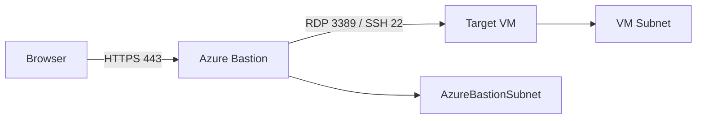

# How to Fix Azure Bastion Connection Failures to Virtual Machines in Private Subnets

Author: [nawazdhandala](https://www.github.com/nawazdhandala)

Tags: Azure, Bastion, Virtual Machines, Private Subnets, Networking, Remote Access, Troubleshooting

Description: Troubleshoot and resolve Azure Bastion connection failures to VMs in private subnets including NSG rules, subnet configuration, and connectivity issues.

---

Azure Bastion provides secure RDP and SSH access to your VMs without exposing them to the public internet. No public IPs on VMs, no VPN clients to manage, and connections happen through the Azure portal or native client. When it works, it is seamless. When it does not, you get a generic "connection failed" message that gives you almost nothing to work with.

I have troubleshot Bastion connectivity issues across dozens of Azure environments. The failures almost always come down to NSG rules, subnet configuration, or network routing. Let me walk you through each scenario systematically.

## How Azure Bastion Connects to VMs

Understanding the connection flow is essential for troubleshooting. When you click "Connect" in the portal:

1. Your browser connects to the Bastion host over HTTPS (port 443)
2. The Bastion host initiates a connection to the target VM over the Azure backbone network
3. For RDP, Bastion connects to the VM on port 3389
4. For SSH, Bastion connects to the VM on port 22
5. The session is proxied through the Bastion host back to your browser



Failures can occur at any of these hops. Let me cover the most common ones.

## Prerequisite: Subnet Configuration

Azure Bastion requires a dedicated subnet named exactly `AzureBastionSubnet`. The name is not flexible. If the subnet has any other name, Bastion deployment fails.

The subnet must be at least /26 (64 addresses) for the Basic SKU and /26 for the Standard SKU. Smaller subnets do not work.

```bash
# Check if AzureBastionSubnet exists in your VNet
az network vnet subnet show \
  --resource-group myResourceGroup \
  --vnet-name myVNet \
  --name AzureBastionSubnet \
  -o table

# If it does not exist, create it
az network vnet subnet create \
  --resource-group myResourceGroup \
  --vnet-name myVNet \
  --name AzureBastionSubnet \
  --address-prefixes 10.0.1.0/26
```

The AzureBastionSubnet must not have a route table that changes the default route. If you have a UDR with 0.0.0.0/0 pointing to an NVA or firewall, Bastion connectivity breaks because its management traffic cannot reach the Azure control plane.

## Problem: NSG Rules Blocking Bastion Traffic

NSG rules are the number one cause of Bastion connection failures. Both the AzureBastionSubnet NSG and the target VM subnet NSG need specific rules.

### Required NSG Rules on AzureBastionSubnet

The Bastion subnet NSG needs to allow:

**Inbound:**
- Port 443 from the Internet (for user connections)
- Port 443 from the GatewayManager service tag (for Bastion management)
- Port 443 from the AzureLoadBalancer service tag (for health probes)

**Outbound:**
- Port 3389 and 22 to the VirtualNetwork service tag (to reach VMs)
- Port 443 to the AzureCloud service tag (for Bastion management)

```bash
# Create NSG for AzureBastionSubnet with required rules
az network nsg create --resource-group myRG --name nsg-bastion

# Inbound: Allow HTTPS from Internet (user connections)
az network nsg rule create --resource-group myRG --nsg-name nsg-bastion \
  --name AllowHttpsInbound --priority 100 --direction Inbound \
  --access Allow --protocol Tcp --source-address-prefixes Internet \
  --source-port-ranges '*' --destination-port-ranges 443

# Inbound: Allow Gateway Manager (Bastion management)
az network nsg rule create --resource-group myRG --nsg-name nsg-bastion \
  --name AllowGatewayManagerInbound --priority 110 --direction Inbound \
  --access Allow --protocol Tcp --source-address-prefixes GatewayManager \
  --source-port-ranges '*' --destination-port-ranges 443

# Inbound: Allow Azure Load Balancer
az network nsg rule create --resource-group myRG --nsg-name nsg-bastion \
  --name AllowAzureLoadBalancerInbound --priority 120 --direction Inbound \
  --access Allow --protocol Tcp --source-address-prefixes AzureLoadBalancer \
  --source-port-ranges '*' --destination-port-ranges 443

# Outbound: Allow SSH and RDP to VNet
az network nsg rule create --resource-group myRG --nsg-name nsg-bastion \
  --name AllowSshRdpOutbound --priority 100 --direction Outbound \
  --access Allow --protocol '*' --source-address-prefixes '*' \
  --source-port-ranges '*' --destination-address-prefixes VirtualNetwork \
  --destination-port-ranges 22 3389

# Outbound: Allow Azure Cloud (management traffic)
az network nsg rule create --resource-group myRG --nsg-name nsg-bastion \
  --name AllowAzureCloudOutbound --priority 110 --direction Outbound \
  --access Allow --protocol Tcp --source-address-prefixes '*' \
  --source-port-ranges '*' --destination-address-prefixes AzureCloud \
  --destination-port-ranges 443

# Associate NSG with AzureBastionSubnet
az network vnet subnet update \
  --resource-group myRG --vnet-name myVNet --name AzureBastionSubnet \
  --network-security-group nsg-bastion
```

### Required NSG Rules on Target VM Subnet

The VM's subnet NSG must allow inbound traffic from the Bastion subnet.

```bash
# Allow inbound RDP/SSH from the AzureBastionSubnet
az network nsg rule create --resource-group myRG --nsg-name nsg-vm-subnet \
  --name AllowBastionInbound --priority 100 --direction Inbound \
  --access Allow --protocol Tcp \
  --source-address-prefixes 10.0.1.0/26 \
  --source-port-ranges '*' --destination-port-ranges 22 3389
```

Replace `10.0.1.0/26` with your actual AzureBastionSubnet address range.

## Problem: VM Not Running or Not Responsive

Bastion cannot connect to a VM that is stopped (deallocated) or has a failed provisioning state. This sounds obvious, but I have seen tickets where the VM was stopped and the team did not realize it.

```bash
# Check VM power state
az vm get-instance-view \
  --resource-group myResourceGroup \
  --name myVM \
  --query "instanceView.statuses[1].displayStatus" -o tsv
```

The output should be "VM running". Any other state means Bastion cannot reach it.

Also check if the RDP or SSH service is actually running inside the VM. A running VM with a crashed SSH daemon will accept the connection but never complete the handshake.

## Problem: VNet Peering and Cross-VNet Access

Azure Bastion can connect to VMs in peered VNets, but only with the Standard or Premium SKU. The Basic SKU only supports VMs in the same VNet.

If you are using the Standard SKU and peered VNets, verify:

1. VNet peering is established and in the "Connected" state
2. "Allow forwarded traffic" is enabled on both peering connections
3. The VM subnet NSG allows traffic from the Bastion subnet (using the Bastion VNet address space)
4. No route tables are redirecting traffic between the VNets

```bash
# Check VNet peering status
az network vnet peering list \
  --resource-group myRG \
  --vnet-name myVNet \
  --query "[].{name:name, peeringState:peeringState, allowForwardedTraffic:allowForwardedTraffic}" \
  -o table
```

## Problem: Bastion SKU Limitations

The Basic SKU has several limitations that can cause unexpected connection failures:
- Cannot connect to VMs in peered VNets
- Does not support native client connections (only browser-based)
- No IP-based connection (must use VM resource)
- Limited concurrent connections

If you are hitting these limitations, upgrade to the Standard SKU.

```bash
# Check current Bastion SKU
az network bastion show \
  --resource-group myRG \
  --name myBastion \
  --query "sku.name" -o tsv

# Upgrade from Basic to Standard
az network bastion update \
  --resource-group myRG \
  --name myBastion \
  --sku Standard
```

## Problem: Browser or Client Issues

Sometimes the issue is on the client side. Bastion uses WebSockets for the session, and some corporate proxies or firewalls block WebSocket connections.

Symptoms: The portal shows "Connecting..." indefinitely, or the connection opens briefly and then drops.

Fixes:
- Try a different browser (Edge and Chrome work best with Bastion)
- Disable browser extensions that might interfere with WebSocket connections
- If behind a corporate proxy, verify WebSocket (wss://) traffic is allowed
- Use the native client connection instead of browser-based (Standard SKU only)

```bash
# Use native RDP client via Bastion (Standard SKU required)
az network bastion rdp \
  --name myBastion \
  --resource-group myRG \
  --target-resource-id "/subscriptions/{sub-id}/resourceGroups/myRG/providers/Microsoft.Compute/virtualMachines/myVM"

# Use native SSH via Bastion
az network bastion ssh \
  --name myBastion \
  --resource-group myRG \
  --target-resource-id "/subscriptions/{sub-id}/resourceGroups/myRG/providers/Microsoft.Compute/virtualMachines/myVM" \
  --auth-type ssh-key \
  --username azureuser \
  --ssh-key ~/.ssh/id_rsa
```

## Diagnostic Steps Summary

When Bastion fails to connect, work through this checklist:

1. Verify the VM is running
2. Check the AzureBastionSubnet NSG allows all required traffic
3. Check the target VM subnet NSG allows inbound from the Bastion subnet
4. Verify no route tables are interfering with Bastion management traffic
5. If cross-VNet, verify peering state and Bastion SKU
6. Try a different browser or the native client
7. Check Bastion resource health in the Azure portal

Azure Bastion connection failures are frustrating because the error messages are vague. But the root causes are almost always network configuration issues. Get the NSG rules right, ensure the AzureBastionSubnet is properly configured, and most connection problems disappear.
