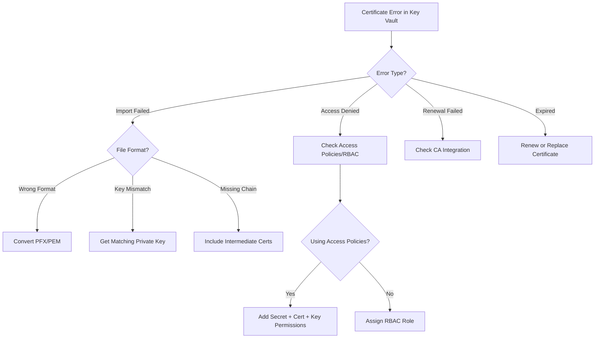

# How to Fix Certificate Validation Errors in Azure Key Vault

Author: [nawazdhandala](https://www.github.com/nawazdhandala)

Tags: Azure, Key Vault, Certificates, SSL, TLS, Troubleshooting, Security

Description: A practical guide to diagnosing and resolving certificate validation errors in Azure Key Vault including import failures and renewal issues.

---

Azure Key Vault is where most teams store their TLS/SSL certificates, but certificate management is surprisingly tricky. Between import failures, validation errors, renewal problems, and access permission issues, there are plenty of ways things can go wrong. I have seen teams spend hours debugging certificate issues that turned out to be something simple like a missing private key or an incorrect content type.

In this post, I will cover the most common certificate validation errors in Key Vault and how to fix them.

## Common Error 1: Import Fails with "Invalid Certificate File"

When you try to import a certificate into Key Vault, you might get an error saying the file is invalid or the format is not recognized.

Key Vault supports two formats for import:

- **PFX/PKCS#12**: A binary format that bundles the certificate, private key, and any intermediate certificates. This is the most common format for Key Vault imports.
- **PEM**: A base64-encoded text format. Key Vault accepts PEM files that contain both the certificate and private key.

**Fix**: Verify your certificate file format and convert if necessary:

```bash
# Check if a PFX file is valid and readable
# You will be prompted for the password
openssl pkcs12 -info -in mycert.pfx -nokeys

# Convert PEM certificate + key to PFX for Key Vault import
# Combine the certificate and private key into a single PFX file
openssl pkcs12 -export \
  -out mycert.pfx \
  -inkey private.key \
  -in certificate.crt \
  -certfile intermediate.crt \
  -passout pass:MyPassword123

# Import the PFX into Key Vault
az keyvault certificate import \
  --vault-name myKeyVault \
  --name myCertificate \
  --file mycert.pfx \
  --password MyPassword123
```

If you have a PEM file, make sure it includes both the certificate and private key:

```bash
# Create a combined PEM file with certificate and private key
# The order matters: certificate first, then private key
cat certificate.crt private.key > combined.pem

# Import PEM file into Key Vault
az keyvault certificate import \
  --vault-name myKeyVault \
  --name myCertificate \
  --file combined.pem
```

## Common Error 2: "The specified PEM X.509 certificate content is in an unexpected format"

This happens when the PEM file has formatting issues. Common causes:

- Extra whitespace or blank lines in the PEM file
- Missing BEGIN/END markers
- Certificate and key are not in the correct order
- Windows-style line endings (CRLF) causing parsing issues

**Fix**: Validate and clean up the PEM file:

```bash
# Verify the certificate portion is valid
openssl x509 -in certificate.crt -noout -text

# Verify the private key is valid
openssl rsa -in private.key -check

# Verify the key matches the certificate
# These two commands should output the same modulus hash
openssl x509 -noout -modulus -in certificate.crt | openssl md5
openssl rsa -noout -modulus -in private.key | openssl md5
```

If the modulus hashes do not match, the private key does not belong to the certificate. You need the correct private key that was used to generate the CSR (Certificate Signing Request).

## Common Error 3: Certificate Chain Validation Failures

When importing a certificate that was signed by a Certificate Authority, Key Vault validates the certificate chain. If intermediate certificates are missing, the import might succeed but the certificate will not work correctly when used by Application Gateway, Front Door, or other services.

**Fix**: Include the full certificate chain in your PFX or PEM file:

```bash
# Create a full-chain PEM file
# Order: leaf certificate, then intermediates, then root (optional)
cat leaf.crt intermediate.crt root.crt > fullchain.pem

# Convert to PFX with the full chain
openssl pkcs12 -export \
  -out fullchain.pfx \
  -inkey private.key \
  -in leaf.crt \
  -certfile intermediate.crt \
  -passout pass:MyPassword123
```

You can verify the chain:

```bash
# Verify the certificate chain is complete
openssl verify -CAfile root.crt -untrusted intermediate.crt leaf.crt
```

## Common Error 4: Access Denied When Retrieving Certificates

Even if a certificate imports successfully, your application might get "Forbidden" or "Access Denied" when trying to retrieve it. This is a Key Vault access policy issue.

Key Vault has separate permissions for certificates, secrets, and keys. A certificate in Key Vault is actually three objects: a certificate, a secret (containing the PFX/PEM data), and a key. To fully use a certificate, the accessing identity needs permissions on all three.

**Fix**: Grant the appropriate permissions:

```bash
# Grant certificate permissions to a service principal or managed identity
# Using access policies (classic model)
az keyvault set-policy \
  --name myKeyVault \
  --object-id <principal-object-id> \
  --certificate-permissions get list \
  --secret-permissions get list \
  --key-permissions get list

# Using RBAC (recommended for new deployments)
az role assignment create \
  --assignee <principal-object-id> \
  --role "Key Vault Certificates Officer" \
  --scope /subscriptions/<sub-id>/resourceGroups/myRG/providers/Microsoft.KeyVault/vaults/myKeyVault
```

For applications that only need to read the certificate (like App Service or Application Gateway), the minimum permissions are:

- Certificate: Get, List
- Secret: Get (needed to retrieve the private key)

## Common Error 5: Certificate Renewal Failures

If you set up Key Vault to auto-renew certificates through an integrated CA (like DigiCert or GlobalSign), the renewal can fail for several reasons:

- The CA integration credentials have expired or been revoked
- The domain validation has expired (for DV certificates)
- The CA account does not have sufficient credits or permissions

**Fix**: Check the certificate operation status:

```bash
# Check the pending certificate operation
az keyvault certificate pending show \
  --vault-name myKeyVault \
  --name myCertificate \
  --output json
```

If the operation is stuck or failed, you can cancel and retry:

```bash
# Cancel a stuck certificate operation
az keyvault certificate pending delete \
  --vault-name myKeyVault \
  --name myCertificate

# Check CA issuer configuration
az keyvault certificate issuer show \
  --vault-name myKeyVault \
  --issuer-name DigiCert \
  --output json
```

For self-signed certificates that Key Vault auto-generates, renewal usually works fine. The issues are almost always with third-party CA integrations.

## Common Error 6: Content Type Mismatch

Key Vault certificates have a content type that specifies whether the secret (downloadable) version is in PFX or PEM format. If you import a PFX but the certificate policy says PEM (or vice versa), retrieval might fail or return data in an unexpected format.

**Fix**: Set the correct content type during import:

```bash
# Import with explicit PFX content type
az keyvault certificate import \
  --vault-name myKeyVault \
  --name myCertificate \
  --file mycert.pfx \
  --password MyPassword123 \
  --content-type application/x-pkcs12

# Import with PEM content type
az keyvault certificate import \
  --vault-name myKeyVault \
  --name myCertificate \
  --file combined.pem \
  --content-type application/x-pem-file
```

## Common Error 7: Expired Certificates

This sounds obvious, but expired certificates cause more outages than you would think. Key Vault does not automatically delete or replace expired certificates, and if your application does not check expiry, it will happily serve an expired cert until browsers start rejecting connections.

**Fix**: Set up expiry notifications and monitor certificate lifetimes:

```bash
# List all certificates with their expiry dates
az keyvault certificate list \
  --vault-name myKeyVault \
  --query "[].{name: name, expires: attributes.expires}" \
  --output table

# Set up a certificate policy with lifetime actions for auto-renewal
# This creates a certificate that auto-renews 30 days before expiry
az keyvault certificate create \
  --vault-name myKeyVault \
  --name myCertificate \
  --policy '{
    "issuerParameters": {"name": "Self"},
    "keyProperties": {"keySize": 2048, "keyType": "RSA"},
    "lifetimeActions": [{
      "action": {"actionType": "AutoRenew"},
      "trigger": {"daysBeforeExpiry": 30}
    }],
    "x509CertificateProperties": {
      "subject": "CN=myapp.example.com",
      "validityInMonths": 12
    }
  }'
```

## Debugging Certificate Issues Programmatically

When you need to inspect a certificate stored in Key Vault without downloading it:

```bash
# Show certificate details including thumbprint and expiry
az keyvault certificate show \
  --vault-name myKeyVault \
  --name myCertificate \
  --query "{
    name: name,
    thumbprint: x509ThumbprintHex,
    subject: policy.x509CertificateProperties.subject,
    issuer: policy.issuerParameters.name,
    expires: attributes.expires,
    enabled: attributes.enabled,
    contentType: contentType
  }" \
  --output json

# List all versions of a certificate
az keyvault certificate list-versions \
  --vault-name myKeyVault \
  --name myCertificate \
  --query "[].{version: id, created: attributes.created, expires: attributes.expires, enabled: attributes.enabled}" \
  --output table
```

## Troubleshooting Flowchart



## Summary

Certificate validation errors in Azure Key Vault come down to a few categories: file format issues during import, missing certificate chain components, access permission gaps, and renewal failures. Always verify your certificate and key match before importing, include the full chain, and set the correct content type. For access issues, remember that a Key Vault certificate is actually three objects (cert, secret, key) and you need permissions on all three. Set up expiry monitoring so you catch renewal problems before they become outages.
