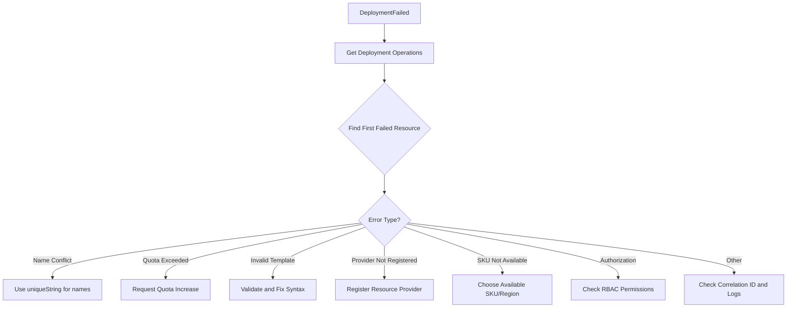

# How to Fix 'DeploymentFailed' Errors in Azure Resource Manager Deployments

Author: [nawazdhandala](https://www.github.com/nawazdhandala)

Tags: Azure, ARM Templates, Resource Manager, Deployment, Troubleshooting, Infrastructure as Code, DevOps

Description: Practical strategies for diagnosing and fixing DeploymentFailed errors in Azure Resource Manager template deployments.

---

Azure Resource Manager (ARM) deployment failures are one of the most common headaches when working with infrastructure as code on Azure. You submit a template, wait for it to run, and it comes back with a "DeploymentFailed" status and a nested error that can be anything from a quota limit to a name conflict.

The challenge is that DeploymentFailed is a generic wrapper - the real error is buried inside the deployment details. In this post, I will show you how to dig into the actual error, understand the most common failure types, and fix them.

## Step 1: Get the Actual Error Details

The DeploymentFailed message itself is not very helpful. You need to look at the inner errors to understand what went wrong.

```bash
# Get detailed deployment error information
az deployment group show \
  --resource-group myResourceGroup \
  --name myDeployment \
  --query "properties.error" \
  --output json

# List all deployment operations to find which resource failed
az deployment operation group list \
  --resource-group myResourceGroup \
  --name myDeployment \
  --query "[?properties.statusCode!='OK'].{resource: properties.targetResource.resourceType, name: properties.targetResource.resourceName, status: properties.statusCode, error: properties.statusMessage}" \
  --output table
```

For subscription-level deployments:

```bash
# Get errors from a subscription-level deployment
az deployment sub show \
  --name mySubscriptionDeployment \
  --query "properties.error" \
  --output json
```

The operation-level details tell you exactly which resource in the template failed and why.

## Common Error 1: Resource Name Already Exists

Many Azure resources require globally unique names (storage accounts, web apps, Key Vaults, etc.). If the name is already taken, the deployment fails.

**Error message**: `StorageAccountAlreadyTaken`, `WebAppAlreadyExists`, `VaultAlreadyExists`

**Fix**: Use unique naming conventions. A common pattern is to include a short hash or random suffix:

```json
{
  "variables": {
    "uniqueSuffix": "[uniqueString(resourceGroup().id)]",
    "storageAccountName": "[concat('mystorage', variables('uniqueSuffix'))]"
  }
}
```

The `uniqueString()` function generates a deterministic 13-character hash based on the input, so the same resource group always produces the same suffix. This keeps names unique across subscriptions while being repeatable.

## Common Error 2: Quota Exceeded

Every Azure subscription has quotas for resources like vCPUs, public IPs, storage accounts, and more. When a deployment tries to create resources beyond the quota, it fails.

**Error message**: `QuotaExceeded`, `OperationNotAllowed - The maximum number of...`

**Fix**: Check your current usage and request a quota increase:

```bash
# Check vCPU quota usage for a specific region
az vm list-usage \
  --location eastus \
  --output table

# Check storage account limits
az storage account list \
  --subscription <sub-id> \
  --query "length(@)"

# Request a quota increase through the portal or CLI
az quota create \
  --resource-name "standardDSv3Family" \
  --scope "/subscriptions/<sub-id>/providers/Microsoft.Compute/locations/eastus" \
  --limit-object value=100 limit-object-type=LimitValue \
  --resource-type "dedicated"
```

Quota increases for most resource types are approved automatically within minutes, but some (like GPU VMs) require manual review.

## Common Error 3: Invalid Template Syntax

Template validation catches many syntax errors before deployment, but some issues only surface at deploy time - especially with expressions and runtime values.

**Error message**: `InvalidTemplate`, `InvalidDeploymentParameterValue`, `DeploymentTemplateValidationError`

**Fix**: Validate the template before deploying:

```bash
# Validate the template without actually deploying
az deployment group validate \
  --resource-group myResourceGroup \
  --template-file azuredeploy.json \
  --parameters @azuredeploy.parameters.json

# Use what-if to preview changes and catch issues
az deployment group what-if \
  --resource-group myResourceGroup \
  --template-file azuredeploy.json \
  --parameters @azuredeploy.parameters.json
```

Common syntax issues include:

- Missing required parameters
- Type mismatches (passing a string where an integer is expected)
- Circular dependencies between resources
- Invalid resource API versions
- Malformed expressions (missing brackets, wrong function names)

## Common Error 4: Resource Provider Not Registered

If your template creates a resource type that requires a resource provider that is not registered in your subscription, the deployment fails.

**Error message**: `MissingSubscriptionRegistration`, `NoRegisteredProviderFound`

**Fix**:

```bash
# Register the missing resource provider
az provider register --namespace Microsoft.ContainerService

# Wait for registration to complete
az provider show --namespace Microsoft.ContainerService --query "registrationState"
```

You can pre-register all providers your template needs before deploying:

```bash
# Register multiple providers at once
for provider in Microsoft.ContainerService Microsoft.KeyVault Microsoft.Insights Microsoft.OperationalInsights; do
  az provider register --namespace $provider
done
```

## Common Error 5: Dependency Failures (Cascade)

When one resource in the template fails, all resources that depend on it also fail. This creates a cascade of errors that looks much worse than it is.

**Fix**: Focus on the root cause, not the cascade. Look at the deployment operations and find the first resource that failed chronologically:

```bash
# List failed operations sorted by timestamp to find the root cause
az deployment operation group list \
  --resource-group myResourceGroup \
  --name myDeployment \
  --query "sort_by([?properties.provisioningState=='Failed'], &properties.timestamp) | [0].{resource: properties.targetResource.resourceName, error: properties.statusMessage}" \
  --output json
```

If you fix the root resource, all the dependent failures will resolve on the next deployment.

## Common Error 6: Conflict with Existing Resources

If a resource already exists and the template tries to create it with different properties that cannot be changed (like the location), the deployment fails.

**Error message**: `Conflict`, `ResourceExistsAndCannotBeChanged`

**Fix**: Either delete the existing resource and redeploy, or modify the template to match the existing resource's immutable properties. You can also use incremental deployment mode (the default) which will update existing resources rather than trying to recreate them.

```bash
# Deploy in incremental mode (default) - updates existing resources
az deployment group create \
  --resource-group myResourceGroup \
  --template-file azuredeploy.json \
  --parameters @azuredeploy.parameters.json \
  --mode Incremental

# Use Complete mode to remove resources not in the template
# WARNING: Complete mode deletes resources not defined in the template
az deployment group create \
  --resource-group myResourceGroup \
  --template-file azuredeploy.json \
  --parameters @azuredeploy.parameters.json \
  --mode Complete
```

## Common Error 7: SKU Not Available in Region

Not all VM sizes, storage SKUs, or service tiers are available in every Azure region.

**Error message**: `SkuNotAvailable`, `InvalidParameter`

**Fix**: Check availability before deploying:

```bash
# List available VM sizes in a region
az vm list-skus \
  --location eastus \
  --resource-type virtualMachines \
  --query "[?restrictions[0].type!='Location'].{name: name, family: family}" \
  --output table
```

I cover this in more detail in a separate post on SkuNotAvailable errors.

## Common Error 8: Timeout During Deployment

ARM deployments have a timeout of 4 hours for resource group deployments. If a resource takes longer than expected (like a large database provisioning or AKS cluster creation), the deployment times out.

**Error message**: `DeploymentTimeout`

**Fix**: Break large templates into smaller, linked templates. Deploy long-running resources separately. Use deployment scripts with their own timeouts.

## Viewing Deployment History and Correlating Errors

Azure keeps the last 800 deployments per resource group. You can use this history to understand patterns:

```bash
# List recent deployments with their status
az deployment group list \
  --resource-group myResourceGroup \
  --query "[].{name: name, state: properties.provisioningState, timestamp: properties.timestamp}" \
  --output table

# Get correlation ID for support tickets
az deployment group show \
  --resource-group myResourceGroup \
  --name myDeployment \
  --query "properties.correlationId" \
  --output tsv
```

The correlation ID is useful when filing support tickets - Azure support can use it to trace the exact failure in their backend systems.

## Troubleshooting Flowchart



## Prevention Tips

1. Always run `az deployment group validate` before deploying.
2. Use `what-if` to preview changes.
3. Use CI/CD pipelines that validate templates on every pull request.
4. Keep templates modular - smaller templates are easier to debug.
5. Use parameter validation in your templates to catch bad inputs early.
6. Tag your deployments with meaningful names so you can find them in the history.

DeploymentFailed is never the real error. The key is to drill into the deployment operations, find the first resource that failed, and address that specific issue. Most of the time, it is a naming conflict, a quota limit, or a misconfiguration.
