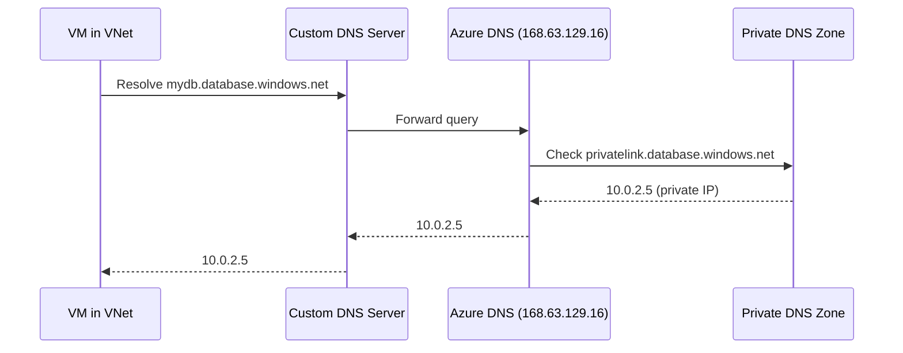
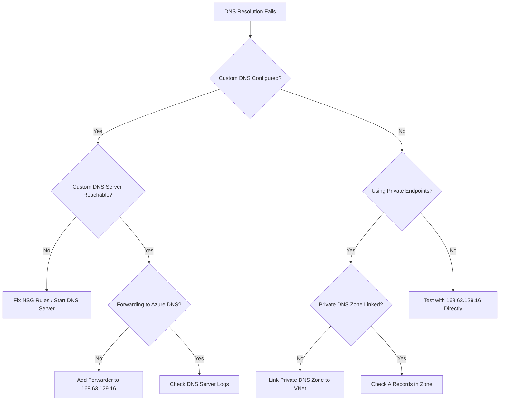

# How to Fix DNS Resolution Failures in Azure Virtual Networks

Author: [nawazdhandala](https://www.github.com/nawazdhandala)

Tags: Azure, DNS, Virtual Networks, Networking, Troubleshooting, VNet, Private DNS

Description: A comprehensive guide to diagnosing and fixing DNS resolution failures within Azure Virtual Networks with real-world solutions.

---

DNS resolution failures inside Azure Virtual Networks are one of those problems that can take down everything without an obvious error message. Your applications just stop connecting to databases, APIs, and other services, and the logs show hostname resolution errors. The frustrating part is that DNS issues manifest as completely different symptoms depending on what you are running, so it is not always obvious that DNS is the root cause.

Let me walk through the most common scenarios and how to fix each one.

## How DNS Works in Azure Virtual Networks

By default, Azure Virtual Networks use Azure-provided DNS (168.63.129.16). This recursive resolver handles:

- Resolution of Azure public DNS names (*.azure.com, *.windows.net, etc.)
- Resolution of VM names within the same Virtual Network
- Resolution of public internet hostnames

When you configure custom DNS servers on a VNet, all DNS queries from VMs in that VNet go to your custom DNS servers instead. This is where most problems start.

## Step 1: Identify the DNS Configuration

First, figure out which DNS servers your VNet is actually using:

```bash
# Check the DNS server configuration on the VNet
az network vnet show \
  --resource-group myResourceGroup \
  --name myVNet \
  --query "dhcpOptions.dnsServers" \
  --output tsv

# Empty result means Azure-provided DNS (168.63.129.16) is being used
```

Also check if individual NICs have DNS overrides:

```bash
# Check DNS settings on a specific NIC
# NIC-level settings override VNet-level settings
az network nic show \
  --resource-group myResourceGroup \
  --name myNIC \
  --query "dnsSettings" \
  --output json
```

## Step 2: Test DNS Resolution from Inside the VM

SSH into a VM in the VNet and test resolution directly:

```bash
# Test DNS resolution using nslookup
nslookup myservice.database.windows.net

# Test with a specific DNS server
nslookup myservice.database.windows.net 168.63.129.16

# Use dig for more detailed output including timing
dig myservice.database.windows.net +trace

# Check which DNS server the VM is actually configured to use
cat /etc/resolv.conf
```

On Windows VMs:

```powershell
# Test DNS resolution on Windows
Resolve-DnsName -Name "myservice.database.windows.net" -Type A

# Test with a specific DNS server
Resolve-DnsName -Name "myservice.database.windows.net" -Server 168.63.129.16

# Show current DNS configuration
Get-DnsClientServerAddress
```

## Common Cause 1: Custom DNS Server Is Down or Misconfigured

This is the most frequent cause of DNS failures in Azure VNets. When you set custom DNS servers (like a domain controller or a custom DNS forwarder), all DNS traffic goes through them. If they go down or become unreachable, nothing in the VNet can resolve hostnames.

**Symptoms**: All DNS resolution fails. VMs cannot reach any service by hostname. Resolution works when you explicitly query 168.63.129.16.

**Fix**: Verify your custom DNS servers are running and reachable:

```bash
# Test if the DNS server is reachable on port 53
nc -zv 10.0.1.10 53

# Test if the DNS server responds to queries
dig @10.0.1.10 google.com
```

If your custom DNS server is a VM, check that:
- The VM is running
- The DNS service (BIND, Windows DNS, etc.) is started
- NSG rules allow UDP and TCP port 53 inbound from the VNet
- The DNS server is configured to forward queries it cannot resolve to Azure DNS (168.63.129.16) or a public resolver

```bash
# NSG rule to allow DNS traffic to your custom DNS server
az network nsg rule create \
  --resource-group myResourceGroup \
  --nsg-name myDnsServerNSG \
  --name AllowDNS \
  --priority 100 \
  --direction Inbound \
  --access Allow \
  --protocol "*" \
  --source-address-prefixes VirtualNetwork \
  --destination-port-ranges 53 \
  --description "Allow DNS queries from the VNet"
```

**Best practice**: Always configure at least two DNS servers for redundancy. If one goes down, the other can still serve queries.

## Common Cause 2: Azure Private DNS Zone Not Linked to VNet

If you are using Azure Private Endpoints for services like Azure SQL, Storage, or Key Vault, you need Private DNS Zones linked to your VNet. Without this, the private endpoint hostname will not resolve to the private IP.

For example, when you create a Private Endpoint for Azure SQL Database, the hostname `myserver.database.windows.net` should resolve to the private IP (like 10.0.2.5). But it will only do this if:

1. A Private DNS Zone named `privatelink.database.windows.net` exists
2. The DNS zone has an A record for `myserver` pointing to the private IP
3. The DNS zone is linked to your VNet

```bash
# Check if the private DNS zone exists
az network private-dns zone show \
  --resource-group myResourceGroup \
  --name "privatelink.database.windows.net" \
  --output table

# Check if it is linked to your VNet
az network private-dns link vnet list \
  --resource-group myResourceGroup \
  --zone-name "privatelink.database.windows.net" \
  --output table

# If the link is missing, create it
az network private-dns link vnet create \
  --resource-group myResourceGroup \
  --zone-name "privatelink.database.windows.net" \
  --name myVNetLink \
  --virtual-network myVNet \
  --registration-enabled false
```

## Common Cause 3: DNS Resolution Fails with Custom DNS and Private Endpoints

This is a tricky one. If you use custom DNS servers on your VNet AND you use Private Endpoints, the custom DNS server must forward queries for `privatelink.*` zones to Azure DNS (168.63.129.16). Otherwise, the custom DNS server resolves the hostname to the public IP instead of the private IP.

Here is the resolution flow:



If the custom DNS server forwards to a public resolver (like 8.8.8.8) instead of Azure DNS, it will get the public IP, which might not be reachable from the VNet if you have forced tunneling or firewall rules.

**Fix for Windows DNS Server**: Add a conditional forwarder for each `privatelink.*` domain that forwards to 168.63.129.16.

**Fix for BIND**: Add a forwarding zone:

```
# BIND configuration to forward privatelink queries to Azure DNS
zone "privatelink.database.windows.net" {
    type forward;
    forward only;
    forwarders { 168.63.129.16; };
};
```

## Common Cause 4: DNS Cache Stale Entries

After changing DNS configurations, VMs might cache old DNS results. This is especially common after migrating resources or changing Private Endpoint configurations.

```bash
# Flush DNS cache on Linux
sudo systemd-resolve --flush-caches

# Or restart the systemd-resolved service
sudo systemctl restart systemd-resolved

# Flush DNS cache on Windows
ipconfig /flushdns
```

On Azure VMs, you may also need to renew the DHCP lease to pick up new DNS server settings:

```bash
# Renew DHCP lease on Linux to get updated DNS settings
sudo dhclient -r && sudo dhclient
```

## Common Cause 5: Split-Brain DNS Issues

Split-brain (or split-horizon) DNS happens when the same hostname resolves to different IPs depending on where you query from. This is common with Private Endpoints where the hostname resolves to a private IP inside the VNet and a public IP from outside.

If your application has hardcoded IP addresses or is caching DNS results for too long, it might use the wrong IP after a network change.

**Fix**: Make sure your applications respect DNS TTL values and do not cache DNS results indefinitely. For Java applications, set the JVM DNS cache TTL:

```java
// Set DNS cache TTL to 60 seconds in Java
// Place this early in your application startup
java.security.Security.setProperty("networkaddress.cache.ttl", "60");
java.security.Security.setProperty("networkaddress.cache.negative.ttl", "10");
```

## Common Cause 6: VNet Peering DNS Issues

When you peer two VNets, DNS does not automatically work across the peering. VMs in VNet A cannot resolve VM names in VNet B using Azure-provided DNS unless you set up additional configuration.

Options for cross-VNet name resolution:

1. Use Azure Private DNS Zones linked to both VNets
2. Use custom DNS servers that both VNets are configured to use
3. Use Azure DNS Private Resolver (the recommended modern approach)

```bash
# Create a Private DNS Zone for internal names
az network private-dns zone create \
  --resource-group myResourceGroup \
  --name "internal.mycompany.com"

# Link it to both VNets
az network private-dns link vnet create \
  --resource-group myResourceGroup \
  --zone-name "internal.mycompany.com" \
  --name vnetALink \
  --virtual-network vnetA \
  --registration-enabled true

az network private-dns link vnet create \
  --resource-group myResourceGroup \
  --zone-name "internal.mycompany.com" \
  --name vnetBLink \
  --virtual-network vnetB \
  --registration-enabled false
```

Note: Only one VNet can have `registration-enabled` set to true per zone. That VNet will automatically register VM hostnames in the DNS zone.

## Diagnostic Flowchart



## Summary

DNS resolution failures in Azure VNets usually fall into one of a few categories: custom DNS server issues, missing Private DNS Zone links, incorrect forwarding configuration for Private Endpoints, or stale caches. Start by figuring out which DNS servers your VNet is using, then test resolution from inside a VM. Work through the scenarios above based on your specific architecture. And always make sure that any custom DNS server forwards to 168.63.129.16 for Azure-internal name resolution.
