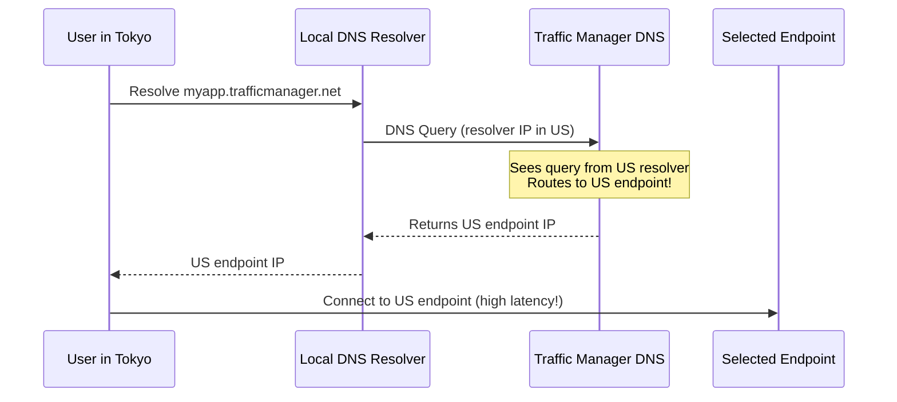
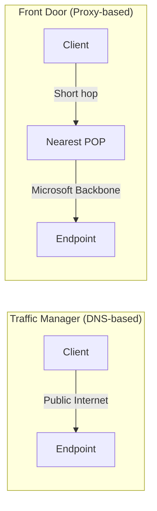

# How to Fix High Latency Issues Between Azure Regions Using Traffic Manager

Author: [nawazdhandala](https://www.github.com/nawazdhandala)

Tags: Azure, Traffic Manager, Latency, DNS, Multi-Region, Performance, Load Balancing

Description: Learn how to diagnose and fix high latency when using Azure Traffic Manager for multi-region deployments with practical optimization tips.

---

Azure Traffic Manager is a DNS-based traffic load balancer that distributes traffic across global endpoints. When configured correctly, it routes users to the closest or fastest endpoint, reducing latency. But when something is off, users can end up being routed to endpoints on the other side of the world, and your latency numbers go through the roof.

In this post, I will explain how Traffic Manager routing works, what causes high latency, and how to fix the common issues.

## How Traffic Manager Works (And Why It Matters for Latency)

Traffic Manager is a DNS-level service. It does not proxy your traffic. When a client queries the Traffic Manager DNS name (like `myapp.trafficmanager.net`), Traffic Manager returns the IP address or CNAME of the best endpoint based on the routing method. The client then connects directly to that endpoint.

This means Traffic Manager can only influence which endpoint the client connects to. It cannot change the network path or reduce the latency of the connection itself. If Traffic Manager sends a user in Tokyo to an endpoint in East US instead of Japan East, the latency will be high because of the physical distance. The fix is making sure Traffic Manager routes correctly.

## Step 1: Check Your Routing Method

Traffic Manager supports several routing methods:

- **Performance**: Routes to the endpoint with the lowest latency from the client. This is what you want for latency optimization.
- **Geographic**: Routes based on the geographic location of the DNS query.
- **Priority**: Routes to the primary endpoint unless it is unhealthy, then fails over to secondary.
- **Weighted**: Distributes traffic across endpoints based on assigned weights.
- **MultiValue**: Returns all healthy endpoints; the client picks one.
- **Subnet**: Routes based on the client's source IP subnet.

If you are experiencing high latency and using Priority or Weighted routing, that is likely the problem. These methods do not consider the client's location or endpoint proximity.

```bash
# Check the current routing method
az network traffic-manager profile show \
  --resource-group myResourceGroup \
  --name myTrafficManagerProfile \
  --query "trafficRoutingMethod" \
  --output tsv
```

**Fix**: Switch to Performance routing for latency-sensitive applications:

```bash
# Update the routing method to Performance
az network traffic-manager profile update \
  --resource-group myResourceGroup \
  --name myTrafficManagerProfile \
  --routing-method Performance
```

## Step 2: Verify Endpoint Health

Traffic Manager only routes to healthy endpoints. If the closest endpoint is unhealthy, traffic gets routed to the next best healthy endpoint, which might be much farther away.

```bash
# Check the health status of all endpoints
az network traffic-manager endpoint list \
  --resource-group myResourceGroup \
  --profile-name myTrafficManagerProfile \
  --type azureEndpoints \
  --query "[].{name: name, target: target, endpointStatus: endpointStatus, endpointMonitorStatus: endpointMonitorStatus}" \
  --output table
```

If your nearby endpoint shows as "Degraded" or "Stopped," Traffic Manager skips it. Common reasons for unhealthy endpoints:

- The health probe path returns a non-200 status
- The health probe times out (default timeout is 10 seconds)
- The endpoint application is down or restarting
- An NSG or firewall blocks the health probe traffic

**Fix**: Check and fix the health probe configuration:

```bash
# View the monitoring configuration
az network traffic-manager profile show \
  --resource-group myResourceGroup \
  --name myTrafficManagerProfile \
  --query "monitorConfig" \
  --output json
```

Make sure the probe path is correct, the port is right, and the expected status code range includes what your endpoint returns.

## Step 3: Understand the DNS Resolution Chain

A common source of confusion: Traffic Manager uses the location of the DNS resolver, not the client, to determine the "closest" endpoint for Performance routing. Here is the resolution chain:



If a user in Tokyo uses a DNS resolver located in the US (this happens with some corporate DNS setups and VPNs), Traffic Manager sees the query coming from the US and routes to the US endpoint. The user in Tokyo now has to cross the Pacific for every request.

**Fix**: Use DNS resolvers that are geographically close to the user. Modern DNS services like Google Public DNS (8.8.8.8), Cloudflare (1.1.1.1), and Azure DNS use EDNS Client Subnet (ECS) to pass the client's subnet to authoritative DNS servers. Traffic Manager supports ECS, so even if the resolver is remote, Traffic Manager can make a better routing decision.

If your users are behind a corporate proxy or VPN that forces DNS through a central resolver, there is not much you can do at the Traffic Manager level. You would need to change the network architecture.

## Step 4: Check DNS TTL and Caching

Traffic Manager sets a DNS TTL (Time to Live) on its responses. During this period, the DNS resolver caches the result. If an endpoint goes unhealthy and Traffic Manager starts returning a different endpoint, clients using cached DNS will still go to the old (now unhealthy or suboptimal) endpoint until the TTL expires.

```bash
# Check the current DNS TTL
az network traffic-manager profile show \
  --resource-group myResourceGroup \
  --name myTrafficManagerProfile \
  --query "dnsConfig.ttl" \
  --output tsv
```

The default TTL is 60 seconds. For latency-sensitive applications, a lower TTL (like 10-30 seconds) means faster failover but slightly more DNS queries.

**Fix**: Lower the TTL for faster endpoint switches:

```bash
# Set DNS TTL to 30 seconds
az network traffic-manager profile update \
  --resource-group myResourceGroup \
  --name myTrafficManagerProfile \
  --set dnsConfig.ttl=30
```

Keep in mind that some DNS resolvers ignore low TTLs and cache for longer than specified. There is nothing you can do about that from the Azure side.

## Step 5: Add Endpoints in More Regions

If you only have endpoints in East US and West Europe, users in Asia will always have high latency because the nearest endpoint is still thousands of kilometers away.

**Fix**: Deploy your application to additional Azure regions and add them as Traffic Manager endpoints:

```bash
# Add an endpoint in Japan East
az network traffic-manager endpoint create \
  --resource-group myResourceGroup \
  --profile-name myTrafficManagerProfile \
  --name japanEastEndpoint \
  --type azureEndpoints \
  --target-resource-id /subscriptions/<sub-id>/resourceGroups/rgJapan/providers/Microsoft.Web/sites/myAppJapanEast \
  --endpoint-status Enabled
```

For Performance routing to work well, you need endpoints distributed geographically close to your user base.

## Step 6: Test from the Client's Perspective

To verify routing behavior, test DNS resolution from the client's location:

```bash
# Resolve the Traffic Manager DNS name
nslookup myapp.trafficmanager.net

# Check which endpoint was returned
dig myapp.trafficmanager.net +short

# Test latency to the returned endpoint
curl -o /dev/null -s -w "DNS: %{time_namelookup}s\nConnect: %{time_connect}s\nTTFB: %{time_starttransfer}s\nTotal: %{time_total}s\n" https://myapp.trafficmanager.net/health
```

If the returned endpoint is not the one you expect for your location, check:

1. The routing method (must be Performance)
2. The health status of the expected endpoint (must be healthy)
3. The DNS resolver location (might be misleading Traffic Manager)

## Step 7: Use Real User Measurements

Traffic Manager has a Real User Measurements feature that collects latency data from actual users. Instead of relying on Azure's internal latency tables, Traffic Manager uses real measurements from your users' browsers to determine the best endpoint.

```bash
# Enable Real User Measurements
# This returns a key you embed in your web pages
az network traffic-manager profile update \
  --resource-group myResourceGroup \
  --name myTrafficManagerProfile \
  --traffic-view-enrollment-status Enabled
```

You embed a JavaScript snippet in your web pages that measures latency from the user's browser to each Azure region. This data feeds back into Traffic Manager to improve routing decisions.

## Step 8: Consider Azure Front Door Instead

If latency is critical, consider using Azure Front Door instead of (or in addition to) Traffic Manager. Front Door operates at Layer 7 and uses the Microsoft global network backbone to route traffic, providing lower latency than DNS-based routing.

The key difference: Traffic Manager returns a DNS answer and the client connects directly to the endpoint (over the public internet). Front Door proxies the traffic through Microsoft's global network, which often has lower latency than the public internet path.



## Summary

High latency with Traffic Manager is usually caused by one of these: wrong routing method, unhealthy nearby endpoints forcing failover to distant ones, DNS resolvers in the wrong location, or simply not having endpoints close enough to your users. Start by switching to Performance routing, verify all endpoints are healthy, and deploy to regions where your users are. For the best possible latency, consider Azure Front Door which uses the Microsoft backbone network instead of relying on public internet paths.
