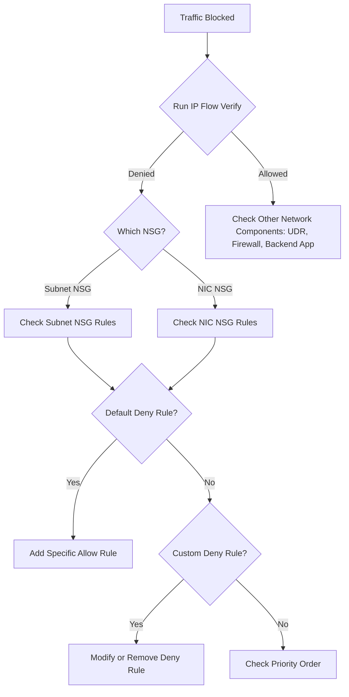

# How to Fix 'NetworkSecurityGroupBlockedTraffic' Issues in Azure NSG Flow Logs

Author: [nawazdhandala](https://www.github.com/nawazdhandala)

Tags: Azure, NSG, Network Security Group, Flow Logs, Networking, Troubleshooting, Security

Description: Learn how to analyze NSG flow logs to identify and fix blocked traffic issues in Azure virtual networks step by step.

---

You have deployed your application in Azure, everything looks good in the resource configuration, but traffic is not flowing. Maybe your web server is not reachable from the internet, maybe your application cannot connect to the database, or maybe a microservice cannot talk to another microservice. You check the NSG flow logs and see entries with the action "D" (Denied). Welcome to the world of Network Security Group troubleshooting.

NSG flow logs are incredibly useful for diagnosing blocked traffic, but they can be overwhelming to parse. In this post, I will show you how to read flow logs, identify the specific rules causing blocks, and fix them without opening your network wider than necessary.

## Understanding NSG Flow Logs

NSG flow logs record information about every IP flow through a Network Security Group. Each entry tells you:

- Source and destination IP
- Source and destination port
- Protocol (TCP, UDP, or Other)
- Direction (Inbound or Outbound)
- Action (Allow or Deny)
- The NSG rule that matched

Flow logs are stored in a Storage Account and can be analyzed through Azure Monitor, Log Analytics, or third-party tools.

## Step 1: Enable NSG Flow Logs

If you have not enabled flow logs yet, do that first:

```bash
# Create a storage account for flow logs if you do not already have one
az storage account create \
  --resource-group myResourceGroup \
  --name mynsgflowlogs \
  --location eastus \
  --sku Standard_LRS

# Enable flow logs for an NSG
az network watcher flow-log create \
  --resource-group myResourceGroup \
  --nsg myNSG \
  --storage-account mynsgflowlogs \
  --enabled true \
  --log-version 2 \
  --retention 30 \
  --name myFlowLog \
  --location eastus
```

Version 2 flow logs include additional information like bytes transferred and flow state, which helps with deeper analysis.

## Step 2: Read the Flow Log Data

Flow logs are stored as JSON files in the storage account. Each file covers a one-hour period. The path structure is:

```
resourceId=/SUBSCRIPTIONS/{subId}/RESOURCEGROUPS/{rgName}/PROVIDERS/MICROSOFT.NETWORK/NETWORKSECURITYGROUPS/{nsgName}/y={year}/m={month}/d={day}/h={hour}/m=00/macAddress={mac}/PT1H.json
```

The flow tuple format for version 2 is:

```
timestamp,sourceIP,destIP,sourcePort,destPort,protocol,trafficFlow,trafficDecision,flowState,packetsStoD,bytesStoD,packetsDtoS,bytesDtoS
```

Where:
- trafficFlow: I (Inbound) or O (Outbound)
- trafficDecision: A (Allow) or D (Deny)
- protocol: T (TCP), U (UDP), O (Other)

## Step 3: Query Flow Logs in Log Analytics

If you have flow logs going to Log Analytics (which I strongly recommend), you can query for blocked traffic directly:

```kusto
// Find all denied flows in the last hour grouped by source and destination
AzureNetworkAnalytics_CL
| where TimeGenerated > ago(1h)
| where FlowStatus_s == "D"  // D = Denied
| summarize DeniedFlows = count() by
    SrcIP_s,
    DestIP_s,
    DestPort_d,
    L7Protocol_s,
    NSGRule_s
| order by DeniedFlows desc
| take 50
```

Or if you are using the newer traffic analytics schema:

```kusto
// Find blocked traffic with NSG rule details
NTANetAnalytics
| where TimeGenerated > ago(1h)
| where FlowStatus == "D"
| project TimeGenerated, SrcIp, DestIp, DestPort, Protocol, NSGRuleMatched = NSGRule, FlowDirection
| order by TimeGenerated desc
| take 100
```

## Step 4: Identify Which NSG Rule Is Blocking Traffic

The flow log entry tells you which NSG rule matched. The rule name is in the format `{NSG-Name}/{RuleName}`. If the matching rule is `DefaultRule_DenyAllInBound`, it means no custom allow rule matched and the default deny kicked in.

List the rules in your NSG to understand the current configuration:

```bash
# List all rules in an NSG including default rules
az network nsg rule list \
  --resource-group myResourceGroup \
  --nsg-name myNSG \
  --include-default \
  --output table
```

NSG rules are evaluated in priority order (lower number = higher priority). The first matching rule wins. If you have an allow rule at priority 200 and a deny rule at priority 100 for the same traffic, the deny rule wins because 100 is evaluated before 200.

## Step 5: Common Blocked Traffic Scenarios and Fixes

### Scenario 1: Web Server Not Reachable from Internet

Your VM is running a web server on port 443, but external users cannot connect.

**Cause**: No inbound allow rule for port 443 from the Internet.

**Fix**:

```bash
# Allow HTTPS traffic from the internet
az network nsg rule create \
  --resource-group myResourceGroup \
  --nsg-name myNSG \
  --name AllowHTTPS \
  --priority 100 \
  --direction Inbound \
  --access Allow \
  --protocol Tcp \
  --source-address-prefixes Internet \
  --destination-port-ranges 443 \
  --description "Allow inbound HTTPS from the internet"
```

### Scenario 2: Application Cannot Reach Database

Your app VM in one subnet cannot connect to a database VM in another subnet on port 5432 (PostgreSQL).

**Cause**: The NSG on the database subnet does not allow inbound traffic from the application subnet.

**Fix**:

```bash
# Allow PostgreSQL traffic from the app subnet to the database subnet
az network nsg rule create \
  --resource-group myResourceGroup \
  --nsg-name myDbSubnetNSG \
  --name AllowPostgresFromAppSubnet \
  --priority 100 \
  --direction Inbound \
  --access Allow \
  --protocol Tcp \
  --source-address-prefixes 10.0.1.0/24 \
  --destination-port-ranges 5432 \
  --description "Allow PostgreSQL from application subnet"
```

But wait - you also need to check the NSG on the application subnet for outbound rules. By default, Azure allows all outbound traffic, but if someone added a deny-all outbound rule, your app cannot reach anything.

### Scenario 3: Cannot SSH/RDP to VM for Debugging

You cannot SSH (port 22) or RDP (port 3389) into a VM.

**Fix**: Add a temporary rule with a restrictive source (your IP only):

```bash
# Allow SSH only from your specific IP address
az network nsg rule create \
  --resource-group myResourceGroup \
  --nsg-name myNSG \
  --name TempAllowSSH \
  --priority 110 \
  --direction Inbound \
  --access Allow \
  --protocol Tcp \
  --source-address-prefixes $(curl -s ifconfig.me)/32 \
  --destination-port-ranges 22 \
  --description "Temporary SSH access from my IP - remove after debugging"
```

Better yet, use Azure Bastion to connect without opening SSH/RDP ports at all.

## Step 6: Use IP Flow Verify for Quick Tests

Azure Network Watcher has an "IP Flow Verify" tool that simulates a flow and tells you whether it would be allowed or denied, and which rule matches:

```bash
# Test if traffic from a specific source to a destination would be allowed
az network watcher test-ip-flow \
  --direction Inbound \
  --protocol TCP \
  --local 10.0.2.4:443 \
  --remote 203.0.113.50:12345 \
  --vm myVM \
  --resource-group myResourceGroup \
  --output json
```

This returns the access decision (Allow/Deny) and the name of the NSG rule that matched. It is much faster than deploying flow logs and waiting for data.

## Step 7: Check for Multiple NSGs

A common gotcha: traffic can be evaluated by multiple NSGs. Azure applies NSGs at two levels:

1. **Subnet-level NSG**: Applied to all resources in the subnet
2. **NIC-level NSG**: Applied to the specific network interface

Both must allow the traffic. If the subnet NSG allows it but the NIC NSG denies it (or vice versa), the traffic is blocked.

```bash
# Check which NSGs are associated with a subnet
az network vnet subnet show \
  --resource-group myResourceGroup \
  --vnet-name myVNet \
  --name mySubnet \
  --query "networkSecurityGroup.id" \
  --output tsv

# Check which NSG is associated with a NIC
az network nic show \
  --resource-group myResourceGroup \
  --name myNIC \
  --query "networkSecurityGroup.id" \
  --output tsv
```

**Best practice**: Use NSGs at the subnet level only. Having NSGs at both levels makes troubleshooting much harder because you need to check both for every flow.

## Step 8: Understand Azure Service Tags

Instead of using raw IP addresses in NSG rules, use Azure service tags where possible. Service tags represent groups of IP addresses for Azure services and are automatically updated.

Common service tags:

- `Internet` - All public IP addresses
- `VirtualNetwork` - The VNet address space plus any peered VNets
- `AzureLoadBalancer` - Azure health probes
- `AzureCloud` - All Azure data center IPs
- `Sql` - Azure SQL Database IPs
- `Storage` - Azure Storage IPs

```bash
# Use service tags instead of hard-coded IPs
az network nsg rule create \
  --resource-group myResourceGroup \
  --nsg-name myNSG \
  --name AllowAzureSQL \
  --priority 120 \
  --direction Outbound \
  --access Allow \
  --protocol Tcp \
  --destination-address-prefixes Sql \
  --destination-port-ranges 1433 \
  --description "Allow outbound to Azure SQL using service tag"
```

## Troubleshooting Flowchart



## Summary

NSG flow log analysis is the most reliable way to diagnose blocked traffic in Azure. Enable flow logs on all NSGs, use Log Analytics for querying, and use IP Flow Verify for quick ad-hoc tests. Remember to check both subnet-level and NIC-level NSGs. Use service tags instead of raw IP addresses for cleaner and more maintainable rules. And always document why each NSG rule exists so the next person does not accidentally remove it.
