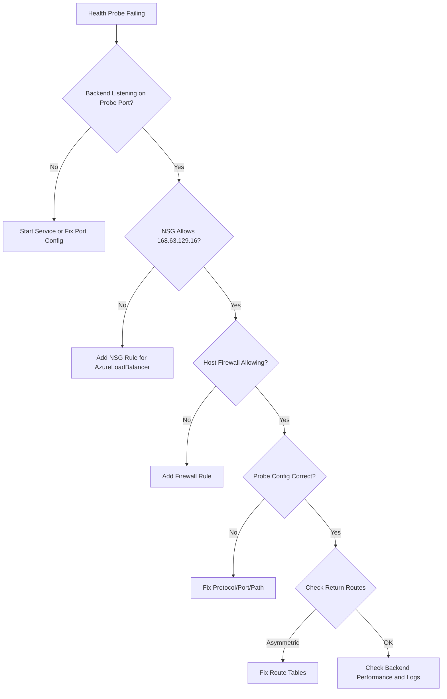

# How to Fix Packet Drops in Azure Load Balancer Health Probes

Author: [nawazdhandala](https://www.github.com/nawazdhandala)

Tags: Azure, Load Balancer, Health Probes, Networking, Troubleshooting, Packet Loss, High Availability

Description: Diagnose and resolve packet drops in Azure Load Balancer health probes that cause backend instances to be incorrectly marked unhealthy.

---

When Azure Load Balancer health probes fail, the affected backend instance gets pulled out of the rotation. Traffic stops flowing to that instance, and if all backends fail their health probes, the entire service goes down. The tricky part is that the backend might actually be perfectly healthy - the health probe packets are just getting dropped somewhere between the load balancer and the backend.

In this post, I will walk through why health probe packets get dropped and how to fix each scenario.

## How Azure Load Balancer Health Probes Work

Azure Load Balancer sends health probes from the IP address 168.63.129.16 (this is a well-known Azure infrastructure IP). The probes are sent at a configurable interval (default 5 seconds for Standard LB) and the backend must respond within the timeout period. If the backend fails to respond to a configurable number of consecutive probes (the unhealthy threshold), the load balancer marks it as unhealthy.

For TCP probes, the load balancer attempts a TCP handshake on the configured port. If the handshake succeeds, the probe passes. For HTTP/HTTPS probes, the load balancer sends an HTTP GET request and expects a 200 OK response.

## Step 1: Check the Current Health Probe Status

First, find out which backends are failing health probes:

```bash
# Check Load Balancer health probe status
az network lb show \
  --resource-group myResourceGroup \
  --name myLoadBalancer \
  --query "probes" \
  --output json

# Get the health status via metrics
az monitor metrics list \
  --resource "/subscriptions/<sub-id>/resourceGroups/myRG/providers/Microsoft.Network/loadBalancers/myLoadBalancer" \
  --metric "DipAvailability" \
  --interval PT1M \
  --output table
```

The `DipAvailability` metric (also called Health Probe Status) shows the percentage of successful probes per backend. 100% means all probes pass, 0% means all probes fail.

## Step 2: Verify the Backend Is Listening on the Probe Port

The most common reason for probe failures is that the backend is not listening on the port the health probe is checking.

```bash
# SSH into the backend VM and check if the service is listening
# Replace 80 with your actual probe port
ss -tlnp | grep :80

# Or on Windows
netstat -an | findstr :80
```

If nothing is listening on the probe port, the TCP handshake will fail and the probe will be denied.

**Fix**: Make sure your application or a dedicated health endpoint is listening on the probe port. If you are using an HTTP probe, make sure the endpoint returns a 200 status code.

A common mistake: configuring the health probe on port 80 but the application only listens on port 443. Or using an HTTP probe on a port that only accepts HTTPS connections.

## Step 3: Check NSG Rules for Health Probe Traffic

NSG rules on the backend subnet or NIC can block health probe traffic from reaching the backend. Health probes come from 168.63.129.16, and many teams forget to allow this address in their NSG rules.

The default NSG rules include a rule called `AllowAzureLoadBalancerInBound` that allows traffic from the `AzureLoadBalancer` service tag. If this rule has been modified or overridden by a higher-priority deny rule, probes will be blocked.

```bash
# List NSG rules including defaults, sorted by priority
az network nsg rule list \
  --resource-group myResourceGroup \
  --nsg-name myBackendNSG \
  --include-default \
  --query "sort_by([?direction=='Inbound'], &priority).{Priority:priority, Name:name, Access:access, Source:sourceAddressPrefix, DestPort:destinationPortRange}" \
  --output table
```

**Fix**: Make sure health probe traffic is allowed:

```bash
# Explicitly allow health probe traffic from Azure Load Balancer
az network nsg rule create \
  --resource-group myResourceGroup \
  --nsg-name myBackendNSG \
  --name AllowHealthProbes \
  --priority 100 \
  --direction Inbound \
  --access Allow \
  --protocol Tcp \
  --source-address-prefixes AzureLoadBalancer \
  --destination-port-ranges 80 443 \
  --description "Allow Azure Load Balancer health probes"
```

## Step 4: Check for Firewall Software on the Backend

If the backend VM is running a host-based firewall (iptables on Linux, Windows Firewall on Windows), it might be blocking health probe packets even if the NSG allows them.

On Linux:

```bash
# Check iptables rules for any rules that might block port 80
sudo iptables -L -n -v | grep -E "80|168.63.129.16"

# Check if the host firewall is allowing traffic from 168.63.129.16
sudo iptables -L INPUT -n -v --line-numbers
```

On Windows:

```powershell
# Check Windows Firewall rules for the probe port
Get-NetFirewallRule | Where-Object {$_.Direction -eq 'Inbound' -and $_.Action -eq 'Block'} | Get-NetFirewallPortFilter | Where-Object {$_.LocalPort -eq 80}
```

**Fix**: Add firewall rules to allow probe traffic:

```bash
# Linux iptables - allow health probe traffic
sudo iptables -I INPUT -s 168.63.129.16 -p tcp --dport 80 -j ACCEPT
```

## Step 5: Check the Probe Configuration

Mismatched probe settings cause failures. Review the probe configuration:

```bash
# Show health probe configuration
az network lb probe show \
  --resource-group myResourceGroup \
  --lb-name myLoadBalancer \
  --name myHealthProbe \
  --output json
```

Common misconfiguration issues:

- **Wrong port**: The probe checks a port different from what the backend listens on.
- **Wrong protocol**: Using HTTP probe but backend only serves HTTPS, or vice versa.
- **Wrong path**: For HTTP probes, the path returns a redirect (301/302) or an error code instead of 200.
- **Timeout too short**: If the backend takes more than the probe timeout to respond, the probe fails even though the backend is working.

**Fix**: Adjust the probe to match your backend:

```bash
# Update the health probe configuration
az network lb probe update \
  --resource-group myResourceGroup \
  --lb-name myLoadBalancer \
  --name myHealthProbe \
  --protocol Http \
  --port 8080 \
  --path "/health" \
  --interval 10 \
  --threshold 3
```

## Step 6: Check for Asymmetric Routing

Asymmetric routing happens when the health probe packet arrives at the backend through one path, but the response leaves through a different path. This is common when:

- The backend VM has multiple NICs
- The subnet has User Defined Routes (UDRs) that send return traffic through a firewall or NVA
- The backend is behind an NVA that does not handle return traffic for the probe

When return traffic goes through a different path, the TCP handshake fails because the response does not reach the load balancer.

**Fix**: Make sure the route table on the backend subnet does not redirect traffic destined for 168.63.129.16 through an NVA. Health probe responses must go directly back to 168.63.129.16:

```bash
# Check the effective routes on the backend NIC
az network nic show-effective-route-table \
  --resource-group myResourceGroup \
  --name myBackendNIC \
  --output table
```

Look for a route that matches 168.63.129.16/32. If it points to a next hop other than "Internet" or "VirtualNetwork," that could be the problem.

## Step 7: Backend Application Is Overloaded

If the backend application is consuming 100% CPU or is out of memory, it might not be able to respond to health probes in time. The probes time out, the backend gets marked unhealthy, and the remaining backends get even more load, creating a cascading failure.

**Fix**:

1. Increase the probe timeout to give overloaded backends more time to respond.
2. Use a lightweight health endpoint that does not depend on the main application processing pipeline.
3. Scale out to add more backend instances.

A good health endpoint pattern:

```python
# A simple health check endpoint that responds quickly
# even when the main application is under heavy load
from flask import Flask, jsonify

app = Flask(__name__)

@app.route('/health')
def health():
    # Only check if the process is alive and can handle requests
    # Do NOT check database connectivity or external dependencies here
    # Those checks belong in a separate readiness endpoint
    return jsonify({"status": "healthy"}), 200
```

## Step 8: Multiple Load Balancer Rules with Different Probes

If you have multiple load balancing rules that point to the same backend pool but use different health probes, a backend can be healthy for one rule and unhealthy for another. This can cause confusing behavior where some traffic works and other traffic does not.

```bash
# List all load balancing rules and their associated probes
az network lb rule list \
  --resource-group myResourceGroup \
  --lb-name myLoadBalancer \
  --query "[].{name: name, frontendPort: frontendPort, backendPort: backendPort, probe: probe.id}" \
  --output table
```

**Fix**: Make sure each rule's health probe is correctly configured for the traffic that rule handles.

## Diagnostic Flowchart



## Summary

Health probe packet drops in Azure Load Balancer almost always come down to one of these: the backend is not listening on the probe port, NSG rules block the probe source (168.63.129.16), host firewalls interfere, the probe configuration does not match the backend, or asymmetric routing prevents the response from reaching the load balancer. Use the diagnostic flowchart above to work through each possibility systematically. And keep your health check endpoints lightweight so they can respond even when the application is under heavy load.
