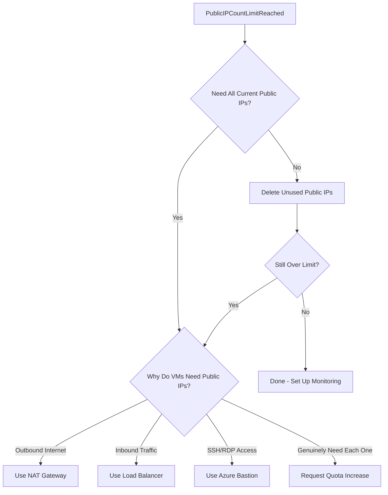

# How to Fix 'PublicIPCountLimitReached' Errors in Azure Subscriptions

Author: [nawazdhandala](https://www.github.com/nawazdhandala)

Tags: Azure, Public IP, Quota, Networking, Troubleshooting, Subscription Limits, Cloud

Description: Learn how to resolve PublicIPCountLimitReached errors in Azure by managing public IP allocations and requesting quota increases.

---

You try to create a new public IP address, deploy a VM with a public IP, or spin up a load balancer, and Azure returns: `PublicIPCountLimitReached`. This means your subscription has hit the maximum number of public IP addresses allowed in a specific region.

This error is more common than you might expect, especially in subscriptions that have been around for a while and have accumulated unused public IPs, or in environments with lots of VMs that each have their own public IP. Let me show you how to identify the problem and fix it.

## Understanding the Public IP Limit

Every Azure subscription has a default limit on the number of public IP addresses per region. The typical defaults are:

- **Static public IPs**: 200 per region per subscription (for Standard SKU)
- **Dynamic public IPs (Basic SKU)**: 200 per region per subscription

These limits apply per region, so if you hit the limit in East US, you can still create public IPs in West US. But within a single region, you are capped.

## Step 1: Check Your Current Usage

First, see how many public IPs you are using versus your limit:

```bash
# Check public IP usage and limits for a specific region
az network list-usages \
  --location eastus \
  --query "[?contains(name.value, 'PublicIPAddresses')].{Name: name.localizedValue, CurrentValue: currentValue, Limit: limit}" \
  --output table
```

This shows your current count and the limit. If you are at or near the limit, that explains the error.

You can also list all public IPs in your subscription:

```bash
# List all public IPs in the subscription with their details
az network public-ip list \
  --query "[].{Name: name, ResourceGroup: resourceGroup, Location: location, Allocation: publicIpAllocationMethod, SKU: sku.name, IPAddress: ipAddress, AssociatedTo: ipConfiguration.id}" \
  --output table
```

## Step 2: Find and Clean Up Unused Public IPs

The most common reason teams hit this limit is accumulated unused public IPs. These are public IPs that are not associated with any resource - they just sit there consuming quota and costing money (static public IPs are billed even when unassociated).

```bash
# Find all unassociated (orphaned) public IPs
az network public-ip list \
  --query "[?ipConfiguration==null && natGateway==null].{Name: name, ResourceGroup: resourceGroup, Location: location, IPAddress: ipAddress, SKU: sku.name}" \
  --output table
```

This query finds public IPs that are not attached to any NIC, load balancer, or NAT gateway. Review the list and delete the ones you no longer need:

```bash
# Delete an unused public IP
az network public-ip delete \
  --resource-group myResourceGroup \
  --name myUnusedPublicIP

# Delete multiple unused public IPs at once using a loop
# First list them, then delete
for ip in $(az network public-ip list --query "[?ipConfiguration==null && natGateway==null].{Name: name, RG: resourceGroup}" -o tsv); do
  name=$(echo $ip | cut -f1)
  rg=$(echo $ip | cut -f2)
  echo "Deleting $name in $rg"
  az network public-ip delete --resource-group "$rg" --name "$name"
done
```

Be careful with bulk deletion. Some public IPs might be intentionally unassociated (reserved for disaster recovery, pending deployments, etc.). Verify with your team before deleting.

## Step 3: Reduce Public IP Usage

If you are legitimately using all your public IPs, consider whether you actually need them all. Many workloads do not require individual public IPs.

### Use NAT Gateway Instead of Per-VM Public IPs

If your VMs only need outbound internet access (not inbound), use a NAT Gateway instead of assigning public IPs to each VM:

```bash
# Create a NAT Gateway with a single public IP
az network public-ip create \
  --resource-group myResourceGroup \
  --name natGatewayIP \
  --sku Standard \
  --allocation-method Static

az network nat gateway create \
  --resource-group myResourceGroup \
  --name myNatGateway \
  --public-ip-addresses natGatewayIP \
  --idle-timeout 10

# Associate the NAT Gateway with a subnet
az network vnet subnet update \
  --resource-group myResourceGroup \
  --vnet-name myVNet \
  --name mySubnet \
  --nat-gateway myNatGateway
```

One NAT Gateway with one public IP can handle outbound connections for all VMs in the subnet. You just freed up dozens of public IPs.

### Use a Load Balancer with a Single Frontend IP

Instead of giving each backend VM a public IP, put them behind a load balancer with a single public frontend IP:

```bash
# Create a load balancer with one public IP
az network lb create \
  --resource-group myResourceGroup \
  --name myLoadBalancer \
  --sku Standard \
  --public-ip-address myLBPublicIP \
  --frontend-ip-name myFrontEnd \
  --backend-pool-name myBackendPool
```

### Use Azure Bastion for Management Access

If VMs have public IPs only for SSH or RDP access, use Azure Bastion instead. Bastion provides secure remote access through the Azure portal without exposing VMs to the internet:

```bash
# Create Azure Bastion (requires a dedicated subnet named AzureBastionSubnet)
az network vnet subnet create \
  --resource-group myResourceGroup \
  --vnet-name myVNet \
  --name AzureBastionSubnet \
  --address-prefixes 10.0.255.0/26

az network public-ip create \
  --resource-group myResourceGroup \
  --name bastionPublicIP \
  --sku Standard \
  --allocation-method Static

az network bastion create \
  --resource-group myResourceGroup \
  --name myBastion \
  --public-ip-address bastionPublicIP \
  --vnet-name myVNet \
  --location eastus
```

Now you can remove public IPs from individual VMs and use Bastion for SSH/RDP. One Bastion host replaces dozens of public IPs.

### Use Private Endpoints

If VMs need to access Azure PaaS services (like Storage, SQL Database, Key Vault), use Private Endpoints instead of accessing these services over public IPs. This reduces the need for outbound public IPs and improves security.

## Step 4: Request a Quota Increase

If you genuinely need more public IPs than the default limit allows, request a quota increase:

```bash
# Check the current limit
az network list-usages \
  --location eastus \
  --query "[?contains(name.value, 'PublicIPAddresses')]" \
  --output json

# Request a quota increase through the Azure portal:
# 1. Go to Subscriptions > your subscription > Usage + quotas
# 2. Filter for "Public IP"
# 3. Click the pencil icon next to the limit
# 4. Enter the new desired limit
# 5. Submit the request
```

You can also request increases through the Azure CLI:

```bash
# Submit a support request for quota increase
az quota create \
  --resource-name "PublicIPAddresses" \
  --scope "/subscriptions/<sub-id>/providers/Microsoft.Network/locations/eastus" \
  --limit-object value=500 limit-object-type=LimitValue \
  --resource-type "PublicIPAddresses"
```

Most public IP quota increases are approved automatically within minutes for reasonable amounts (up to a few hundred). Very large requests might require a business justification.

## Step 5: Audit and Prevent Future Accumulation

Set up processes to prevent public IPs from accumulating:

### Use Azure Policy

Create a policy that prevents VMs from being created with public IPs unless explicitly approved:

```json
{
  "mode": "All",
  "policyRule": {
    "if": {
      "allOf": [
        {
          "field": "type",
          "equals": "Microsoft.Network/networkInterfaces"
        },
        {
          "not": {
            "field": "Microsoft.Network/networkInterfaces/ipconfigurations[*].publicIpAddress.id",
            "exists": false
          }
        }
      ]
    },
    "then": {
      "effect": "deny"
    }
  }
}
```

### Set Up Cost and Resource Alerts

Create an alert that fires when your public IP count approaches the limit:

```bash
# Create a metric alert for public IP usage approaching the limit
az monitor metrics alert create \
  --resource-group myResourceGroup \
  --name "PublicIP-Quota-Warning" \
  --scopes "/subscriptions/<sub-id>" \
  --condition "total PublicIPAddressUsage > 180" \
  --window-size 1h \
  --evaluation-frequency 1h \
  --action-group myActionGroup \
  --description "Public IP usage approaching quota limit"
```

## Architecture Decision Flowchart



## Summary

The PublicIPCountLimitReached error means you have hit your subscription's public IP quota for a region. Start by finding and deleting unused (orphaned) public IPs. Then evaluate whether all your VMs truly need individual public IPs. NAT Gateway, Load Balancer, and Azure Bastion can dramatically reduce public IP consumption. If you still need more, request a quota increase. And set up monitoring and Azure Policy to prevent the problem from recurring.
