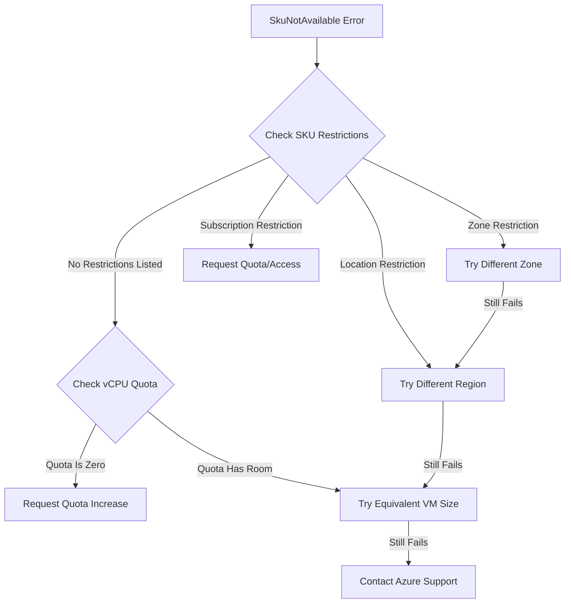

# How to Fix 'SkuNotAvailable' Errors When Creating Azure Virtual Machines

Author: [nawazdhandala](https://www.github.com/nawazdhandala)

Tags: Azure, Virtual Machines, SkuNotAvailable, Troubleshooting, Compute, Cloud, VM Sizing

Description: Learn how to resolve SkuNotAvailable errors when creating Azure VMs by finding available sizes and working around regional restrictions.

---

You try to create a virtual machine in Azure, and the deployment fails with a SkuNotAvailable error. The full message typically looks like this:

```
The requested VM size Standard_D4s_v3 is not available in the current region.
The following sizes are available in this region: Standard_D2s_v3, Standard_D8s_v3...
```

Or sometimes:

```
The requested size for resource '/subscriptions/.../virtualMachines/myVM' is currently
not available in location 'eastus' for subscription '<sub-id>'.
Please try another size or deploy to a different location or zone.
```

This error means the specific VM SKU (size) you requested is not available in your chosen region, zone, or subscription. It can be due to capacity constraints, regional availability limitations, or subscription-level restrictions. Let me show you how to work through this.

## Why Does This Happen?

There are several reasons a VM SKU might not be available:

1. **Regional capacity exhaustion**: Azure data centers have finite physical hardware. When a popular VM size sells out in a region, new deployments are blocked until capacity is freed up.

2. **Zone restrictions**: A VM size might be available in a region generally but not in a specific Availability Zone within that region.

3. **Subscription restrictions**: Some SKUs are restricted to certain subscription types. For example, GPU VMs (N-series) and high-memory VMs (M-series) might not be available on free trial or MSDN subscriptions without requesting access.

4. **New SKU rollout**: Newer VM families roll out to regions gradually. A VM size that is available in East US might not yet be available in Brazil South.

5. **Quota limits**: Even if the SKU is technically available, you might have a zero quota for that VM family, which looks similar to a SkuNotAvailable error.

## Step 1: Check Which SKUs Are Available

The first step is to find out which VM sizes are actually available in your target region and subscription:

```bash
# List all available VM sizes in a specific region
# The --query filter removes SKUs with location restrictions
az vm list-skus \
  --location eastus \
  --resource-type virtualMachines \
  --query "[?restrictions==null || restrictions[?type=='Location'] == null].{Name:name, Family:family, Zones:locationInfo[0].zones}" \
  --output table
```

This command shows you every VM SKU that is available without restrictions. If the size you want does not appear in this list, it is either restricted or not offered in that region.

To check a specific SKU:

```bash
# Check availability of a specific VM size
az vm list-skus \
  --location eastus \
  --size Standard_D4s_v3 \
  --output table
```

If the output shows a restriction of type "Zone" or "Location," that tells you exactly why it is not available:

```bash
# Show detailed restriction information for a specific SKU
az vm list-skus \
  --location eastus \
  --size Standard_D4s_v3 \
  --query "[].{Name:name, Restrictions:restrictions[*].{Type:type, Values:values[*].name, Reason:reasonCode}}" \
  --output json
```

The `reasonCode` field tells you whether the restriction is due to `NotAvailableForSubscription` (subscription-level block) or capacity constraints.

## Step 2: Try a Different Availability Zone

If the SKU is available in the region but not in your chosen zone, try a different zone:

```bash
# Check which zones have the SKU available
az vm list-skus \
  --location eastus \
  --size Standard_D4s_v3 \
  --query "[].locationInfo[0].zones" \
  --output json
```

If the output shows zones [1, 3] but not zone 2, deploy your VM to zone 1 or zone 3 instead.

## Step 3: Find an Equivalent VM Size

If your exact VM size is not available, find an equivalent or similar size. Azure has many VM families that overlap in capabilities:

```bash
# List all available VM sizes with their specs
az vm list-sizes \
  --location eastus \
  --query "sort_by([?numberOfCores==\`4\` && memoryInMb>=\`16000\`], &memoryInMb).{Name:name, Cores:numberOfCores, MemoryGB:memoryInMb, MaxDisks:maxDataDiskCount}" \
  --output table
```

This query filters for VMs with 4 cores and at least 16 GB of RAM - you can adjust the criteria to match what you need.

Common equivalent families:

| If This Is Unavailable | Try This Instead |
|----------------------|-----------------|
| Standard_D4s_v3 | Standard_D4s_v4 or Standard_D4s_v5 |
| Standard_E8s_v3 | Standard_E8s_v4 or Standard_E8s_v5 |
| Standard_F4s_v2 | Standard_F4s (older but often more available) |
| Standard_B2ms | Standard_B2s or Standard_D2s_v3 |

Newer generations (v4, v5) often have better availability than v3 because Azure continuously adds new hardware.

## Step 4: Try a Different Region

If the VM size is not available in your preferred region, deploy to a nearby region:

```bash
# Check multiple regions at once to find availability
for region in eastus eastus2 centralus westus2 northcentralus; do
  echo "=== $region ==="
  az vm list-skus \
    --location $region \
    --size Standard_D4s_v3 \
    --query "[?restrictions==null].name" \
    --output tsv
done
```

Choose a region that is geographically close to your users or other resources to minimize latency.

## Step 5: Request Quota for the VM Family

Sometimes the SkuNotAvailable error is actually a quota issue in disguise. Each subscription has a vCPU quota per VM family per region. If your quota is zero, you cannot create VMs of that family.

```bash
# Check your current vCPU quota and usage per family
az vm list-usage \
  --location eastus \
  --output table

# Look for the specific VM family
az vm list-usage \
  --location eastus \
  --query "[?contains(localName, 'DSv3')]" \
  --output table
```

If your limit is 0, request an increase:

```bash
# Request a quota increase for a specific VM family
# This opens a support request
az quota create \
  --resource-name "standardDSv3Family" \
  --scope "/subscriptions/<sub-id>/providers/Microsoft.Compute/locations/eastus" \
  --limit-object value=20 limit-object-type=LimitValue \
  --resource-type "dedicated"
```

Most quota increases for standard VM families are approved automatically within 10-15 minutes. Specialized SKUs like GPUs may take longer and require justification.

## Step 6: Handle SkuNotAvailable in Automation

If you are deploying VMs through scripts or CI/CD pipelines, you should build in fallback logic to handle SkuNotAvailable gracefully:

```bash
#!/bin/bash
# Deploy a VM with fallback SKU options
# Try preferred sizes in order until one succeeds

RESOURCE_GROUP="myResourceGroup"
VM_NAME="myVM"
LOCATION="eastus"

# List of VM sizes to try, in order of preference
VM_SIZES=("Standard_D4s_v5" "Standard_D4s_v4" "Standard_D4s_v3" "Standard_D4as_v5")

for size in "${VM_SIZES[@]}"; do
  echo "Attempting to create VM with size: $size"

  # Check if the SKU is available before trying to deploy
  available=$(az vm list-skus \
    --location $LOCATION \
    --size $size \
    --query "[?restrictions==null].name" \
    --output tsv)

  if [ -n "$available" ]; then
    echo "SKU $size is available, deploying..."
    az vm create \
      --resource-group $RESOURCE_GROUP \
      --name $VM_NAME \
      --location $LOCATION \
      --size $size \
      --image Ubuntu2204 \
      --admin-username azureuser \
      --generate-ssh-keys

    if [ $? -eq 0 ]; then
      echo "VM created successfully with size $size"
      exit 0
    fi
  else
    echo "SKU $size is not available in $LOCATION, trying next..."
  fi
done

echo "Failed to create VM - no available SKUs matched"
exit 1
```

## Step 7: Use Azure Resource Graph for Bulk Checks

If you manage many subscriptions and need to check SKU availability across all of them, Azure Resource Graph is faster than querying each subscription individually:

```bash
# Query SKU availability across multiple subscriptions
az graph query -q "
  Resources
  | where type =~ 'microsoft.compute/virtualmachines'
  | summarize count() by tostring(properties.hardwareProfile.vmSize), location
  | order by count_ desc
"
```

This does not directly show available SKUs, but it shows you which VM sizes are successfully running in each region, which is a good proxy for availability.

## Decision Tree



## Summary

SkuNotAvailable errors are a fact of life in Azure because physical hardware has limits. The fix is usually one of: try a different zone, try a different but equivalent VM size, try a different region, or request a quota increase. Build your deployment scripts with fallback logic so you are not stuck when a specific SKU runs out of capacity. And prefer newer VM generations (v4, v5) which generally have better availability across regions.
