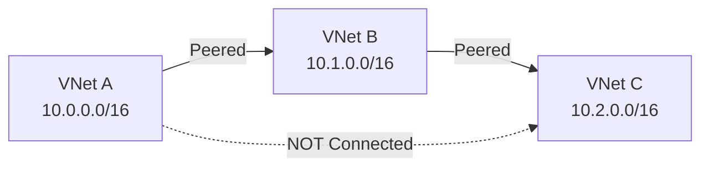
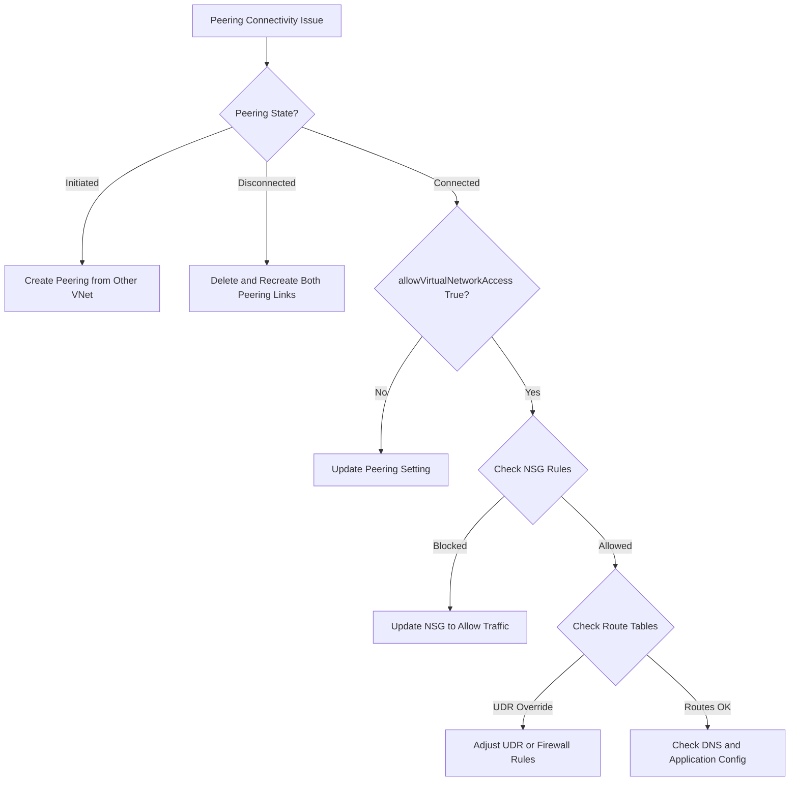

# How to Fix VNet Peering Connectivity Issues Between Azure Virtual Networks

Author: [nawazdhandala](https://www.github.com/nawazdhandala)

Tags: Azure, VNet Peering, Virtual Networks, Networking, Troubleshooting, Connectivity, Cloud

Description: Diagnose and resolve common VNet peering connectivity issues in Azure including failed states and routing problems.

---

VNet peering in Azure connects two virtual networks so resources in each can communicate using private IP addresses, as if they were on the same network. It sounds simple, and when it works, it is seamless. But when it does not work, the debugging can be tricky because there are several layers where things can go wrong - the peering state, address space conflicts, routing tables, NSGs, and DNS.

Let me walk through the most common VNet peering connectivity issues and how to fix each one.

## Step 1: Check the Peering Status

The very first thing to verify is whether the peering connection is actually established. A VNet peering requires links in both directions - VNet A must peer to VNet B, and VNet B must peer to VNet A. If only one side is configured, the peering state will be "Initiated" and traffic will not flow.

```bash
# Check peering status from VNet A's perspective
az network vnet peering show \
  --resource-group rgA \
  --vnet-name vnetA \
  --name peeringToVnetB \
  --query "{name: name, peeringState: peeringState, provisioningState: provisioningState}" \
  --output json

# Check peering status from VNet B's perspective
az network vnet peering show \
  --resource-group rgB \
  --vnet-name vnetB \
  --name peeringToVnetA \
  --query "{name: name, peeringState: peeringState, provisioningState: provisioningState}" \
  --output json
```

The `peeringState` should be "Connected" on both sides. If it shows:

- **Initiated**: The other side has not configured their peering yet. Create the peering link from the other VNet.
- **Disconnected**: The peering was established but then broken, usually because one side was deleted or the VNet address space was changed. Delete both peering links and recreate them.

```bash
# Create peering from VNet A to VNet B
az network vnet peering create \
  --resource-group rgA \
  --vnet-name vnetA \
  --name peeringToVnetB \
  --remote-vnet /subscriptions/<sub-id>/resourceGroups/rgB/providers/Microsoft.Network/virtualNetworks/vnetB \
  --allow-vnet-access true

# Create peering from VNet B to VNet A
az network vnet peering create \
  --resource-group rgB \
  --vnet-name vnetB \
  --name peeringToVnetA \
  --remote-vnet /subscriptions/<sub-id>/resourceGroups/rgA/providers/Microsoft.Network/virtualNetworks/vnetA \
  --allow-vnet-access true
```

## Step 2: Check for Address Space Overlaps

VNet peering requires that the address spaces of the two VNets do not overlap. If VNet A uses 10.0.0.0/16 and VNet B also uses 10.0.0.0/16 (or any overlapping range like 10.0.1.0/24), the peering creation will fail.

```bash
# Check address spaces of both VNets
az network vnet show --resource-group rgA --name vnetA --query "addressSpace.addressPrefixes" --output json
az network vnet show --resource-group rgB --name vnetB --query "addressSpace.addressPrefixes" --output json
```

**Fix**: If the address spaces overlap, you have a few options:

1. **Resize one VNet**: Change the address space of one VNet to a non-overlapping range. This requires that no subnets use the addresses being removed.
2. **Use a hub-spoke topology with a firewall**: If you cannot change address spaces, use Azure Firewall or a third-party NVA in a hub VNet to NAT traffic between the overlapping networks.
3. **Use Private Link**: Instead of peering, access specific services via Private Endpoints which do not require peering.

## Step 3: Verify the Peering Settings

VNet peering has several settings that control what traffic is allowed to flow. A misconfigured setting can block traffic even when the peering is in the "Connected" state.

```bash
# Show all peering settings
az network vnet peering show \
  --resource-group rgA \
  --vnet-name vnetA \
  --name peeringToVnetB \
  --query "{
    allowVirtualNetworkAccess: allowVirtualNetworkAccess,
    allowForwardedTraffic: allowForwardedTraffic,
    allowGatewayTransit: allowGatewayTransit,
    useRemoteGateways: useRemoteGateways
  }" \
  --output json
```

Key settings:

- **allowVirtualNetworkAccess**: Must be `true` on both sides for VMs to communicate. If this is `false`, the peering exists but traffic is blocked.
- **allowForwardedTraffic**: Must be `true` if you want traffic forwarded from another VNet (in a hub-spoke topology) to flow through this peering. Default is `false`.
- **allowGatewayTransit**: Set to `true` on the VNet that has the VPN or ExpressRoute gateway.
- **useRemoteGateways**: Set to `true` on the VNet that wants to use the remote VNet's gateway. Cannot be set if the VNet already has its own gateway.

**Fix**: Update the peering settings:

```bash
# Enable virtual network access (allow VMs to communicate)
az network vnet peering update \
  --resource-group rgA \
  --vnet-name vnetA \
  --name peeringToVnetB \
  --set allowVirtualNetworkAccess=true

# Enable forwarded traffic for hub-spoke topology
az network vnet peering update \
  --resource-group rgA \
  --vnet-name vnetA \
  --name peeringToVnetB \
  --set allowForwardedTraffic=true
```

## Step 4: Check NSG Rules

Even with peering correctly configured, NSG rules can block traffic between peered VNets. The NSGs on source and destination subnets (or NICs) must allow the traffic.

A common mistake: the NSG uses "VirtualNetwork" as the source/destination address prefix. In Azure, the "VirtualNetwork" service tag includes the local VNet address space AND the address spaces of all peered VNets. So if you have an NSG rule that allows traffic from "VirtualNetwork", it should allow traffic from peered VNets too.

But if you have explicit deny rules or rules that restrict traffic to specific IP ranges within the local VNet, peered traffic might be blocked.

```bash
# Test connectivity between VMs in peered VNets using Network Watcher
az network watcher test-ip-flow \
  --direction Inbound \
  --protocol TCP \
  --local 10.1.0.4:443 \
  --remote 10.0.0.4:12345 \
  --vm vmInVnetB \
  --resource-group rgB
```

## Step 5: Check Route Tables (UDRs)

If you have User Defined Routes (UDRs) on the subnets, they can override the system routes that peering creates. This is a very common issue in hub-spoke architectures where a UDR sends all traffic to a firewall.

```bash
# Check the effective routes on a VM's NIC
az network nic show-effective-route-table \
  --resource-group rgA \
  --name myNIC \
  --output table
```

Look for routes to the peered VNet's address space. You should see a route with the next hop type "VNetPeering" or "VNetGlobalPeering." If instead you see a UDR pointing to a firewall or other NVA, traffic will go through that device instead of directly through the peering.

**Fix**: If traffic should go directly through peering (bypassing the firewall), either remove the UDR that overrides the peering route, or add a more specific route for the peered VNet's address space:

```bash
# Add a route that sends traffic to the peered VNet directly
az network route-table route create \
  --resource-group rgA \
  --route-table-name myRouteTable \
  --name DirectToPeeredVNet \
  --address-prefix 10.1.0.0/16 \
  --next-hop-type VirtualNetworkGateway
```

Wait, that is not right for peering. For VNet peering, you do not need to add routes - Azure adds them automatically. If a UDR is overriding the peering routes, you need to either adjust the UDR or accept that traffic goes through the firewall and make sure the firewall allows it.

## Step 6: Transitive Peering Does Not Work

A crucial thing to understand: VNet peering is NOT transitive. If VNet A is peered with VNet B, and VNet B is peered with VNet C, VNet A cannot automatically communicate with VNet C.



**Fix options for transitive connectivity**:

1. **Direct peering**: Create a peering between VNet A and VNet C.
2. **Hub-spoke with NVA**: Use VNet B as a hub with an Azure Firewall or NVA that routes traffic between A and C. Enable "allowForwardedTraffic" on the spoke peerings.
3. **Azure Virtual WAN**: Use Virtual WAN which supports transitive routing natively.
4. **VPN Gateway**: Use a VPN gateway in the hub VNet to route between spokes.

For the NVA approach, the configuration on VNet B needs IP forwarding enabled:

```bash
# Enable IP forwarding on the NVA's NIC in VNet B
az network nic update \
  --resource-group rgB \
  --name nvaVMNIC \
  --ip-forwarding true
```

## Step 7: DNS Resolution Across Peered VNets

By default, Azure-provided DNS does not resolve VM names across peered VNets. VMs in VNet A cannot resolve `vmB.internal.cloudapp.net` for a VM in VNet B.

**Fix**: Use Azure Private DNS Zones linked to both VNets, or use custom DNS servers that both VNets are configured to use. I cover this in detail in the DNS resolution failures post.

## Step 8: Global VNet Peering Considerations

If you are peering VNets across different Azure regions (global peering), there are additional considerations:

- Data transfer charges apply for cross-region traffic
- You cannot use remote gateways over global peering with Basic SKU load balancers
- Latency will be higher compared to local peering

```bash
# Create a global peering (across regions)
az network vnet peering create \
  --resource-group rgA \
  --vnet-name vnetA \
  --name peeringToVnetB \
  --remote-vnet /subscriptions/<sub-id>/resourceGroups/rgB/providers/Microsoft.Network/virtualNetworks/vnetB \
  --allow-vnet-access true \
  --allow-forwarded-traffic true
```

## Troubleshooting Flowchart



## Summary

VNet peering issues usually fall into one of these categories: peering state not connected, peering settings misconfigured, NSG rules blocking traffic, UDRs overriding peering routes, or misunderstanding the non-transitive nature of peering. Start by checking the peering state on both sides, then work through the settings, NSGs, and routes. Use Network Watcher's IP Flow Verify and effective routes to pinpoint exactly where traffic is being blocked.
