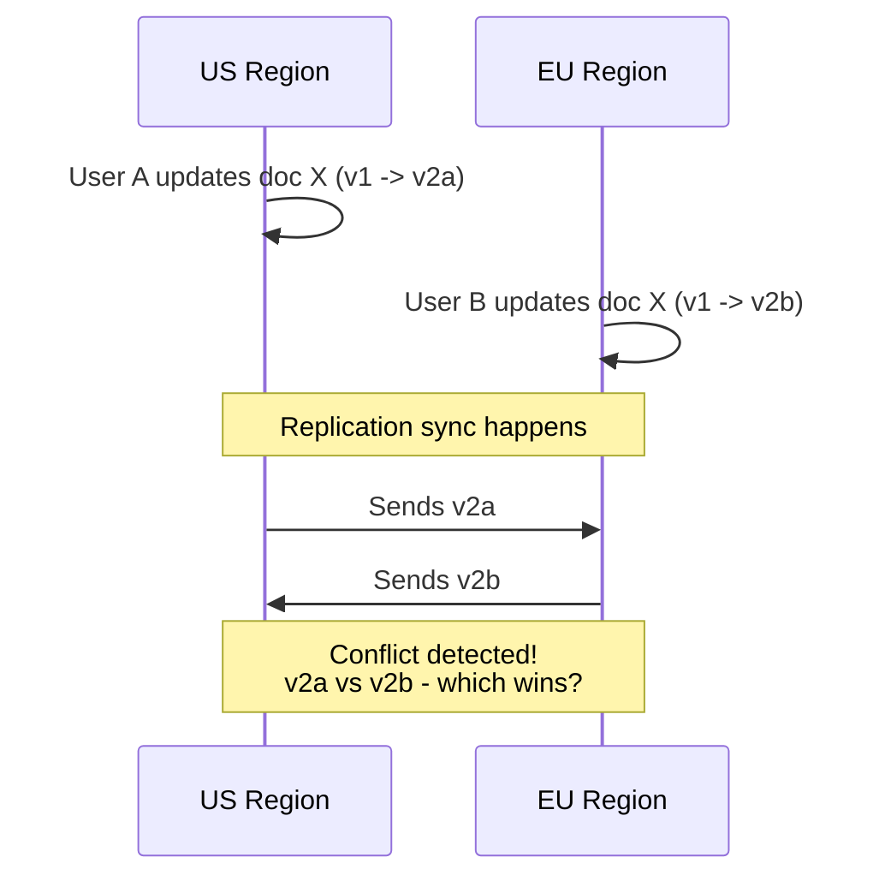

# How to Handle Conflicts in Multi-Region Writes with Azure Cosmos DB

Author: [nawazdhandala](https://www.github.com/nawazdhandala)

Tags: Azure, Cosmos DB, Multi-Region Writes, Conflict Resolution, Distributed Systems, Data Consistency

Description: Learn how to detect, resolve, and prevent write conflicts in Azure Cosmos DB when using multi-region writes with practical conflict resolution strategies.

---

Multi-region writes in Azure Cosmos DB let any region accept write operations. This gives you the lowest possible write latency for globally distributed users. But there is a catch - when two users in different regions update the same document at the same time, you get a conflict. Cosmos DB detects these conflicts automatically, but you need to decide how they get resolved. This guide covers the three conflict resolution strategies, how to implement each one, and how to design your data model to minimize conflicts in the first place.

## When Do Conflicts Happen?

A conflict occurs when the same document is written to in two or more regions before the regions have a chance to synchronize. In practice, this happens when:

1. User A in the US updates document X
2. User B in Europe updates the same document X at nearly the same time
3. Both writes succeed locally in their respective regions
4. When the regions sync, Cosmos DB detects that both regions modified the same document



The replication lag between regions is typically 5-50 milliseconds. So conflicts happen when two writes to the same document occur within that window. For high-traffic documents, this is more common than you might think.

## Conflict Resolution Strategy 1: Last Writer Wins (LWW)

This is the default strategy. Cosmos DB picks the document with the highest value in a specified property. By default, it uses the `_ts` (timestamp) property - so the most recent write wins.

### Configuration

```bash
# Create a container with Last Writer Wins conflict resolution
az cosmosdb sql container create \
    --account-name myCosmosAccount \
    --database-name mydb \
    --name orders \
    --partition-key-path "/customerId" \
    --conflict-resolution-policy-mode "LastWriterWins" \
    --conflict-resolution-policy-path "/_ts" \
    --resource-group myResourceGroup
```

### Using a Custom Property

Instead of the timestamp, you can use a custom numeric property. This is useful when you want application-controlled conflict resolution:

```bash
# Use a custom 'priority' field for conflict resolution
# Higher priority value wins
az cosmosdb sql container create \
    --account-name myCosmosAccount \
    --database-name mydb \
    --name tasks \
    --partition-key-path "/projectId" \
    --conflict-resolution-policy-mode "LastWriterWins" \
    --conflict-resolution-policy-path "/priority" \
    --resource-group myResourceGroup
```

```csharp
// Documents with a priority field for LWW resolution
// The document with the higher priority wins in a conflict
var task1 = new
{
    id = "task-123",
    projectId = "proj-A",
    title = "Deploy to production",
    status = "approved",
    priority = 100  // High priority write from manager
};

var task2 = new
{
    id = "task-123",
    projectId = "proj-A",
    title = "Deploy to production",
    status = "pending",
    priority = 50  // Lower priority write from automated system
};

// If both are written simultaneously, task1 wins because priority 100 > 50
```

### Using a Version Counter

A common pattern is using a monotonically increasing version number:

```csharp
// Use a version counter for LWW resolution
// Each update increments the version - highest version wins
public class VersionedDocument
{
    [JsonProperty("id")]
    public string Id { get; set; }

    [JsonProperty("partitionKey")]
    public string PartitionKey { get; set; }

    [JsonProperty("version")]
    public long Version { get; set; }

    [JsonProperty("data")]
    public string Data { get; set; }
}

// When updating, increment the version
async Task UpdateWithVersion(Container container, string id, string pk, string newData)
{
    // Read the current document
    var response = await container.ReadItemAsync<VersionedDocument>(id, new PartitionKey(pk));
    var doc = response.Resource;

    // Increment version and update data
    doc.Version++;
    doc.Data = newData;

    // Write back - in case of conflict, higher version wins
    await container.ReplaceItemAsync(doc, id, new PartitionKey(pk));
}
```

## Conflict Resolution Strategy 2: Custom Stored Procedure

For complex resolution logic that cannot be handled by a simple "highest value wins" rule, use a stored procedure:

### Setting Up the Stored Procedure

```bash
# Configure the container to use a custom stored procedure for conflict resolution
az cosmosdb sql container create \
    --account-name myCosmosAccount \
    --database-name mydb \
    --name inventoryItems \
    --partition-key-path "/warehouseId" \
    --conflict-resolution-policy-mode "Custom" \
    --conflict-resolution-policy-procedure "dbs/mydb/colls/inventoryItems/sprocs/resolveConflict" \
    --resource-group myResourceGroup
```

### The Resolution Stored Procedure

```javascript
// Custom conflict resolution stored procedure
// This example merges inventory counts instead of picking a winner
function resolveConflict(incomingItem, existingItem, isTombstone, conflictingItems) {
    var context = getContext();
    var collection = context.getCollection();

    // If the existing document was deleted
    if (isTombstone) {
        // Accept the incoming item (undelete)
        var accepted = collection.replaceDocument(
            existingItem._self,
            incomingItem,
            function(err) {
                if (err) throw new Error("Failed to resolve tombstone conflict: " + err.message);
            }
        );
        if (!accepted) throw new Error("Replace not accepted");
        return;
    }

    // Merge strategy: combine inventory counts from both regions
    // Both regions may have processed sales independently
    var merged = existingItem;

    // Calculate the delta each region applied
    // Assume both started from the same base quantity
    var baseQuantity = Math.max(existingItem.lastKnownBase || 0, incomingItem.lastKnownBase || 0);
    var existingDelta = existingItem.quantity - baseQuantity;
    var incomingDelta = incomingItem.quantity - baseQuantity;

    // Apply both deltas to get the true quantity
    merged.quantity = baseQuantity + existingDelta + incomingDelta;
    merged.lastKnownBase = merged.quantity;
    merged.lastMergedAt = new Date().toISOString();
    merged.mergeCount = (existingItem.mergeCount || 0) + 1;

    // Save the merged document
    var accepted = collection.replaceDocument(
        existingItem._self,
        merged,
        function(err) {
            if (err) throw new Error("Failed to save merged document: " + err.message);
        }
    );
    if (!accepted) throw new Error("Replace not accepted for merge");
}
```

Register the stored procedure:

```csharp
// Register the conflict resolution stored procedure
string sprocBody = File.ReadAllText("resolveConflict.js");
StoredProcedureProperties sproc = new StoredProcedureProperties
{
    Id = "resolveConflict",
    Body = sprocBody
};
await container.Scripts.CreateStoredProcedureAsync(sproc);
```

## Conflict Resolution Strategy 3: Custom Conflict Feed (Async)

Instead of resolving conflicts automatically, store all conflicting versions and let your application resolve them asynchronously. This gives you maximum control.

### Configuration

```bash
# Enable custom conflict resolution with no automatic resolution
# Conflicts are stored in the conflict feed for manual resolution
az cosmosdb sql container create \
    --account-name myCosmosAccount \
    --database-name mydb \
    --name documents \
    --partition-key-path "/ownerId" \
    --conflict-resolution-policy-mode "Custom" \
    --resource-group myResourceGroup
```

When no stored procedure is specified, conflicting versions go to the conflict feed.

### Reading and Resolving Conflicts

```csharp
// Read conflicts from the conflict feed and resolve them
Container container = client.GetContainer("mydb", "documents");

// Iterate through pending conflicts
FeedIterator<ConflictProperties> conflictIterator =
    container.Conflicts.GetConflictQueryIterator<ConflictProperties>();

while (conflictIterator.HasMoreResults)
{
    FeedResponse<ConflictProperties> conflicts = await conflictIterator.ReadNextAsync();

    foreach (ConflictProperties conflict in conflicts)
    {
        Console.WriteLine($"Conflict ID: {conflict.Id}");
        Console.WriteLine($"Operation: {conflict.OperationType}");
        Console.WriteLine($"Resource Type: {conflict.ResourceType}");

        // Read the conflicting document
        dynamic conflictDoc = await container.Conflicts.ReadCurrentAsync<dynamic>(
            conflict,
            new PartitionKey(conflict.PartitionKeyValue));

        // Your resolution logic here
        dynamic resolvedDoc = ResolveBasedOnBusinessRules(conflictDoc);

        // Write the resolved document
        await container.UpsertItemAsync(resolvedDoc,
            new PartitionKey((string)resolvedDoc.ownerId));

        // Delete the conflict after resolution
        await container.Conflicts.DeleteAsync(conflict,
            new PartitionKey(conflict.PartitionKeyValue));

        Console.WriteLine($"Conflict resolved and deleted");
    }
}
```

### Background Conflict Resolution Worker

In production, run a background worker that continuously processes conflicts:

```csharp
// Background worker that processes conflicts from the conflict feed
public class ConflictResolutionWorker : BackgroundService
{
    private readonly Container _container;
    private readonly ILogger<ConflictResolutionWorker> _logger;

    public ConflictResolutionWorker(CosmosClient client, ILogger<ConflictResolutionWorker> logger)
    {
        _container = client.GetContainer("mydb", "documents");
        _logger = logger;
    }

    protected override async Task ExecuteAsync(CancellationToken stoppingToken)
    {
        _logger.LogInformation("Conflict resolution worker started");

        while (!stoppingToken.IsCancellationRequested)
        {
            try
            {
                int resolved = await ProcessConflicts(stoppingToken);
                if (resolved > 0)
                {
                    _logger.LogInformation("Resolved {Count} conflicts", resolved);
                }
            }
            catch (Exception ex)
            {
                _logger.LogError(ex, "Error processing conflicts");
            }

            // Poll every 5 seconds
            await Task.Delay(TimeSpan.FromSeconds(5), stoppingToken);
        }
    }

    private async Task<int> ProcessConflicts(CancellationToken ct)
    {
        int count = 0;
        var iterator = _container.Conflicts.GetConflictQueryIterator<ConflictProperties>();

        while (iterator.HasMoreResults && !ct.IsCancellationRequested)
        {
            var batch = await iterator.ReadNextAsync(ct);
            foreach (var conflict in batch)
            {
                await ResolveConflict(conflict);
                count++;
            }
        }
        return count;
    }

    private async Task ResolveConflict(ConflictProperties conflict)
    {
        // Implement your resolution logic here
        // This is application-specific
    }
}
```

## Design Patterns to Minimize Conflicts

The best conflict resolution strategy is to avoid conflicts altogether. Here are design patterns that help:

### Pattern 1: Partition-Aware Routing

Route writes for specific partition keys to specific regions. Users in the US always write to the US region, users in Europe to the EU region:

```csharp
// Route writes based on partition key to reduce conflicts
// Each region "owns" certain partition key ranges
CosmosClient GetWriteClient(string partitionKey)
{
    string region = DetermineOwnerRegion(partitionKey);
    return _clientsByRegion[region];
}
```

### Pattern 2: Event-Sourcing with Append-Only

Instead of updating documents, append events. Events never conflict because each one is unique:

```csharp
// Instead of updating a counter, append increment events
// No conflicts because each event is a new document
var incrementEvent = new
{
    id = Guid.NewGuid().ToString(),
    entityId = "counter-123",
    partitionKey = "counter-123",
    eventType = "increment",
    value = 1,
    region = "eastus",
    timestamp = DateTime.UtcNow
};
await container.CreateItemAsync(incrementEvent, new PartitionKey("counter-123"));
```

### Pattern 3: CRDTs (Conflict-free Replicated Data Types)

Design your data structures so that any merge operation produces the correct result:

```csharp
// G-Counter: each region has its own counter
// The total is the sum of all regional counters
// Merging always takes the max of each region's count
var counter = new
{
    id = "page-views-homepage",
    partitionKey = "counters",
    counts = new Dictionary<string, long>
    {
        { "eastus", 1500 },
        { "westeurope", 820 },
        { "southeastasia", 340 }
    }
    // Total = 1500 + 820 + 340 = 2660
    // Each region only increments its own count
    // No conflicts possible
};
```

## Monitoring Conflicts

Track conflict rates to understand if your design is working:

```bash
# Check conflict count metrics
az monitor metrics list \
    --resource "/subscriptions/{sub}/resourceGroups/{rg}/providers/Microsoft.DocumentDB/databaseAccounts/myCosmosAccount" \
    --metric "TotalRequests" \
    --filter "StatusCode eq '409'" \
    --interval PT1H
```

In the Azure Portal under Metrics, monitor the conflict feed size and resolution rate. A growing conflict feed indicates your resolution process is falling behind.

Handling conflicts in multi-region writes is fundamentally about understanding your data's semantics. For most applications, Last Writer Wins with a timestamp is sufficient. For data where merging makes more sense than overwriting (like counters or collaborative documents), use a custom stored procedure or the conflict feed. And whenever possible, design your data model to avoid conflicts altogether by using append-only patterns or region-aware routing.
