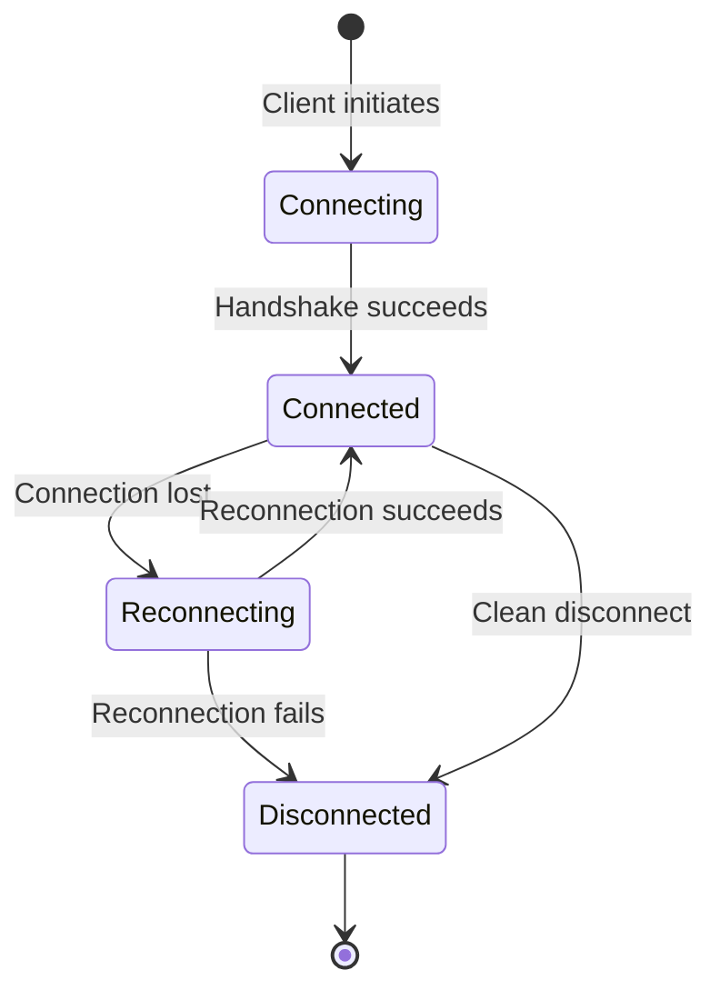

# How to Handle Connection Lifecycle Events in Azure SignalR Service

Author: [nawazdhandala](https://www.github.com/nawazdhandala)

Tags: Azure, SignalR, Connection Lifecycle, Real-Time, WebSockets, Event Handling

Description: Learn how to handle connection, disconnection, and reconnection events in Azure SignalR Service for robust real-time applications.

---

Every WebSocket connection has a lifecycle: it connects, it stays alive for some period, and eventually it disconnects. In between, it might temporarily lose connectivity and reconnect. How you handle these lifecycle events determines whether your real-time application feels solid or flaky. A user switching from Wi-Fi to cellular, a network hiccup, a browser tab going to sleep - these are everyday occurrences that your application needs to handle gracefully.

In this post, I will walk through the connection lifecycle events in Azure SignalR Service, show you how to handle them on both the server and client side, and cover the patterns that make real-time applications resilient.

## The Connection Lifecycle

A SignalR connection goes through several states:



Each transition is an event you can hook into. Let me walk through each one.

## Server-Side Lifecycle Events (Default Mode)

In ASP.NET Core with Azure SignalR Service in Default mode, you override methods on the Hub class to handle connection and disconnection:

```csharp
// Hub with comprehensive lifecycle event handling
// Tracks user presence and manages cleanup on disconnection
public class AppHub : Hub
{
    private readonly IUserPresenceService _presenceService;
    private readonly ILogger<AppHub> _logger;

    public AppHub(IUserPresenceService presenceService, ILogger<AppHub> logger)
    {
        _presenceService = presenceService;
        _logger = logger;
    }

    // Called when a new client connects
    // This runs after the handshake is complete and the connection is established
    public override async Task OnConnectedAsync()
    {
        var connectionId = Context.ConnectionId;
        var userId = Context.UserIdentifier;
        var userAgent = Context.GetHttpContext()?.Request.Headers["User-Agent"].ToString();
        var ipAddress = Context.GetHttpContext()?.Connection.RemoteIpAddress?.ToString();

        _logger.LogInformation(
            "Client connected: ConnectionId={ConnectionId}, UserId={UserId}, IP={IP}",
            connectionId, userId, ipAddress);

        // Track the user's presence
        await _presenceService.UserConnected(userId, connectionId, new ConnectionMetadata
        {
            UserAgent = userAgent,
            IpAddress = ipAddress,
            ConnectedAt = DateTime.UtcNow
        });

        // Notify others that this user is now online
        await Clients.Others.SendAsync("userOnline", new
        {
            userId,
            timestamp = DateTime.UtcNow
        });

        // Send the current online users list to the connecting client
        var onlineUsers = await _presenceService.GetOnlineUsers();
        await Clients.Caller.SendAsync("onlineUsers", onlineUsers);

        await base.OnConnectedAsync();
    }

    // Called when a client disconnects
    // The exception parameter is non-null if the disconnect was caused by an error
    public override async Task OnDisconnectedAsync(Exception exception)
    {
        var connectionId = Context.ConnectionId;
        var userId = Context.UserIdentifier;

        if (exception != null)
        {
            _logger.LogWarning(exception,
                "Client disconnected with error: ConnectionId={ConnectionId}, UserId={UserId}",
                connectionId, userId);
        }
        else
        {
            _logger.LogInformation(
                "Client disconnected cleanly: ConnectionId={ConnectionId}, UserId={UserId}",
                connectionId, userId);
        }

        // Remove the connection from presence tracking
        var isLastConnection = await _presenceService.UserDisconnected(userId, connectionId);

        // Only notify others if this was the user's last connection
        // (they might still be connected from another device)
        if (isLastConnection)
        {
            await Clients.Others.SendAsync("userOffline", new
            {
                userId,
                timestamp = DateTime.UtcNow
            });
        }

        // Clean up any resources associated with this connection
        await CleanupConnectionResources(connectionId);

        await base.OnDisconnectedAsync(exception);
    }

    private async Task CleanupConnectionResources(string connectionId)
    {
        // Remove from any active collaboration sessions
        // Cancel any pending operations
        // Release any locks held by this connection
    }
}
```

Important things to note about the server-side lifecycle:

1. **OnConnectedAsync** runs once per connection. If a client disconnects and reconnects, it runs again with a new connection ID.
2. **OnDisconnectedAsync** runs when the connection is terminated, either cleanly or due to an error. The `exception` parameter tells you which.
3. There is no **OnReconnectedAsync** on the server. When a client reconnects, it gets a new connection ID and triggers OnConnectedAsync again. The reconnection is transparent to the hub.

## User Presence Tracking

Tracking user presence is one of the most common lifecycle use cases. Here is a service that handles it properly, accounting for multiple connections per user:

```csharp
// User presence service that tracks online/offline status
// Handles multiple connections per user (multiple devices/tabs)
public interface IUserPresenceService
{
    Task UserConnected(string userId, string connectionId, ConnectionMetadata metadata);
    Task<bool> UserDisconnected(string userId, string connectionId);
    Task<List<string>> GetOnlineUsers();
}

public class UserPresenceService : IUserPresenceService
{
    // In production, use Redis or a database instead of in-memory storage
    private static readonly ConcurrentDictionary<string, ConcurrentDictionary<string, ConnectionMetadata>> _users = new();

    public Task UserConnected(string userId, string connectionId, ConnectionMetadata metadata)
    {
        var connections = _users.GetOrAdd(userId, _ => new ConcurrentDictionary<string, ConnectionMetadata>());
        connections[connectionId] = metadata;
        return Task.CompletedTask;
    }

    public Task<bool> UserDisconnected(string userId, string connectionId)
    {
        if (_users.TryGetValue(userId, out var connections))
        {
            connections.TryRemove(connectionId, out _);

            if (connections.IsEmpty)
            {
                _users.TryRemove(userId, out _);
                return Task.FromResult(true); // Last connection removed
            }
        }
        return Task.FromResult(false); // User still has other connections
    }

    public Task<List<string>> GetOnlineUsers()
    {
        return Task.FromResult(_users.Keys.ToList());
    }
}

public class ConnectionMetadata
{
    public string UserAgent { get; set; }
    public string IpAddress { get; set; }
    public DateTime ConnectedAt { get; set; }
}
```

## Client-Side Lifecycle Events

On the client side, you have more lifecycle events to handle. The SignalR JavaScript client provides callbacks for each state transition:

```javascript
// Comprehensive client-side lifecycle event handling
const connection = new signalR.HubConnectionBuilder()
    .withUrl("/hub/app", {
        accessTokenFactory: () => getAccessToken()
    })
    // Configure automatic reconnection with exponential backoff
    .withAutomaticReconnect({
        nextRetryDelayInMilliseconds: (retryContext) => {
            // Custom retry strategy
            // retryContext.previousRetryCount tells us how many times we've retried
            // retryContext.elapsedMilliseconds tells us total time spent reconnecting
            if (retryContext.elapsedMilliseconds > 60000) {
                // Stop reconnecting after 60 seconds
                return null;
            }
            // Exponential backoff: 0s, 2s, 4s, 8s, 16s, 30s (capped)
            var delay = Math.min(
                Math.pow(2, retryContext.previousRetryCount) * 1000,
                30000
            );
            return delay;
        }
    })
    .build();

// Connection successfully established
connection.onreconnecting((error) => {
    // The connection was lost and SignalR is attempting to reconnect
    console.warn("Connection lost. Attempting to reconnect...", error);

    // Update UI to show reconnecting state
    showConnectionStatus("reconnecting");

    // Disable message sending while reconnecting
    disableInputs();
});

connection.onreconnected((connectionId) => {
    // Successfully reconnected
    console.log("Reconnected with new connection ID:", connectionId);

    // Update UI to show connected state
    showConnectionStatus("connected");

    // Re-enable message sending
    enableInputs();

    // The connection ID has changed, so we might need to re-join groups
    // or re-subscribe to specific updates
    rejoinRooms();

    // Fetch any messages we might have missed during the disconnection
    fetchMissedMessages();
});

connection.onclose((error) => {
    // Connection permanently closed (reconnection gave up or was not configured)
    if (error) {
        console.error("Connection closed due to error:", error);
    } else {
        console.log("Connection closed.");
    }

    showConnectionStatus("disconnected");
    disableInputs();

    // Show a reconnect button for manual retry
    showReconnectButton();
});

// Helper function for manual reconnection
async function manualReconnect() {
    try {
        await connection.start();
        showConnectionStatus("connected");
        enableInputs();
        rejoinRooms();
    } catch (err) {
        console.error("Manual reconnection failed:", err);
        // Try again in a few seconds
        setTimeout(manualReconnect, 5000);
    }
}
```

## Handling Missed Messages During Reconnection

When a client disconnects and reconnects, it misses any messages sent during the gap. Your application needs a strategy for this:

```javascript
// Track the last message timestamp to fetch missed messages on reconnect
let lastMessageTimestamp = null;

connection.on("newMessage", (message) => {
    lastMessageTimestamp = message.timestamp;
    displayMessage(message);
});

async function fetchMissedMessages() {
    if (lastMessageTimestamp) {
        try {
            // Call an HTTP endpoint to get messages since the last received one
            const response = await fetch(
                "/api/messages?since=" + encodeURIComponent(lastMessageTimestamp)
            );
            const missedMessages = await response.json();

            missedMessages.forEach(msg => displayMessage(msg));

            if (missedMessages.length > 0) {
                lastMessageTimestamp = missedMessages[missedMessages.length - 1].timestamp;
            }
        } catch (err) {
            console.error("Failed to fetch missed messages:", err);
        }
    }
}
```

This pattern combines real-time SignalR messages with an HTTP fallback for gap filling. It ensures no messages are lost during brief disconnections.

## Serverless Mode Lifecycle Events

In Serverless mode with Azure Functions, you can handle lifecycle events using the `SignalRTrigger` binding:

```csharp
// Azure Function triggered when a client connects
// The 'connections' event category receives connect/disconnect events
[Function("OnConnected")]
[SignalROutput(HubName = "notifications")]
public static SignalRMessageAction OnConnected(
    [SignalRTrigger("notifications", "connections", "connected")] SignalRInvocationContext context,
    ILogger logger)
{
    logger.LogInformation("Client connected: {ConnectionId}, User: {UserId}",
        context.ConnectionId, context.UserId);

    // Send a welcome message to the newly connected client
    return new SignalRMessageAction("welcome")
    {
        ConnectionId = context.ConnectionId,
        Arguments = new object[] { new { message = "Welcome! You are connected." } }
    };
}

// Azure Function triggered when a client disconnects
[Function("OnDisconnected")]
public static void OnDisconnected(
    [SignalRTrigger("notifications", "connections", "disconnected")] SignalRInvocationContext context,
    ILogger logger)
{
    logger.LogInformation("Client disconnected: {ConnectionId}, User: {UserId}",
        context.ConnectionId, context.UserId);

    // Perform cleanup for the disconnected user
}
```

## Connection Timeout Configuration

Azure SignalR Service has configurable timeouts that affect the lifecycle:

- **KeepAlive interval**: How often the server sends ping frames to keep the connection alive. Default is 15 seconds.
- **Server timeout**: How long the client waits for a keep-alive ping before considering the connection dead. Default is 30 seconds.
- **Client timeout**: How long the server waits for a message from the client before closing the connection.

Configure these on the server:

```csharp
// Configure connection timeouts
builder.Services.AddSignalR(options =>
{
    // Send keep-alive pings every 10 seconds
    options.KeepAliveInterval = TimeSpan.FromSeconds(10);
    // Consider the connection dead if no ping received for 20 seconds
    options.ClientTimeoutInterval = TimeSpan.FromSeconds(20);
})
.AddAzureSignalR();
```

And on the client:

```javascript
// Configure client-side timeout
const connection = new signalR.HubConnectionBuilder()
    .withUrl("/hub/app")
    .withAutomaticReconnect()
    .build();

// Server timeout: if no message from server in 30 seconds, start reconnecting
connection.serverTimeoutInMilliseconds = 30000;
// Keep alive interval: send ping every 15 seconds
connection.keepAliveIntervalInMilliseconds = 15000;
```

## Graceful Shutdown

When your server is shutting down (during deployment or scaling), you want to close connections gracefully rather than letting them time out:

```csharp
// Handle graceful shutdown in Program.cs
var app = builder.Build();

var lifetime = app.Services.GetRequiredService<IHostApplicationLifetime>();
lifetime.ApplicationStopping.Register(() =>
{
    // Azure SignalR Service handles graceful connection migration
    // during rolling deployments when using multiple app servers
    Console.WriteLine("Application is shutting down. Connections will be migrated.");
});
```

Azure SignalR Service handles connection migration during rolling deployments. When an app server instance goes down, the service migrates connections to other healthy instances without the client noticing (in most cases).

## Monitoring Connection Lifecycle

Track lifecycle events in your monitoring system:

```csharp
// Log lifecycle events with structured logging for monitoring
public override async Task OnConnectedAsync()
{
    _logger.LogInformation(
        new EventId(1001, "ClientConnected"),
        "Client connected: {ConnectionId} {UserId} {Transport}",
        Context.ConnectionId,
        Context.UserIdentifier,
        Context.GetHttpContext()?.WebSockets.IsWebSocketRequest == true ? "WebSocket" : "Other");

    await base.OnConnectedAsync();
}

public override async Task OnDisconnectedAsync(Exception exception)
{
    _logger.LogInformation(
        new EventId(1002, "ClientDisconnected"),
        "Client disconnected: {ConnectionId} {UserId} Error={HasError}",
        Context.ConnectionId,
        Context.UserIdentifier,
        exception != null);

    await base.OnDisconnectedAsync(exception);
}
```

Create dashboards and alerts based on:
- Connection rate (connections per second)
- Disconnection rate (should correlate with connection rate)
- Error disconnection rate (should be low)
- Average connection duration
- Reconnection rate (indicates network instability)

## Summary

Connection lifecycle events in Azure SignalR Service give you the hooks you need to build resilient real-time applications. On the server, handle `OnConnectedAsync` and `OnDisconnectedAsync` for user presence, resource cleanup, and group management. On the client, use `onreconnecting`, `onreconnected`, and `onclose` to keep the UI in sync with the connection state. Implement gap-filling with HTTP fallback for missed messages during disconnections. And configure appropriate timeouts to balance responsiveness with network tolerance. The lifecycle is simple in concept, but handling it properly is what separates a prototype from a production-ready real-time application.
